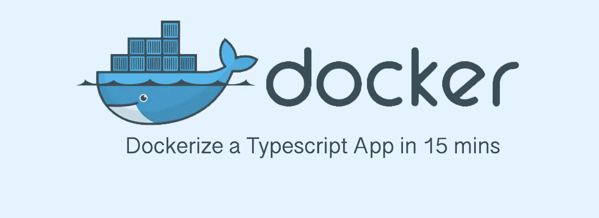

# 在 15 分钟内完成一个打字稿应用程序

> 原文：<https://itnext.io/dockerize-a-typescript-app-in-15-mins-a0e8c1e904b3?source=collection_archive---------0----------------------->



# 介绍

我们将下载一个简单的 TypeScript Hacker 新示例应用程序，并对其进行 dockerize。我们还将介绍如何:

*   写入`Dockerfile`和`docker-compose.yaml`
*   使用 docker-compose 运行 NodeJs 应用程序
*   建立码头工人形象
*   使用`docker run`运行 NodeJs 应用程序

# 第一部分:启动一个简单的 NodeJs 应用程序

## 克隆源代码

```
git clone [https://github.com/alickmail/hackernews-async-ts-docker](https://github.com/alickmail/hackernews-async-ts-docker.git)
```

原始源代码来自 EggJs 官方回购:

[](https://github.com/eggjs/examples) [## 鸡蛋/例子

### 将所有 egg 示例存储在一个地方。在 GitHub 上创建一个帐户，为 eggjs/examples 开发做贡献。

github.com](https://github.com/eggjs/examples) 

## 安装软件包，构建 typescript，启动服务器

```
// Install all packages
npm install
// Compile all typescript to javascript
npm tsc
// Start the server
npm start
```

## **访问服务器**

您应该能够在控制台中看到这一点:

```
hackernewsapp_1  | 2019-07-14 08:45:13,783 INFO 47 [egg-watcher:application] watcher start success
hackernewsapp_1  | 2019-07-14 08:45:13,783 INFO 47 [egg:core:ready_stat] end ready task /usr/src/app/node_modules/egg-watcher/lib/init.js:15:14, remain []
hackernewsapp_1  | 2019-07-14 08:45:13,804 INFO 29 [master] app_worker#1:47 started at 7001, remain 0 (1567ms)
hackernewsapp_1  | 2019-07-14 08:45:13,806 INFO 29 [master] egg started on <http://127.0.0.1:7001> (2464ms)
```

您可以在浏览器`http://127.0.0.1:7001`中访问该网址

服务成功启动！

# 第二部分:将应用程序文档化

将这两个文件添加到项目的根目录中

// `Dockerfile`

```
FROM node:10.13.0-alpine# Env
ENV TIME_ZONE=Asia/Hong_Kong
ENV ENV_NAME dev
ENV EGG_SERVER_ENV dev
ENV NODE_ENV dev
ENV NODE_CONFIG_ENV dev# Set the timezone in docker
RUN apk --update add tzdata \\
   && cp /usr/share/zoneinfo/Asia/Hong_Kong /etc/localtime \\
   && echo "Asia/Hong_Kong" > /etc/timezone \\
   && apk del tzdata# Create Directory for the Container
WORKDIR /usr/src/app# Only copy the package.json file to work directory
COPY package.json .
# Install all Packages
RUN npm install# Copy all other source code to work directory
ADD . /usr/src/app
# TypeScript
RUN npm run tsc# Start
CMD [ "npm", "start" ]
EXPOSE 7001
```

// `docker-compose.yaml`

```
version: "3"
networks:
  api_server_default:
    external: trueservices:
  hackernewsapp:
    networks:
      - api_server_default
    build:
      context: .
      dockerfile: Dockerfile
    environment:
      ENV_NAME: dev
    ports:
      - 7001:7001
```

我们现在可以使用 **docker composer** 或 **docker images** 来启动应用程序:

# 使用 docker composer 启动应用程序:

```
docker-compose up --build
```

您现在可以在浏览器`http://127.0.0.1:7001`中访问该网址。

# 使用 docker 图像启动应用程序:

```
docker build -t asia.gcr.io/web-campaign/api-server:0.2 .
docker run asia.gcr.io/web-campaign/api-server:0.2
```

您现在可以在浏览器`http://127.0.0.1:7001` 中访问该 url。

# 下一步是什么

我们将在下一篇文章中讨论如何自动构建 docker 图像。