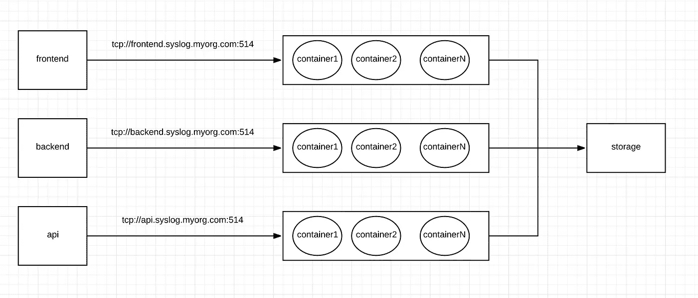

# Dockerize Rsyslog 服务器

> 原文：<https://itnext.io/dockerize-rsyslog-server-f8f9754c37d5?source=collection_archive---------1----------------------->

# 介绍

在本文中，我将解释如何对 Rsyslog 服务器进行 dockerize，并构建一个解耦的、可伸缩的集中式日志记录机制。下面是对 Docker 和 Rsyslog 的一个快速介绍

Rsyslogd :可靠且扩展的 syslogd 实用程序，为消息日志提供支持。

[Docker](https://docs.docker.com/) :集装箱化应用平台

## 我为什么要容器化 Rsyslog 服务器？

作为开发人员或系统管理员，将所有设备和应用程序的日志传送到中央日志记录设备以解决问题或运行分析非常重要。随着基础设施的增长，日志量也在增加，我们的中央日志记录基础设施应该能够动态扩展和处理负载，同时最大限度地减少或避免停机。当一个应用程序被解耦时，很容易扩展它。

## 如何解耦 Rsyslog 服务器？

让我用一个例子来解释这一点，假设我们有 3 个微服务(前端、后端、API ),我们可以用一组容器运行 3 个 Rsyslog docker 服务，并具有高度可用的架构，如下图所示。



Rsyslogd 微服务架构示例

另外，请注意，这是解除 Rsyslog 耦合的方法之一。根据不同的环境，你可以选择最适合的。我在这里的目的是演示我们可以解耦 Rsyslog。

现在让我们进入实现阶段。

## 创建 Docker 图像。

创建一个名为 Dockerfile 的文件，并粘贴以下内容。

## 构建 Docker 映像

```
docker build -t mysyslog .
```

## 运行容器

```
docker run  --cap-add SYSLOG --restart always -v /var/log:/var/log -p 514:514 -p 514:514/udp --name rsyslog mysyslog
```

*命令击穿*

```
--cap-add SYSLOG --> Allow container to perform privileged syslog(2) operations.
--restart always --> Restart container regardless of the exit status
-v /var/log:/var/log --> Mount host /var/log directory in container /var/log directory 
-p 514:514         --> Bind Host TCP 514 port to contaainer TCP 514 port 
-p 514:514/udp     --> Bind Host UDP 514 port to contaainer UDP 514 port
```

或者，您可以使用下面的 docker-compose.yaml 文件并启动 Rsyslog 服务器。

通过运行以下命令启动服务

```
docker-compose up -d
```

## 测试您的系统日志服务器:

找到您的主机的 IP 地址，并配置您的日志驱动程序。在我的例子中，我运行在 IP 地址为 192.168.0.5 的主机上，所以我使用了以下命令。

```
docker run --log-driver syslog --log-opt syslog-address=tcp://192.168.0.5:514 alpine echo hello world
```

导航到/var/log/remote/

# 接下来是什么！

阅读我的另一篇文章[这里](https://medium.com/@sudheer.chamarthi/run-rsyslog-server-in-kubernetes-bb51a7a6e227)解释了在 Kubernetes 中运行 Syslog 服务器