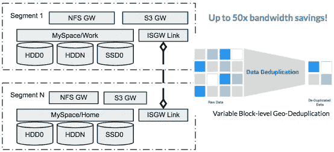
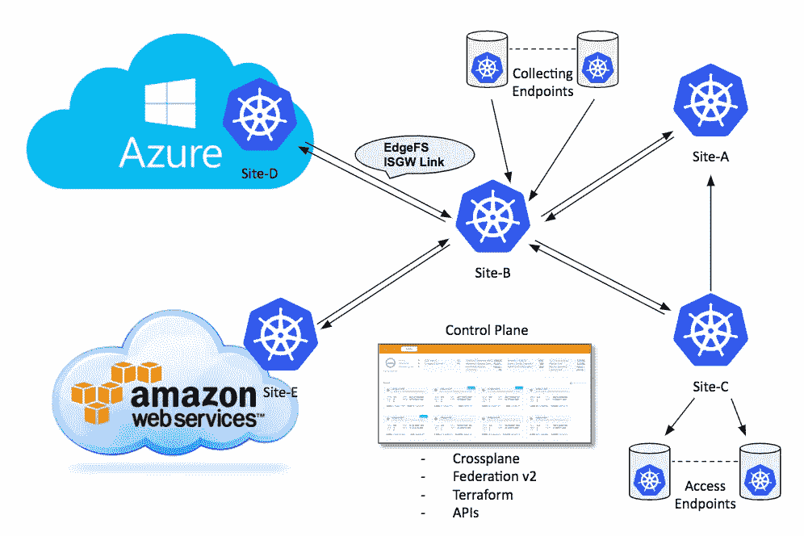
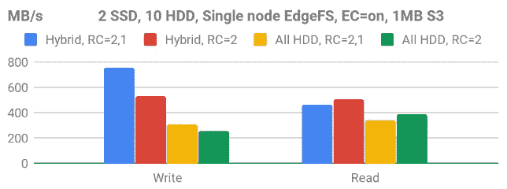
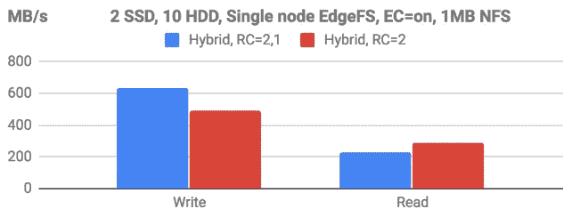

# 具有地理透明的 S3/NFS 访问的对接单节点 EdgeFS

> 原文：<https://itnext.io/dockerized-single-node-edgefs-with-geo-transparent-s3-nfs-access-1415b5ed5d27?source=collection_archive---------3----------------------->

如果您碰巧需要一种快速简单的方法来启动具有地理透明数据访问的单节点 S3/NFS 集群，或者只是简单的单节点 EdgeFS 安装，本文可能会有所帮助！

什么是 EdgeFS？这是 CNCF 鲁克项目的一个新的存储提供商，你可以在 https://rook.io/docs/rook/master/edgefs-storage.html 了解更多信息。但您也可以在所谓的“solo”模式下运行它，这是一种单节点 Docker 容器，能够随着部署的增长而扩展，只需连接更多节点和/或地理上分散的集群段即可。

EdgeFS 的优势在于它能够将底层基础架构虚拟化为可扩展、高可用性的分布式存储系统。它的工作方式类似于“git ”,其中所有的修改都是全局不可变的、完全版本化的、自我验证的、分布式的，因此是容错的。因此，它支持对对象、文件和数据块常用存储协议的跨云和地理透明的高性能分布式访问。

# 使用案例—地理分布的 S3/NFS 归档

地理上分散且透明的 S3/NFS 可访问存档。数百万个大约 1MB 大小的小对象，可在 2 个以上的分段位置访问，用于非结构化归档模式读写，性能特征受分段内存、CPU 和磁盘类型的限制。



分布式双向 EdgeFS 命名空间分段

我想让这一步一步的说明尽可能简单，但同时演示随机 1MB I/O 访问的高性能用例的实现。因此，我将使用混合风格的 EdgeFS 目标部署，配备 10 个硬盘和 2 个固态硬盘，以实现更好的性价比。我的第一个段的磁盘配置如下所示:

```
# lsblk -o name,model,vendor,rota
NAME           MODEL            VENDOR   ROTA
sda            MICRON_M510DC_MT ATA         0
sdb            MG04SCA40EE      TOSHIBA     1
sdc            MG04SCA40EE      TOSHIBA     1
sdd            MG04SCA40EE      TOSHIBA     1
sde            MG04SCA40EE      TOSHIBA     1
sdf            MICRON_M510DC_MT ATA         0
sdh            MG04SCA40EE      TOSHIBA     1
sdi            MG04SCA40EE      TOSHIBA     1
sdj            MG04SCA40EE      TOSHIBA     1
sdk            MG04SCA40EE      TOSHIBA     1
sdl            MG04SCA40EE      TOSHIBA     1
```

其他段可以位于相同或遥远的位置。在本文中，我们将配置连接 2+ EdgeFS 段的 ISGW 链路。

与其进入冗长的 docker 命令行解释，我想我们可以用一个优秀的 [docker-compose 工具](https://docs.docker.com/compose/install/)来稍微自动化一下。您需要一个支持 2.4 格式的版本。

# 步骤 0。下载 docker-compose.yml 文件

Docker-compose 文件列出了我们需要并设计在/edgefs 目录中工作的所有服务。从[这个 gist](https://gist.github.com/dyusupov/d407cb89f8e8644f7a785cb35b62493c#file-docker-compose-yml) 下载并安装到一个空的/edgefs 目录下。验证“docker-compose ps”返回成功。

# 第一步。准备原始磁盘

使用原始磁盘的 EdgeFS(未创建文件系统！)作为其存储介质。它将传统的块设备转换为虚拟化的键值数据库。配置单个节点目标的最简单方法是为节点上的每个原始磁盘手动执行“wipefs -a /dev/DEV”命令，并让 EdgeFS 配置向导构建其最佳配置。

# 第二步。配置目标

在启动 docker-compose 服务之前，我们需要配置 EdgeFS 目标服务。为了实验，我准备了几个我们可以玩的选项。

## 备选方案 1。所有硬盘配置

在此选项中，我们将忽略已安装的 SSD，并命令我们的配置向导只选择 HDD。此选项非常适用于低温、廉价和深度归档:

```
docker-compose run --rm -e CCOW_LOG_STDOUT=1 target config node \
    -i enp5s0f0 -d rtrd -p rtrdAllHDD -o \ '{"LmdbPageSize":32768,"HDDReadAhead":512,"DisableVerifyChid":true}'
```

## 选项 2。混合硬盘/固态硬盘配置，固态硬盘上有元数据和 WAL

如果您只想对数据块使用循环介质，这是一个很好的选择。EdgeFS RT-RD 在合并流 I/O 写入方面做得很好。我建议将此选项用于任何类型的活动归档:

```
docker-compose run --rm -e CCOW_LOG_STDOUT=1 target config node \
    -i enp5s0f0 -d rtrd -p rtrdMDOffload -o \ '{"LmdbPageSize":32768,"HDDReadAhead":512,"DisableVerifyChid":true}'
```

您可能需要替换的上述配置的重要部分:“-i enp5s0f0”需要指向服务可用的接口名称，“-o …”命令支持最佳混合 HDD/SSD 配置和 512k b HDD 预读。

## 选项 3。简单的选项，所有数据都在/edgefs/data 目录中

此选项用于非生产用途。配置后，它将利用本地装载的位置/edgefs/data，并创建 4 个模拟设备。您会注意到“efscli”的汇总输出乘以 4，但现在忽略它。因此，要启用这种模式，只需运行以下命令:

```
docker-compose run --rm -e CCOW_LOG_STDOUT=1 target config node \
    -l localhost -i eth0 -d rtlfs
```

如果您想要调整建议的配置，请传递“— help”标志。

完成后，您可以在/edgefs/etc 目录中查看创建的配置。您可以多次运行 config node 命令，直到您对配置满意为止。

# 第三步。启动目标并初始化服务

启动目标和预配置的服务。这包括休息管理服务、GUI、NFS 和 S3。

```
# docker-compose up -d
Creating edgefs_target_1
Creating edgefs_nfs01_1
Creating edgefs_mgmt_1
Creating edgefs_s301_1
Creating edgefs_ui_1
Creating edgefs_isgw01_1# docker-compose logs -f
```

第一次启动可能需要几分钟，因为它需要准备磁盘。您可以监控其进度，也可以登录到工具箱:

```
# docker-compose exec mgmt toolboxWelcome to EdgeFS Toolbox.
Hint: type efscli to begin# efscli system status
ServerID B86037FF3C399D636A270A2BB4E6780E node3075ub16 ONLINE
```

## 初始化集群段“myspace”

状态为在线后，初始化集群并创建系统对象:

```
### initialize local cluster segment
efscli system init### initialize myspace/work/shared1
efscli cluster create myspace
efscli tenant create myspace/work
efscli bucket create myspace/work/shared1 \
    -s 512K -r 2 -R 1 -t 1 -c 3:1:xor -C 2h
```

EdgeFS 使用全局唯一的系统路径，格式为名称空间/租户/存储桶/对象。在上面的示例中，我们创建了“myspace/work/shared”存储桶，在对象版本超过 2 小时、复制计数为 2 且 1 个副本延迟、默认区块大小为 512KB 时，触发 XOR 擦除编码模式 3:1。

我们还可以连接到 GUI，通过将 web 浏览器指向 http://IPADDR:3000 (默认用户管理，默认密码是 edgefs)来创建/监控/管理服务。


## EdgeFS 中的擦除编码设计

EdgeFS 中的 EC 有许多好处，特别是在我们的示例中，它被设计为后处理，它延迟编码，直到对象被认为是冷的(配置为自版本创建起经过 2 小时)。它通过删除一组 3 个区块的 4 个不再需要的副本并在后台添加 1 个奇偶校验区块来保留不可变的对象结构，因此，与普通复制相比，写入 I/O 路径不受影响。在编码过程中，最初的 3 个区块保持未编码，因此后续读取 I/O 不需要重建，因此对冷数据读取性能没有影响。


*重要提示:*对于要触发的每个编码模式，集群需要有≥ n_data+n_parity 故障域，并且存储桶复制计数必须≥ n_parity+1。例如，对于 3:1:xor 模式和设备级故障域(单节点)，集群段需要提供至少 4 个设备。

总结一下:

*   当数据“变冷”时，编码作为后处理完成(可调)。对写入性能没有影响
*   编码是“跨块”执行的。对读取性能没有影响:数据区块的完整副本保留在集群中
*   完全分布式丢失奇偶校验/区块重建
*   支持冷->热数据修改(覆盖)
*   支持灵活的模式:2:1:异或，3:1:异或，4:2:rs，6:2:rs，9:3:rs

# 第三步。创建 S3、NFS 和 ISGW 服务

既然已经创建了集群命名空间段、租户和存储桶，我们就可以设置 S3、NFS 和 ISGW 服务定义了:

```
### NFS service with myspace/work/shared1 export
efscli service create nfs nfs01
efscli service config nfs01 X-MH-ImmDir 1
efscli service serve nfs01 myspace/work/shared1### S3 service servicing myspace/work tenant
efscli service create s3 s301
efscli service serve s301 myspace/work### ISGW endpont link
efscli service create isgw isgw01
efscli service serve isgw01 myspace/work/shared1
efscli service config isgw01 X-ISGW-Remote ccow://REMOTE_IP:14000
efscli service config isgw01 X-Status enabled
```

此时，docker-compose 脚本将在下一次策略重启时获取更改，服务应该可用。如果由于某种原因它没有启动，使用以下命令加速服务重启:

```
docker-compose logs -f nfs01         # monitor nfs service logs
docker-compose logs -f s301          # monitor s3 service logs
docker-compose logs -f isgw01        # monitor isgw01 service logsdocker-compose restart nfs01
docker-compose restart s301
docker-compose restart isgw01
```

# 第四步。连接 EdgeFS 集群段

EdgeFS 段间网关链接是 EdgeFS 跨段、跨云全局名称空间同步功能的构建块。

它异步分发已修改的数据块，并实现对文件、对象和块设备的无缝和地理上透明的访问。值得注意的是，文件或块设备由一个或多个对象组成，因此，在 EdgeFS 范围内，最终所有东西都是对象，全局不可变且自我验证。

打个比方，EdgeFS 对修改的全局不变性的概念非常类似于“git”对存储库提交和分支的操作方式。因此，这种技术使 EdgeFS 用户能够构建和操作广泛分布的全局名称空间，同时大大简化了管理开销。ISGW 端点链接会立即注意到在设置了 ISGW 链接的源站点上修改的文件或对象，从而传播更改。最终，所有连接的站点都将收到文件修改，其中只传输修改过的数据块。



ISGW link 不仅减少了需要传输的数据量，还消除了传输中的重复数据。匹配文件更改的全局唯一加密签名将不会被传输，从而启用全局命名空间重复数据删除。

ISGW 链接可以是双向的，即支持跨名称空间的相同文件/对象修改。它适用于许多应用程序逻辑可以确保变更序列化的用例。单个双向链接可以连接两个站点，但也可以根据需要创建尽可能多的非重叠链接。

ISGW link 还可以透明地同步文件、对象、目录、存储桶或租户级快照，这些快照被分组到所谓的 SnapView 结构中。因此，例如，对块设备修改可以在整个全局命名空间中一致地查看。

因为 EdgeFS 元数据也是全局不可变和唯一的，所以可以启用只传输元数据更改的模式。启用此模式后，用户可以构建高效的访问端点，在那里可以按需获取修改，这是通过内置的 E-LRU 回收策略创建全球和地理分布式缓存雾聚合的结果。

每个站点的本地 I/O 以物理或虚拟连接的媒体设备的速度执行。最终传输全局不可变的修改(版本),并且不会降低本地站点运行应用程序工作流的速度。

假设此时 2 段都已配置了步骤 1–3，我们现在可以创建双向 ISGW 链路。

以下命令解释了如何创建段间链接:

# 验证和性能

现在是有趣的部分，让我们使用服务和验证功能，并获得我们想要的用例的最佳性能。

让我们从主要场景开始，模拟创建 100，000 个 1MB 的 S3 对象。为此，我们需要安装 CosBench:

```
COS_HOST=10.3.30.75
docker run --rm -d -p 19088:19088 -p 18088:18088 -e ip=$COS_HOST \
    -e t=both -e n=1 -e u=true nexenta/cosbench
```

登录[http://$ COS _ HOST:19088/controller/](http://10.3.30.75:19088/controller/)，提交[本要点](https://gist.github.com/dyusupov/dded61c4a3dc815de48a7d7dbb0c0206)的工作量。



为了便于实验，现在让我们在 NFS 上空，在同一个铲斗上运行一个类似的测试。以下 fio 命令将完成这项工作:

```
### mount NFS sharemkdir /mnt/shared1
showmount -e $COS_HOST
mount -t nfs $COS_HOST:/work/shared1 /mnt/shared1 -o tcp
mkdir /mnt/shared1/dir1### execute FIO testfio -name=myjob -directory=/mnt/shared1/dir1 -ioengine=psync \
    -norandommap -randrepeat=0 -allrandrepeat=0 -refill_buffers \
    -blocksize=1M -nrfiles=1000 -filesize=1M -rw=write -buffered=0 \
    -buffer_compress_percentage=0 -dedupe_percentage=0 \
    -iodepth=2 -numjobs=10 -fallocate=none -group_reporting
```

总的来说，NFS 更多的元数据密集型协议，因此，我不认为人们会希望使用所有的硬盘配置来处理大量的小文件。因此，我们将实验仅限于混合配置。



NFS 的性能与 S3 相似，只是元数据的开销微不足道。现在让我们探索一下我们是否能够透明地访问文件和对象:

```
### Place an object via S3 and access via NFScurl [http://$COS_HOST:9982/shared1/path/to/obj1](http://localhost:9982/shared1/path/to/obj1) -X PUT
ls /mnt/shared1/.objects/path/to/obj1### Place a file via NFS and access via S3mkdir -p /mnt/shared1/dir/to; touch /mnt/shared1/dir/to/file1
curl [http://$COS_HOST:9982/shared1/.nfs/dir/to/file1](http://localhost:9982/shared1/.nfs/dir/to/file1)
```

完全保留路径，并且可以在同一个群集段内透明地访问文件/对象。现在，让我们切换到第二个集群段，尝试访问同一个对象和文件:

```
### Second segment has our modifications and preserves transaprencyls /mnt/shared1/.objects/path/to/obj1
curl [http://$COS_HOST2:9982/shared1/.nfs/dir/to/file1](http://localhost:9982/shared1/.nfs/dir/to/file1)### We can also see all the objects and files that we created during 
### our performance testsls /mnt/shared1/dir1|wc -l
10002### We can display syncing statistics
efscli service show isgw01 -sX-Service-Name: isgw01
X-Service-Type: isgw
X-Description: Inter Segment Gateway
X-Auth-Type: disabled
X-Servers: -
X-Container-Network: -
X-ISGW-Basic-Auth: -
X-ISGW-Direction: -
X-ISGW-MDOnly: -
X-ISGW-Encrypted-Tunnel: -
X-ISGW-DFLocal: 0.0.0.0:49678
X-ISGW-Replication: 3
X-ISGW-Local: 0.0.0.0:14000
X-ISGW-Remote: ccow://10.3.30.75:14000
X-Status: enabled
[
  myspace/work/shared1
]Stats: [
myspace/work/shared1: {
        "timestamp":         1551664249664,
        "status":            "active",
        "state":            "continuous",
        "delay":             29664,
        "version_manifests": 1,
        "requests":          2,
        "chunk_manifests":   0,
        "data_chunks":       0,
        "snapshots":         0,
        "bytes":             693,
        "latency":           81
}
]
```

这里假设所有链接的集群段都预先创建了 myspace/work 名称空间和租户。如果需要，我们可以在租户级别轻松覆盖源对象属性，从而提供一种利用集群段物理特征的方式，并以更具成本效益的方式利用基础架构。

# 拆卸

要清理并重新开始，这些命令会很有用:

```
docker-compose down
docker-compose run --rm -e CCOW_LOG_STDOUT=1 target toolbox \
    nezap --do-as-i-say
partprobe                  # refresh partitions tables
rm -f ./var/run/flexhash*  # reset previously discovered FlexHash
```

它会在/edgefs/etc 中保留当前配置，同时会清理磁盘和缓存，以便可以重新创建或重新初始化配置。

# 摘要

EdgeFS 利用本地可用的资源，并将它们呈现为高可用性的集群段。由于其不可变的数据结构设计、通过低延迟协议的动态数据放置以及高度可扩展的无共享架构，实现了出色的性能特征。本地创建的集群段可以根据性能和容量要求进行扩展，只需向其中添加更多服务器即可。

EdgeFS 对于可以创建多少个集群段没有限制。全网状网络可以像传统主-从或双向链路一样工作。它工作的原因是元数据是全局唯一的和不可变的，因此允许跨段传输协议避免修改的分布(如果存在的话)。因此，段间网关上的重复数据消除可以极大地节省出口成本，因为它处理压缩数据块，不需要传输重复数据。

今天就试试吧！让我知道你的想法？

加入我们日益壮大的社区，了解更多信息，网址为:http://edgefs.io 和 [http://rook.io](http://rook.io)