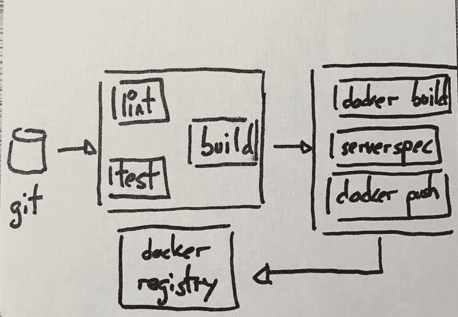
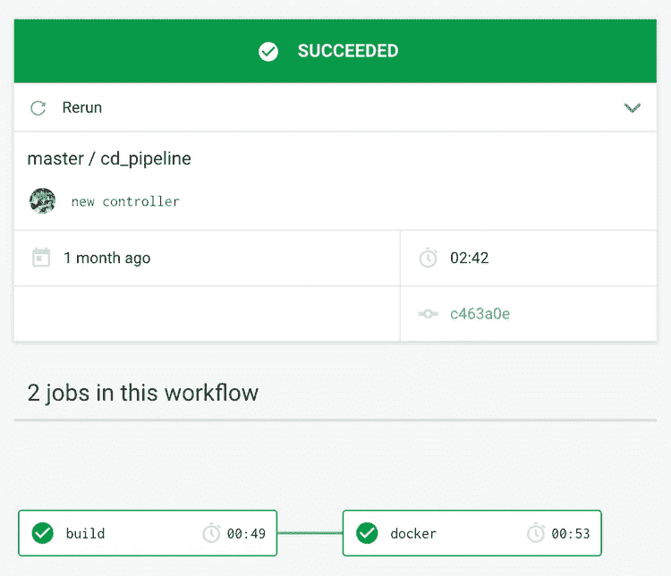
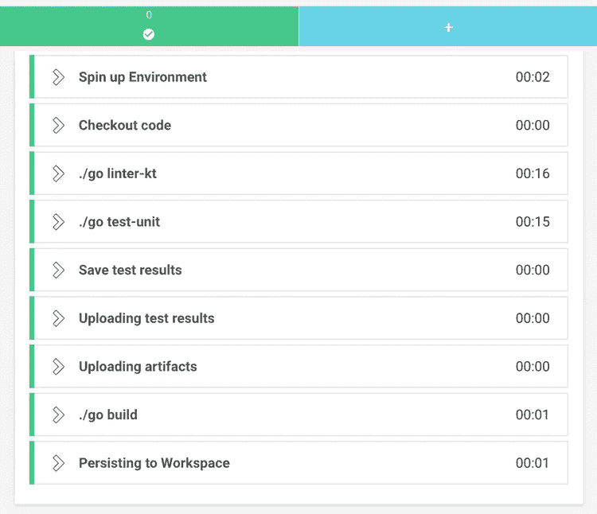

# 用 CircleCI 编写 JVM 应用程序

> 原文：<https://itnext.io/dockerizing-a-jvm-app-with-circleci-204fcd48d211?source=collection_archive---------3----------------------->

很长一段时间以来，我一直在用特拉维斯做我的个人项目，直到大规模裁员的消息吓得我开始寻找替代方案。我听说过关于 CircleCI 的好消息，所以我决定试一试。具体来说，我希望构建一个管道来完成以下任务:

*   封装一个用 [Kotlin](https://kotlinlang.org/) 编写的 [SpringBoot](https://spring.io/) 应用程序作为`jar`，运行 linters 和之前的测试，保存测试结果。
*   构建一个 [Docker](https://www.docker.com/) 映像来运行应用程序，首先运行 [ServerSpec](https://serverspec.org/) ，并将其推送到 *Docker* 注册表。

按照我自己对管道的想法，我希望它快速、可视化、易于维护并且可靠地构建我的玩具应用。成功了吗？休息之后更精彩！

# 绕圈跑

CircleCI 有一个[免费计划](https://circleci.com/pricing/usage/)，非常适合实验，与 [Github](https://github.com/) 无缝集成，这使得开始变得轻而易举。

基础知识在[他们自己的网站](https://circleci.com/docs/2.0/getting-started/)上有深入的介绍，所以我会跳过。让我们直接进入细节。这是要实现的管道的草图:



我将讨论一些我感兴趣的细节，以及实现部分管道的代码。TLDR:这是完整的管道。

# 使用工作流

工作流是 CircleCI 组织工作间依赖关系的方式。在我的例子中，这只是一种说法，即一个作业应该在另一个作业之后执行，如下图所示:



看起来很简单，对吧？然而，这幅图并没有展示全部的真相。我使用一个过滤器将`docker`任务限制在`master`分支。工作流定义如下所示:

为什么有限制？嗯，我正在使用[dependent bot](https://dependabot.com/)来自动检查依赖关系的新版本，我希望工具生成的 PRs 运行我的测试，但不要生成新的 docker 映像。

# 构建步骤

我总是在某个 Docker 映像中运行我的工作。对于构建，我使用由 *CircleCI* 提供的 *OpenJDK* 图像，这是它们维护的许多图像中的一个。这些是步骤。

[detekt](https://github.com/arturbosch/detekt) 基本上是一个可以在管道内独立运行的棉绒。除此之外，执行单元测试，如果一切正常，就构建一个`jar`。

# 坚持

与 [Concourse](https://concourse-ci.org/) 不同的是， *CircleCI* 允许你在任务之间持久化工件，这非常方便。在这种情况下，当我构建 *Docker* 映像时，我需要我们刚刚生成的`jar`文件。为了持久化它，您在`build`作业的步骤列表中添加了一个额外的指令:

```
- persist_to_workspace: 
    root: build/libs 
    paths: 
      - echo.jar
```

# 你必须保存测试

我发现的另一个漂亮的特性是[存储测试结果](https://circleci.com/docs/2.0/collect-test-data/)，它出现在仪表板中，让你更容易理解你的工作在做什么。

测试结果和执行摘要都被存储为工件。为此，需要添加一些额外的步骤:

总而言之，构建有一堆步骤，正如在这个截图中可以看到的。



# 码头工步骤

# 图像本身

因此，如果我想对我们的应用程序进行归档，我需要一个归档文件。).该映像运行在前一个任务上构建的`jar`:

没什么异常。[这是最近的一篇关于提高你的 *Docker* 图片质量的文章](https://blog.docker.com/2019/07/intro-guide-to-dockerfile-best-practices/)。

# 运行 ServerSpec

我是使用 [ServerSpec](https://serverspec.org/) 测试容器的忠实粉丝，因为[我在](https://hceris.com/testing-containers-serverspec-and-localstack/)之前已经写过并且多次提到过。

由于臭名昭著的 [docker in docker](https://jpetazzo.github.io/2015/09/03/do-not-use-docker-in-docker-for-ci/) 问题，在配置项中运行这些测试往往很痛苦。当我试图安排他们去 CircleCI 的时候，我还以为会有另一轮的痛苦。

没那么多！令人惊讶的是，它进行得相当迅速。也许我现在已经习惯了，谁知道呢。但是，如何去做呢？

我为此设立了一份新工作。我用 ruby image 创建并上传了自己的 [dind，这样我就可以访问更新的`ruby`版本。它的简化版本如下所示:](https://hub.docker.com/r/sirech/dind-ruby/tags)

由于有了 [setup_remote_docker](https://circleci.com/docs/2.0/building-docker-images/) 指令，常规的`docker`命令可用于这项工作。安装完依赖项后，[测试](https://github.com/sirech/echo/blob/master/spec/container_spec.rb)可以在管道内部运行。

通过使用`attach_workspace`指令，可以获得前一个作业中生成的`jar`。

# 建立形象

一旦容器测试通过，就该构建映像并将其发布到某个注册中心了。这将是我们最终可以用于部署的工件。部署可以在同一个管道中进行，也可以在单独的管道中进行，这并不重要。

从和以前一样的工作开始，是时候登录到我们应该保存图像的注册表中了。然后我们用正确的标签构建图像，并按下它:

```
- run: 
    name: Publish docker image 
    command: | 
      echo $DOCKER_PASSWORD | docker login -u $DOCKER_USER $DOCKER_REGISTRY --password-stdin
      docker build . --tag $DOCKER_REGISTRY/echo 
      docker push $DOCKER_REGISTRY/echo
```

你可以看到我没有对图像进行版本控制。对于严肃的应用程序，不要这样做。您可以通过使用`CIRCLE_SHA1`变量来附加`git`提交，这是许多现成可用的[内置](https://circleci.com/docs/2.0/env-vars/#built-in-environment-variables)变量之一。

# 贮藏

隔离非常有助于保持我们的构建的可靠性。不过，这通常与性能不一致。我不想像过去黑暗的日子里那样缓存整个工作空间，但是避免每次都下载依赖项非常方便，并且保持管道快速，这正是我喜欢的方式。

在 *CircleCI* 中，你可以通过保存一个基于键的特定文件夹来实现。例如，如果我想缓存我用于容器测试的`ruby`依赖项，我使用这样一个块:

```
- restore_cache:     
    key: bundle-2-{{ checksum "Gemfile.lock" }} 
- run: bundle check || bundle install --without ops development 
- save_cache:     
    key: bundle-2-{{ checksum "Gemfile.lock" }}     
    paths:       
      - vendor/bundle
```

在此之后，同一作业中的所有步骤都将可用，并且它们将被缓存，直到`Gemfile.lock`文件发生变化。

# 定义变量

我在整个管道中使用变量来编码某些值，比如我的 *Docker* 凭证。它们是通过 UI 来管理的，坦白地说，这并不理想。老实说，我更喜欢更程序化的解决方案。不用说，直接把秘密放在`config.yml`是不可能的，所以这将不得不做。

如果您想要管理多个项目的一组变量，一个选项可以是使用上下文的[。](https://circleci.com/docs/2.0/contexts/)

# 这一切看起来怎么样？

那也没那么糟。我发现 CircleCI 非常直观，对于业余爱好项目来说，他们的标准账户已经足够了。事实上，管道运行速度非常快。开始时，我等了一会儿去检查它们，当我看的时候，它们已经完成了一会儿。

整条管线都在 [github](https://github.com/sirech/echo/blob/master/.circleci/config.yml) 中。这应该是构建您自己的应用程序的良好开端。事实上，管道并没有停止在 *Docker* 阶段，而是有一个基于定制脚本的部署步骤。

*原载于 2019 年 7 月 15 日 https://hceris.com**的*[T22。](https://hceris.com/dockerizing-a-jvm-app-with-circleci/)