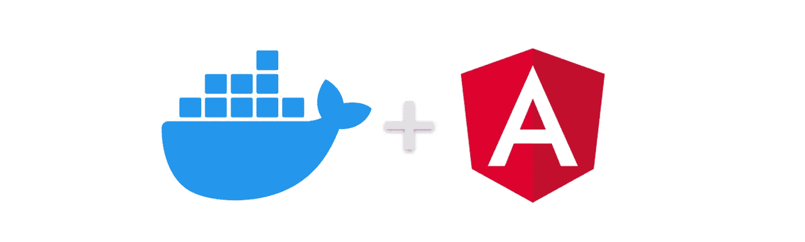
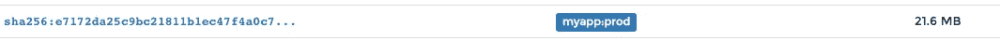

# 用 Karma 和量角器容器记录一个有角度的应用程序

> 原文：<https://itnext.io/dockerizing-an-angular-app-with-karma-and-protractor-containers-3b4c53ea807f?source=collection_archive---------2----------------------->

Docker 是一个容器化工具，用于简化各种环境中的应用程序开发和部署工作流。



本教程展示了如何使用 Docker 和 Docker Compose 在开发和生产中对 Angular 应用程序进行 Docker 化，使用 Angular CLI 进行构建。我们将特别关注:

1.  设置一个 docker-compose 文件用于热重装开发，其中包括一个用于 Karma 和量角器测试的 Chrome 实例
2.  使用多阶段构建配置精简的生产就绪映像

*我们将使用:*

*   Docker 版本 19.03.1，内部版本 74b1e89
*   docker-compose 版本 1.24.1，内部版本号 4667896b
*   马科斯

# 内容

*   [项目设置](#ee43)
*   [生产构建](#a324)

# 项目设置

为角度应用程序创建新文件夹:

```
$ mkdir myApp
```

创建 docker 撰写文件:

```
$ touch docker-compose.yml
```

将以下 yml 配置添加到 docker-compose 文件中。我们将使用开源 angular CLI docker 映像来创建和运行新的 angular 应用程序:

```
version: '3'
services:
  angular_cli:
    image: trion/ng-cli:latest
    container_name: 'angular_cli'
    volumes:
      - .:/usr/app/
    working_dir: /usr/app/
    command: >
      bash -c "ng new myApp --directory ./"
```

`command`配置中的键具有在容器启动后运行的命令。在这种情况下，它将通过 Angular CLI 创建一个新项目。

通过以下命令启动容器。

```
$ docker-compose up
```

通过完成这一步，我们创建了一个新的 angular 项目，并在本地环境中启用了热重载特性。这可能需要 2-3 分钟才能完成。下一步，我们将添加测试服务，并将所有服务一起旋转。

## 设置 Karma 和量角器容器

由于项目已经创建，我们需要对 docker compose 文件中的现有服务进行少量更改。这一次我们不希望命令创建一个新项目，我们只想在容器中运行它。此外，我们需要发布相关的端口，以便能够通过浏览器访问它。看起来像这样:

```
version: '3'
services:
  angular_cli:
    image: trion/ng-cli:latest
    container_name: 'angular_cli'
    volumes:
      - .:/usr/app/
    working_dir: /usr/app/
    ports:
      - 4200:4200
    command: >
      bash -c "npm install && ng serve --host 0.0.0.0"
```

我们需要在 docker-compose.yml 文件中再添加两个服务。一个是因果报应。为此，我们将使用内置 chromium 的 ng-cli-karma 映像。

您将能够通过您的浏览器访问它，并且“更改时自动运行测试”功能已经启用。将以下代码块添加到 docker-compose 文件中。注意服务名的缩进。

```
 angular_karma:
    image: trion/ng-cli-karma:latest
    container_name: 'angular_karma'
    volumes:
      - .:/usr/app/
    working_dir: /usr/app/
    ports:
      - 9876:9876
    command: >
      bash -c "ng test"
```

当这个服务启动时，它将继续运行并观察我们的测试文件的文件变化。您可以通过访问 [http://localhost:9876/](http://localhost:9876/) 访问 Karma UI

下一次点击，我们将通过 docker 容器中的量角器添加另一个运行 e2e 测试的图像。将以下代码块添加到 docker-compose.yml 文件中。

```
 angular_e2e:
    image: trion/ng-cli-e2e:latest
    container_name: "angular_e2e"
    volumes:
      - .:/usr/app/
    working_dir: /usr/app/
    command: >
      bash -c "ng e2e"
```

一旦端到端测试容器运行并完成测试，它就会停止。

最后，我们可以在本地机器上运行容器。我们可以一次运行所有容器，就像这样使用日志:

```
$ docker-compose up
```

或者我们可以从 docker-compose.yml 文件中运行单独的服务，如下所示:

```
$ docker-compose up angular_cli angular_karma angular_e2e
```

# 生产构建

通常，生产 docker 的配置与开发 docker 不同。因此，隔离的最佳方式和归档的最简单方式是在项目根目录下创建新的 Dockerfile:

```
$ touch Dockerfile
```

这一次，我们不需要 Angular CLI 功能和其他工具来改善开发人员的体验。我们只是想把这个项目轻量级的，尽可能高性能的交付给生产。

我们将分两步对此进行归档:

*   构建:使用节点 alpine 映像构建应用程序
*   服务:通过在构建过程和 Nginx 配置之后使用人工制品，我们将服务于应用程序。

将以下配置添加到刚刚创建的 Dockerfile 中:

```
### STAGE 1: Build #### We label our stage as ‘builder’
FROM node:alpine as builderCOPY package.json package-lock.json ./## Storing node modules on a separate layer will prevent unnecessary npm installs at each buildRUN npm ci && mkdir /ng-app && mv ./node_modules ./ng-appWORKDIR /ng-appCOPY . .## Build the angular app in production mode and store the artifacts in dist folderRUN npm run ng build -- --prod --output-path=dist### STAGE 2: Setup ###FROM nginx:alpine## Copy our default nginx config
COPY nginx/default.conf /etc/nginx/conf.d/## Remove default nginx website
RUN rm -rf /usr/share/nginx/html/*## From ‘builder’ stage copy over the artifacts in dist folder to default nginx public folder
COPY --from=builder /ng-app/dist /usr/share/nginx/htmlCMD ["nginx", "-g", "daemon off;"]
```

然后，您可以像这样构建我们的生产映像:

```
$ docker build -t myapp:prod .
```

为了进行测试，您可以使用以下命令运行该映像，并访问 [http://localhost:8080/](http://localhost:8080/) :

```
$ docker run -p 8080:80 myapp:prod
```

这个应用程序的大小比开发图像小很多，在这种情况下，它大约为 21.6 MB



你可以在 github 上看到完整的例子:【https://github.com/ersah123/angular-docker-karma-protractor 

干杯！