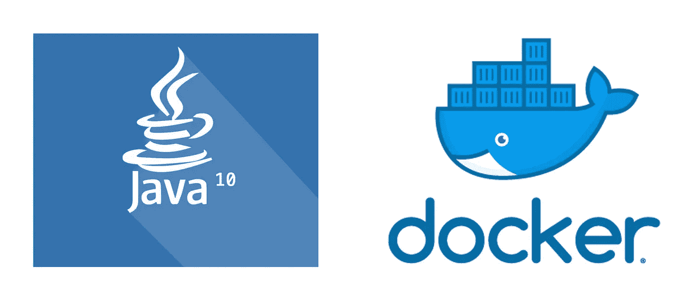

# Dockerizing Java 10 Spring Boot 应用程序

> 原文：<https://itnext.io/dockerizing-java-10-spring-boot-app-d21e95a348f6?source=collection_archive---------1----------------------->

在我之前的[文章](https://medium.com/@andrei.chernyshev/java-10-migration-story-cdc65c05bb5a)中，我一直在谈论使用 **Java 10** 来构建和运行你的**应用。现在是时候讨论如何将它放入 Docker 容器中了。更好地支持容器化是 Java 10 版本的主要特性之一。所以，我们走吧！**

**这是一个相当简单的过程，所以只需看看下面的代码片段:**

**在这里，你可以看到，我使用多阶段 Docker 构建文件。快速提示:Docker 17.05 或更高版本支持多阶段构建，但结果图像是向后兼容的(至少从我的经验来看)。在第一阶段，它从甲骨文下载 **JDK** ，但是将你自己的副本存储在离你的构建服务器更近的地方是有意义的，因为它不是那么小——略小于 200mb。因此，它被下载，解压缩，并准备使用。但没那么快。**

**你可能还记得， **Java 9** 给了我们模块系统， **JDK** 本身也是模块化的。这意味着我们不需要将整个 **JDK** 投入生产，但是我们可以专门为我们的应用需求构建我们自己的条纹版本。为此提供了`jlink`工具。看看它在构建过程中是如何使用的。这里列出的模块应该足以运行一个典型的 Spring Boot 应用程序。在我的生产案例中，我也必须将`java.scripting, jdk.scripting.nashorn`放到列表中。**

**在第二阶段，它复制前一阶段的结果，定义一些环境变量，暴露端口，复制`launch.sh`和应用程序的工件。根本不是火箭科学。**

**这是我刚刚提到的`launch.sh`脚本:**

**那只是一个小帮手，保证有所有重要的东西提供等等。但是，当然，这是可选的。**

**这应该足以将你的应用程序投入生产。如果你有什么想法可以让它变得更好，请写下你的评论。**