# 归档。NET core app:all ready app 的案例研究

> 原文：<https://itnext.io/dockerizing-net-core-app-a-case-study-on-the-allready-app-4d4a3b01a12a?source=collection_archive---------1----------------------->

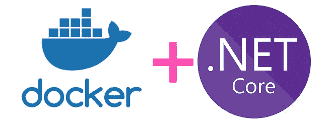

使用 [docker](https://www.docker.com/) 和 [compose](https://docs.docker.com/compose/) 为[创建一个端到端的环境。NET Core](https://dotnet.microsoft.com/)+[SQL server](https://www.microsoft.com/en-us/sql-server/sql-server-2017)+[Typescript](https://www.typescriptlang.org/)app。

这篇文章比平常要长一点，因为它从初学者的角度非常详细地介绍了**创建 dockerfile** 脚本和 **docker-compose** 文件。对于高级 docker 用户来说，这可能太详细了。它旨在观察实际情况。NET 核心服务器渲染的(主要)应用程序，并满足其特定的依赖性。最终的目标是通过这样做来传达我所学到的东西，并在行动中表现出来。

我一直在努力为[做贡献。这是一个开源的准备运动应用——一个好的理由。如果你想用代码或其他方式做出贡献，请去阅读它。](https://github.com/HTBox/allReady)

让我印象深刻的一件事是，让一个新开发人员能够快速建立一个开发环境，查看应用程序，并了解它是如何组织的。将所需的环境归档似乎是一个好主意(似乎我不是唯一一个有这种想法的人)。我真的很喜欢学习 Docker，所以…

让我们从我所说的'*dockering*'开始:有一个声明性的 **docker** 文件和 **docker-compose** 文件，当运行(`docker-compose up`)时，会导致应用程序从源代码中获得**构建的**和在本地 docker 实例上部署的**(可能不仅仅是——实际上是 docker 可用的任何机器):**

**本练习的最终目标是能够按照以下步骤运行应用程序:**

1.  **安装 Docker**
2.  **`git clone`[回购](https://github.com/HTBox/allReady)**
3.  **`docker-compose up`准备好应用程序**

****准备**的步骤是:**

1.  **研究应用程序有哪些组件。**
2.  **研究它们是如何被部署的。**
3.  **构建或使用现有映像来模拟组件和部署。**

**研究部分产生了以下应用组件:**

*   **应用程序数据的 SQL server 实例。它有一个名为`AllReady`的数据库。**
*   **。NET 核心应用程序，通过实体框架核心与 SQL 对话。它还使用实体框架迁移来更新(迁移)数据库。**
*   **前端是一个带有 Typescript 元素的 ASP.NET 核心 MVC 应用程序。后者通过`gulp`脚本进行构建。**

***许多信息来自描述构建和运行过程的* `*appveyor.yml*` *文件。另外* `*gulpfile.js*` *详细描述了前端资源编译的步骤。当然，* `*startup.cs*` *和* `*appsettings.json*` *告诉了我需要知道的事情。NET app。***

**接下来是有趣的部分——模仿容器中的环境。**

## **首先是数据库**

**我知道微软官方支持 SQL server [镜像。从那篇文章中，我对如何在我的本地 Docker 实例上部署一个实例有了很好的了解。我还意识到该映像附带了允许 SQL 查询和命令的`sqlcmd`命令行实用程序。完美——因为我需要某种创建数据库的方法。所以我的计划是启动](https://docs.microsoft.com/en-us/sql/linux/quickstart-install-connect-docker?view=sql-server-2017&pivots=cs1-bash) [SQL server 映像](https://hub.docker.com/_/microsoft-mssql-server)的**一个容器实例**来实际充当数据库服务器，启动同一个映像的**另一个容器实例**来用于其`sqlcmd`实用程序，而不是在其中启动 SQL。**

**主实例:**

```
docker run -e ACCEPT_EULA=Y -e SA_PASSWORD=sa12345! -p 1433:1433 --name sql1 --network sql -d mcr.microsoft.com/mssql/server:2017-latest
```

**指示呈现容器的环境变量`-e ACCEPT_EULA=Y -e SA_PASSWORD=sa12345!`需要接受最终用户协议并设置系统管理员帐户，`— network sql`告诉 docker 为该容器创建一个网络(或加入，如果存在的话，`-d`表示在后台运行，然后是映像的名称`mcr.microsoft.com/mssql/server:2017-latest`。这需要几分钟下载，然后几秒钟旋转起来。**

**完成后，是第二个实例的时候了:
`docker run --rm -it --network sql mcr.microsoft.com/mssql/server:2017-latest bash`其中`--rm`表示—在容器退出后移除它(而不是保留它以便重新启动和重用)，`-it`表示给我容器的输入输出—即在容器“内部”获得一个控制台，允许命令，`— network sql`使两个容器处于相同的网络中，最后—容器的名称`mcr.microsoft.com/mssql/server:2017-latest`和最后【T5)—当它启动时在容器中运行什么。我不想启动数据库服务器—这是默认设置。然后在容器中我们可以运行`/opt/mssql-tools/bin/sqlcmd -S sql1,1433 -U sa -P sa12345!`和`create database AllReady`和`go`和`select name from sys.databases`和`go`:**

**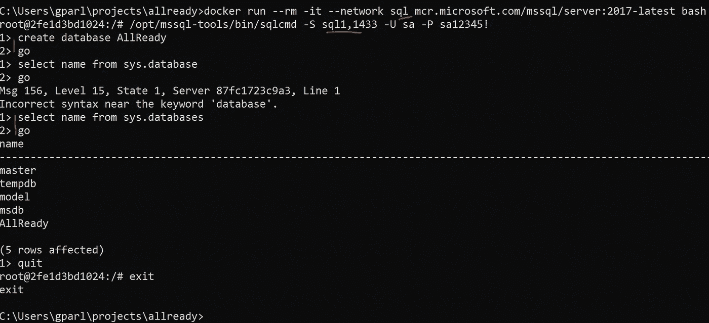**

**我保留了原始抄本(有错别字)。我注意到了有趣的部分 run 命令、到 sql1:1433 上的服务器的连接，然后创建数据库并查询以查看它是否真的在那里**

**就是这样，我们在一个容器中有一个正在运行的 SQL server 实例，容器中有应用程序期望找到的数据库。这是足够的数据库了。**

## **接下来——应用程序本身**

**如前所述，这是一个. NET 核心应用程序，它也需要节点。从`npm`得到几个包，从`nuget`得到几个包。构建`dotnet`应用程序，使用`gulp`任务传输文件类型脚本并准备资源，最后运行数据库迁移并启动服务器应用程序，服务器应用程序进而向用户提供内容。**

**我们将从描述我们想要构建的图像的`dockerfile`开始，然后详细讨论文件的每个部分。也就是说，当我们运行`docker build .`时，它将获取当前文件夹和 docker 文件，并逐个执行指令。每个**指令**都会在**之前的**图像上产生一个**层**，这样我们就得到一个新的图像。**

**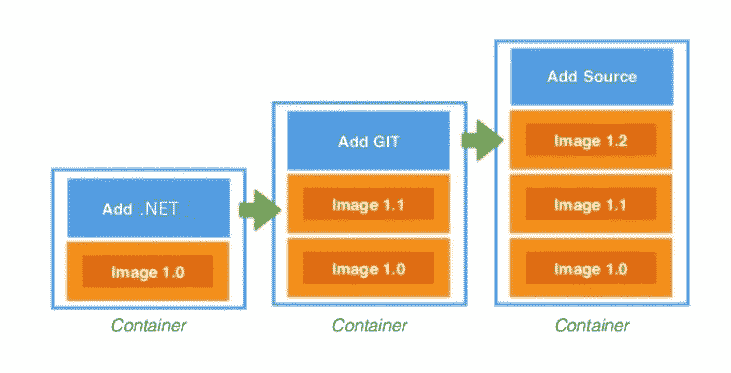**

**从一个基础图像开始，我们添加一层，然后得到下一个图像，再下一个，等等。一层一层地，直到我们得到我们需要的。**

**下面是最终的`dockerfile`和**细节**:**

**脚本的分步描述:**

**微软发布了一张的[图片。NET Core 2.2 安装完毕，随时可用。(如果你想知道香肠是如何制作的，这是原始文档)。下面是我们如何指示 Docker 从该图像开始，即提取图像*并将其用作运行`dockerfile`后将构建的图像的基础。](https://docs.microsoft.com/en-us/dotnet/standard/microservices-architecture/net-core-net-framework-containers/official-net-docker-images)**

*** *仅当它不在本地缓存中时才拉取，否则使用缓存的。它的行为很像 NPM——在本地提取和缓存包。***

****

**app 还需要`node/npm`和`gulp`。接下来的几行从[https://deb.nodesource.com](https://deb.nodesource.com)那里获得`bash`脚本，并在 bash 中运行它(通过管道传递给 bash ),它准备好了包的源代码。下一行实际上安装了`nodejs` (Linux)包。**

****

**之后，使用现在可用的`npm`作为全球可用的命令行实用程序来安装`gulp`:**

****

**然后创建一个文件夹，并使其成为当前工作文件夹:**

****

**之后,`package.json`从我们的构建上下文中复制过来(稍后会有更多介绍)。然后我们运行`npm install`，它将获得`package.json`的依赖项部分中列出的所有包。我们需要专门复制仅`package.json`文件，因为 Docker 缓存层，Docker 文件的每一行代表一层。实际上——当`package.json`没有改变时,`npm install`步骤不会重复——所以我们的`node_modules`将被缓存。如果我们复制整个`src`文件夹，然后运行`npm install`，docker 将看到`src`文件夹中的一些文件被更改，这将使缓存层无效并重新触发`npm install`。这并不理想。`npm install`只依赖于`package.json`所以这就是我们复制过来的。**

**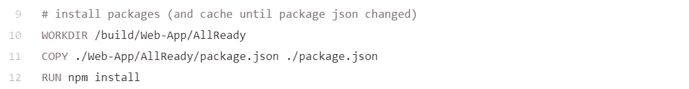**

**接下来，我们对`.csproj`文件进行类似的复制，并恢复它们的依赖关系。`AllReady.Core`是`AllReady` web 项目的依赖项，所以先获取它。再次，对`.csproj`文件的任何更改将触发层失效，并将再次调用`dotnet restore`。**

**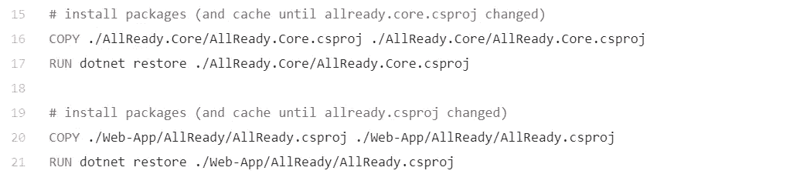**

**然后我们复制源代码的其余部分，创建一个输出文件夹`publish`并构建应用程序。使用`--no-restore`，因为我们已经安装了所有的依赖项。**

**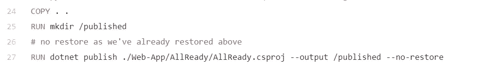**

**然后，我们运行`gulp`任务，并将其输出复制到`/published`中的 build(又名 published)应用程序旁边。**

**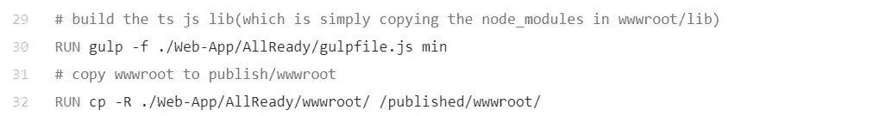**

**最后，我们可以开始迁移，完成后，运行应用程序。我们将这两个步骤作为一个`CMD`来完成，这样当来自这个`dockerfile`的构建映像的容器实例运行时就会发生这种情况。也就是说，在构建映像时不运行`CMD`,而是在创建并运行它的实例时运行。**

**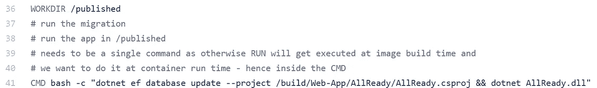**

**对于最后一个，有一点细节:如前所述 **dockerfile** 是一系列的**指令**，当它们被执行时会创建一个**图像**。它包含一些文件，并准备好被推送到`hub.docker.com` 或 docker 图像的另一个存储库，或者只是您机器上的本地存储库。从那里可以运行**映像**，或者我喜欢称之为**实例化** *。这个实例就是我们所说的**容器。**从镜像中获取文件的**副本**，并运行`CMD`(或`ENTRYPOINT`)中指定的命令。容器保持**活动**，直到该命令**结束**。例如，如果服务器启动，容器将在服务器进程运行时运行。例如，如果执行一个短期命令，`ls`容器将在`ls`打印出文件夹内容后立即停止。**

**** *与. NET 类非常相似的是* ***实例化*** *，我们得到的实例是实际的运行时单元。容器是运行的图像。容器就是实例。它可以有自己的状态并操纵它，但映像保持不变，其他容器副本可以从中派生出来并相互独立。假设你有一个* `*class Cat*` *和两个实例。* `*var cat1 = new Cat(’puff’); var car2 = new Cat(’fluff’);*` *实例共享蓝图，但它们的状态是它们自己操纵的。***

**从所有这些，我们现在有一个 docker 文件，我们可以建立一个图像:**

```
docker build --tag allready .
```

**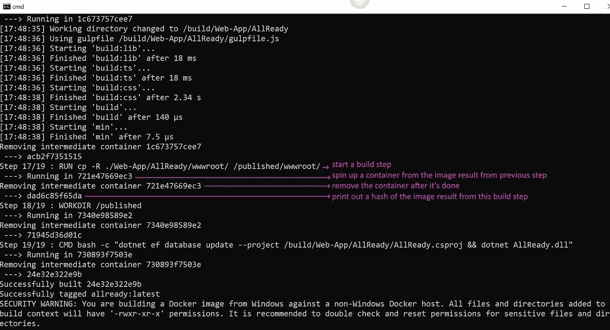**

**这是构建输出的一部分。请注意“—-->在 721e47669ec3 中运行”，然后是“移除中间容器 721e47669ec3”，最后是“dad6c85f65da”。这就是从上一步的图像结果中旋转出一个容器，在容器中执行一个命令，然后从运行的容器中创建一个图像。图像(ex dad6c85f65da)全部可用并可访问。例如，尝试“docker run -it dad6c85f65da bash ”(用您自己构建的哈希替换该哈希),您将能够浏览图像。**

**这将**的结果**在图像**中标记为** `allready:latest`以便于访问。让我们来谈谈背景。注意到命令的**端**上的**点**了吗？这就是我们如何在**上下文**中传递，即我们希望**允许** docker 在构建图像时**看到的文件夹。它是我们用来`COPY`的。所以如果我们在文件夹`myfolder`中，用它作为上下文。`COPY .\package.json .`指令将在`\myfolder\package.json`中寻找`package.json`，如果没有找到则出错。请注意，如果我们尝试`COPY ..\..\package.json`，我们将得到一个错误，因为这是**在我们允许 docker 看到的**上下文**的**之外。****

回到主线，我们继续。然后，我们可以根据刚刚构建的映像旋转一个容器:

```
docker run -it allready
```

`-it`告诉 Docker 在运行的容器中获取一个 shell。我们将在那里看到一些**错误**，这是由于应用程序试图**获取**数据库**的**和**失败**造成的。

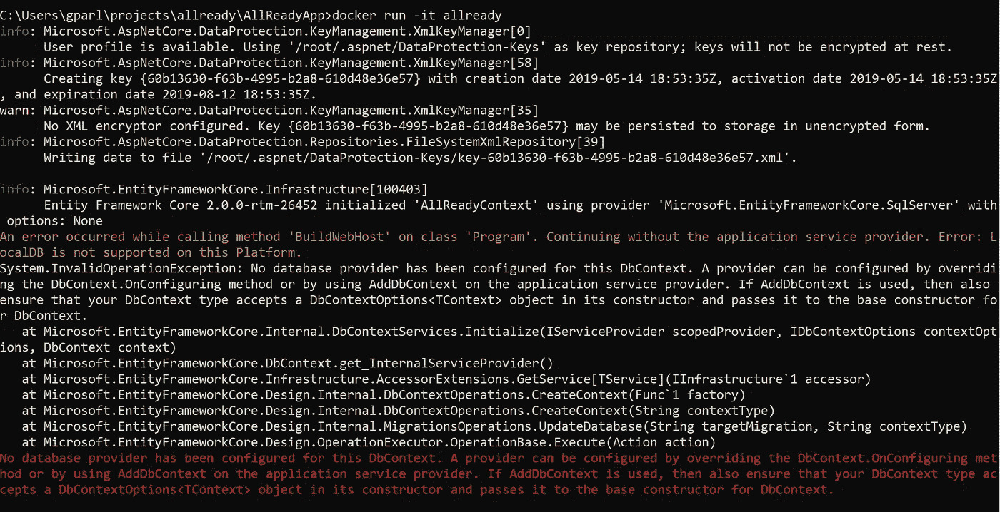

如果我们看一下配置文件`appsettings.json` ，我们可以看到默认连接:

[我们知道](https://medium.com/@gparlakov/the-confusion-of-asp-net-configuration-with-environment-variables-c06c545ef732)我们可以用特殊的语法通过环境变量将配置传递给`dotnet core`，所以`Data.DefaultConnection.ConnectionString`变成了`Data__DefaultConnection__ConnectionString`

所以我们现在可以做以下事情(假设我们已经构建了上面标记为**的图像):**

1.  创建共享的**网络**
2.  打开**端口**和**网络**运行 **DB 镜像**
3.  使用**相同的网络**但不同的命令再次运行 DB 镜像——即**创建**数据库**数据库**
4.  在同一个**网络**中运行 **app** ，传入连接数据库服务器和实例所需的**环境变量**。它通过主机上的 8080 暴露端口 80。所以 localhost:8080 应该会显示 **app** ！

## 创作这一切

哇，工作量真大。至此，我们可以收工了。但是我想更进一步。
对于重复构建和部署，我们可以在命令行上手动一个接一个地执行上述步骤。或者是要复制粘贴的备忘单文本文件。或者批处理/bash 脚本。
或
我们可以使用一个`[**docker-compose**](https://docs.docker.com/compose/compose-file/)` 文件:

它声明了我们在前面的**步骤**中手动输入的所有内容以及更多内容。本质上，我们创建了一个我们的基础设施的声明，可以很容易地在本地重用或在其他地方重用。

在其中，我们声明了三个**服务**——`sql_db`(从第 4 行开始)、`sql_database_creator`(从第 16 行开始)和`app`(从第 23 行开始):

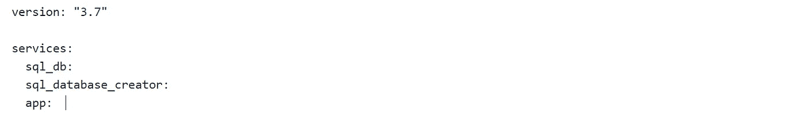

这只是服务声明的顶层。他们中的每一个人都可以并且确实宣布了细节。

他们每个人都可以使用现有的图像:


或者及时建立一个:


基本上与“docker build-tag app”相同

我们可以在容器内部设置环境变量:


我们可以创建一个`volume`来将 SQL server 数据库文件保存在我们机器上的永久文件系统中 docker 主机:


看起来有点空，但就是这样。就像{volume: {database: {}}一样。

然后将该卷(实际上是一个文件夹)传递给文件夹【where SQL Server 将数据库文件存储在运行的数据库容器中:


创建`**network**`:


让所有的容器都成为它的一部分:


声明`app` **依赖于**其他两个服务——因此只有当其他两个**成功启动**时,`app`容器才会启动:


也为`sql_database_creator`:


注意**开始**不等于 [**不等于** **准备好**](https://docs.docker.com/compose/startup-order/) 。在尝试创建数据库之前，我们等待一段时间以确保 SQL server 正在运行:


“命令”将在容器**中执行，而不是在预定义的 CMD/ENTRYPOINT 的**中执行

当然，还要定义端口绑定，即我们将本地主机的哪个端口连接到容器内的哪个端口。即 localhost:8080 连接到容器中的端口:80。


声明如果应用程序失败，它应该重新启动(因为它可能会尝试在尚未启动的数据库上运行迁移)


实际上，从上面的要点来看，行数是 30。不知道那里发生了什么。

现在，有了`docker-compose.yml`,我们可以在命令行上运行`docker-compose up`,我们的应用程序就启动并运行了。这个单一命令将**拉出**所有需要的容器，**构建**需要构建的容器，创建**卷**和**网络**需要的容器，**启动**容器，然后**监控**容器，如果其中一个容器失败，则采取规定的行动(如重启“应用”服务)。我们可能想在编辑源代码时做`docker-compose up --build`，以迫使 Docker 每次都重建我们的映像，否则，它会使用最新的映像。
哪里来的`docker-compose`从来的**？它安装了 Docker 桌面版，这里有更多细节[其他场景](https://docs.docker.com/compose/install/)。**

为了**重述**，我们**从一个应用程序开始**，这个应用程序**要求**开发者(以及运营和任何需要运行或开发应用程序的人)在他们的**本地**机器上**安装**许多**依赖项**。SQL Server，。NET Core SDK，Node 8，囫囵吞枣地说出了其中的大部分。
我们到达了一个**点**，在那里我们可以运行`docker-compose up`并查看应用程序！完成后，我们可以删除图像，彻底删除-应用程序什么都没有留下！并且不会与我们已经为其他项目运行的工具的其他版本发生冲突。我真的很喜欢最后一个。我们可以在持续集成机器上做同样的事情，等等。

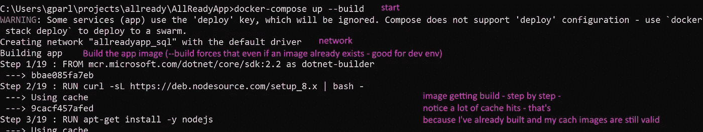

跳过一点…

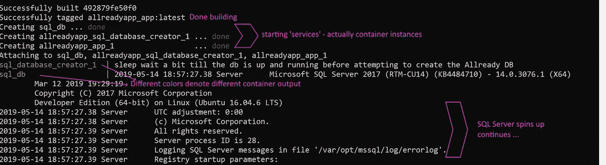

多跳过一些…

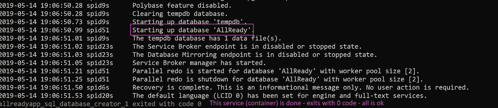

(不要介意日志时间几乎有 10 分钟的差距——必须重新运行)跳过一些更多…和一些更多…和更多..ef 迁移相当冗长…更多…最后

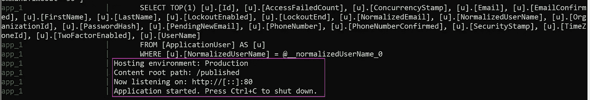

感谢阅读！

这个练习对我来说很有趣，我希望对你有所帮助。我正在考虑将它扩展为一个在线研讨会，我希望得到您的反馈:

你想要一个更详细的版本，一个在线研讨会，让你一步一步地完成整个过程，有一些指导吗？请投票:

我想留给你们一些资源，它们对我理解和使用 docker 和 docker-compose 帮助很大。

*   A very nice **video** from a docker conference for Docker basics — “Docker FROM scratch” [WEBv=i7yoXqlg48M](https://www.youtube.com/watch?v=i7yoXqlg48M)
*   Docker 文档 [https://docs.docker.com/](https://docs.docker.com/)
*   Docker-compose 文档 h [ttps://docs.docker.com/compose/](https://docs.docker.com/compose/)