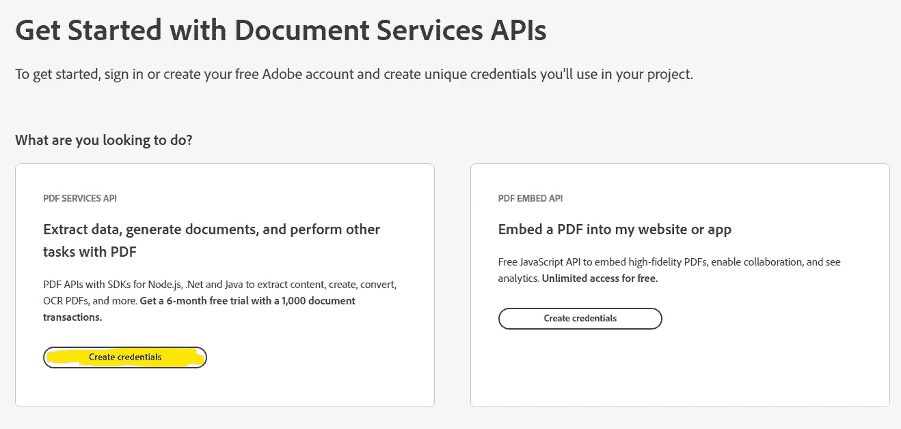
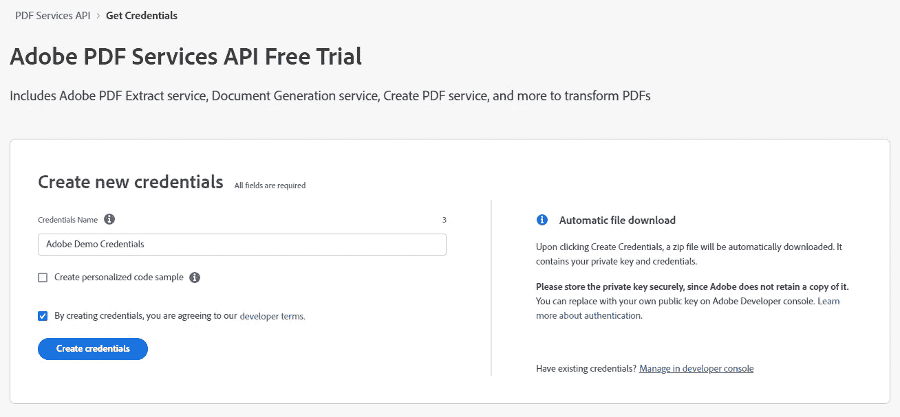
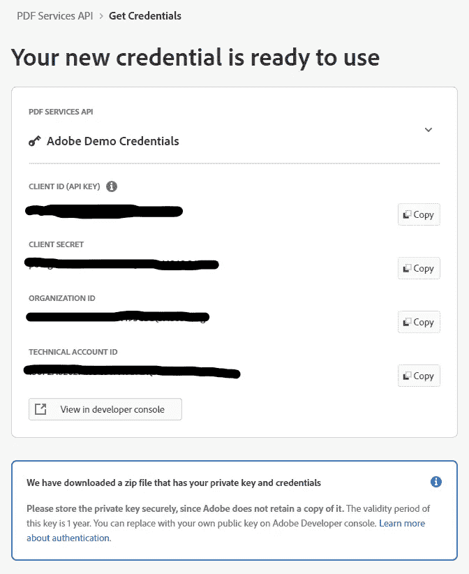
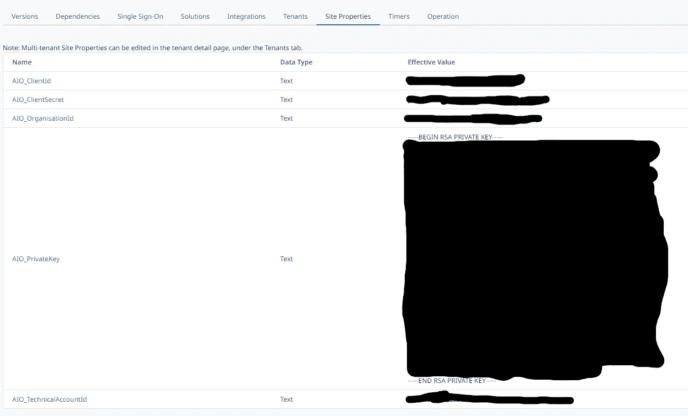
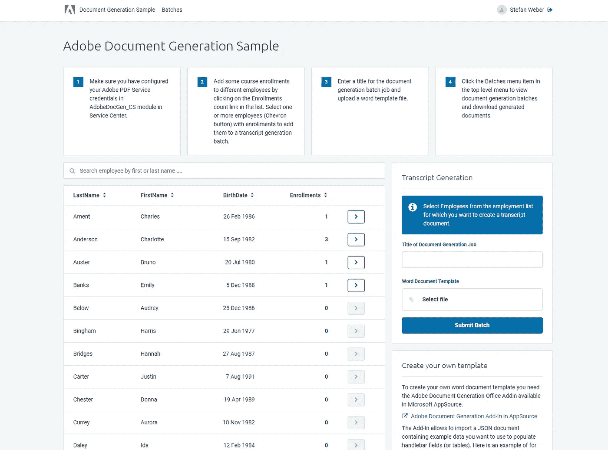
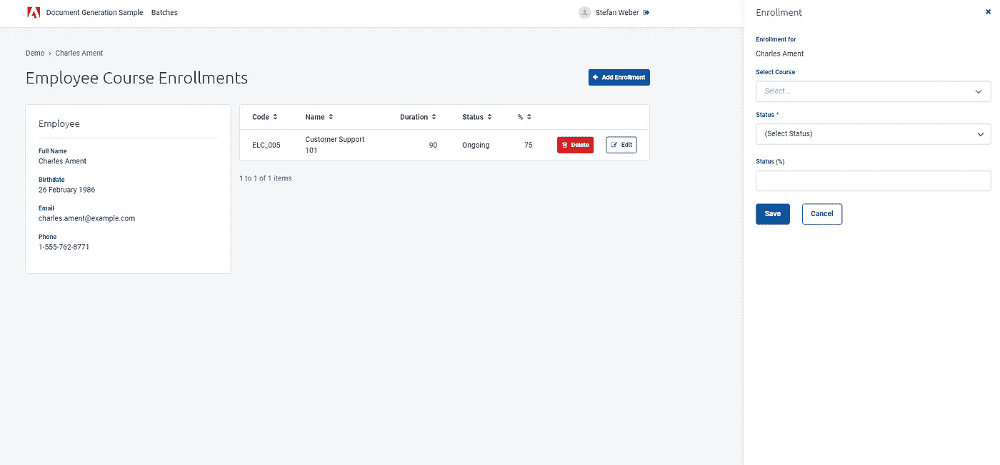
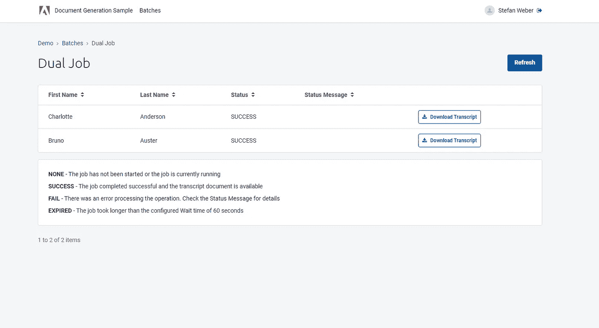
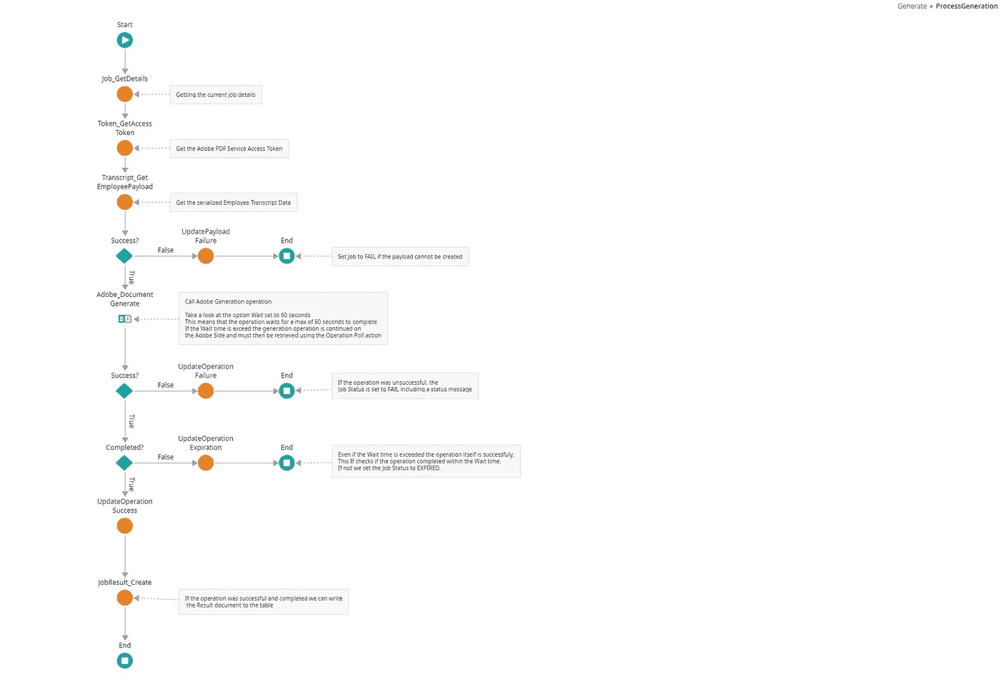
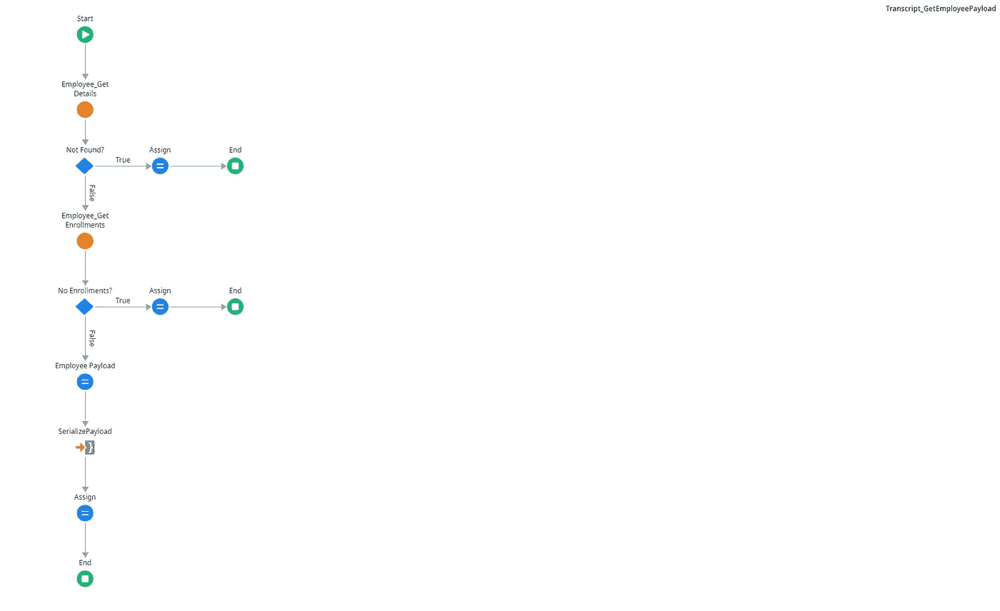

# 使用 OutSystems 和 Adobe 文档服务进行文档组装

> 原文：<https://itnext.io/document-assembly-with-outsystems-and-adobe-document-services-551cf05fa7ed?source=collection_archive---------2----------------------->

在本文中，我们将了解如何使用 Adobe Document Generation(Adobe 文档服务的一部分)将文档与来自外部系统应用程序的数据进行动态组装。


# 外部系统

OutSystems 是一个低代码应用程序平台。支持整个应用程序开发生命周期的可视化开发环境。低代码意味着您仍然可以使用自定义代码，无论是前端的 JavaScript 还是服务器端的 C#。

[](https://www.outsystems.com) [## 低代码高性能软件开发|外部系统

### OutSystems 为有远见的组织创建高性能、低代码和云本地开发平台

www.outsystems.com](https://www.outsystems.com) 

# Adobe 文档服务 API

文档服务 API 是一组云服务，用于提供广泛的文档自动化功能，包括文档生成、操作、转换和内容提取。Adobe 文档服务 API 的主要服务有

*   **Adobe PDF 服务 API** —将各种文件格式转换为 PDF，反之亦然。处理和转换 PDF 文档，包括保护。
*   **Adobe PDF Embed API** —一个功能强大的 PDF web 浏览器，支持集成到其他应用程序中的注释。
*   **Adobe 文档生成 API** —基于动态数据生成 Word 和 PDF 文档。包含标记和占位符的数据和 Word 模板被合并到结果文档中。
*   **Adobe PDF Extract** —使用 Adobe Sensei AI 技术从 PDF 文档中自动提取内容和结构信息。
*   **Adobe PDF Accessibility Auto-Tag API**—在撰写本文时(2022 年 8 月)仍处于早期访问阶段。自动向 PDF 文档添加结构标签，以提高可访问性。

 [## SDK 开发工具包| PDF 库| Adobe 文档服务- Adobe 开发人员

### 拥有端到端的客户体验。我们的 SDK 开发人员套件可定制，经久耐用。找到一个创新的…

developer.adobe.com](https://developer.adobe.com/document-services/homepage) 

# 定义

在我们进入细节之前，让我们澄清一些在处理数据驱动文档生成时经常出现的术语。

**文档组合** —是基于数据组合文档的自动化过程。在最简单的情况下，源文档中的占位符由单个值或整个数据表填充。更复杂的过程使用条件从文本块库中组装文档，从而各个文本块也可以包含占位符和条件。取决于所使用的文档组合解决方案，占位符和条件被直接输入到源文档(例如，Microsoft Word)中，或者文档完全基于数据集来创建。Adobe 文档生成 API 用于文档组装。

**文档自动化** —文档自动化是文档的自动化处理，即通过一个或多个系统和服务传递文档的工作流，生成文档的附加数据或变体。文档自动化的一个经典示例是通过文档组装生成合同，将最终文档转发给 Adobe Sign 等签名服务，最后将签名版本归档到文档存储库中。Adobe PDF Services 和 Adobe PDF Extract 提供了可以集成到更大的文档自动化工作流程中的功能。

**初稿** —根据数据生成最终文档并不总是可能的，或者说不太实际。在这种情况下，文档组合以可编辑的格式生成所谓的初稿。然后对初稿进行人工编辑，并作为最终文档进行进一步处理。

# 摘要

本文和 OutSystems Forge 中附带的示例项目展示了如何使用 Adobe 文档生成 API 组装**数据驱动文档**。除其他事项外，您将学习如何

*   从 **Adobe 身份管理服务**获取并管理 **Adobe 文档服务**的访问令牌。
*   使用 **OutSystems Light BPT** 触发和处理文档组装作业。
*   使用 **Adobe 文档生成 Word 插件**在 Microsoft Word 中创建一个文档组合模板。

我们将使用我的两个 Forge 组件 **Adobe IMS 令牌交换**和 **Adobe PDF 服务**。

*   **Adobe IMS 令牌交换** —包括用于 Adobe 认证的服务器操作。通过 Adobe IMS，我们使用我们的凭据登录，并获得允许我们使用其他 Adobe 云服务的访问密钥。

[](https://www.outsystems.com/forge/component-overview/12581/adobe-ims-token-exchange) [## Adobe IMS 令牌交换

### 该组件的唯一目的是使用 Adobe JWT 证书和私钥创建一个签名的 JSON Web 令牌

www.outsystems.com](https://www.outsystems.com/forge/component-overview/12581/adobe-ims-token-exchange) 

*   **Adobe PDF-Services** —包括针对 Adobe 文档生成、Adobe PDF 服务和 Adobe PDF 提取的多个服务器操作。

[](https://www.outsystems.com/forge/component-overview/12582/adobe-pdf-services) [## adobe PDF-服务

### 该组件与 Adobe 集成。IO PDF-服务。PDF Services 是 Adobe 提供的一项强大的基于云的服务，用于创建…

www.outsystems.com](https://www.outsystems.com/forge/component-overview/12582/adobe-pdf-services) 

> 这个名字有点令人困惑。它表明该组件只实现了 Adobe Document Services 的一个服务，但它包括文档生成、PDF-Services 和 Extract。所有服务的原始名称是 PDF-Services，Adobe 最近刚刚更改了这个名称。

我在 Forge 上创建了一个示例项目来演示各种构建模块，供您参考。

[](https://www.outsystems.com/forge/component-overview/13763/adobe-document-generation-sample) [## Adobe 文档生成示例

### 关于如何使用 Adobe IMS 令牌交换和 Adobe PDF-Services Forge 组件的完整示例。此示例应用程序…

www.outsystems.com](https://www.outsystems.com/forge/component-overview/13763/adobe-document-generation-sample) 

# 准备

接下来，你需要做一些准备工作。显然，你需要一个外部系统环境——一个个人环境就足够了。

将上述 Forge 组件和样例项目下载到您的环境中:

*   Adobe IMS 令牌交换
*   adobe PDF-服务
*   Adobe 文档生成示例

# Adobe 文档服务 API 凭据

接下来，您需要您的 **Adobe 文档服务证书**。

> PDF Services API 提供了一个免费试用程序，可以在长达 6 个月的时间内处理 1，000 个文档事务。单击下面的链接注册凭据。

 [## DC 集成创建应用程序

### 编辑描述

documentcloud.adobe.com](https://documentcloud.adobe.com/dc-integration-creation-app-cdn/main.html) 

> 如果您没有 Adobe 帐户，您还必须注册一个帐户。

*   点击 PDF-Services 卡中的**创建凭证**。



选择凭据类型

*   为您的凭证添加一个**名称**。这有助于您以后识别您的凭据，尤其是当您有多个使用 Adobe 文档服务的项目时。



*   阅读并同意开发者条款，然后点击**创建凭证**按钮。

在下一页，会自动下载一个 ZIP 文件。它包含一个 JSON 格式的文件，如屏幕所示。另一个名为 **private.key** 。这是您希望保存在安全存储中的最重要的文件。稍后将需要您的凭据和私钥。您不需要复制这个屏幕中的凭证，因为它们包含在 JSON 凭证文档中。



创建的身份证明页

您始终可以从 [Adobe 开发人员控制台](https://developer.adobe.com/console)访问您的凭证，但不能访问您的私钥。

要创建和编辑文档组合模板，您需要 **Adobe 文档生成 Word 插件**

*   打开**微软 Word** 。切换到功能区中的**插入**选项卡，点击**获取插件**。
*   搜索 **Adobe 文档生成**。选择列表中的条目，点击**添加**。按照屏幕提示完成插件安装。

安装后，您会看到一个附加组 **Adobe** ，在**主页**功能区选项卡中有一个名为**文档生成**的按钮。

作为最后的准备步骤，我们配置示例项目。

*   创建 Adobe 文档服务凭证后，解压缩您下载的 ZIP 文件，并使用任何文本编辑器打开附带的 **JSON 凭证文档**和 **private.key** 文件。
*   打开安装了 **Adobe 文档生成示例**应用程序的环境的 OutSystems 服务中心。
*   进入**工厂—模块**，打开 **AdobeDocGen_CS** 模块。切换到**站点属性**选项卡，并将 **JSON 凭证文档**中的相应值填入站点属性。

> 确保复制 **private.key** 文件的完整内容。



示例应用程序的站点属性

这些值都是构造和签署一个 **JSON Web 令牌** (JWT)所需要的。然后，JWT 被发送到 Adobe 身份管理服务，以换取服务访问令牌。

> 在较大的数字工厂中，您可能希望将凭证集中在一个安全的凭证存储中。我正在尽可能地在我们自己的外部系统环境和客户环境中使用 **HashiCorp Vault** 。我还为多个 **HashiCorp Vault** 特性创建了连接器 Forge 上有售——包括非常适合存储 Adobe IMS 凭证的任意键值秘密存储。

# Adobe 文档生成示例

示例应用程序允许您将一个或多个课程参与(注册)分配给一个员工，并为一批中的多个员工生成一个成绩单文档。

成绩单文档包含有关员工的一些详细信息以及课程注册及其状态的列表。成绩单文档的输出格式为 PDF。

在研究最重要的实现部分之前，让我们先测试一下我们是否已经正确地配置了所有的东西。

浏览到示例应用程序

在开始屏幕上，您会注意到一个通过 Microsoft Excel 文件引导的员工列表。



样本开始屏幕

通过点击表格中的**登记**计数，您可以为员工创建额外的登记。



添加课程注册

返回开始屏幕，通过点击表格行中的**人字形按钮**，将一个或多个员工(有登记)添加到新的成绩单生成批处理作业中。

将批处理作业命名为**标题**，并上传您的文档生成模板文件。对于第一次试用，您可以从下面的**创建您自己的模板**框中下载样本成绩单模板。

点击**提交批次**按钮。您应该会收到一条绿色的成功反馈消息，表明已经创建了一个新的批处理作业。

在顶部菜单栏中，点击**批次**菜单项，查看所有已创建的批次。单击您的批次标题以查看其详细信息。



显示所有作业的批次详细信息

对于每个员工，您将找到一个条目，其中包含其状态以及(如果失败)其状态消息。

如果成功，您可以点击**下载抄本**按钮下载生成的抄本文档。打开下载的文件查看内容。

如果由于任何原因，您的作业未能运行，请检查状态消息。检查网站属性是否与您的 Adobe 文档服务凭据匹配。

现在让我们回顾一下示例应用程序中的重要实现。

# 检索访问令牌

在 Service Studio 中打开 **AdobeDocGen_CS** 模块。在*逻辑*选项卡中*服务器动作→令牌*下打开**令牌 _ getaccessstoken**服务器动作。

此服务器操作负责检索有效的访问令牌，并在文档组装操作发送到 Adobe 文档服务之前使用。它执行以下操作

*   如果我们已经有缓存的访问令牌，则使用在站点属性中配置的客户端 Id 查询令牌实体中的记录。
*   如果可以检索令牌并且令牌尚未过期，则服务器操作返回缓存的访问令牌。
*   如果无法从缓存中检索令牌或检索到的令牌已过期，则使用配置的站点属性和元范围实体调用 **Adobe_TokenExchange** (来自 Adobe IMS 令牌交换组件)。Metascope.DC (这是访问 Adobe 文档服务的必要条件)。
*   如果成功，新的或更新的令牌将存储在令牌缓存中并返回。否则，抛出异常 **AccessTokenException** 。

这是检索和管理定时访问令牌的常见模式。如果检索到的访问令牌没有过期(或接近过期),则重复使用它是一种良好的做法，不要每次操作都检索它。当您检索新的访问令牌时，一些服务会使以前的访问令牌无效，这可能会导致失败，尤其是在并行执行操作时。

> 如上所述，您可能希望将凭证管理卸载到中央凭证存储库，如 **HashiCorp Vault** 。请注意，不仅凭证是敏感的，访问令牌或 OAuth 刷新令牌也是敏感的，不应该以纯文本形式存储。除了使用中央凭证管理解决方案之外，您还可以使用您的外部系统环境的**私钥来选择并加密凭证和令牌。Crypto API Forge 模块有一个用环境密钥加密和解密数据的功能。不完美，但总比没有好😏。**

# 文件装配灯 BPT

在同一个模块中的*流程*选项卡中打开**生成**流程。该流程有一个单独的自动活动**流程生成**。



流程生成自动活动

每当在作业实体中创建新记录时，流程本身就会执行，并执行以下内容。

*   使用 **Job_GetDetails** 助手服务器操作查询包含员工和模板的作业详细信息，以用于文档组装。
*   调用**令牌 _ getaccessstoken**(见上文)来检索访问令牌。
*   通过**脚本 _GetEmployeePayloadData** 服务器动作获得序列化 JSON 形式的脚本负载数据。(见下文)。
*   如果有有效数据，那么调用 Adobe PDF-Services Forge 组件中的 **Adobe_DocumentGenerate** ，其中包含客户端 id 站点属性、访问令牌、模板文件名和二进制数据、设置为 PDF 的输出格式以及设置为 60(秒)的等待选项。

> 60 的**等待**选项告诉文件生成操作等待最长时间。60 秒的时间来完成手术。如果操作花费的时间超过 60 秒，那么操作将异步继续，否则将立即返回结果文档。

*   如果操作失败，作业状态将更新为失败
*   如果操作成功，我们将再次检查操作是否在 60 秒的**等待**时间内完成。如果没有完成，我们将作业状态设置为过期。

> 我决定最小化样本的复杂性，如果操作没有在等待时间内完成就退出。如果您处理大而复杂的文档生成，那么您可以在这里添加一个启动流程，该流程使用 Adobe PDF-Services Forge 组件中的 **Adobe_OperationPoll** 服务器操作定期检查操作，直到操作完成。

*   如果成功且已完成，则将作业状态设置为成功，并存储生成的副本文档。

# 为文档组合生成有效负载数据

Adobe 文档生成将一个包含有效负载数据的 JSON 文档和一个包含车把标签的 Microsoft Word 文档作为输入，然后合并这两个文档以生成一个输出文档。

在*逻辑*选项卡中打开**抄本 _GetEmployeePayload** 服务器动作。



员工有效负载生成

此服务器操作:

*   使用 **Employee_GetDetails** 服务器操作查询雇员的详细信息
*   使用**Employee _ get enrollment**查询员工的所有登记

然后，结构类型 **Document_Payload** 的本地属性 **LocalPayload** 被来自两个服务器动作的数据填充。

*   Adobe 文档生成需要文本形式的有效负载数据，因此 LocalPayload 属性使用 JSON Serialize 进行序列化。
*   返回结果序列化的 JSON。

> 同样检查**文档 _ 有效载荷**结构。注意所有属性的 JSON 设置中的**名称。**

我希望应用程序的其余部分是自我解释。如果我应该解释样本的其他方面，请留下评论。

# 创建或修改您自己的模板

为 Adobe 文档生成创建模板包括向任何现有的或新的 Word 文档添加把手标签，然后这些标签可用于组合文档。

我们将修改您在第一次试用中已经使用过的样本模板。

*   确保您已经在中安装了 **Adobe 文档生成 Word。**
*   从样本开始屏幕上的**创建自己的模板**框中下载**样本 JSON 文档**。它包含由**转录本 _GetEmployeePayload** 创建的样本数据。
*   用 Microsoft Word 打开示例模板。
*   在*功能区*栏中点击**文档生成**按钮(Adobe group)。在开始屏幕上点击**开始**按钮。

点击**上传 JSON** 按钮，选择下载样本 JSON 文档。然后点击**生成标签**。

这里的基于助手的选项应该是不言自明的。在“基本”选项卡上，您可以在文档中的光标位置为所选属性添加把手元素。在“高级”选项卡上，您可以通过从示例数据中选择数组来插入图像、表格和列表。

但是还有更多。Adobe 文档生成支持 **JSONata** 表达式，助手不直接支持。

[](https://jsonata.org) [## JSONata

### JSONata:用于 JSON 数据的声明性开源查询和转换语言。

jsonata.org](https://jsonata.org) 

在这种情况下，您必须直接在文档中键入把手和表达式。

我们希望在表格下方显示文档中的附加部分。如果一名员工有 4 个以上的注册，我们希望显示文本 **Awesome Learner** 。

将以下内容直接添加到表格下方的文档中

```

Awesome Learner

```

> %前后的空格很重要。

风格**牛逼的学习者**任何你想要的样子。

试试你修改过的模板，生成一些抄本。

要了解如何为 Adobe 文档生成创建动态模板的更多信息，请访问[模板标签的 Adobe 文档生成文档](https://developer.adobe.com/document-services/docs/overview/document-generation-api/templatetags/)。

仅此而已。

感谢您的阅读。我希望你喜欢它，并且我已经很好地解释了重要的部分。如果没有，请告诉我😊

如果您在启动和运行时遇到困难，请使用 [OutSystems 论坛](https://www.outsystems.com/forums)获得帮助。非常欢迎对如何改进这篇文章提出建议。通过我的 [OutSystems Profile](https://www.outsystems.com/profile/0qginuc0j5/overview) 给我发消息，或者直接在 medium 上回复。

如果你喜欢我的文章，请留下一些掌声。低编码快乐！