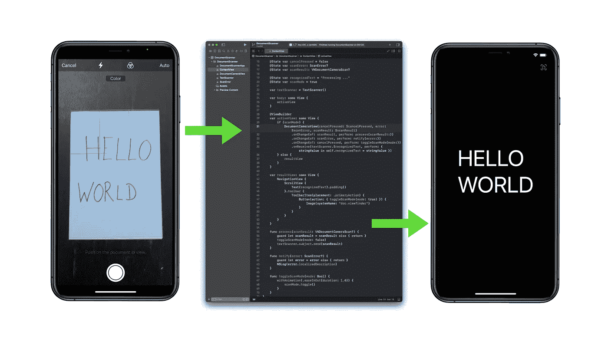
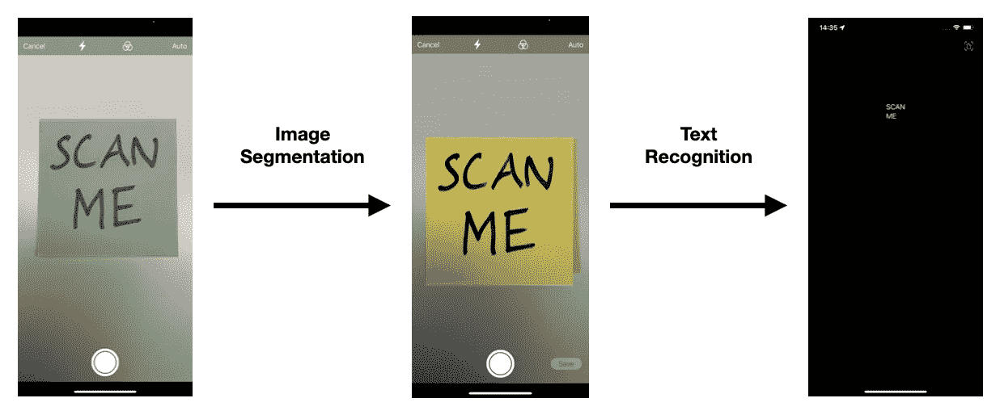
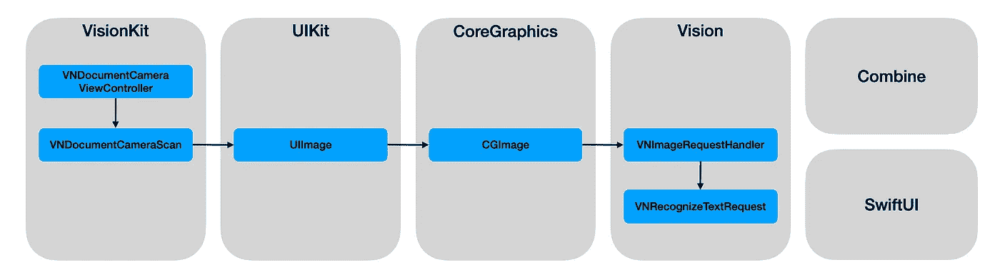
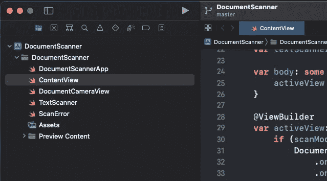
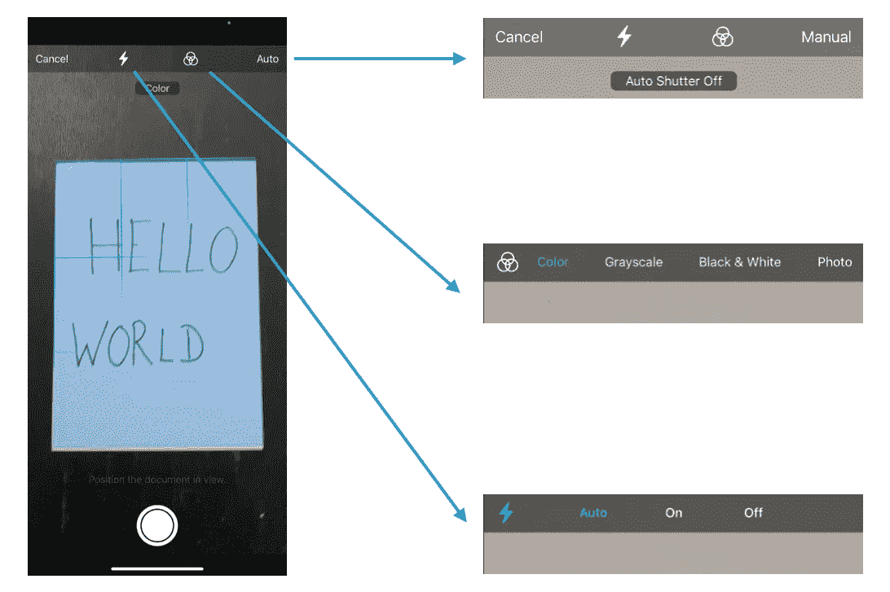
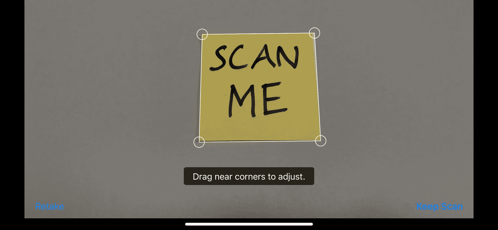
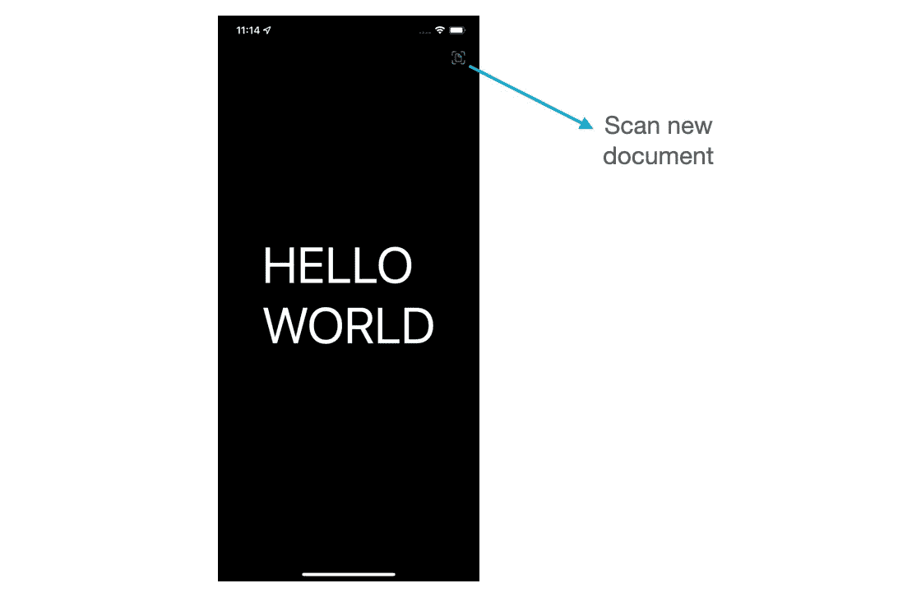

# SwiftUI 中的文档扫描仪

> 原文：<https://itnext.io/document-scanner-in-swiftui-709753af367b?source=collection_archive---------0----------------------->

## 使用人工智能从文档中提取文本

在本教程中，我们将学习如何通过文档分割和光学字符识别来扫描文档和提取包含的文本。

作为源代码提供的一个完整的 iOS 应用程序将帮助我们理解完成这项任务需要哪些苹果框架和特定的类。

## 介绍

电话不再仅仅是电话，在其他事物中，它们变成了我们的办公室。我这一代人(我稍微年长一点……)中没有多少人会想到今天的智能手机可以取代这么多其他设备。

这些设备中有文档扫描仪。

2017 年，苹果推出了一款用于笔记、邮件、文件和信息的文档扫描仪。它提供了清理文件“扫描”,这是透视校正和均匀照明。

自 2019 年 WWDC 奥运会以来，我们作为开发者也可以在我们的应用中利用这一功能！

是时候让我坐下来想出一个尽可能简单但功能齐全的 SwiftUI 应用了。结果就是这个教程和附带的可以下载源代码的 app。

以下是该应用程序的工作原理演示:

[**点击此链接**](https://www.buymeacoffee.com/twissmueller/e/52154) **可以下载完整的 Xcode 项目。**

在写这篇教程的时候，我的设置如下:

*   MacBook Pro，16 英寸，2021，M1 最大
*   macOS Monterey，版本 12.0.1
*   Xcode，版本 13.1

以下是我们将要介绍的内容:

*   框架概述
*   文档分割
*   光学字符识别
*   参考应用程序演练
*   优化和最佳实践
*   结论

让我们开始吧。

## 概观

完成我们的任务基本上需要两个步骤。

首先，我们需要在图像中“找到”文档:文档分割。

其次，我们需要“找到”字符并提取文本:光学字符识别。

幸运的是，苹果为我们提供了大量现成的代码，我们可以抓取并粘合在一起，制作一个漂亮而闪亮的应用程序。

下图显示了涉及的主要类和框架。

然而，只有两个类是最重要的，我们将重点关注。

第一个是`VNDocumentCameraViewController`:

> 显示文档照相机所见内容的视图控制器。

第二个是`VNRecognizeTextRequest`:

> 一种图像分析请求，用于查找和识别图像中的文本。

此外，我们在两者之间使用一点组合来“粘合”东西。

对于用户交互，我们将使用 SwiftUI。

## 文档分割

让我们把重点放在文档分割上，以了解实现我们的应用程序所需了解的背景。

维基百科将文档分段定义为:

> 在数字图像处理和计算机视觉中，图像分割是将数字图像分割成多个片段(像素组，也称为图像对象)的过程。

总的来说，苹果为我们提供了`VNRequest`:

> 分析请求的抽象超类。

`VNRequests`提供大量文档分析请求，如

*   条形码检测
*   文本识别
*   轮廓检测
*   矩形检测
*   2021 年的新功能:文档分段检测

最后一个是我们需要的。其具体实施是`VNDetectDocumentSegmentationRequest`:

> 检测输入图像中包含文本的矩形区域的对象。

这是一个基于机器学习的检测器，在装有苹果神经引擎的设备上实时运行。它提供了一个分割蒙版和角点，正在`VNDocumentCameraViewController`中使用。

过去，为了分割文档，我们不得不使用更通用的`VNDetectRectanglesRequest`进行矩形检测:

> 在图像中查找投影矩形区域的图像分析请求。

它使用运行在 CPU 上的传统算法。它检测边缘并寻找交点，以形成仅具有角点的四边形。它可以检测包括嵌套矩形在内的 N 矩形。

相比之下，新的`VNDetectDocumentSegmentationRequest`使用的是基于机器学习的算法，运行在神经引擎、GPU 或 CPU 上。它已经在文档、标签、标志上接受过训练，包括非矩形形状。它找到一个文档，并为我们提供分段掩码和角点。

为了方便起见，我们甚至不必直接使用`VNDetectDocumentSegmentationRequest`，因为它已经封装在`VNDocumentCameraViewController`中:

> 显示文档照相机所见内容的视图控制器。

我们已经具备了进行下一步处理所需的一切:从文档中提取文本。

## 光学字符识别

让我们再次从维基百科获得帮助，让我们对光学字符识别(OCR)有一个大致的了解:

> 光学字符识别或光学字符阅读器(OCR)是将打字、手写或印刷文本的图像电子或机械转换成机器编码的文本，无论是从扫描的文档、文档的照片、场景照片(例如风景照片中的标志和广告牌上的文本)还是从叠加在图像上的字幕文本(例如电视广播)

直到 2019 年，我们将不得不使用`VNDetectRectanlgesRequest`和`VNTextObservation`，然后执行多个步骤来提取文本:

1.  迭代观察中的字符框。
2.  训练 CoreML 模型做字符识别。
3.  在字符盒上运行模型。
4.  防止可能的垃圾结果的阈值。
5.  将字符连接成字符串。
6.  将识别的字符固定在字符串中。
7.  基于字典和字符对的其他概率试探法修复识别的单词。

那是我们不得不做的许多事情，但再也不是了…

多亏了`VNRecognizeTextRequest`，所有的步骤都被简化成了一行程序。

嗯，我希望能有更多的东西来写，但它真的很简单。我们现在手头上有写一个应用程序的一切，我已经为你做了。

在下一章，我将提供 Xcode 项目的概述，指出完成所有工作的类，并向您介绍一些特性。

## 参考应用程序演练

一切都从 Xcode 的标准 SwiftUI 应用程序开始。在我添加了所有必要的代码之后，项目结构如下所示:

完成所有工作的两个最重要的类是`DocumentCameraView`和`TextScanner`。

我们需要`DocumentCameraView`来“包装”`VNDocumentCameraViewController`，它是一个`UIKit`类，不是 SwiftUI 的原生类。

我在我的教程中描述过:

 [## 在 SwiftUI 中使用 UIView 和 UIViewController

### 编辑描述

itnext.io](/using-uiview-in-swiftui-ec4e2b39451b) 

`VNDocumentCameraViewController`的“结果”是`VNDocumentCameraScan`。

此时，`TextScanner`类开始发挥作用，它将`VNDocumentCameraScan`用于进一步处理，从扫描的图像中提取文本数据。

为了让代码尽可能简单，我把主视图中的所有东西都粘在了一起，这个视图在`ContentView`中。我认为没有必要为一个应该尽可能简单的应用程序引入一个花哨的应用程序架构。

现在是时候介绍一下`VNDocumentCameraViewController`附带的一些应用功能了。

相机视图中有几个选项可以优化我们应用的性能和准确性。

*   我们可以将闪光灯设置为自动模式(默认)，持续开启或关闭。
*   文档模式的选项有彩色(默认)、灰度、黑白和照片。
*   快门行为也可以改变。每当相机“认为”它已经识别了一个文件，它将自动“按下”快门(默认)。万一我们真的要自己按快门按钮，这个需要设置为“手动”。

在手动模式下按下快门时，文件不会自动分割。这种分割必须由我们自己通过调整角点来手动完成。

当按下“取消”按钮时，我们进入结果视图，当没有拍摄照片时，结果视图是空的。

在结果视图中，我们通过按右上角的“扫描”图标返回相机视图。

大概就是这样。让我们结束它。

## 结论

多好的旅程啊。从我们需要的基本构建模块开始，文档分割和文本识别，我们学习了构建应用程序所需的所有类和框架。

然后，我们开发了一个完全可用的 iOS 应用程序，它可以针对您可能想要实现的任何特定用例和要求进行调整和扩展。

我真诚地希望这将帮助你启动你的下一个大的应用程序的想法！

[**点击此链接**](https://www.buymeacoffee.com/twissmueller/e/52154) **可以下载完整的 Xcode 项目。**

感谢您的阅读！

*   如果你喜欢这个，请[在 Medium](https://twissmueller.medium.com/) 上跟随我
*   给我买杯咖啡让我继续前进
*   通过[在这里注册](https://twissmueller.medium.com/membership)来支持我和其他媒体作者

 [## 通过我的推荐链接加入媒体

### 作为一个媒体会员，你的会员费的一部分会给你阅读的作家，你可以完全接触到每一个故事…

twissmueller.medium.com](https://twissmueller.medium.com/membership) 

## 资源

*   [使用视觉提取文档数据](https://developer.apple.com/videos/play/wwdc2021/10041/)
*   [视觉框架中的文本识别](https://developer.apple.com/videos/play/wwdc2019/234/)
*   [VNDocumentCameraViewController](https://developer.apple.com/documentation/visionkit/vndocumentcameraviewcontroller)
*   [VNRecognizeTextRequest](https://developer.apple.com/documentation/vision/vnrecognizetextrequest)
*   [图像分割](https://en.wikipedia.org/wiki/Image_segmentation)
*   [光学字符识别](https://en.wikipedia.org/wiki/Optical_character_recognition)
*   [VNRequest](https://developer.apple.com/documentation/vision/vnrequest)
*   [vndetectdocumentationrequest](https://developer.apple.com/documentation/vision/vndetectdocumentsegmentationrequest)
*   [VNDetectRectanglesRequest](https://developer.apple.com/documentation/vision/vndetectrectanglesrequest)
*   [了解 Swift Combine 框架中的调度器](https://www.vadimbulavin.com/understanding-schedulers-in-swift-combine-framework/)