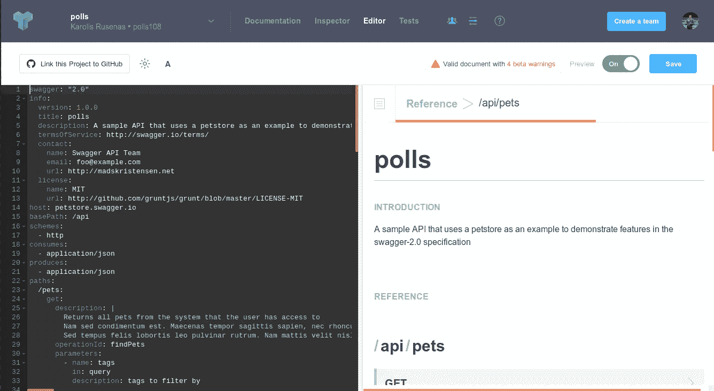
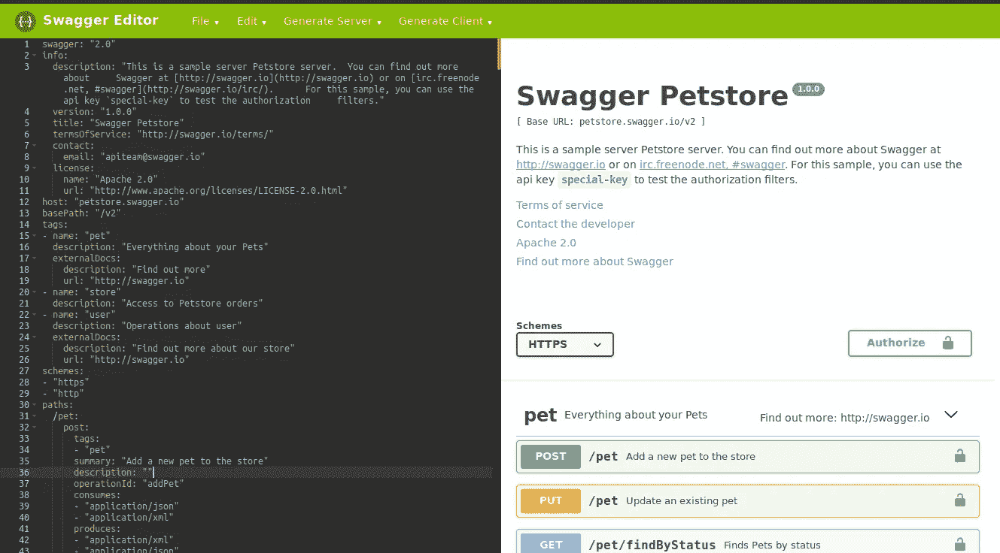
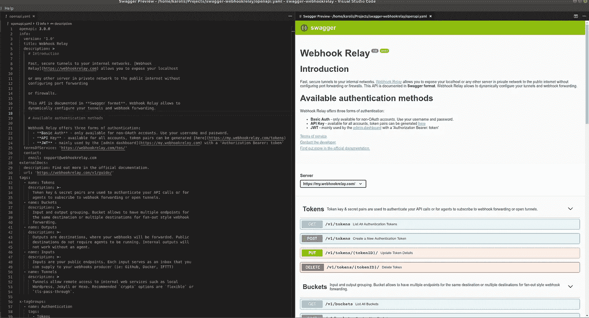
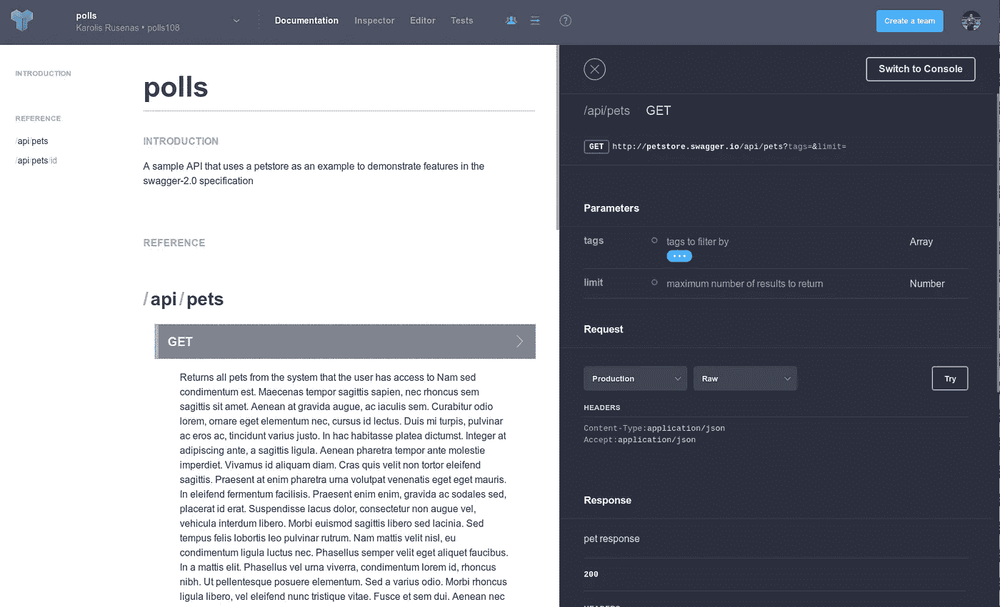
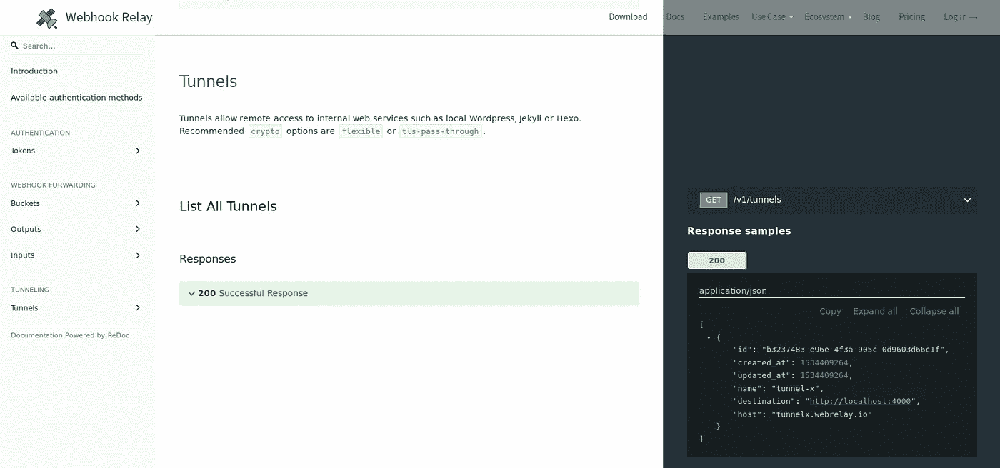

# 用 OpenAPI (Swagger)和 Redoc 记录你的 API

> 原文：<https://itnext.io/documenting-your-api-with-openapi-swagger-and-redoc-417bd8304b72?source=collection_archive---------2----------------------->

在本文中，我们将回顾几种适合于用 OpenAPI 3.0 规范记录 API 的流行编辑器、可以呈现该规范的不同主题以及托管策略。

# TL；速度三角形定位法(dead reckoning)

我们发现的最佳组合:

*   使用 [OpenAPI 3.0](https://www.openapis.org/)
*   用 [VSCode Swagger 扩展](https://github.com/arjun-g/vs-swagger-viewer)实现规范
*   使用带有 [Redoc](https://github.com/Rebilly/ReDoc) 的 GitHub 页面获得好看的&免费托管

# 选择 API 规范格式

我想可以肯定地说，OpenAPI 现在是最流行的 API 规范。你可以在这里了解更多:[https://www.openapis.org/](https://www.openapis.org/)。其他竞争者:

*   拉姆尔
*   API 蓝图
*   WADL
*   石板

你可以在一篇优秀的 Nordic APIs 文章中阅读更多关于其他顶级规范格式的内容:[https://nordicapis . com/top-specification-formats-for-rest-APIs/](https://nordicapis.com/top-specification-formats-for-rest-apis/)

# open API vs/和 Swagger

简史:OpenAPI 3.0 是由 [SmartBear Software](https://smartbear.com/) 捐赠给 OpenAPI initiate(并从 Swagger 规范改名)以来的第一个官方版本。许多人仍然认为(在我做一些研究之前包括我自己)Swagger 仍然是一个规范，但是，目前:

*   OpenAPI 是一种规范
*   Swagger 提供了编写规范、生成代码和托管代码的工具。

在过去的几年里，OpenAPI 已经被各种规模的大型企业和初创公司所接受。

# 编辑

一旦你选择了一个规范，寻找一个好的方法把它写下来是很重要的。我最初是从[https://apary . io](https://apiary.io/)开始的，因为他们提供了一个带有 Swagger 2.0 和 API Blueprint 选项的编辑器(默认为 API Blueprint，所以要小心:)，并在他们的服务上托管您的文档:



听起来很划算？可能是吧，因为它提供了一个一体化的软件包——编辑器、语法检查，甚至免费托管你的文档。我们来看看其他选项:)

# 招摇的编辑

然后，我调查了 Swagger editor([https://editor.swagger.io/](https://editor.swagger.io/))，但我选择了一个自托管的 via Docker:



它与 apiary.io 非常相似，但是我发现它们的主要问题是它们没有我在本地使用的编辑器快。

# Swagger VSCode 扩展

很自然地，我查看了 VSCode extensions marketplace，发现了这篇优秀的文章[https://github.com/arjun-g/vs-swagger-viewer](https://github.com/arjun-g/vs-swagger-viewer):



通过扩展，您将获得:

*   自动完成
*   你所有的快捷方式都有效
*   集成 Git

总而言之，当我开始在 Apiary 中记录 API 时，通过切换到 VSCode 扩展，它极大地提高了我记录的速度。

# 托管您的文档

虽然我真的很喜欢 Swagger 2.0 和 OpenAPI 规范格式，但 Swagger 文档在视觉上并没有特别吸引我。养蜂场确实提供了一个很好的主题:



如果我们还没有一个存放文档的网站，这可能是我的第一选择。但是说到底，它只是一个页面，依赖第三方主机有点太多了。

# 输入 ReDoc

在花了一点时间查看各种主题和工具后，我找到了我最喜欢的——**ReDoc**(【https://github.com/Rebilly/ReDoc】T5)。)它提供了一个令人难以置信的好主题，该项目是活跃的，非常可定制。我选择 ReDoc 的主要原因是因为用它嵌入文档非常容易:

1.  把你的 *openapi.yaml* 或者 *swagger.yaml* 放在一个公共可访问的地方。在我们的例子中，我将它放在 git repo 中:
    [https://github . com/webhookreel/swagger-webhookreel/blob/master/open API . YAML](https://github.com/webhookrelay/swagger-webhookrelay/blob/master/openapi.yaml)
    将它存储在 Git repo 中提供了一个很好的功能——您可以编辑、推送它，它会一直保持最新，而无需重新部署您的网站。
2.  在您的网站中添加以下几行:

```
<script src=”https://cdn.jsdelivr.net/npm/[[email protected]](https://webhookrelay.com/cdn-cgi/l/email-protection)/bundles/redoc.standalone.js”> </script><script>
Redoc.init(‘https://raw.githubusercontent.com/webhookrelay/swagger-webhookrelay/master/openapi.yaml', {scrollYOffset: 60,hideDownloadButton: true}, document.getElementById(‘redoc’))</script>
```

就这样，您的 API 引用现在被托管:



# 结论

如果你选择正确的工具，而这些工具又不会拖你的后腿，那么编写你的 API 文档会非常有趣。在我们的例子中，我们使用了一个很好的编辑器，它具有针对 OpenAPI 规范定制的特性，向全世界发布 API 文档也是一种轻松的体验。

显然，推荐的工具对我来说是最好的，我建议在你开始记录你自己的 API 之前，你也可以做 30 分钟的研究，在不同的编辑器、主题和主机上做一些试验。也许你会找到一些更适合你的其他组合。一天下来，选择合适的工装会节省你很多时间:)祝你好运！最坏的情况——一旦规范完成，就很容易尝试不同的主题和托管选项。

你可以在这里查看 Webhook Relay API 参考:[https://webhookrelay.com/api-reference/](https://webhookrelay.com/api-reference/)和 Swagger 规范在这里:[https://github.com/webhookrelay/swagger-webhookrelay](https://github.com/webhookrelay/swagger-webhookrelay)。

> 【https://openapi-converter.herokuapp.com/】加成:Swagger 2.0 到 OpenAPI 3.0 的转换器:[](https://openapi-converter.herokuapp.com/)

# *参考*

*   *[https://trends.google.com/trends/explore?cat=13&q = swagger，openapi，raml](https://trends.google.com/trends/explore?cat=13&q=swagger,openapi,raml)*
*   *[https://swagger . io/blog/API-strategy/difference-before-swagger-and-open API/](https://swagger.io/blog/api-strategy/difference-between-swagger-and-openapi/)*
*   *[https://github . com/OAI/open API-Specification/blob/master/versions/3 . 0 . 0 . MD # OAS document](https://github.com/OAI/OpenAPI-Specification/blob/master/versions/3.0.0.md#oasDocument)*
*   *[https://nordicapis . com/top-specification-formats-for-rest-API/](https://nordicapis.com/top-specification-formats-for-rest-apis/)*
*   *[https://raml.org/](https://raml.org/)*
*   *[https://github.com/Rebilly/ReDoc](https://github.com/Rebilly/ReDoc)*

**原载于 2018 年 11 月 5 日*[*webhookrelay.com*](https://webhookrelay.com/blog/2018/11/05/openapi-redoc-tutorial/)*。**