# Spark-Kafka Writer 是否维护 Spark 分区之间的排序语义？

> 原文：<https://itnext.io/does-spark-kafka-writer-maintain-ordering-semantics-between-spark-partitions-c832117aa111?source=collection_archive---------2----------------------->

## 我已经深入源代码进行了检查

# 你能保证订购吗？

你有一个很酷的 Spark 工作，你最终想要[将你的结果](https://spark.apache.org/docs/3.2.1/structured-streaming-kafka-integration.html#writing-data-to-kafka) `[DataFrame](https://spark.apache.org/docs/3.2.1/structured-streaming-kafka-integration.html#writing-data-to-kafka)` [发送到一个卡夫卡主题](https://spark.apache.org/docs/3.2.1/structured-streaming-kafka-integration.html#writing-data-to-kafka)。

但是，您需要保证表顺序在目标主题中得到维护。换句话说，对于下面的代码:

```
df
  .writeStream
  .format("kafka")
  .options(kafkaConfig.kafkaConnectionConfig ++
   Map("topic" -> targetKafkaTopic)
  )
  .start()
```

或者以批处理方式:

```
df
  .write
  .format("kafka")
  .options(kafkaConfig.kafkaConnectionConfig ++
   Map("topic" -> targetKafkaTopic)
  )
  .save()
```

… **您期望主题中的记录与 Spark** `**DataFrame**` **中的记录具有相同的顺序。**

> 你能保证吗？

要回答这个问题，我们需要把问题分解成两部分:

1.  **单一生产商订购保证**
2.  **分布式系统增加了复杂性**

我将首先描述单个非分布式生产者在“普通”Kafka 中可用的订购保证和配置选项，然后我将讨论从 Apache Spark 这样的分布式系统进行生产所增加的复杂性。最后，我将描述如何解决这个问题。

## **单一生产商订购保证**

流语义允许我们在“最多一次”、“至少一次”和“恰好一次”之间选择传递保证(这个 [Kafka 文档部分](https://kafka.apache.org/33/documentation.html#semantics)是关于这个问题的必读内容)。

你可能知道，卡夫卡保证了分区内部的顺序[，而不是分区之间的顺序。](https://developer.confluent.io/learn-kafka/apache-kafka/partitions/#:~:text=Kafka%20Partitioning&text=Partitioning%20takes%20the%20single%20topic,many%20nodes%20in%20the%20cluster.)

某些 Kafka 配置可能会导致重复的消息，或传递顺序的改变——这是“确保”语义“至少一次”的一种折衷。

这是 Kafka 通过使用以下设置内置解决的(在非分布式生产者设置中):

```
val idempotentProducerConfig: Map[String, String] = Map(
  "kafka.enable.idempotence" -> true.toString,
  "kafka.max.in.flight.requests.per.connection" -> 5.toString,
  "kafka.acks" -> "all",
)
```

注意，`max.in.flight.requests.per.connection = 5`是幂等生产者的[最大可能配置](https://kafka.apache.org/33/documentation.html#producerconfigs_enable.idempotence)，这是这种设置的一个折衷例子。此外，请注意，为了保证排序，我们可能没有使用幂等配置，但是`max.in.flight.requests.per.connection=1`会获得相同的结果。然而，看着这个 Kafka KIP ，感觉幂等开销将低于从更高的运行中请求(在这种情况下最多 5 个)获得的性能。

## **分布式系统增加了复杂性**

Spark 是一个分布式系统。因此，Spark 集群中的数据分布在工作人员之间。

**此外，数据被分区(注意“spark”分区，而不是 Kafka 分区)分割，每个工作者持有分区的子集。**

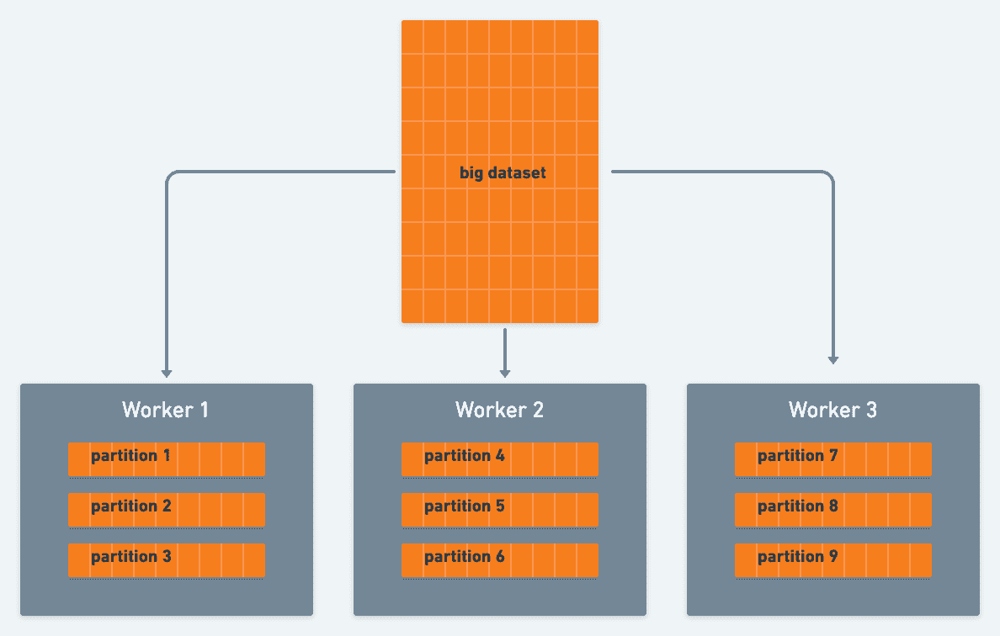

> **假设数据是分布式的，我们如何确保 Spark workers 按照期望的顺序同步生成 Kafka 主题？**

**我们无法期待。但是我们可以强制执行:**

## 强制执行命令

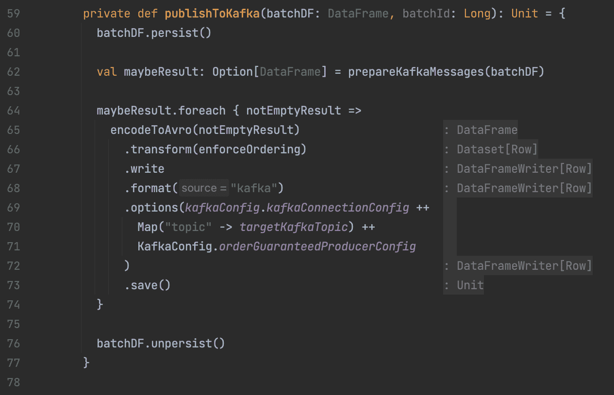

这里的`enforceOrdering`方法是:

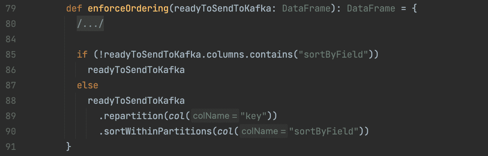

我们在这里做了什么？让我们再细分一下:

1.  我们设置标准的 Kafka 生产者配置来保证分区中的顺序。
2.  我们在 Spark 分区和 Kafka 分区之间建立了 1:1 的关系，确保 Spark workers 的本地 Kafka 生产者将拥有所有可用的数据，避免不一致。
3.  我们在 spark 分区内进行分类，因此 Spark workers 的本地 Kafka 生产商将为其 Kafka 分区生产它。

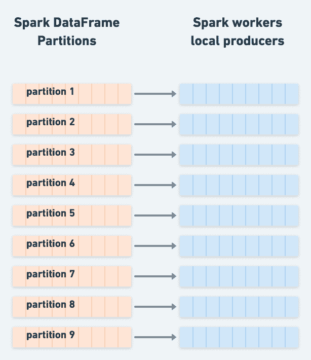

*生产者是在 worker 上创建和缓存的，所以 Spark 分区数可以大于 worker 的本地生产者

# 长篇大论——火花——卡夫卡 V2 作家源代码分析

现在让我们走一条长路，探索 Spark-Kafka 连接器源代码，以便检查我上面的假设。

**1。Spark-Kafka writer 在 Spark 分区上迭代，所以 Kafka partitioner 是在 spark 分区上调用的，而不是在整个表上:**

因此，当[我们发布从 spark 到 Kafka 的主题](https://spark.apache.org/docs/3.2.1/structured-streaming-kafka-integration.html#writing-data-to-kafka)时，`org.apache.spark.sql.kafka010.KafkaWriter#write`方法被称为:

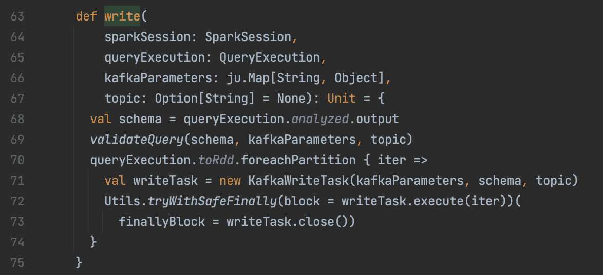

`org.apache.spark.sql.kafka010.KafkaWriter#write`

**我们可以清楚地看到(第 70-74 行), Spark-Kafka 作者在 Spark 分区上进行迭代，其方式是在 Spark 分区上调用** `**KafkaWriteTask#execute**` **，而不是在整个表中调用。**

## 2.每个分区使用一个缓存的本地 Kafka 生成器:

被调用的`KafkaWriteTask#execute`使用一个内部生产者，而这个内部生产者又是一个缓存生产者，可能在同一个工作者的任务之间共享。

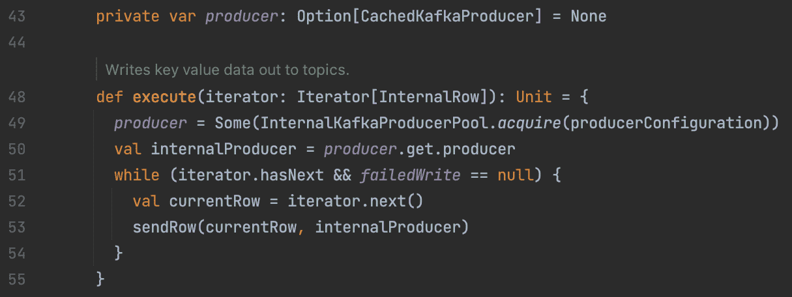

`org.apache.spark.sql.kafka010.`KafkaWriteTask #执行

## 3.然后它为每一行构建一个 Kafka ProducerRecord:

`org.apache.spark.sql.kafka010.KafkaRowWriter#sendRow`从 Spark `InternalRow`构建 Kafka `ProducerRecord`，并使用[标准 Java 生成器 API](https://kafka.apache.org/33/javadoc/index.html?org/apache/kafka/clients/producer/KafkaProducer.html) 生产它。

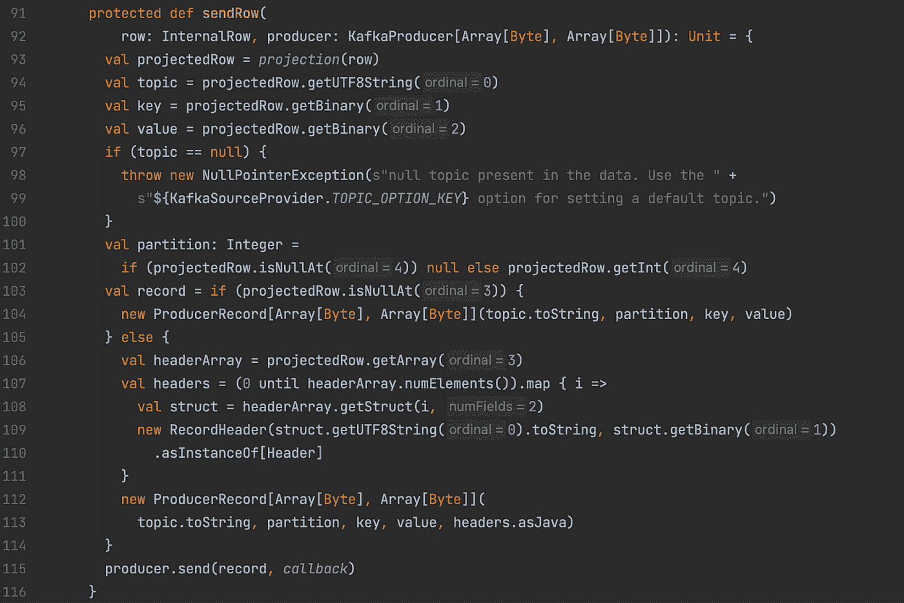

`org.apache.spark.sql.kafka010.KafkaRowWriter#sendRow`

关注 93 行很有意思。它首先将`InternalRow`投射到实际上是`UnsafeRow`的`UnsafeProjection`上，也就是说，它以相关的顺序投射[相关信息](https://spark.apache.org/docs/3.2.1/structured-streaming-kafka-integration.html#writing-data-to-kafka)以用于建立记录。这就是为什么我们可以在上面的代码片段中看到通过按序号获取行片段来构建记录(例如，第 94–96 行)。


`org.apache.spark.sql.kafka010.KafkaRowWriter`

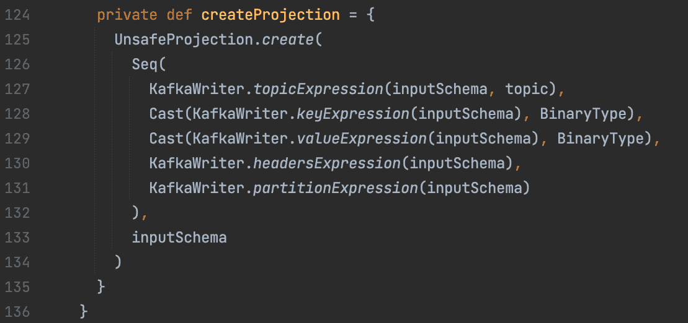

`org.apache.spark.sql.kafka010.KafkaRowWriter#createProjection`


org . Apache . spark . SQL . catalyst . expressions . unsafe projection

## 4.同样，[如文档](https://spark.apache.org/docs/3.2.1/structured-streaming-kafka-integration.html#writing-data-to-kafka)所示，我们可以强制一个分区设置一个分区列，或者让它自动解析它:

从`sendRow`方法:

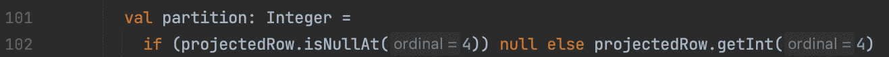

`org.apache.spark.sql.kafka010.KafkaRowWriter#sendRow`

如果我们定义一个分区列，它将用于构建`ProducerRecord`，否则，它将为空。

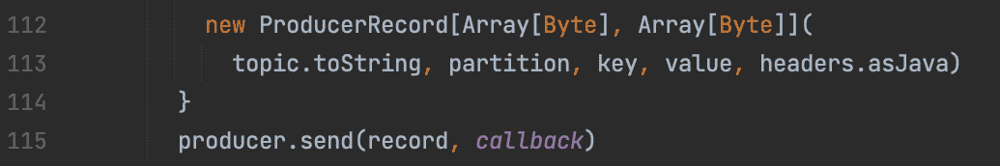

`org.apache.spark.sql.kafka010.KafkaRowWriter#sendRow`

在这种情况下，Null 意味着我们将让 Kafka 生成器 Java API 为我们解析分区，并返回到 Kafka `DefaultPartitioner`。

来自`org.apache.kafka.clients.producer.KafkaProducer#partition`:

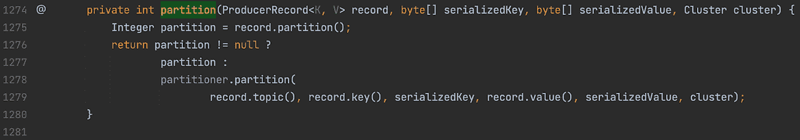

`org.apache.kafka.clients.producer.KafkaProducer#partition`

并且，根据 [Spark 文档](https://spark.apache.org/docs/3.2.1/structured-streaming-kafka-integration.html#writing-data-to-kafka)我们可以通过提供不同的分区器来更改默认分区器:

> 通过设置 kafka.partitioner.class 选项，可以在 Spark 中指定 Kafka partitioner。如果不存在，将使用 Kafka 默认分区器。

但是，如果我们为 KafkaProducer 提供一个定制的分区器，这个分区器不同于 Spark 用来对其`DataFrame`进行重新分区的分区器，我们可能还需要改变 Spark 对数据帧进行重新分区的方式，因为我们希望 Spark 分区和 Kafka 分区之间是 1:1 的关系。

## **所以我们可以看到，我们不能天真地期待订购…**

1.  每个 spark 分区都是独立的，可以有自己的 Kafka 本地制作商
2.  默认的分区器将使用 ["Murmur2 hash for the keys(所以相同的 keys hash)应该是相等的，并将被写入同一个主题分区"](https://stackoverflow.com/questions/72704353/does-spark-structured-streaming-producer-using-the-kafka-default-partitioner-bet?noredirect=1#comment128426751_72704353)
3.  然而，如果相同的键不在同一个 spark 分区中，它们可能会被不同的生产者发送，即，在 Spark 分区之间没有顺序保持，只在 Spark 分区内部

**因此，如果我们关心整个数据帧的排序，并且我们不确定 Spark-partition-key 是否与 Kafka-partition-key 相同，我们需要在将它们发布到我们的 Kafka 主题之前实施它。**

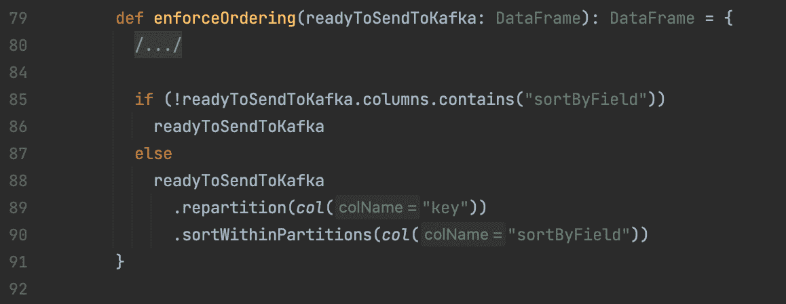

**快乐管道！；)**

脚注:

1.  Spark 版本免责声明:Apache Spark 版本 3.2.1 上的源代码分析
2.  如果你想更深入地了解可能的不同配置及其对交付语义的影响，请看这里的、这里的和这里的。此外，值得注意的是，Kafka 版本之间的默认配置会发生变化(例如，参见[这个](https://kafka.apache.org/33/documentation.html#upgrade_311_notable)和[这个](https://kafka.apache.org/33/documentation.html#upgrade_320_notable))，这表明[应用显式配置](https://medium.com/zencity-engineering/mongo-spark-connector-deep-dive-part-ii-json-serialization-4b126d2f210b)是多么重要。