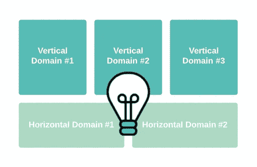
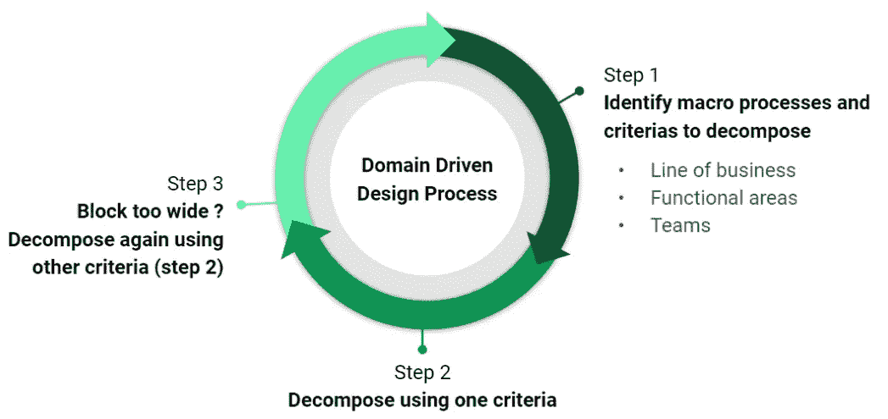
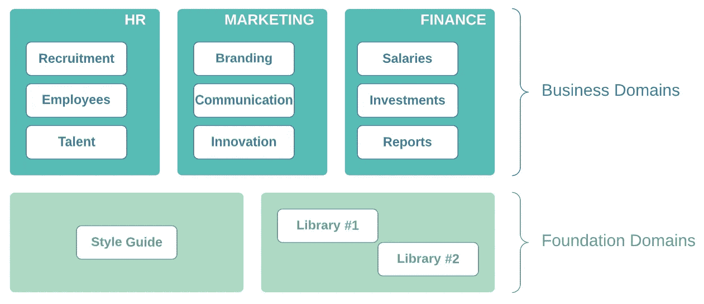
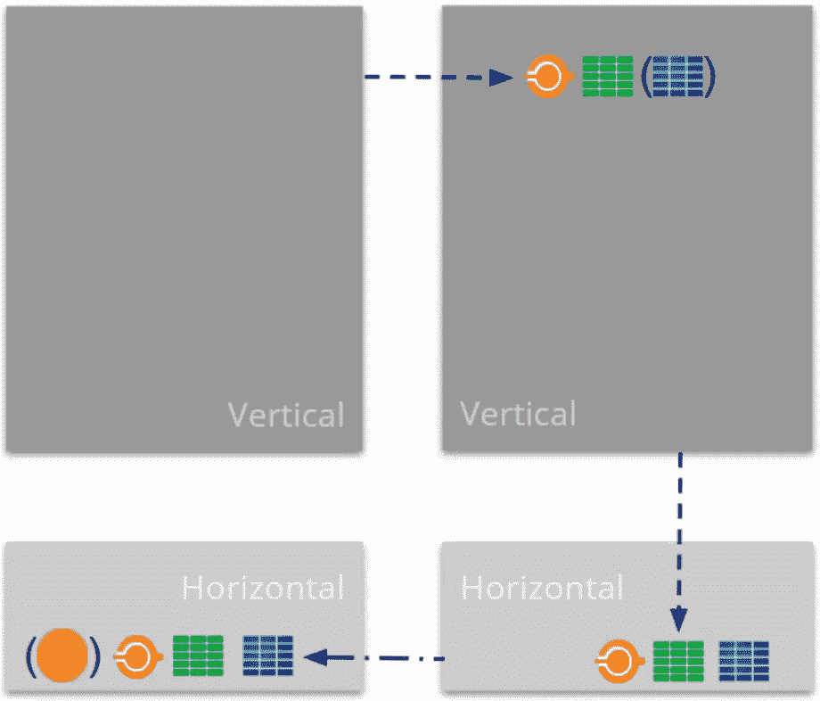

# 外部系统中的领域驱动设计

> 原文：<https://itnext.io/domain-driven-design-in-outsystems-ef930ab9ab01?source=collection_archive---------2----------------------->

## 你知道这个领域的魔力吗？

因此，您的外部系统工厂正在高速增长，您开始有一些“意大利肉酱面”架构，您需要一些帮助来隔离概念以促进开发和部署？你的生活中可能需要域名！

OutSystems 允许你使用领域驱动设计(DDD)方法开发你的项目，将复杂的软件分割成更小的和连接的部分。

好看吗？让我们开始吧:

# 什么是域？

领域是一个业务线，你可以把它隔离成一个“块”,并为它开发一个软件解决方案，有一个清晰而独立的生命周期。它促进了数据隔离和所有权，并减少了变更的影响。

举一个小例子:假设您正在为您的公司构建一个内部应用程序。市场营销和人力资源部门似乎有相同的生命周期，还是孤立的听起来更好？财务部，甚至是 IT 解决方案团队呢？你认为这些部门有独立的生命周期吗？(也就是说，它们可以单独规划、开发、测试和部署，而无需与其他应用程序结合使用——为营销部门开发的应用程序可以在不为财务部门部署应用程序的情况下进行部署)

如果你做了，你就对了！(吃块曲奇)虽然同属一家公司，但他们有各自的业务范围。这意味着您可以将它们分成不同的域，每个域一个。

差不多就是这些了，但是如果你想了解更多关于域名的信息，可以看看这篇关于 DDD 的文章。

# 何时使用领域驱动设计？

这看起来是个简单的问题，但事实并非如此。

每个案例、每个项目和应用都有其特殊性。您可能有两个应用程序似乎受益于 DDD 方法，但其中一个可能不适合，因为如果应用程序即使在技术上非常复杂，但具有最小的领域复杂性，那么它就没有多大用处。此外，有时业务线不清晰，或者架构耦合性太强，以至于需要大量投资来分离它。

为了帮助你，你可以试着回答这些问题，看看 DDD 是否是你想要的:

*   您的应用程序是否变得太大而难以部署？
*   有没有相互独立的概念，可以逻辑分离？
*   您有针对不同最终用户的应用程序吗？
*   随着时间的推移，您的应用程序的特性会经常改变吗，您需要帮助来管理重构过程吗？
*   您是否有多个团队在开发应用程序，解决不同的问题？

以公司为例，回答上面的这些问题可能会得到所有人的肯定回答(也许不是现在的第一个)；这些概念彼此独立，最终用户明显不同，功能可能会改变(或者会添加新的功能)。让不同的团队专门负责不同的部门也是非常有用的，因为这将加快进程。最好的结果之一是:一个部门的应用程序可以在不影响另一个部门的情况下部署。

最后，这是一个只有你和你的团队仔细分析应用程序的架构后才能回答的问题。不要忘记，你可以从第一天起就利用 DDD 的魔力，或者以后当复杂性证明它是合理的时候。

# 如何塑造一个领域驱动的设计？

既然你已经决定使用 DDD，是时候进入状态了！

塑造 DDD 是一个基于业务线的迭代过程，当找到合适的粒度时就结束了。它有 3 个步骤:

1.  确定企业的宏观流程和标准
2.  使用预定义的标准(业务线、功能标准、接口、团队)分解每个宏观过程
3.  询问是否达到了期望的粒度级别

来自[外部系统](https://success.outsystems.com/Documentation/Best_Practices/Architecture/OutSystems_Domain_Driven_Architecture/Domain_Driven_Design_with_OutSystems)的迭代分解过程的表示

当该过程完成时，您将拥有您想要的域。下一步是将它们映射到外部系统，并开始您的开发过程和所需的调整。

仔细看看公司的例子，借助于上述主题中的一些问题，我们已经确定了几个宏观过程和标准:不同的部门及其需求、不同的最终用户以及可以单独工作的团队。因此，在这种情况下，我们可以将公司分解成各个部门，这样我们就有了自己的领域。他们可能需要共享一些东西，比如主题、一些服务和库，但正如你将看到的，这是可以管理的。

您必须考虑 3 种域类型的存在:

*   Orchestrator domain*:为最终用户提供独立垂直业务的统一视图
*   垂直领域:支持业务线
*   水平域:提供可重用的核心业务服务，可共享给多个垂直域

如您所见，每种域类型都有自己定义的用途，因此您必须考虑您需要什么类型，然后使用[发现](https://www.outsystems.com/forge/component-overview/409/discovery?_gl=1*td6rgo*_ga*OTIxODgwMDYxLjE2NTE0OTY2MTI.*_ga_ZD4DTMHWR2*MTY1MjE4NTYxNi4zLjEuMTY1MjE4OTE4MS41Nw..)工具将其转换到外部系统。

> *在验证域关系时被视为垂直域

以业务和基础领域为例

继续公司的内部应用程序示例，上图显示了如何将部门分成不同的域，每个域都有自己的应用程序来承担不同的责任。这些将是垂直领域，因为它们与业务相关。考虑到您可能需要一个应用程序主题、一些可重用的 UI 组件、库集成等等，我们还有基础域、可共享服务的水平域。

# 现在…推荐人

正如您所知道的(或者应该知道的)，使用外部系统意味着使用模块和应用程序之间的强引用和弱引用。现在，它还意味着管理域之间的引用。

如果您需要一些帮助来更好地理解弱引用和强引用，请查看 OutSystems [文档](https://success.outsystems.com/Documentation/11/Developing_an_Application/Reuse_and_Refactor/Understand_Strong_and_Weak_Dependencies?_gl=1*5vqxw2*_ga*OTIxODgwMDYxLjE2NTE0OTY2MTI.*_ga_ZD4DTMHWR2*MTY1MjE3MDU0NC4xLjEuMTY1MjE3MzE2My40NQ..)。

有非常著名的[架构验证规则](https://success.outsystems.com/Documentation/Best_Practices/Architecture/Designing_the_Architecture_of_Your_OutSystems_Applications/Validating_your_application_architecture)(或者应该是众所周知的):

*   没有向上引用
*   最终用户或业务流程之间没有间接引用
*   核心或库之间没有循环引用

域名呢？

因为域是包含各种应用程序的概念，所以您需要遵守这些相同的规则。但是，关于跨域引用，有一些特殊性:

*   垂直域之间允许弱引用(服务动作、结构和实体——基于配置)
*   水平域之间允许弱引用(服务动作、结构和实体——基于配置)
*   水平域之间的强引用(服务器动作)可以作为一个**异常**来编排复合逻辑或事务
*   垂直和水平域之间允许弱引用(服务动作、结构和实体——基于配置),如果被引用的元素是基础应用程序的一部分，则允许强引用

由[外部系统](https://success.outsystems.com/Documentation/Best_Practices/Architecture/OutSystems_Domain_Driven_Architecture/Domain_Driven_Design_with_OutSystems)表示域验证规则

域之间所有剩余的关系都被认为是架构发现，因此是不允许的。

# 但是…

总有但是吧？哦，这个不错！

在关于领域的整个对话中，关于架构规则，您也应该考虑一些例外，以减轻您的开发负担:

*   如果应用程序驻留在不同的域中，则允许对上层模块的弱引用
*   如果应用程序驻留在不同的域中，则允许模块之间的循环弱引用

即使使用弱引用，相同域内的应用程序之间也不允许这些引用。但是，使用域需要一些例外来帮助管理大型工厂。

# 下一步是什么？

我相信你已经准备好开始探索和使用 DDD 了！当然，现在这可能看起来像很多信息，但随着您的深入，它会变得越来越容易。

只要记住分解过程步骤、架构规则和异常，并且总是与您的团队和业务讨论决策，看看什么是有意义的。

关于这个主题还有很多要谈的，比如领域 API、有界上下文以及解耦领域。也许我们可以晚点再谈这个？到时候见！