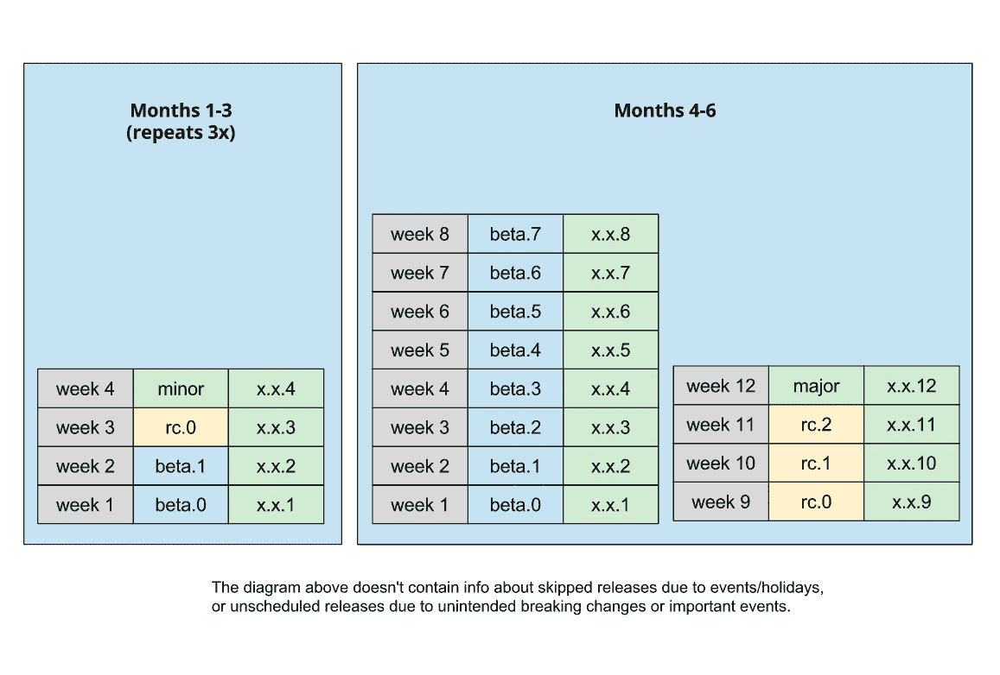
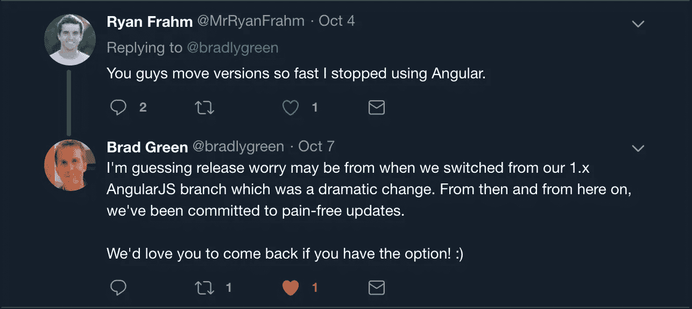
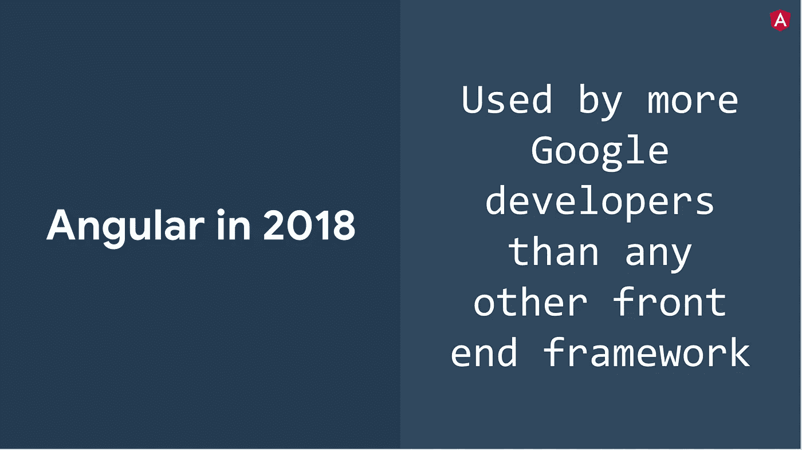

# 不要害怕，只要` ng 更新`！

> 原文：<https://itnext.io/dont-be-afraid-and-just-ng-update-1ad096147640?source=collection_archive---------3----------------------->

## 欣赏频繁角度释放的好处。

我们生活在一个惊人的时代，开源软件已经成为规范而不是例外。每一个有电脑和互联网连接的人都可以免费使用大公司使用的工具(通常由大公司提供)!

Angular 是这种开源项目的一个很好的例子。它由谷歌的 Angular 团队维护，并在非常宽松的麻省理工学院许可下提供，这意味着你可以在你的任何项目中免费使用它。

由于谷歌的目标是保持在网络技术的前沿，对他们来说，投资自己的平台是非常有意义的，这样他们就可以更好地决定他们认为应该如何构建应用程序。Angular 团队与来自社区的贡献者积极合作，不断改进项目。

[角释放周期](https://blog.angularjs.org/2016/10/versioning-and-releasing-angular.html#Timebased_release_cycles_18)的可视化。

# 有角度的版本

Angular 是 AngularJS(又名 Angular 1.x)的继任者，是一个完整的重写。它于 2014 年 10 月在 ng-Europe 上发布，并于近两年后的 2016 年 9 月发布为 Angular 2.0。

Angular 团队宣布，从版本 2 开始，Angular 将完全采用[语义版本](https://semver.org/)，他们决定使用基于时间的发布周期，每年发布两次新的主要版本。

那年晚些时候，在 2016 年 12 月，他们宣布了第 4 版([跳过第 3 版](https://blog.angularjs.org/2016/12/ok-let-me-explain-its-going-to-be.html))，关于名称，他们说:这只是 Angular——在提到 Angular(平台)时省略版本号，只使用版本号来指定特定版本。

对于一些人来说，频繁的更新是停止使用 Angular 的一个原因。

# 雅艾尔:又一次角度释放？

Angular 团队已经明确了他们关于更新的意图，并且已经成功地实现了这些意图。然而，对一些人来说，不清楚为什么新版本会如此迅速地相继发布。为了帮助这些人更好地理解 Angular 方法的好处，下面是我认为拥有一个可预测的发布时间表是一件好事的几个原因。

## 开发者/企业期望

开发者和企业可以提前计划何时应该花时间更新他们的 Angular 应用程序。对于第三方库的维护者来说，知道新版本何时发布是很好的，他们可以用测试版和发布候选版进行测试。

## 有棱角可以做出更大的改变

突破性的改变从来都不是故意的，然而有时却是不可避免的。主要版本是 Angular 团队能够按照语义版本进行这些突破性改变的唯一时机。

## 折旧周期

任何反对意见都将被传达，并将包括推荐的更新路径。除此之外，旧的 API 至少会一直工作到下一个主要版本，给开发者一个清晰的预期，告诉他们什么时候必须更新。

## LTS 所有的事情

2018 年 1 月，Angular 团队宣布*所有*版本将在发布后获得 18 个月的长期支持。获得 LTS 意味着任何与安全或浏览器不兼容相关的问题都将在此期间得到解决。

## 这只是一个数字

版本号一年两次以 1 递增，并不意味着总有大量的突破性变化。升级实际上是相当缓慢的。

发布往往集中在几个领域。例如，Angular 版本 6 在工具链中引入了许多变化，增加了诸如“ng update”和“ng add”等功能，并支持在 Angular 项目中创建库。在那个版本中，Angular 的核心没有看到任何重大变化。

## 由谷歌测试

谷歌使用 Angular 构建了 600 多个他们自己的内部和公共应用程序，它们都使用最新版本。这意味着 Angular 团队在保持更新过程尽可能流畅方面有很大的利害关系。或者，正如布拉德·格林所说，他们“致力于无痛苦的更新”。

来源:AngularMix 2018 主题演讲布拉德·格林

# 处理更新

现在您对 Angular 的方法有了一点了解，我将给您一些技巧来应对这些频繁的更新

## 发布后不久更新

处理角度更新的最常见(也是最明智的)方式可能是在主要版本发布后等待几周。

这给了你时间来检查这个版本是否如其他人所期望的那样工作，到那时大多数已知的问题都将被修复。这也给了库作者一些时间来使他们的包与最新版本兼容。如果你不依赖任何新功能，并且你想花些时间来计划你的更新，这是一个很好的方法。

计划更新的一个非常安全的方法是一旦新的*小版本*发布。这意味着您不会立即从 v6 更新到 v7，而是等待版本 7.1 的发布来更新。通过这种方式，您将始终拥有一个稳定且经过测试的版本，任何重大问题都将得到解决。

## 不要更新

在这里，我就说:‘你不用更新’。

如前所述，所有角度版本都支持 18 个月。这意味着您可以安全地将更新推迟到以后。你会错过最新的和最棒的，但是你可以放心，Angular 中任何关于安全和浏览器不兼容的问题都会被修复。您可能会遇到第三方库崩溃的问题，但是可以通过锁定版本或使用软件包管理器提供的锁文件来修复这些问题。

## 使用预发布版本进行测试

警告:这是给不怕死的人的😈！

虽然这个选项并不总是适用于所有的开发人员和项目，但是使用预发布版本是保持项目最新的一个好方法。

最棒的是，你可以向 Angular 项目或第三方库作者报告任何问题。你甚至可能得到改变来修复你发现的一些问题，并提交一些 PR——积极参与开源项目的一个好方法，这反过来对你的经历和职业生涯也有好处——但是我离题了…

一句忠告！

# 如何升级

如果没有关于如何正确升级 Angular 项目的信息，这篇文章是不完整的。这些是我建议进行升级的步骤。

1.  从一个工作版本的干净提交开始。
2.  为升级创建一个新的 git 分支。
3.  运行 ng 更新。
4.  运行、测试和构建您的应用程序。
5.  修复任何问题，更新反对意见，再次运行上一步。
6.  将更改提交并合并到主分支中。

这些步骤中的大部分正是我升级任何其他应用程序时会采取的步骤。只有第 3 点是真正针对 Angular 的，这是从版本 6 开始推荐和官方支持的更新您的项目的方式(而且非常棒！).

运行 ng update 时，Angular CLI 会检查应用程序的 Angular 依赖项的更新，下载并安装它们，然后将更改应用到项目(如果新版本需要)。

在此之后，您的应用程序被更新，您可以开始测试，看看它是否仍然工作。您可能会收到反对警告(下一个主要版本中将会删除的特性)，这可能是修复这些警告的最佳时机。

当应用程序在开发模式下工作时，您可以运行测试并尝试进行生产构建。如果一切顺利，您可以提交您的工作并创建一个 PR，以便它可以被审查并最终合并。

# 如果更新不起作用

担心的一个有效理由是，如果更新不起作用，因为每个应用程序都是不同的，没有简单的方法来解决这个问题。然而，这里有一些事情你总是可以做的:

*   阅读宣布新版本的[博客](https://blog.angular.io/)中的[变更日志](https://github.com/angular/angular/blob/master/CHANGELOG.md)和发布说明，看看是否有需要手动修复的重大变更。
*   分析任何错误信息，并在 Google、GitHub 或 StackOverflow 上搜索有同样错误的人。你的错误没有结果？试着通过省略文件名、类名、变量名等来缩短你要搜索的信息。
*   检查第三方软件包的更新。可能会有针对您所面临的问题进行修复的新版本。有很棒的工具可以帮助你更新依赖关系，比如 [npm-check-updates](https://www.npmjs.com/package/npm-check-updates) 和 [npm-check](https://www.npmjs.com/package/npm-check) 。
*   分析应用程序中通过排除来破坏它的部分。首先，尝试运行一个最小的 Angular 应用程序(只有一个引导 AppComponent 的 AppModule ),然后一个接一个地添加特性，直到它崩溃。这是一个非常基本但经过验证和信任的方法来调试一个不工作的应用程序，原因不明。
*   如果不能取得任何进展，可以打开一个问题或在 StackOverflow 上询问。尽可能地描述问题，包括版本号和您遇到的任何错误。非常重要的是:保持积极的态度——帮助一个没有抱怨的人总是更好。永远记住，另一边的人只是一个和你一样的人。:)

# 保持您的应用程序可更新

如果您使用最新版本来更新您的应用程序，更新到未来版本总是更容易。

真正有帮助的是坚持社区中使用的最佳实践，比如 Angular 风格指南。过度的定制化通常会让更新应用变得更加困难。例如，尽量不要调整构建配置。

拥有清晰的抽象也是一大优势。一个好的实践是围绕(第三方)库包装服务。如果更新更改了库的 API，您只需在一个地方应用更改，而不必在整个应用程序中应用。

# 感谢阅读！

我希望这篇文章能让您了解为什么可预测的更新周期是项目和开发人员非常需要的特性。

当然，我不指望你同意以上所有观点，我邀请你在下面的评论中或者在[推特](https://twitter.com/beeman_nl)上告诉我你的想法。

特别感谢 [Stephen Fluin](https://twitter.com/stephenfluin) 审阅并核实了这篇文章，以及[我的兄弟 Stephan](https://medium.com/@borrie) 润色了这篇文章！