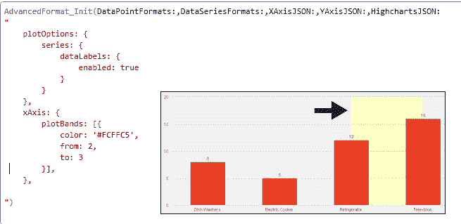
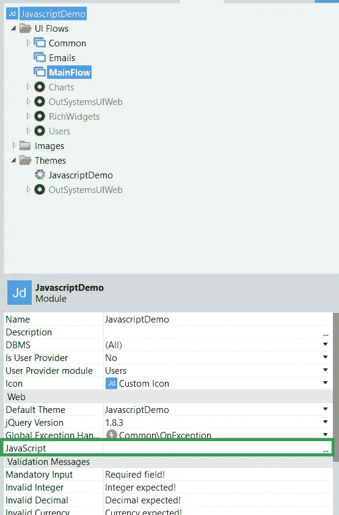
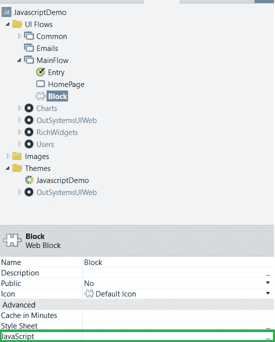
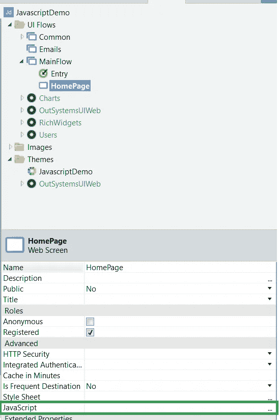
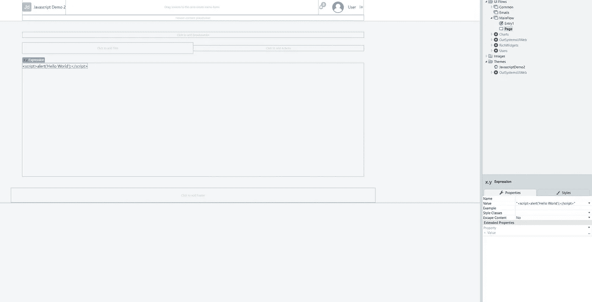
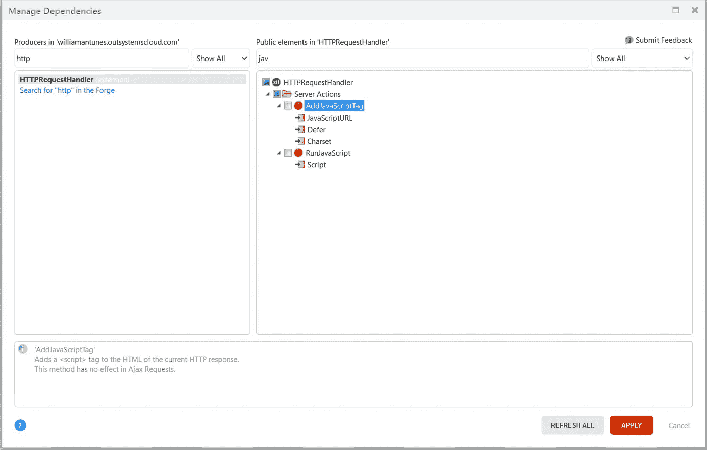
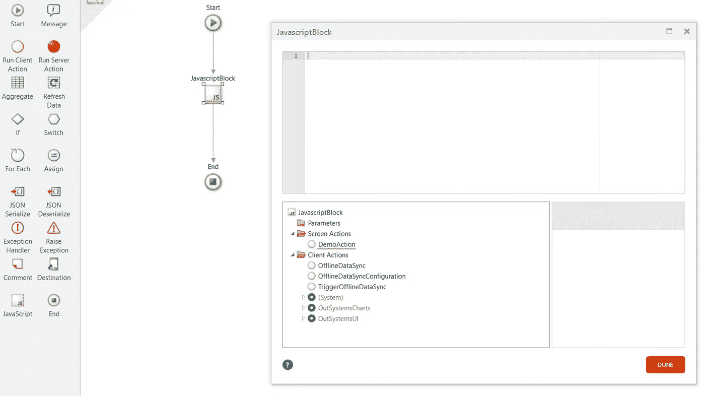
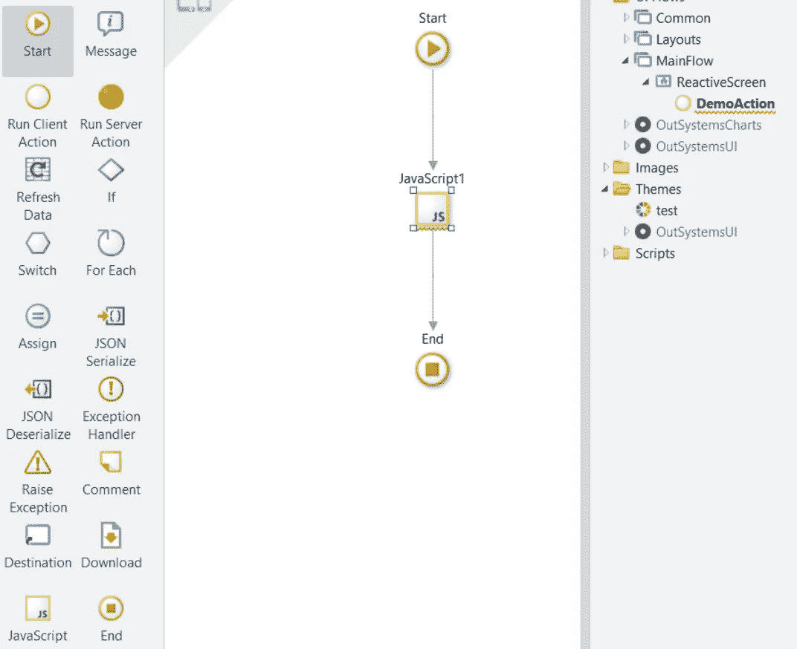
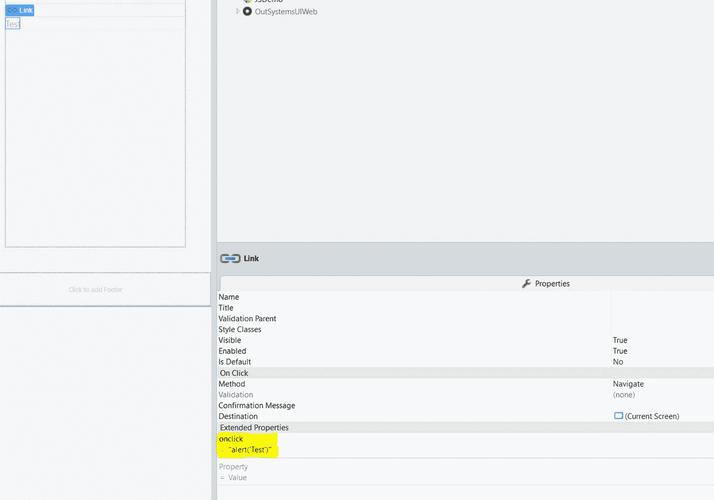

# 不要害怕，Javascript 将启动您的外部系统应用程序

> 原文：<https://itnext.io/dont-be-scared-javascript-will-power-up-your-outsystems-applications-b46eff117c9c?source=collection_archive---------4----------------------->

在与不同技术打交道的这些年里，我意识到了将其中一些技术结合起来的重要性。通过这种方式，您可以利用每种技术为您提供的优势。

如果您正在使用。NET 框架，在某些时候，您需要使用一些其他技术，如 Angular、Javascript 或其他技术来启动您的应用程序。这个不是特别关系到。网；这可能会发生在大多数其他编程语言中。

那么，在与外部系统合作时，你为什么不这样做呢？例如，Javascript 对其他技术来说从来都不是问题；为什么不在外部系统中使用它呢？

在过去的几年里，我一直和不同的团队一起工作。有人请求某些东西并不罕见，这些东西只在 Javascript 插件/文件/组件中可用。或者，甚至有人抱怨现有 OutSystems 应用程序中的 Javascript 代码需要维护。

在这种情况下，当同事意识到我懂 Javascript 时，看到他们开心的表情有点滑稽。我可以想象他们在想:“呸！终于不用我管了。让威廉去做吧！”。

事实是，看到那张快乐的脸很好，但不是一种好的感觉。因为我相信这些技能对开发人员来说很重要。我不是说每个人都应该掌握 Javascript，但是每个开发 web 应用程序的人至少应该知道 Javascript、HTML 和 CSS 的基础知识。

有了这些基础知识，你肯定能理解一段 Javascript 代码中发生了什么，甚至能创建你自己的代码。结合这两种技术(OutSystems 和 Javascript)将会让你每天都能学到新的东西。

OutSystems 为我们提供了很多不需要使用 Javascript 的特性，但有时我们确实需要使用它。例如，假设您的客户要求您使表格记录列可拖动，您会怎么做？目前，在 2019 年，仅使用 OutSystems 小部件是不可能做到的。解决方案是使用 Javascript 毫无问题地移动您的列。我将很快写一篇新文章来展示如何做到这一点。

您还需要 Javascript 来创建一个不是默认图表的酷图表，这些图表已经内置在平台中。比如下面的例子:

来自 Chart_HowTo (Forge 组件)的示例

另一个例子是当你想使用一个还不在 forge 组件中的 google maps 特性时？您还需要编写一些 Javascript 代码。

我可以不断地列出数以千计的您将重用或创建的集成和组件，对于所有这些，Javascript 的基础知识将节省您的时间。

因此，首先，您需要理解该平台如何在幕后使用 Javascript。

下面您可以找到在您的 OutSystems 应用程序中添加 Javascript 代码的地方。括号中的数字表示应用程序加载 JS 文件的层次顺序。

*   _OSGlobalJS.js (1)

*   Block.js (2)

*   Page.js (3)

默认情况下，屏幕、块和模块都有可以放置 Javascript 代码的属性。

如果我们在这些地方添加一个 console.log (Javascript 函数),结果也会显示加载的顺序:

还有其他方法可以将 JavaScript 代码添加到您的应用程序中，例如:

*   “转义内容”设置为“否”的表达式，这将导致 HTML 代码中间出现一个“

*   HTTPRequestHandler 扩展为我们提供了操作 HTTP 请求和响应的操作。在扩展中，我们有两个动作可以帮助我们在应用程序中使用 Javascript 代码，AddJavaScriptTag 和 RunJavaScript。

*   当谈到移动时，我们的逻辑流中有一个特殊的元素，那就是 Javascript 元素。

*   新发布的 reactive web 应用也在逻辑流中包含了 Javascript 元素。

*   添加 Javascript 代码的另一种方法是使用扩展属性，如下例所示:

这篇短文的目的是鼓励您和您周围的开发人员至少学习 Javascript 的基础知识，并通过将它们带到另一个水平来增强您的外部系统应用程序。

OutSystems 是一个很棒的平台，它让你的开发比别人更快、更容易、更好。然而，将它的优势与其他技术(如 Javascript、HTML 和 CSS)结合起来会使它变得更好。

说到 CSS，你已经看过我之前关于 CSS 和 OutSystems 的文章了吗？如果没有，点击 [**查看这里**](/understanding-the-marriage-of-outsystems-and-css-7be4e538eecc?source=friends_link&sk=1993df63a7777daf0a81fd49938af6e9)

我接下来的两篇文章将讨论如何将很酷的 Javascript 组件/插件/库集成到外部系统应用程序中。

如果你想进一步了解这个主题，可以直接去平台的文档:[https://www . out systems . com/evaluation-guide/extending-the-ui-with-html-JavaScript-and-CSS/](https://www.outsystems.com/evaluation-guide/extending-the-ui-with-html-javascript-and-css/)

不要害怕，Javascript 不会咬你。

干杯。