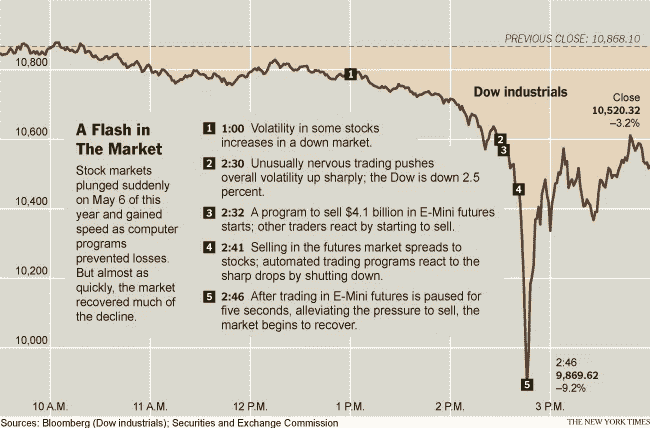

# 人工智能的现状。

> 原文：<https://itnext.io/dont-fear-artificial-intelligence-783a3fdb216a?source=collection_archive---------1----------------------->

为什么它是我们最重要的技术突破之一，为什么它不会抢走你的工作。

我们都知道 AI 横行的毁灭场景(终结者(1984)里的天网有人吗？)以及 AI 会抢我们饭碗的消息。当然，像任何敏感话题一样，夸大其词也是存在的。为了澄清任何关于人工智能以及它在(不久的)将来对我们意味着什么的疑问，我将把神话和事实分开。为此，我将描述人工智能的现状，以及它是否能“接管你的工作”。

*这个系列将分为两部分:*

*   *第一部分解释了什么是人工智能，以及我认为它如何分成不同的类别。*
*   第二部分是我做的一个采访，加上我对为什么人工智能不会取代你的工作，而是让你的工作更容易的看法。

**艾的状态**

当我在阅读和学习人工智能，它是如何工作的，它的未来是什么，它能做什么的时候，我想知道“人工智能是否能做出智能的决定，以及它何时能与人类的智能相等”。你们中的一些人可能会有同样的问题。这个话题很难解释，因为人工智能有很多种形式，它们背后的技术也各不相同。另外，(机器)智能的概念也很宽泛。

在 [LINKIT](https://www.linkit.nl/) 和 [itnext.io](https://itnext.io/) 可以找到[很多](/search?q=artificial%20intelligence) AI 相关的文章，包括[聊天机器人](/search?q=chatbot)、[机器学习、深度学习和 NLP](/search?q=machine%20learning) 。在这篇文章中，我试图根据我的个人经历和一次采访来解释人工智能。

就我个人而言，我喜欢 T21 对人工狭义智能和人工广义智能的区分。还有一种更高层次的人工智能，即 ASI 或人工超级智能，它相当于或“比所有人类加起来还要聪明”。但我不会在这部分讨论它，因为它还不相关。

**一级 AI:人工狭义智能(ANI):**

我们今天的“AI”属于 ANI(人工狭义智能)的范畴。ANI 在有限的预定义范围内运行，并且在 ANI 中反应式和有限内存之间有一个[区别](http://theconversation.com/understanding-the-four-types-of-ai-from-reactive-robots-to-self-aware-beings-67616)。

反应型 ANI 不能形成记忆，也不能利用过去的经验来学习和帮助当前的决策。一个很好的例子就是击败加里·卡斯帕罗夫的深蓝。在外行看来，深蓝在下棋方面似乎很聪明。但它实际做的是分析整个棋盘，然后遍历所有可能的棋步并选择最优的棋步。每当对手移动一步时，它都会这样做，因为它不记得以前的移动。因此，如果你告诉它向一个[移动的镖靶](https://www.youtube.com/watch?v=MHTizZ_XcUM)投掷飞镖，并确保飞镖进入靶心，它会茫然地看着你。

更现代的 AI，利用有限的内存来做决策，仍然是狭义的 AI，自动驾驶汽车和聊天机器人使用的自然语言处理就是两个例子。自动驾驶汽车使用预先编程的表示方式，持续观察速度以及自己和其他汽车的方向。但是这些信息不能长期保存，只能在软件运行时使用。没有像人类那样的学习和建立经验。一个真正的学习型人工智能不需要预先编程的表示，而是在驾驶时通过体验周围的世界来构建。这个和类似的 ANI 都是为一个特定的目的而建造和编程的。

**二级人工智能:人工通用智能(AGI):**

AGI 与它能做人类所做的事情这一事实相关联，它也被称为人类级人工智能。AGI 或人工通用智能是一种智能，可以像人类一样同时组合执行所有动作。

关于智力的主流科学对智力的描述是:

"*一种非常普遍的心理能力，包括推理、计划、解决问题、抽象思考、理解复杂想法、快速学习和从经验中学习的能力。这不仅仅是书本知识、狭隘的学术技能或应试技巧。相反，它反映了理解我们周围环境的更广泛和更深入的能力——对事物的“理解”、“理解”或“弄清楚”该做什么*

因此，简而言之，我认为 AGI 在被视为 AGI 之前，应该能够采取以下行动:

*   论证
*   规划
*   学问
*   自然语言交流
*   知识表达

这张 GIF 图描绘了每秒钟计算量的加速增长，直到它非常接近人脑。

**那么我们现在在哪里？** **替换还是协助？**

目前，我们仍在 ANI 的领域内，因为我们所有的系统都是为执行特定的狭窄任务而设计的。让我举几个例子:

*   谷歌翻译和聊天机器人在经典的人工智能系统中非常擅长自然语言处理。
*   您的手机是一个松散连接的 ANI 集合，用于导航、音乐、天气和许多其他活动。
*   ANI 还用于[股票交易](https://www.techemergence.com/artificial-intelligence-in-stock-trading-future-trends-and-applications/)。2010 年[闪电崩盘](http://www.motherjones.com/media/2013/05/robots-artificial-intelligence-jobs-automation)的发生是因为多个 ANI 项目在异常紧张的交易推动下，决定继续抛售以防止亏损。只有当市场关闭 5 秒钟时，程序才停止，恢复才开始。尽管发生了这些事故，但 ANI 系统大多是无害的，危害仅限于其狭窄的环境。

然而，有一个问题，我们已经遇到了我们目前的 ANI 的问题。举个例子: [Thiago de Faria](https://medium.com/@thiagodefaria) 描述了当前深度学习的[黑箱](/deep-learning-ai-the-blackbox-5ed48c3b12b4)问题:深度学习使用神经网络和模式识别，通过纯统计数据，它对某件事情发生的可能性做出估计。

他说:*“现在想象一个不同的场景。我进行血液测试和组织检查，并将结果交给深度学习算法。它可以相当准确地预测我有患前列腺癌的倾向，但它不能说为什么(它不能用语言或理由)它会这样假设。我没有基因的解释，只有一个已经被证明准确的算法*

你看到了困境，算法的预测是基于大量以前的样本，这些样本可能会也可能不会发展成癌症。这个假设是基于模式识别，**而不是**对基因及其如何产生癌症的理解。你可能会想:“为什么这是个问题？”，它可以在 80%的情况下准确预测癌细胞。

这里的主要问题是，当我们不能解释它的推理时，我们怎么能相信 ANI 的结论呢？由于这种差异，我们只能可靠地诊断，而不能治疗。

通过将人类的专业知识与 ANI 相结合，我们可以创造一种有益的合作，因为两者可以互补。我想，这就是 AI 的未来，**辅助而不是替代**。

**接下来是**

到目前为止，我提到了不同的智能水平，将您链接到其他关于机器学习和自然语言处理的文章，并说明了 calcs/sec 的增长。我们确定，就目前而言，人工智能相当弱，仅限于人工智能。它已经造成了数十亿美元的损失，并且存在黑盒问题。在本系列的下一部分，你会看到更多的例子，一个采访和关于奇点和 ASI 概念的讨论。