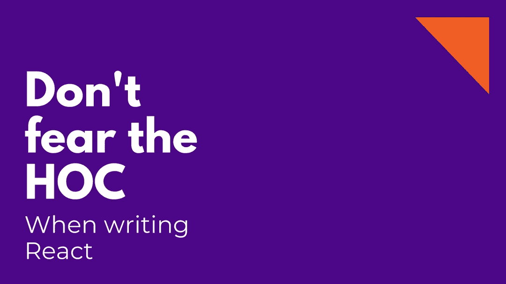

# 不要害怕特设，写作时要有所反应

> 原文：<https://itnext.io/dont-fear-the-hoc-when-writing-react-5875513ce34e?source=collection_archive---------8----------------------->



当我开始在我的代码中使用**函数式编程(FP)** 时，我也开始以不同的方式思考。当某件事情完成并运行时，我不断地问自己，“我能用更优雅的代码得到同样的结果吗？”。当然，我一直在重构我的代码，但是自从我在 FP 的影响下，**这种在编码时追求纯洁、简单和骄傲的感觉**更加相关。

正如[官方文档](https://reactjs.org/docs/higher-order-components.html)中所说:*一个 HOC 是一个接受一个组件并返回一个新组件*的函数，显然他们在这个过程中做了一些事情，通常他们通过执行一些额外的逻辑向目标组件添加一些属性，允许他们重用 HOC 包含的代码。

本文假装是对任何感兴趣的人的粗略介绍和参考，不仅是为了理解它们是什么，也是为了分享我在真实例子中使用*高阶元件(HOC)* 的经验。

# 当我们使用 hoc 时

我从一开始就在没有注意的情况下使用了 **HOCs** ，当你开始将第三方的 common 集成到你的代码中时，可以找到简单的例子，比如 *Redux* 或 *graphql* 。

我将粘贴一段代码，使用 *graphql* 和 *Apollo* 从会话中查询和获取用户数据，以及一个简单验证码的基本逻辑。

```
import React from 'react';
import PropTypes from 'prop-types';
// eslint-disable-next-line
import { Meteor } from 'meteor/meteor';
import gql from 'graphql-tag';
import { graphql, withApollo } from 'react-apollo';

import LoggedApp from './LoggedApp';
import Logging from './Logging';

const App = props => {
  const { data, client } = props;
  // Skipping the execution if data is not loaded
  if (data.loading) return null;
  // We show the LoggedApp  or Logging one depending if the user is logged
  return data.user._id ? <LoggedApp {...props} /> : <Logging client={client} />;
};

const userQuery = gql`
  query User {
    user {
      _id
      alias
    }
    users {
      _id
      alias
    }
  }
`;

export default graphql(userQuery)(withApollo(App));
```

这里，我们没有直接导出`App`组件用于我们应用程序的其他部分，而是使用 2 个 hoc，一个注入`graphql`查询，另一个注入`Apollo`来管理查询。因此，在这个简单的例子中，除了 2 个 hoc 之外，没有人使用。

在他们的[官方文档](https://www.apollographql.com/docs/react/essentials/get-started.html)中有更多关于如何在你的应用中使用 Apollo 的细节。

作为一个真正高层次的总结，我们可以说 **HOCs 返回我们的组件，给它们添加一些特殊的属性，把你从包含在 HOC** 中的逻辑中抽象出来。

# 项目环境示例

所以在理解了 hoc 可以给你的代码带来的好处之后，当我看到一个好机会的时候，我会在我的代码中使用它们。这里我会试着解释一个清晰的情况。

在[precurive](https://precursive.com/)中，我们使用**React**+[Design System React](https://react.lightningdesignsystem.com/)(一个我们用来呈现 [Lightning](https://www.lightningdesignsystem.com/) 调度页面的库)。这个库是 Lightning 的 **React** 实现，因为它可以在不同的环境中使用，我们需要指定我们在哪里找到图标资产(SVG)。

我们用[图标设置](https://react.lightningdesignsystem.com/components/icon-settings/)做这个配置，一个组件，这个组件被用作你的根组件的包装器，所有嵌套的组件将使用它来知道在哪里找到图标资产。

```
// imports...

const sagaMiddleware = createSagaMiddleware();

// Creating enhancers to connect our middleware (saga and asyncDispatchMiddleware)
// and adding devtools in elegant way
const enhancer = composeWithDevTools(applyMiddleware(sagaMiddleware));

const store = createStore(reducers, {}, enhancer);

// We load the configuration of the icons differently depending if we have
// or not the local environment icons available from _slds
const IconConfiguration =
  process.env.NODE_ENV === 'development' ? (
    // eslint-disable-next-line
    const actionSprite = require('@salesforce-ux/icons/dist/salesforce-lightning-design-system-icons/action-sprite/svg/symbols.svg');
    // eslint-disable-next-line
    const customSprite = require('@salesforce-ux/icons/dist/salesforce-lightning-design-system-icons/custom-sprite/svg/symbols.svg');
    // eslint-disable-next-line
    const doctypeSprite = require('@salesforce-ux/icons/dist/salesforce-lightning-design-system-icons/doctype-sprite/svg/symbols.svg');
    // eslint-disable-next-line
    const standardSprite = require('@salesforce-ux/icons/dist/salesforce-lightning-design-system-icons/standard-sprite/svg/symbols.svg');
    // eslint-disable-next-line
    const utilitySprite = require('@salesforce-ux/icons/dist/salesforce-lightning-design-system-icons/utility-sprite/svg/symbols.svg');
    <IconSettings
      actionSprite={actionSprite}
      customSprite={customSprite}
      doctypeSprite={doctypeSprite}
      standardSprite={standardSprite}
      utilitySprite={utilitySprite}
    >
      <App />
    </IconSettings>
  ) : (
    <IconSettings iconPath="/_slds/icons">
      <App />
    </IconSettings>
  );

sagaMiddleware.run(rootSaga);
render(<Provider store={store}>{IconConfiguration}</Provider>, document.getElementById('app'));
```

因此，基本上你可以看到，根据环境，当应用程序部署在 Salesforce 中时，我们通过*加载 SVG 需要*或中继到 Salesforce 资产(**如果图标已经在 Lightning Experience 中加载，为什么要将它们加载到我们的静态资源中**)。

> *注意我在 if 语句中使用了 require，这样我只在开发环境中获取那些 SVG，避免将它们包含在要部署的包中。*

# 要解决的问题

前面的代码可以工作，但是我们有两个问题。

*   首先，我们的代码可以被隔离在图标配置之外，它完全独立于应用程序的初始化。
*   第二，如果我们想在应用程序的不同部分使用这段代码(有其他根组件要挂载)…那么我们必须复制并粘贴代码，而**这从来都不是一个选项**。

# 使用 HOC 的解决方案

那么为什么不使用一个特设来隔离这个`IconSettings`组件的创建逻辑，听起来像是一个很好的用例，你不觉得吗？

实际上，HOCs 的解决方案是我们必须返回一个包装到`IconSettings`组件中的新组件的唯一工具(该组件需要设置为包装器)

所以我用这段代码创建了一个名为`iconifyComponent`的新组件。

```
import React from 'react';

import { IconSettings } from '@salesforce/design-system-react';

/**
 * HOC to wrap the IconSettings logic and reuse when need to be reused (on salesforce environment)
 * We load the configuration of the icons differently depending if we have
 * or not the local environment icons available from _slds
 */
export function iconifyComponent(WrappedComponent) {
  return function WrappingComponent(props) {
    if (process.env.NODE_ENV === 'development') {
      // eslint-disable-next-line
      const actionSprite = require('@salesforce-ux/icons/dist/salesforce-lightning-design-system-icons/action-sprite/svg/symbols.svg');
      // eslint-disable-next-line
      const customSprite = require('@salesforce-ux/icons/dist/salesforce-lightning-design-system-icons/custom-sprite/svg/symbols.svg');
      // eslint-disable-next-line
      const doctypeSprite = require('@salesforce-ux/icons/dist/salesforce-lightning-design-system-icons/doctype-sprite/svg/symbols.svg');
      // eslint-disable-next-line
      const standardSprite = require('@salesforce-ux/icons/dist/salesforce-lightning-design-system-icons/standard-sprite/svg/symbols.svg');
      // eslint-disable-next-line
      const utilitySprite = require('@salesforce-ux/icons/dist/salesforce-lightning-design-system-icons/utility-sprite/svg/symbols.svg');
      return (
        <IconSettings
          actionSprite={actionSprite}
          customSprite={customSprite}
          doctypeSprite={doctypeSprite}
          standardSprite={standardSprite}
          utilitySprite={utilitySprite}
        >
          <WrappedComponent {...props} />
        </IconSettings>
      );
    }
    return (
      <IconSettings iconPath="/_slds/icons">
        <WrappedComponent {...props} />
      </IconSettings>
    );
  };
}
```

现在，在我们的入口点，我们可以使用 HOC 来抽象图标配置，并使它非常漂亮，优雅和清晰。

在我们的入口点(`index.js`)中使用创建的`iconifyComponent`，我们得到了类似这样的东西:

```
// more imports...
import { iconifyComponent } from './data/iconifyComponent';

const sagaMiddleware = createSagaMiddleware();

// Creating enhancers to connect our middleware (saga and asyncDispatchMiddleware)
// and adding devtools in elegant way
const enhancer = composeWithDevTools(applyMiddleware(sagaMiddleware));

const store = createStore(reducers, {}, enhancer);
const AppIconized = iconifyComponent(App);

sagaMiddleware.run(rootSaga);
const AppIconized = iconifyComponent(App);
render(
  <Provider store={store}>
    <AppIconized />
  </Provider>,
  document.getElementById('app')
);
```

🤩很性感，你不觉得吗？如果现在，我们需要在应用程序的任何其他部分使用相同的图标配置(如果有另一个根应用程序)，我们可以再次使用 HOC，忘记细节。

# 结论

和生活中的所有事情一样，我们不应该在代码中滥用 hoc 的用法，并尝试在有意义的时候编写它们，但另一方面，我们在 React 环境中的工具中提供了一个非常优雅的解决方案。

那么，告诉我你对这个用例的想法，以及在你的代码中使用 hoc 的想法。

回头见！

*最初发表于*[*【robertovg.com】*](https://robertovg.com/blog/don-t-fear-the-hoc-when-writing-react)*。*