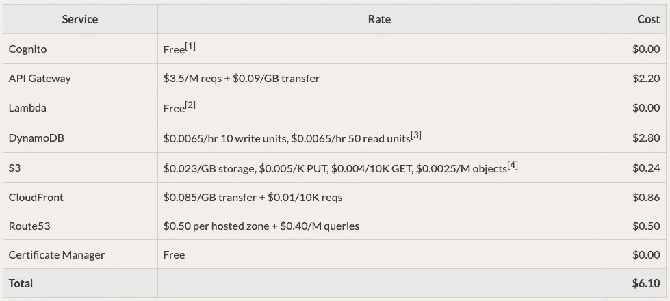
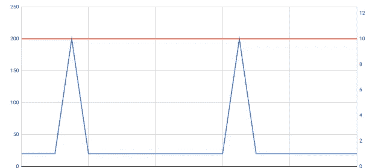

# 应该无服务器的 5 种类型的应用程序

> 原文：<https://itnext.io/dont-go-brainless-into-serverless-8f90d483798?source=collection_archive---------2----------------------->

# 所以你想没有服务器，是吗🏋🏼？

> *At*[*part well*](https://partwell.io)*我们帮助公司深入了解员工决定离职的原因。最重要的是，我们想出了一个独特的解决方案，帮助您在 5 年内重新雇用高达 40%的最佳流失人才。更多信息请访问*[*part well . io*](https://partwell.io)*。*

## 一些背景和术语

随着无服务器成为服务器端应用程序设计的下一步，云计算领域已经发生了演变。那么云计算和无服务器的区别是什么呢？在云计算中，典型的用户租用服务器空间和处理能力。因为您租用了整个资源，所以它是全天候可用的。资源本身不在乎你用不用。

这种模式随着无服务器应用程序而改变。

无服务器应用程序背后的思想是，资源本身只有在被使用时才会被创建。因此，当用户/客户端实际与应用程序交互时，您将使用资源。

作为一名开发人员，你必须编写特殊的功能，并将它们部署到托管服务中(AWS Lambda、Google Cloud Functions 等)。).一个典型的 HTTP 流应该是这样的:(1)用户发送一个 HTTP 请求，(2)请求将由基础设施处理，(3)将为相关函数创建一个容器，(4)函数执行，(5)执行完成，资源被释放。

这种模式被称为功能即服务(FaaS)，经常与术语*无服务器*互换使用。

这种方法体现了千禧一代开发者想要的一切:放手、自由、每周工作四小时等等。你明白了…🚀🚀🚀

简而言之，无服务器承诺轻松扩展和降低成本。

# 动机

在过去的几个月里，我已经阅读了无数关于这个话题的文章，数百页充满了令人困惑的信息和观点。最后我做了一个原型。经过一些测试后，我将我的架构恢复为传统的堆栈。

这太麻烦了。

走了这条痛苦的路后，我发现无服务器有它的使用案例，但是在一头扎进美味的每月一次的体系结构之前，你应该花时间研究一下🍬。

# 一句警告

**无服务器！== AWS Lambda:** 无服务器架构有很多服务提供商，其中 AWS Lambda 是最著名的一个。这篇文章很大程度上来源于我对 AWS Lambda 的体验。我的大部分发现，但不是全部，可以推断到其他供应商。

**随波逐流还是逆流而上:**是的，你是一名开发人员，通过足够多的黑客攻击，你会将你的 Linux 服务器变成一艘火箭飞船🚀。然而，为正确的用例选择正确的工具就像随波逐流一样。反其道而行之会觉得……嗯，像反其道而行之。显然，无服务器有很多可能。这篇文章是写给想随波逐流的人的，而不是反潮流的。**如果你想要一篇关于复杂的 VPC 架构和实验数据库的文章，这篇文章不适合你。**

# 什么时候应该采用无服务器模式？

## 1 如果你的应用没有很多用户，并且你不打算扩展，那么就选择无服务器

无服务器是运行没有很多用户的非常小的应用程序的好方法。这个用例的优势是价格。使用无服务器运行可靠的小型基础设施非常便宜。

下面是一个定价示例，有 1000 个用户每天发出约 20 个请求(来源:serverless-stack.com):

只需 6.10 美元，你就可以运行一个 24/7 可用的小应用程序，几乎不需要维护，数据备份等等。真了不起！**不要相信一旦你扩大规模，价格就会保持这么低的神话——它们不会的！**

## 2 如果你的流量看起来像这样，去无服务器

功能即服务是**按需**。所有东西都在服务器上，只有当用户请求进来时，才会创建一个容器并执行您的功能。因此，你只需要在你的函数被执行的时候付费。如果你有很多时间用户不会(或者很少)使用你的服务，这使得无服务器成为一个很好的解决方案。寻找尖峰流量模式！

当您将 AWS 基础设施与 dynamo db(Lambda(FaaS)的首选数据库)一起使用时，这一点尤其正确。

DynamoDB 有一个很好的新定价模型，专门针对这种叫做按需的使用模式。你最终可以节省很多钱，因为当交通流量较低时，你不会付出太多。

另一方面，如果你的流量分布均匀且很高，你应该准备好打开你的钱包…我指的是大时间(见:[https://gist.github.com/jordansissel/1797961](https://gist.github.com/jordansissel/1797961))。对于所有主要的云提供商来说，这是部分正确的，但对于 AWS DynamoDB 来说尤其如此。

而且你不会很快迁移到更便宜的解决方案，因为你会被你的云提供商的专有生态系统所束缚。

## 3 如果您的应用程序具有非常可预测的数据访问模式，则选择无服务器

在设计数据库时，你知道你的应用程序最终会做什么吗？您是否已经规划出用户访问其数据的每一种方式？你确定这些模式在未来不会改变吗？好消息，无服务器可能适合您。在无服务器的情况下，你很可能最终会使用 NoSQL 数据库，比如 DynamoDB 或 Google BigTable。虽然这些数据库在存储数据方面提供了灵活性，但在访问存储数据的方式方面肯定不够灵活。

因此，如果你的应用程序可以依赖于一个简单的键值存储数据库，并且这就是它在剩余的生命周期中所需要的全部——对你来说是好事。

例如，如果你正在构建一个未来可能出现新用例的社交应用——走向无服务器将感觉像逆水行舟。

## 4 如果您想要无限扩展并且能够承受成本，请选择无服务器

如果您正在运行一个需要超出通常标准的大型应用程序，并且您有财力支付发生的成本，那么无服务器可能是一个很好的选择。

如果您是上述规模的公司，那么很可能需要在开发运维团队或完全托管的服务之间做出决定。坦白地说，这两种选择都很昂贵，所以很有可能数学会解决。无论如何，如果你是一家那样规模的公司，你可能首先就不应该依赖关于媒介的建议:所以，去给你选择的企业销售代表☎️.打电话吧

但是请注意，在无服务器上运行大型/高可靠性/超高性能的应用程序会有其自身的缺陷。这些陷阱将需要他们自己的开销和管理。测试、构建开发环境、定制工具的需求、冷启动(某些请求的性能不佳)、热碎片等。仍然需要你在你的无服务器架构中投入大量的工作(参见:【https://segment.com/blog/the-million-dollar-eng-problem/】[)。如果你运气不好，你可能会以同样的 DevOps 团队和 AWS 法案结束，这将压榨你的柠檬🍋。](https://segment.com/blog/the-million-dollar-eng-problem/)

## 5 .如果你不处理大量的文件或网络套接字，就不要使用服务器

对于功能即服务(FaaS ),通常有一个运行单个功能的最长时间。直到 2018 年，这已经是 5 分钟了。对于 AWS Lambda，现在是 15 分钟。

如果你需要上传大文件，如 4k 电影到 S3 桶，15 分钟。这可能还不够，您必须通过无服务器架构发挥真正的创造力才能做到这一点。一般来说，你会用 lambda 做一些它没有被设计的事情。因此，你会发现自己在逆流而上。

Websockets 上的 with serverless 稍微复杂一点。虽然你可以这样做，而且你会找到一些资源向你展示如何做到这一点，但我认为你最好使用传统的后端(如果你发现自己在寻找关于这个主题的更多信息，请发表评论)。

# 更多需要考虑的事情

## 不会有很多工具为你准备好

无服务器是相当不成熟的。目前，无服务器框架是一种非常流行的方法，已经存在好几年了。

但是这个框架非常单薄。如果你习惯了现代 MVC 框架的舒适，你会发现自己从头开始构建了很多东西。在许多方面，你正在重新发明轮子…难道我们没有被教导不要那样做吗？

调试您的应用程序也将非常麻烦。您肯定会发现自己在代码中放了很多 *console.log()* 。之后，您将从 cloudwatch 中抓取日志(如果是 AWS)。

## 这并不全是坏事:与 AWS IAM、Cognito 和 Cloudformation 的集成非常好

如果您不熟悉您的云提供商的服务，那么在您能够高效地使用无服务器之前，还有很多东西需要学习。在 AWS 的情况下，你必须很好地掌握 API-Gateway、Cloudformation(作为代码的基础设施)、IAM 等。

一旦您很好地掌握了这些主题，集成就会进行得很好。**但有所不同:**你现在完全被锁定在你的云提供商的生态系统中——拥有所有的好处和陷阱。

## 您必须花时间深入 NoSql 数据建模

对许多人来说，无服务器是涉足 NoSql 的一个很好的理由，因为亚马逊和谷歌为 NoSql 和 FaaS 提供了很好的集成。从 SQL 和规范化数据模式的世界来看，这不是一件容易的事情！由于您的数据访问模式(您查询数据的方式)一旦投入生产就非常不灵活，因此您应该花时间研究如何正确地为您的数据建模。这需要时间，但却是一次很好的学习经历。

# 结论🎉🎉🎉🎉

无服务器是令人兴奋和有趣的。目前，我认为价格是一个禁止因素。无服务器肯定不是银弹，但对于正确的用例，它可能会给你一种随波逐流的感觉。

保持快乐，继续黑客🤖！

我正试图建立一个 twitter 用户群。如果成功了，我会发布更多有用的编码技巧。跟我来 https://twitter.com/FlorianMartens9[😜](https://twitter.com/FlorianMartens9)