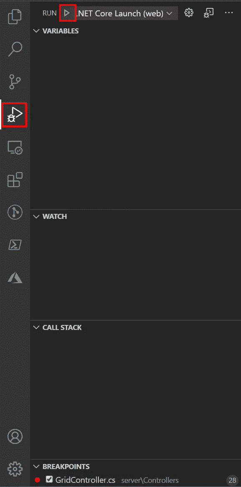
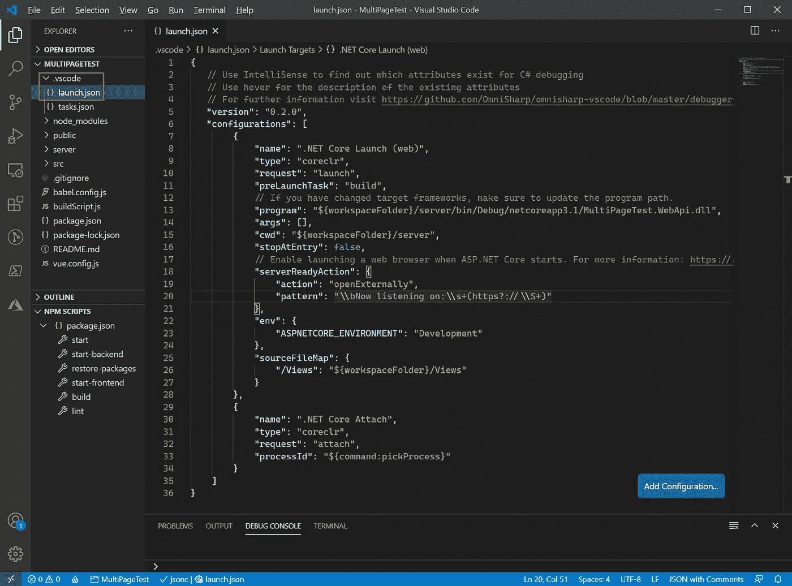

# 不要启动运行从 Web Template Studio 创建的 ASP.NET 核心后端的浏览器

> 原文：<https://itnext.io/dont-launch-a-browser-running-asp-net-core-back-end-created-from-web-template-studio-9faad42492cb?source=collection_archive---------2----------------------->

在上周的帖子中，我提到了我们可以在应用程序后端启动调试会话时阻止 VSCode 启动 web 浏览器。这将是一个关于如何停止浏览器启动的快速帖子。以下是之前的 Web Template Studio 相关帖子，如果你想赶上的话。

[用 Web Template Studio 创建应用](https://elanderson.net/2020/09/create-an-application-with-web-template-studio/)
[调试从 Web Template Studio 创建的 ASP.NET 核心后端](https://elanderson.net/2020/09/debug-asp-net-core-back-end-created-from-web-template-studio/)


## 启动配置

如果您还记得上周运行我们的后端时，我们使用了 VSCode 中的 debug 选项卡，然后点击。NET 核心启动(web)配置。



可在 VSCode 中运行的选项由**中的 **launch.json** 文件控制。vscode** 目录。下面的截图是上周示例项目的 launch.json。



## 停止浏览器

要阻止浏览器打开，请删除您正在处理的特定配置中的 **serverReadyAction** 部分。从上面截图中的例子来看，下面是从。NET 核心启动(web)配置。

```
// Enable launching a web browser when ASP.NET Core starts. For more information: [https://aka.ms/VSCode-CS-LaunchJson-WebBrowser](https://aka.ms/VSCode-CS-LaunchJson-WebBrowser)
"serverReadyAction": {
    "action": "openExternally",
    "pattern": "\\bNow listening on:\\s+(https?://\\S+)"
},
```

删除上述内容后，点击此配置的 run 按钮将不再启动浏览器，但其余的调试体验将保持不变。

## 包扎

希望这将有助于消除开发中的一点烦恼。有关[servereadyaction 的更多详细信息，请查看文档](https://github.com/OmniSharp/omnisharp-vscode/blob/master/debugger-launchjson.md#starting-a-web-browser)。我还建议查看 launch.json 的[完整文档，以便更好地了解所有可能的事情。](https://github.com/OmniSharp/omnisharp-vscode/blob/master/debugger-launchjson.md)

*原载于* [*安德森*](https://elanderson.net/2020/09/dont-launch-a-browser-running-asp-net-core-back-end-created-from-web-template-studio/) *。*