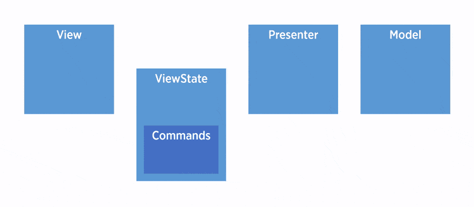
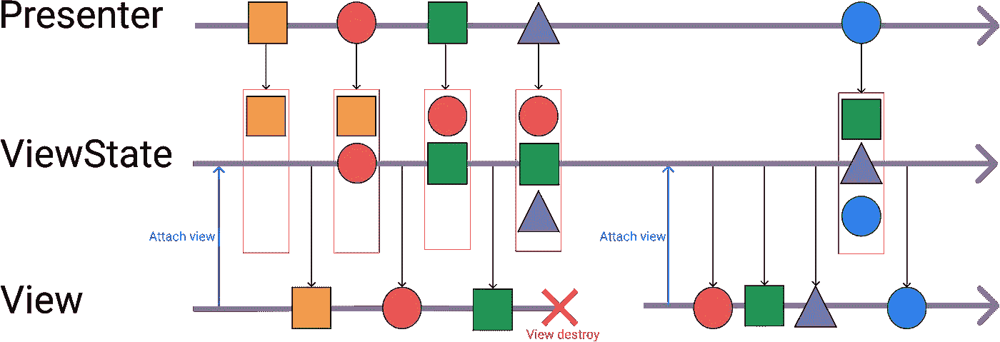
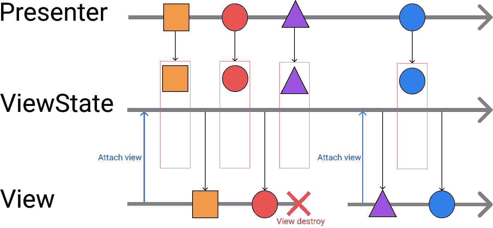
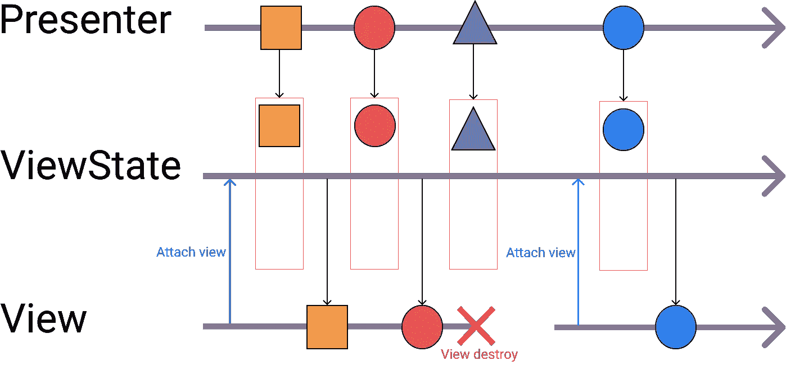
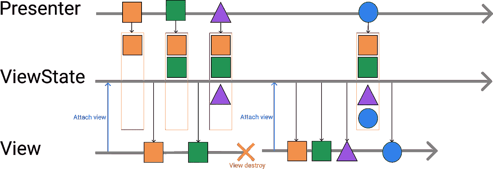

# 不要考虑屏幕的旋转。Moxy 解决了这个问题。

> 原文：<https://itnext.io/dont-think-about-rotation-of-the-screen-moxy-fix-the-problem-e861d52a0d12?source=collection_archive---------4----------------------->

大家好。如果你是一名 android 开发人员，你会知道屏幕旋转是 Android 世界中最大的问题之一。当用户旋转屏幕时，视图被破坏。我们不能改变这一点，因为这是 android 操作系统的默认行为。或者，我们能做什么？

## 主要思想

这个问题有一个简单的解决方法。我非常喜欢简单的解决方案；我的团队成员都知道。我们不能改变操作系统的行为。Android 在用户旋转设备时会破坏你的活动和碎片。然而，我们可以创建一个对象，当用户旋转设备时，它仍然存在。将视图中的所有逻辑移动到该类中。

然后我们需要做下一步:保存 presenter 在视图上调用的所有方法，并在新的视图对象上重新调用它们。我们称这个类为视图状态。

# 解决办法

Moxy 是一个帮助在 android 项目中实现 MVP UI 模式的库。

## 视图状态

ViewState 是一个实现视图接口的对象。Moxy 将视图状态字段注入到演示者中。另外，演示者可以访问所有视图方法，但不能访问上下文。

## 查看者和演示者

Moxy 为活动和片段提供了基类。Moxy 拥有所有活动和片段的父类。您的视图接口必须从 MvpView 扩展。演示者必须从多视图演示者<yourviewinterface></yourviewinterface>

## 提出者

MvpPresenter 有一个受保护的方法 getViewState()，该方法返回实现视图接口的对象的实例。
MvpPresenter 有一个开放的受保护方法 onFirstViewAttach()。当视图第一次附加到演示者时，将调用此方法。我建议重写该方法，并将其用于执行加载数据的调用。

## 样品

有时 android os 会恢复视图状态。Moxy 有处理所有情况的策略。

## AddToEndSingleStrategy

最受欢迎的策略。该策略重新调用演示者在视图状态上调用的每个方法。但是，如果演示者不止一次调用一个方法，该方法将使用最后一个参数重新调用一次。这意味着新视图具有最后的状态。
例如，演示者调用一个方法“printLog(“1”)，然后 printLog(“2”)，在屏幕旋转后，视图状态将只调用带有参数“2”的方法。

## 一个执行策略

我只对显示片段或开始活动的方法使用这种策略。因为 android os 处理这种情况不需要帮助。使用这种策略的方法只会被调用一次。如果此时视图不存在，演示者调用 ViewState 上的方法，该方法将在新视图上调用。

## skip 战略

该策略类似于 OneExecutionStrategy。该方法将被调用一次，或者根本不被调用。该方法不会保存到视图状态中。

## AddToEndSingleTagStrategy

我对互斥方法使用这种策略。比如“showProgress()”和“hideProgress()”。例如，演示者调用“showProgress()”,然后调用“hideProgress()”。该策略仅在屏幕旋转后重新调用“hideProgress()”。

## AddToEndStrategy

我不使用 AddToEndStrategy，也不推荐你使用。该策略为每个新视图实例重新调用所有方法。

# 在后台

它是如何工作的？

Moxy 使用代码生成。Moxy 为每个视图方法生成一个命令类，为每个视图接口生成一个视图状态类。视图状态实现了您的视图接口。Moxy 在编译时生成视图状态。基本演示者中的字段视图状态将由生成的类的实例初始化。

访问 github 上的 [Moxy 库，如果你用简单的方法解决困难的任务，就打一颗星。](https://github.com/moxy-community/Moxy)

编辑: [Vova Usachov](https://medium.com/u/3775b139ac75?source=post_page-----e861d52a0d12--------------------------------)

[发表在我的网站上](https://schoolhelper.tech/2019/09/10/dont-think-about-rotation-of-the-screen-moxy-fixes-the-problem/)