# 不要低估递归:它比大多数人想象的要强大得多

> 原文：<https://itnext.io/dont-underestimate-recursion-it-s-far-more-powerful-than-most-people-think-130a1077f3a6?source=collection_archive---------3----------------------->

你当然知道什么是递归。它的技术含义是*仅仅是* **通过自身**定义某物。

所以简单的定义它实际上可以**完全改变**你写命令式算法的方式。你是 Java 开发人员吗？C#？Python？F#？没关系，它适用于所有通用编程语言！

# 让我们来定义循环

在我的世界里，循环不是“做一件事 n 次”或“当一个条件为真时重复”。在我的世界里，loop 的迭代实际上是一个函数，它改变了某个全局状态，loop 是这类函数的链，从某个初始状态开始:

> 循环是初始状态和转换(迭代)的有限链。

以这段伪代码为例:

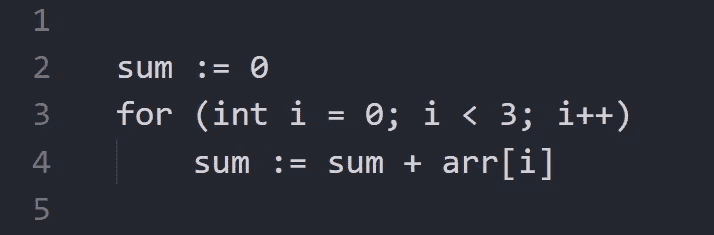

常规循环添加元素

它的全局状态是一个“和”与“我”的元组。它的跃迁是用 arr[i]和 i + 1 求和，我来演示一下:

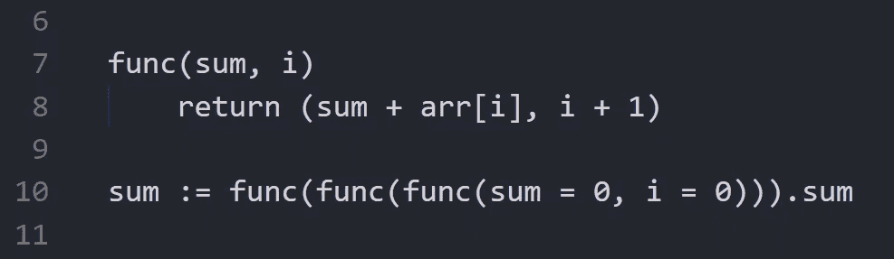

具有初始状态的链式转变再现相同的循环

这里我“硬编码”了“func”的三个嵌套调用，但是我们应该怎么做才能让这个链自动化呢？

我们可以“教”函数实际调用它自己！

# 从循环到递归

让我们的函数调用它自己。

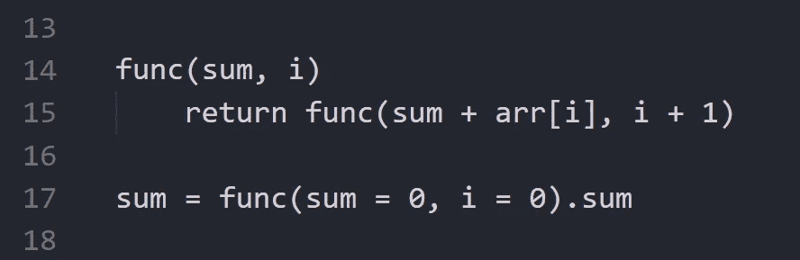

递归定义的函数，对数组的所有元素求和

你可能已经注意到了，这是一个无限递归，所以类似于 for 或 while 的条件，我们将把它作为一个延续条件:

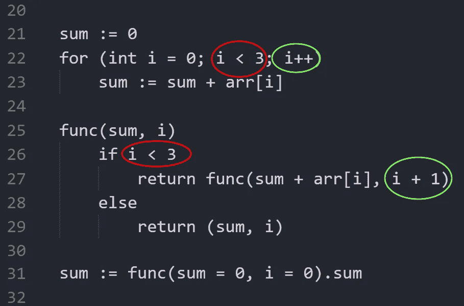

将循环转化为递归

我们递归定义了循环！事实上，这是尾部递归，直接从循环/到循环的转换和递归(我稍后会解释)。

你可能已经注意到这是一个*归纳*定义。我们有*基*是针对“I”等于或大于 3，我们有跃迁，是“假设 func 定义为 i + 1，那么 I 的 func 定义如下”。

我是归纳的忠实爱好者，几周前我甚至用 C#写了一篇关于归纳变量的文章。

这个定义的关键在于它的简单性。没有“动作”，没有移动的变量。它所做的只是返回一个或另一个东西。这纯粹是牛逼不是吗？

# 为什么我们需要递归？

因为**更简单**。更容易**读**，更容易**写**，最终变得更容易**调试**。

## 更容易阅读

好吧…让我们举一个非常基本的例子。阶乘。以下是循环定义:

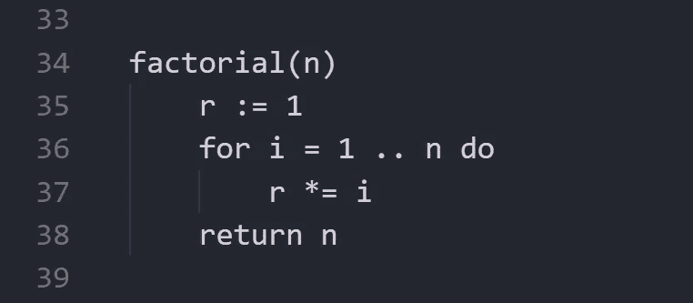

用循环定义的阶乘

现在，你能告诉我阶乘(0)返回什么吗？阶乘(4)呢？它应该是 24 次，还是少了一次迭代(6 次)或多了一次迭代(120 次)？你需要知道如果 1..n 包容不包容，大概，然后仔细建模。

那么，阶乘的“模型”定义是什么？

这是:

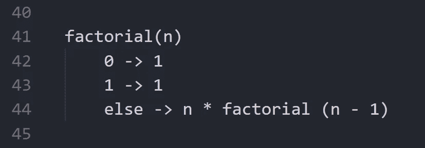

递归定义的阶乘

你不需要考虑一个东西有多少次迭代。您只需要知道它对于基本情况(0 和 1)是正确的，并且它正确地从 n 转换到 n-1。你确信它能正常工作。

## 写作高手

这次我们来看看斐波那契数列。在数学中，它的定义如下:

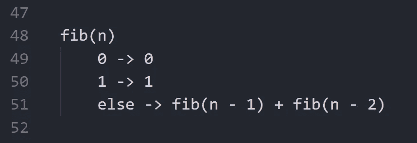

斐波那契数列的直接数学定义

当然，我们都明白没有人会像这样写代码:这是非常低效的。

这里有一个必要的解决方案:

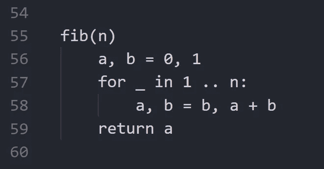

用循环定义的斐波那契数

现在，同样的问题。你能预测 5 的产量吗？你确定你应该返回 a 而不是 b 吗？应该有 n 次还是 n-1 次还是 n+1 次迭代？

但是我们实际上可以用递归公式来解决同样的时间复杂度，这就是记忆化。在带有 decorators(可以修改函数)的语言中，我们需要做的就是在上面添加一个:

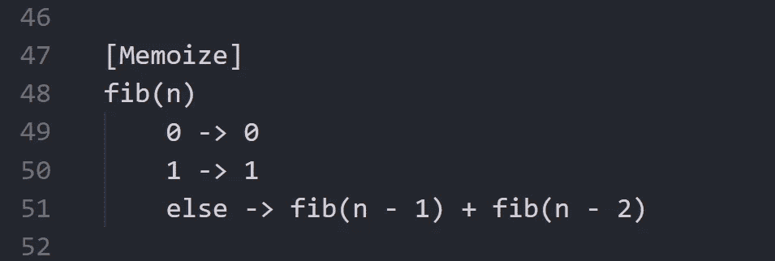

斐波那契记忆

函数是纯的，即对相同的输入返回相同的答案，所以我们只需要缓存它，瞧，时间复杂度是线性的！

(对于没有装饰器的语言，你可以检查输入是否在字典中，这并不难做到)

## 更容易调试

看起来调试循环应该更容易，而不是一直跳下去，你只需要检查迭代。

事实上，调试递归定义的函数至少有两个好处:

*   您可以随时检查/评估任何输入的函数值(但是您不能运行任意迭代次数的循环)
*   您可以看到调用堆栈，并且可以看到每个堆栈*帧的变量值。*

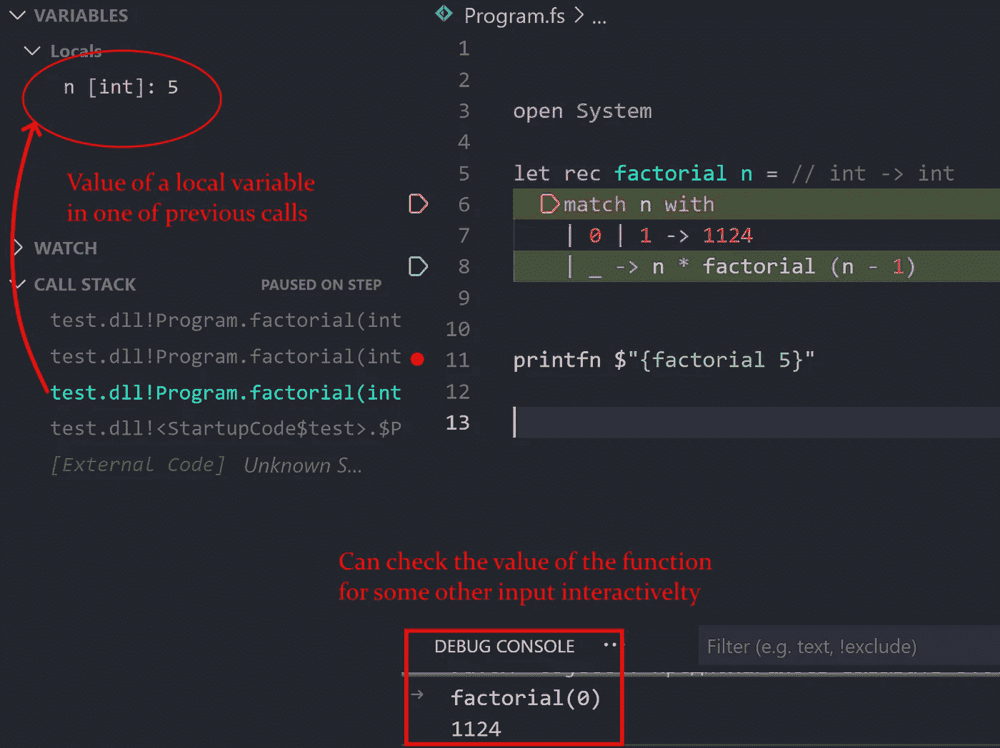

检查先前调用帧的变量。交互式运行函数

# 我们能用递归做什么？

我展示了人工例子，但实际上，你可以用递归做任何循环。例如，考虑这种遍历树的模式:

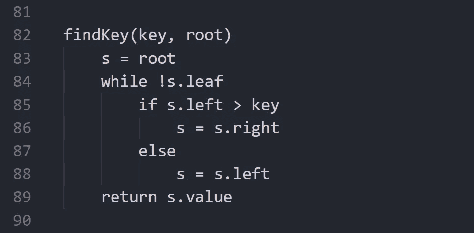

在带循环的二叉查找树中求值

它的对等物:

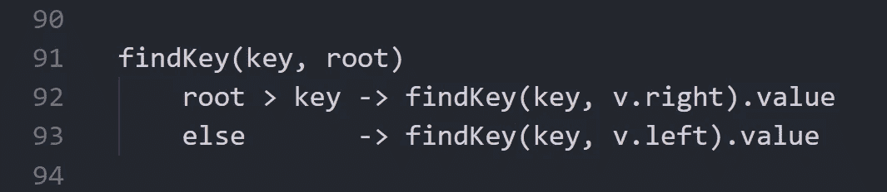

递归查找二叉查找树中的值

看起来不是干净多了吗？在复杂的算法中，读写这样的代码要容易得多，你通常甚至不会去调试它！

关于询问直到给出有效答案的已知问题呢？

下面是命令式代码:

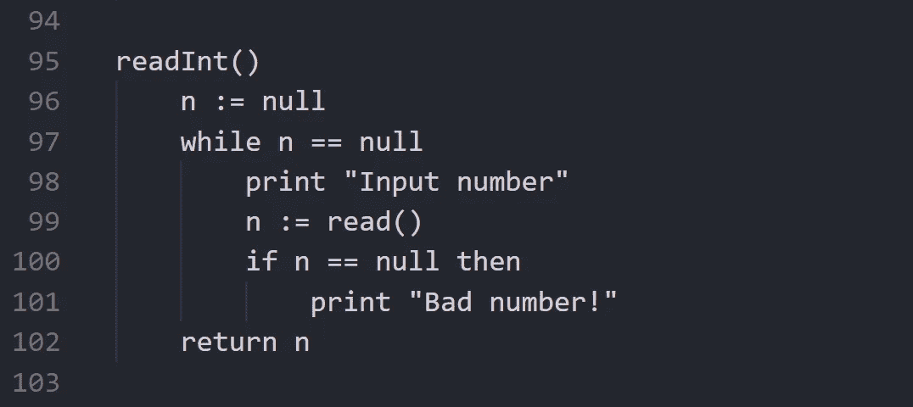

强制性实施

请注意，我们如何声明“n”并预先为其设置 null 以进入循环，以及我们如何复制条件 n==null 以检查输入的数字是否正确！

让我们剔除那些丑陋的东西:

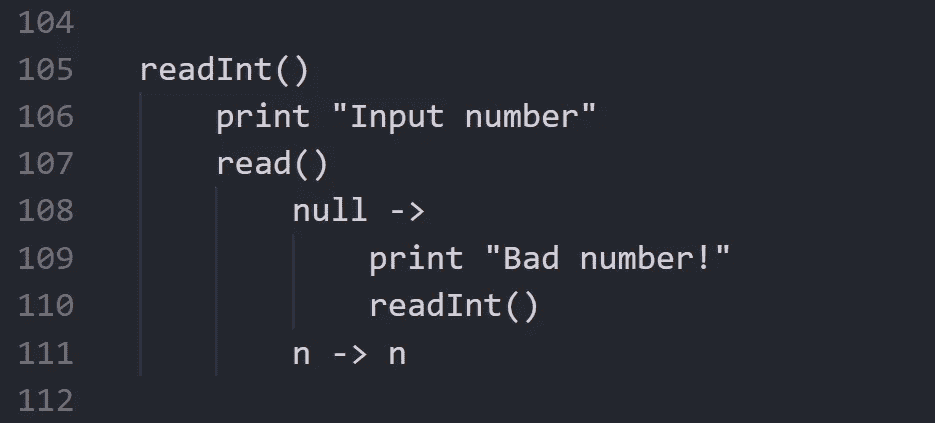

递归实现

看到多简单了吧？这是对的直接翻译

1.  请求输入一个数字
2.  读号码
3.  如果为空，则报告错误并重试
4.  否则，退回去

现在，你能对之前的命令循环做同样的事情吗？这大概是这样的

1.  假设号码无效
2.  无效时，请求输入一个数字
3.  将读取值分配给数字
4.  如果为空，则报告错误
5.  从 2 开始
6.  返回

哦…

# 其他递归的东西呢？

不仅函数可以递归定义。我甚至可以说世界上的一切都可以被递归定义——但是让我先介绍几个实际的例子。我们可以或者应该递归定义的另一件事是类型。

## 递归类型

一个简单的例子是二叉树节点。二叉树的一个节点通常有 0、1 或 2 个相同类型的子节点。这是一个相当简单的例子。

在函数式或函数优先语言中，有一种类型叫做 list(相当于我们在离散数学中所说的 string)。基本上，这个想法是一个列表

*   要么空着
*   或者有第一个元素，其余的也是列表

这里有一个伪定义:

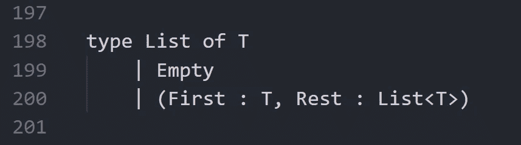

列表的归纳定义

其中 T 是一个泛型类型参数，因此您可以替换任何类型。

这样的列表允许我们避免遍历索引，并允许我们动态地构造列表，而不必预先创建集合并填充它。例如，这里有一个对整型列表元素求和的函数:

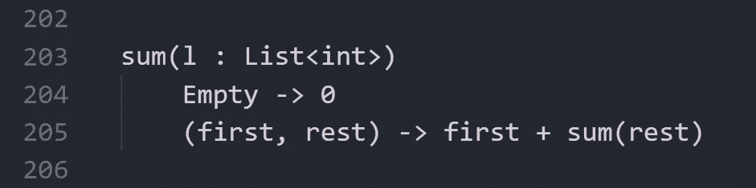

遍历列表

所以我们所做的只是考虑了列表的两种可能状态:当它为空时(那么总和为 0)，当有第一个元素和其余元素时(那么总和就是第一个元素加上其余元素的总和)。

简单吧？但是多方便啊！

例如，假设您想要获取偶数索引的元素。你当然可以用 I 做一个循环，看看它是否是偶数，等等。等等，但是让我们考虑下面的方法:

*   如果它是空的，返回空的
*   如果它只有一个元素，则返回一个元素的列表
*   如果它有两个元素和其余元素，则取第一个元素加上此函数的结果作为其余元素

想写就写:

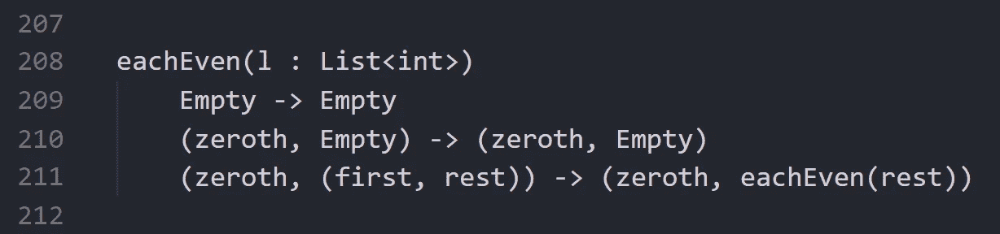

遍历列表

这种类型的链表叫做*单链表*。

## 相互递归

这是关于定义 A 到 B，B 是通过 A 定义的(尽管在这个循环中可以有任意数量的“实体”)。[红绿树](https://blog.yaakov.online/red-green-trees/)相互递归定义。一般来说，这种类型的递归不太常见。

# 语言支持

我展示了如何在大多数通用语言中优雅地使用递归来代替样板文件和可读性差得多的代码。

但是我们可以通过对语言语法、数据结构和编译器的特殊支持来超越它！

## 尾部递归优化

或者 TCO(尾部调用优化)是关于编译/降低你的尾部递归到实际的循环。它是由编译器优化的，这样你的递归定义的函数至少和循环一样有效！

再来说通话。如你所知，当你调用一个函数时，当前指令被保存，然后函数被调用，执行返回到调用后的指令。

当你想在它之后做某事时，它是需要的。例如，在 factorial 定义为 *n * factorial (n-1)* 的情况下，在您调用了内部 factorial 之后，您希望将其乘以 n，然后返回。

考虑这个伪代码:

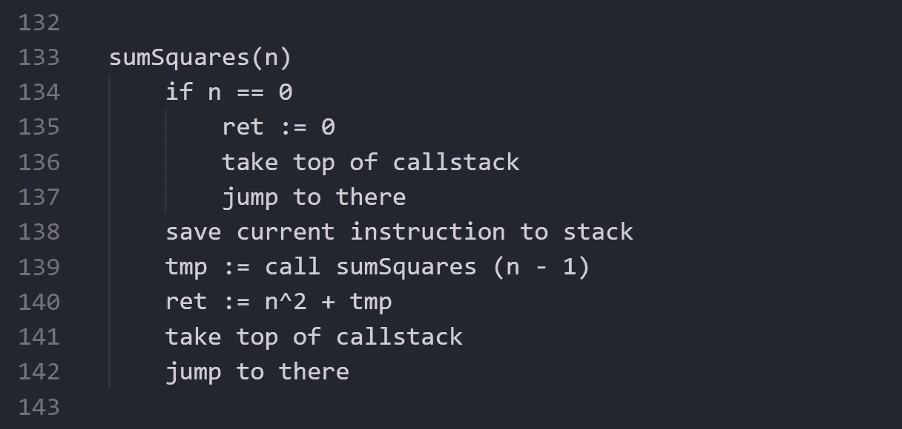

sumSquares 的伪机器代码

它将从 0 到 n 的整数的平方相加。所以这个想法是，当参数为 0 时，我们将 0 赋给返回值，并跳转到返回地址。否则，我们保存当前地址，调用它自己的 n-1，加上 n，然后跳转到返回地址。

但是，如果你不想在函数调用后做任何事情，你可以直接*跳到*而不是调用。让我们添加来自“累加器”的参数“ACC”——它将累加总和。实现如下:

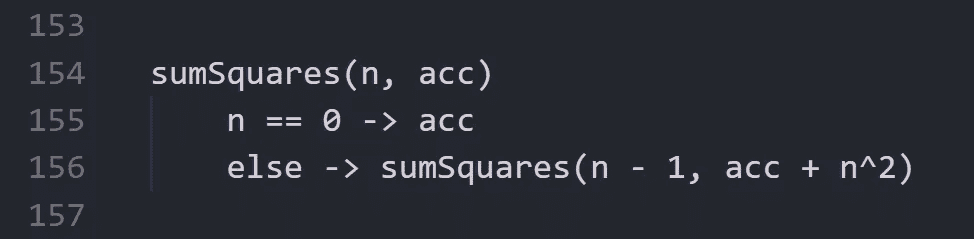

带累加器的递归定义

请注意，它看起来与我们在开始时讨论的循环非常接近。把“n”换成“I”，把“acc”换成“sum”，就会得到一个循环，对吧？就是这个想法。让我们考虑一下它的伪代码:

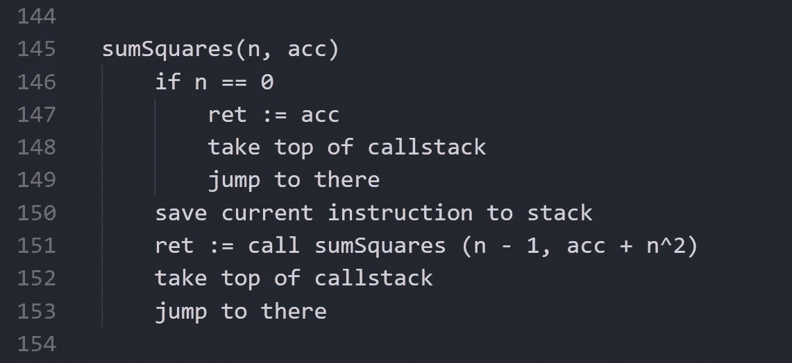

用于直接翻译的机器代码

*但是*事实上“call”已经把结果放进 ret 了。所以把调用的结果赋给 ret 是完全没有意义的。此外…如果我们只是从那里返回，为什么我们需要回到这一点？如果在调用“ret”之后包含了正确的值，那么我们所需要的就是通过跳转到函数本身来结束我们的函数！

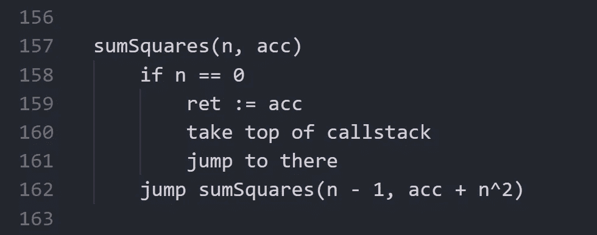

用跳转替换尾调用

现在让我们把它反编译成一种伪语言:

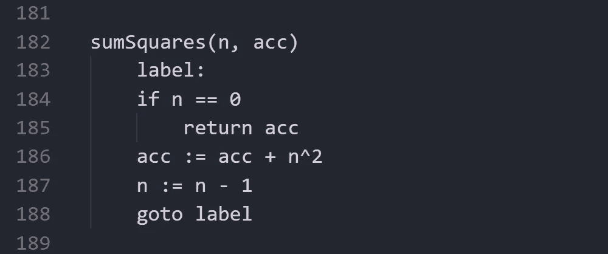

反编译的伪机器代码

事实上，这是一个 while 循环。只要读出来:如果 n 是零那么返回，否则做点什么跳到开头。下面是 while 循环的等价形式:

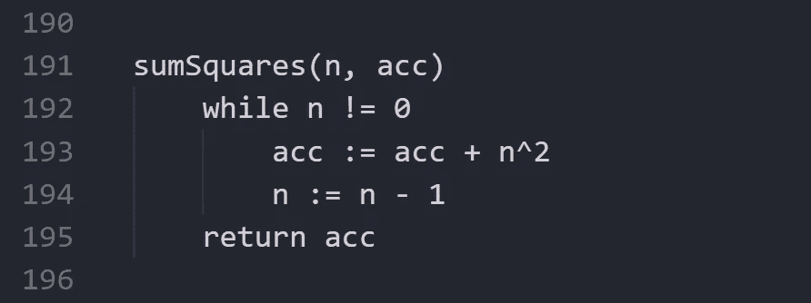

反编译成 while 循环

就这样，看到了吗？这里的关键思想是你写递归定义的函数，编译器为你把它们展开成一个循环！

不幸的是，并不是所有的编译器都支持它，但它存在于 Kotlin(带 tailrec)、F#(和 ML 家族)、Scala 等等。

## 数据结构

虽然递归不必处理不可变的结构，但它可能需要动态地构造新的对象。在像 F#这样的语言中

*   单向链表(上面已经介绍过)
*   用红黑树制作的持久地图和集合
*   受歧视的工会

所有这些都鼓励在没有副作用的情况下创建递归函数，这减少了潜在的错误。

老实说，DUs 本身应该有一个单独的条款。事情越简单，它可能有越多的含义！

## 句法

当有适当的语法支持时，编写递归定义的函数要容易得多:

*   考虑不同情况— *模式匹配*
*   构建和解构列表和元组

当一门语言提供了方便记忆你的函数的方法，例如，通过 decorators，这也是很棒的。

当一种语言提供了一种方法来确保一个函数是 TCO 优化的，这也是很棒的。例如，Kotlin [提供了](https://kotlinlang.org/docs/functions.html#tail-recursive-functions)“tailrec ”,如果无法进行优化，它会发出警告。

# 何时不使用递归

递归仍然是一种工具。对于许多使用单一递归的操作(也就是说，从函数本身调用函数，并且调用次数不超过 1 次)，可以使用序列操作。它们在不同的语言中有不同的称呼， [C#的 LINQ](https://docs.microsoft.com/en-us/dotnet/csharp/programming-guide/concepts/linq/) ，[科特林的序列](https://kotlinlang.org/docs/collection-transformations.html)等等。

这里的关键是当递归比它的替代品更好的时候使用递归。然而，编写一个过滤偶数的显式函数可能应该替换为使用过滤序列函数。

另一种情况是当编译器不支持 TCO *或者*的时候你的函数不受 TCO *而是*嵌套调用的数量是几千或者几十万。那么它可能会消耗你的大量筹码，甚至耗尽你的筹码。但是实际上，一个函数遍历这么大的序列并不常见。

# 结论

递归真的让我很开心。我相信它足够简单，每个人都能理解它和它的优点。

感谢关注，原来比我想象的要稍微长一点:)。

我的 [github/WhiteBlackGoose](https://github.com/WhiteBlackGoose) ，[Twitter/white black goose](https://twitter.com/WhiteBlackGoose)。