# “别担心，女士，你不需要在电话里分享你的信用卡信息”——或者在网上接受支付的故事。

> 原文：<https://itnext.io/dont-worry-ma-am-you-don-t-need-to-share-your-credit-card-details-over-the-phone-or-the-story-6e785175d1a5?source=collection_archive---------6----------------------->

"是的，我还是不在电话里告诉你我的信用卡号码比较好."

又是你好！今天，我们的主要课程是在用 **OutSystems 平台**开发的 web 应用程序中接受信用卡支付。知道这可能是一个*成功或失败的段落*，我们的主要目标是展示如何使用**客户端加密** (CSE)创建一个支付表单。然后，我们将用一个很酷但不太复杂的控制面板和一些简洁的附加功能来补充我们的系统。

**这不是该主题的第一篇文章。**如果你还没有这样做，我推荐你阅读上一篇文章(链接如下，或[此处](/credit-or-debit-or-the-story-of-accepting-payments-in-the-outsystems-platform-b1b4bf15f736))，这样你就可以熟悉一些术语。知道这是一个估计 17 分钟的阅读，我将给出一个简短的总结:**我们定义了我们的业务案例**(接受付款)**我们的约束**(不符合 PCI)和**我们深入研究了核心服务模块** — API 集成— **和移动插件**的实现。所有这些**都使用 Adyen 的**，一个著名的支付网关提供商。如果你不知道 Adyen，我建议你下次在里斯本机场出发时，看看自助服务机上的显示屏，那里出售从枕头到国际充电器的几乎所有东西。

 [## “信用卡还是借记卡？”—或者在 OutSystems 平台中接受支付的故事

### 移动设备、高速数据通信和在线商务创造了方便、安全的期望…

itnext.io](/credit-or-debit-or-the-story-of-accepting-payments-in-the-outsystems-platform-b1b4bf15f736) 

继续阅读本文，我将向您展示如何实现 web 表单——使用 web 块——以及如何构建控制面板。但是，事不宜迟，让我们回顾并更新我们的业务案例。

# 商业案例

> 因此，商业案例相当简单:我们希望在我们的应用程序中接受支付，在我们的两个渠道中——网络和移动。(……)我们也想在网络上支持**(支付)**，因为由于技术困难或通过不同的销售渠道，可以发布一次性网络支付表单。

上面的摘录摘自上一篇文章，总体来说，没有改动。不过，我们将在控制面板上添加一些细节。

我们的**控制面板**应该**允许我们发出一个新的支付请求**，有了同样的请求，**要么生成一个支付表格**并转发给我们的客户，要么请求信用卡详细信息并**自己键入支付详细信息**——你可以通过电话获得详细信息，这在某些文化中似乎很常见。尽管我不是这个选项的“超级粉丝”，但我会让它可用，然后根据具体情况，您可以评估是否应该允许这样做。由你决定。

除此之外，我们的控制面板还将**允许我们收集一些关于过去 30 天付款次数的信息**，成功/不成功付款比率，以及最后，过去几天的最高付款额——30 天将是我们的基线。尽管这不是一个非常全面的功能集，但应该足以启动您的支付处理，正如您现在可能已经猜到的那样，它可以作为一个“框架”工作，因此您可以根据自己的需要扩展这些功能。

在继续之前，让我在这里做一个与上一段完全相关的附加评论:如果您发现缺少某个给定的特性，或者如果您希望将一组更改“合并”到这些文章中描述的任何组件，请随时给我留言，我相信我们可以解决这个问题。毕竟分享就是关爱。

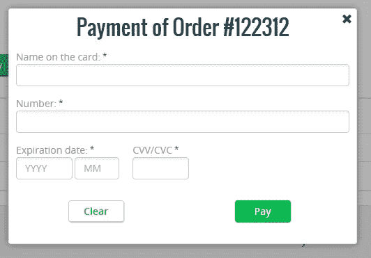

**图 1 —接近最终结果的东西。**

现在我们已经结束了我们的业务案例——瞥了一眼最终的表单——让我们继续讨论用于处理支付的 web 块的实现。

# 付款表格

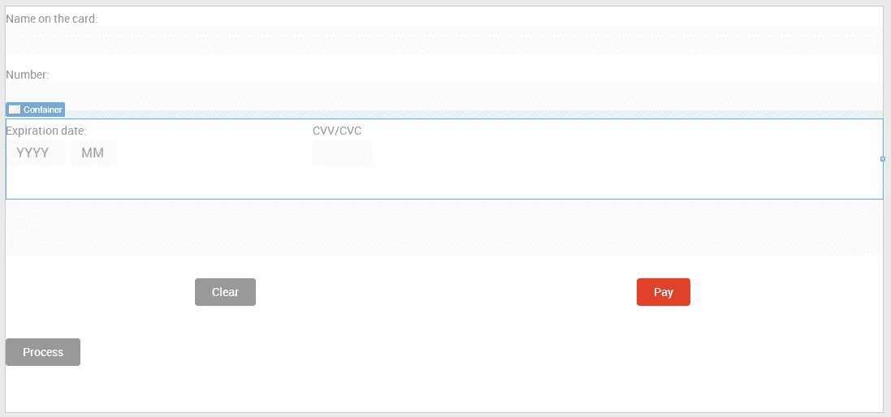

**图 2 —网络表单骨架**

如果你还记得，我们的移动插件有一个很棒的用户界面。这一次，与移动版本相反，我们使用 **London** 作为基本主题——这就是为什么我们的 web 块上没有“无色”按钮，如图 2 所示。我们这样做有几个原因，最相关的是正确绘制布局的能力。

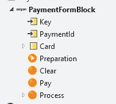

**图 3 —网络块签名。**

使用与之前相同的方法，我们使用平台提供的最简单/基本的元素来构建表单。通过使用这个，我们允许您通过应用一个样式表来定制表单上的任何内容。显而易见，您总是有机会打开该模块，并根据您的喜好或需要对其进行修改。与 web 块本身相关，我们有两个输入参数—客户端加密**密钥**和支付的标识符: **PaymentId** 。另外，我们有一个局部变量来存储表单输入数据。它拥有 web 块用户界面上的所有字段。

所以，如果可以的话，让我快速浏览一下所有的界面元素:我们有基本的字段，如姓名、卡号、有效期和 CVC/CVV 输入。我们还有两个“自解释”按钮和第三个按钮，名为**过程**。

在进入“什么，如何和为什么？”让我快速解释一下:看到图 2 中突出显示的容器了吗？在这个容器下面——如果您的屏幕允许您看到它，因为我的是一个真正的用户——您可以看到两个额外的输入字段。第一个用于生成支付尝试的当前时间戳，而第二个用于存储加密算法的输出。生成时间戳是一个至关重要的字段，因为加密算法需要它来成功工作，并且作为一种安全措施，确保您不能在用户输入详细信息后超过 24 小时处理支付。就我个人而言，我看不出有哪种商业案例会让你想要延迟付款的处理，但我们永远也不会知道。亲爱的读者，如果你想到这样的场景，请在评论中留下，这样我们也可以讨论它。

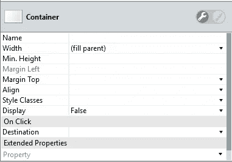

**图 4 —流程按钮容器。**

现在让我们进入**过程**按钮。正如您在图 2 中所看到的，Process 按钮在一个容器中，默认情况下，它通过被标记为 false 的 Display 属性隐藏起来——请看图 4。记住将 Display 属性设置为 false 只会增加“Display:none；”小部件的样式—它仍然在屏幕上呈现/可用。如果您想避免这种情况，请使用 If 小部件。

除了注释之外，我们这样做(隐藏的进程按钮)是因为我们想要“自动”触发与该按钮相关的屏幕动作的执行。我们将通过使用 JavaScript 来实现这个(触发器),但是现在，让我们仔细看看分配给这个按钮的屏幕动作。

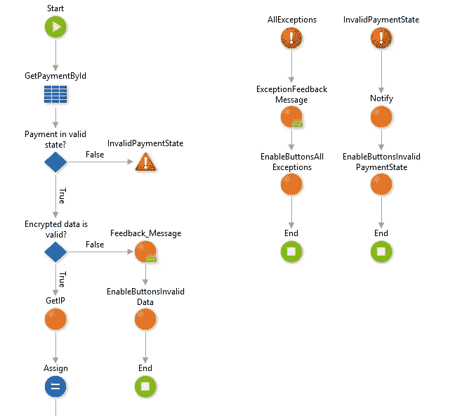

**图 5 —过程屏幕动作的初始流程。**

在图 5 中，您可以快速浏览一下我们在屏幕动作“开始”时正在做什么。与我们在移动端所做的类似，我们检索付款，然后检查两件不同的事情:

*   如果支付处于有效状态，即:已分期、已拒绝或服务不可用，以及
*   如果加密数据有效。

为了确认加密的数据是否有效，我们检查其中一个隐藏输入的内容——第二个，它与表单上的 *EncryptedData* 变量相关联。我们使用两个因素进行验证:它不为空——因为对于不成功的情况， *encryptData* 函数返回*false*——前十七(17)个字符匹配给定的字符串，即***adyenjs _ 0 _ 1 _ 20 _ 1 $***。在图 6 中，您可以看到我们应用的完整 IF 条件。

**快速提示:**这个库有一个较新的版本(0.1.21 ),但是，正如前一篇文章中所述，我们现在仍然使用 0.1.20。

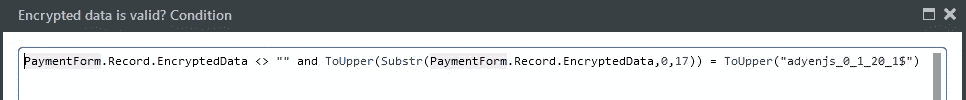

**图 6-全中频条件。**

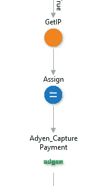

**图 7 —服务呼叫准备和调用。**

然后，在这个验证检查之后——假设一切都经过了正确的验证——我们获得用户的 IP 地址，将这些值赋给我们的 Adyen_CapturePayment 请求结构，然后……执行请求。而不是使用自定义(和原生！)插件来获取用户的 IP 地址，这次我们使用在 **HTTPRequestHandler** 扩展中可用的 **GetIP** 动作。这不是我们将在这个扩展中使用的唯一函数，因为正如您在图 5 和图 8 中看到的，所有这些*enable buttons<*>*动作都是 **RunJavaScript** 。我们这样做是为了在执行结束后再次启用按钮。但不仅如此，所以我们不要太超前了…

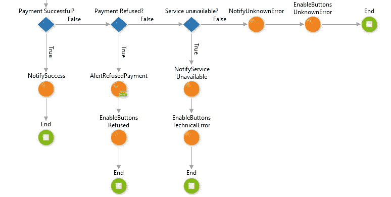

**图 8 —处理响应。**

在调用 **Adyen_CapturePayment** 动作时，我们处理给定的响应。这与移动插件的风格非常相似:我们检查**成功**或**技术错误**。在这些情况下，**我们通知父**块(或屏幕),这样我们可以获取所需的流。**如果付款被拒绝，我们只需提醒用户**，这样就可以修复/更改付款细节。

如果您回想一下图 2，您会看到除了 Process 按钮之外，我们还有两个不同的按钮。与每个 OutSystems 按钮一样，我们需要一个与之相关联的屏幕/导航动作。不幸的是，这并不符合我们的需求，因为**我们希望——也需要——在服务器级做任何事情之前加密客户端上的数据**。因此，问题仍然是:我们如何使用默认的 OutSystems 按钮，并仍然实现这一点？

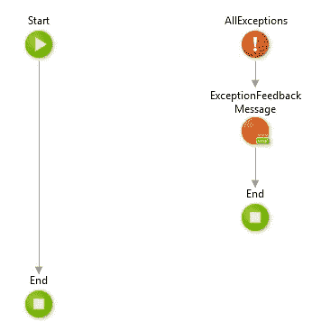

**图 8——你见过的最复杂的屏幕动作。就像，永远！**

**第一步**:定义空屏动作。Pay 和 Clear 屏幕操作看起来与图 8 完全一样。这可能是你一生中见过的最复杂的屏幕动作。玩笑归玩笑，我们定义这个[是为了发布我们的代码](https://www.explainxkcd.com/wiki/index.php/303:_Compiling)和[去摆弄椅子和灭火器](https://www.youtube.com/watch?v=x-yGSIYkeOs)。

**第二步**:定义 JavaScript 函数。我们将在 web 块中定义两个 JavaScript 函数，这样我们就可以在按钮中使用它们。关于这些函数，请参见下面的要点。

我不是 JavaScript 专家，所以，如果你发现一些可以优化的地方，请告诉我，以便我可以应用新版本。

第一个函数(ClearData)是我们将在 Clear 按钮上使用的函数。它只是获取表单中的所有输入，并清除它们的值。简单。

第二个函数(EncryptData)稍微复杂一点。总的来说，我们做的事情和我们的手机版完全一样——不同的是，在这里，我们必须用一个“简单的”JavaScript 函数做所有的事情。

我们从禁用按钮开始，这样我们就*防止*用户篡改数据或进行重复请求——这样他就知道后端有东西在运行。然后，我们生成我们的生成时间——打算冗余——并创建我们的加密实例。我们填充 *creditData* 结构，并将其传递给验证器。如果有效，我们调用 encrypt 函数，并通过将函数的输出指定为输入值来使用它。如果没有，我们遍历所有属性，将适用的属性标记为无效。最后，我们再次启用按钮。简单吧？

一个可能的后续问题是:您在哪里加载带有 **adyen.encrypt** 函数定义的 JavaScript 文件？

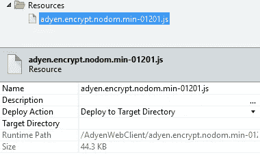

**图 10 —导入的 JavaScript 资源。**

我们做的第一件事是导入资源文件，然后将部署操作标记为 Deploy to Target Directory。然后，您需要复制运行时路径变量的内容。

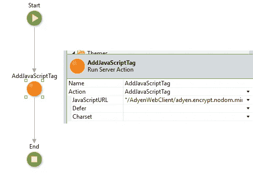

**图 11-网块准备。**

一旦有了这个运行时路径，我们就开始准备包含我们的表单的 web 块，并且我们使用一个不同的动作呈现在 **HTTPRequestHandler** 扩展上: **AddJavaScriptTag** 。出于这个目的，普通的 **HTTPRequestHandler** 扩展可以完成任务——不需要使用缓冲版本。我们将在另一篇文章中讨论这个 Buffed 版本。

接下来，我们只需将之前复制的运行时路径粘贴到 JavaScriptURL 输入参数中，然后 *et voilà* ，就这样。这听起来可能比实际情况更可怕。

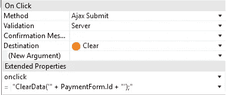

**图 12 —清除按钮 onclick。**

好了，现在是我们进入最后一章付款方式的时候了。我们如何调用 JavaScript 函数？另一个简单的解释。在每个按钮上，**我们为 onclick** 定义了一个扩展属性。对于 Clear 按钮，我们使用 **ClearData** 函数，而对于 Pay 按钮，我们将使用 **EncryptData** 函数——如图 13 所示。

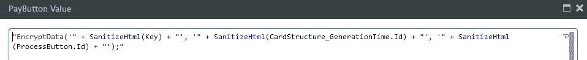

**图 13 —支付按钮 onclick。**

在继续讨论这个问题之前，我想强调两点:

看到函数调用末尾的分号了吗？那个。是。危急关头。为什么？因为 OutSystems 将一组 JavaScript 函数绑定到了 **onclick** 属性，因此，我们在扩展属性中定义的是首先执行的内容。因此，呈现的代码将类似于图 14。

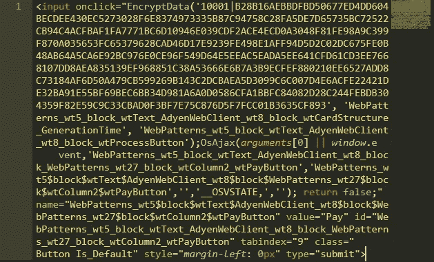

**图 14——支付按钮的生成代码。如果想知道，这是崇高的文本。**

如果您没有显式地声明分号，它将抛出一个 JavaScript 错误——我们根本不希望这样。因此，如果您正在为您的 OutSystems onclick 扩展属性添加像 JavaScript 函数这样酷的东西，不要忘记分号！

第二个评论是，我在使用手动生成的按钮时遇到了很多麻烦。当我说“手动生成的按钮”时，大概是这样的:

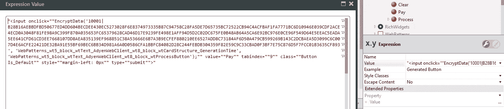

图 15 —手动生成的按钮。

每当我试图使用这样的东西时，我都会得到如图 16 所示的结果。95%的情况下都会这样。在另外的 5%中，我通常打开 JavaScript 调试器，很少情况下，一切都按预期运行。

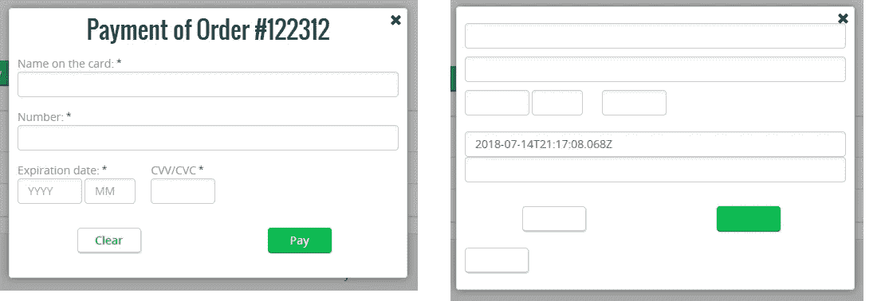

**图 16——使用手动生成按钮时的之前和之后。**

所以，这个故事的寓意:**不要使用手动生成的按钮。你可以以后再感谢我。如果，出于任何原因，你知道为什么会发生这种情况…也请告诉我！**

这就是 web 表单部分。现在，我们有一个完全可用的 web 表单，带有客户端加密功能，可供您与现有项目集成。

# 控制面板

对于控制面板部分，我将更多地关注功能部分，而不是技术方面。当然，当更多的技术细节被建议时，我会做一些评论。

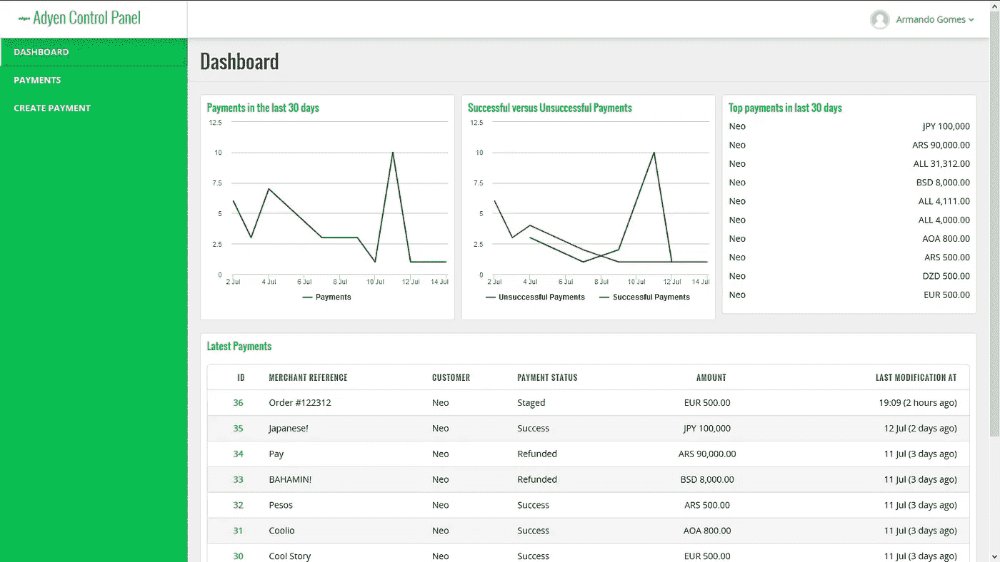

**图 17 —仪表板**

在图 17 中，您可以看到控制面板的仪表板。从上到下，从左到右:

*   第一张图显示了过去 30 天的付款次数。考虑所有付款状态，包括分期付款。
*   第二张图显示了过去 30 天内成功付款(绿色)和不成功付款(红色)的数量。这只考虑前者的成功/退款和后者的拒绝。
*   然后，第一行的最后一张卡有最近 30 天的最高支付额。这不考虑汇率。也许在下一篇文章中？*眨眨眼*
*   最后但同样重要的是，我们有一个包含十(10)笔最新付款的表格，这也包括分期付款。这里需要注意:在您的开发/UAT 环境中拥有高质量的种子数据是至关重要的。因此，拥有像“酷故事”或“库里奥”这样的东西是一个巨大的禁忌。你知道那句谚语:做我说的，不要做我做的。

现在，只是好奇。如果您阅读了与此主题相关的第一篇文章，并且还记得货币实体中的 Multiplier 属性，您可能会注意到并非所有的货币都有相同的小数位数，即使我们使用了相同的内置函数:FormatCurrency。

如何才能实现这一点？通过数学的神奇力量！

引用前一篇文章:

> 在货币实体上，有一个属性叫做**乘数**。该属性存储的值是 10 的幂。

那么，十(10)的幂的倒数是多少呢？没错，以 10 为底的对数——或者普通对数。

首先，我很惊讶对数函数不是默认内置函数的一部分。我有这个想法，但由于我从未使用过它，我希望它能存在。也许这就是它不作为已建物存在的原因？大概吧。

但这就是 Integration Studio 的用途。于是我很快从[系统中获取了几组功能。数学库(C#。NET)](https://msdn.microsoft.com/en-us/library/system.math.log(v=vs.110).aspx) 和[将它们实现为扩展](https://www.outsystems.com/forge/component/4035/logarithm)。完成这项工作大约需要 15 分钟。最新版本(1.0.1)支持这两种堆栈。

因此，使用内置的 **FormatCurrency** 和我们全新的对数函数，我们获得了想要的结果。图 18 显示了完整的功能。

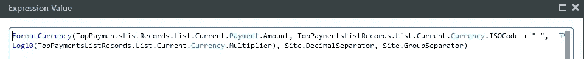

**图 18 —格式货币功能的使用。**

然后，查看左侧菜单上的选项，我们看到了付款屏幕(图 19)和创建付款屏幕(图 20)。

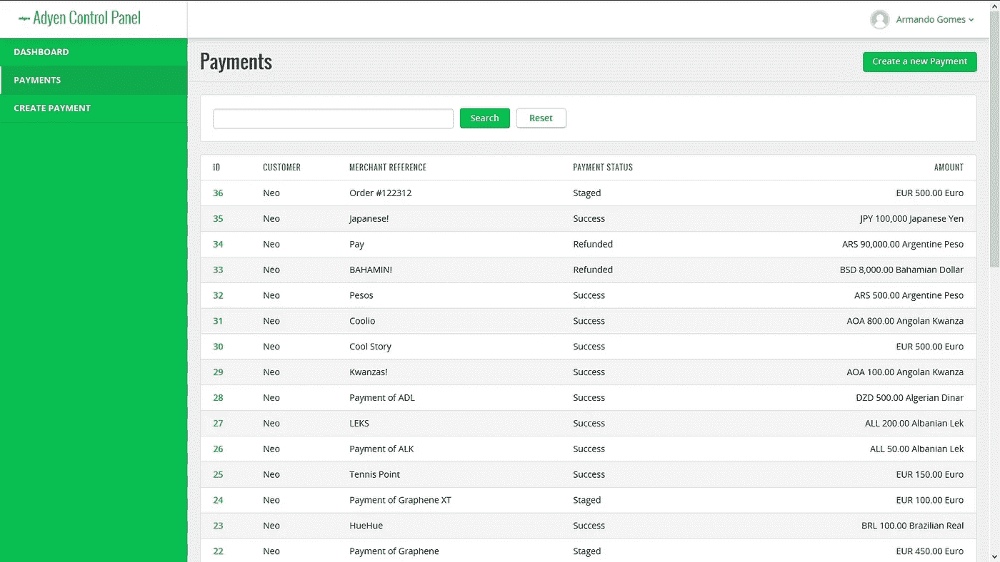

**图 19-支付列表屏幕。**

支付屏幕是一个非常基本的屏幕，与常规的脚手架几乎没有什么区别。只是一个或另一个附加字段，仅此而已。

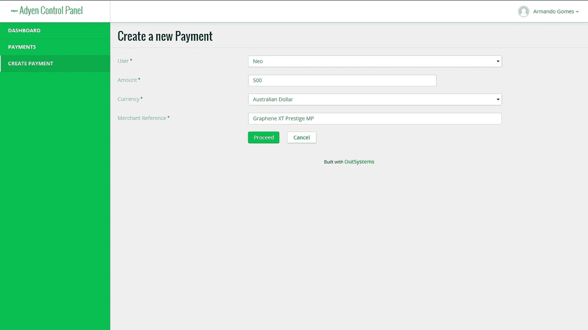

**图 20 —新支付屏幕**

在创建付款屏幕上，我们要求用户指定谁是负责付款的用户，或者换句话说，该付款应该绑定到哪个用户，金额，货币，最后是将显示在对帐单上的参考。在这个屏幕上，更准确地说是在“继续”按钮上，我们没有任何特殊的验证—只是在基本的搭建上生成了什么。如果你需要更健壮的东西，就去做吧。

*(是的，石墨烯 XT Prestige MP 是我的网球拍……有人想玩游戏吗？)*

接着，我们看到了图 21 中的屏幕。在这个屏幕中，我们有要支付的金额、客户、证明人和历史记录。作为新创建的付款，我们没有任何历史可展示。

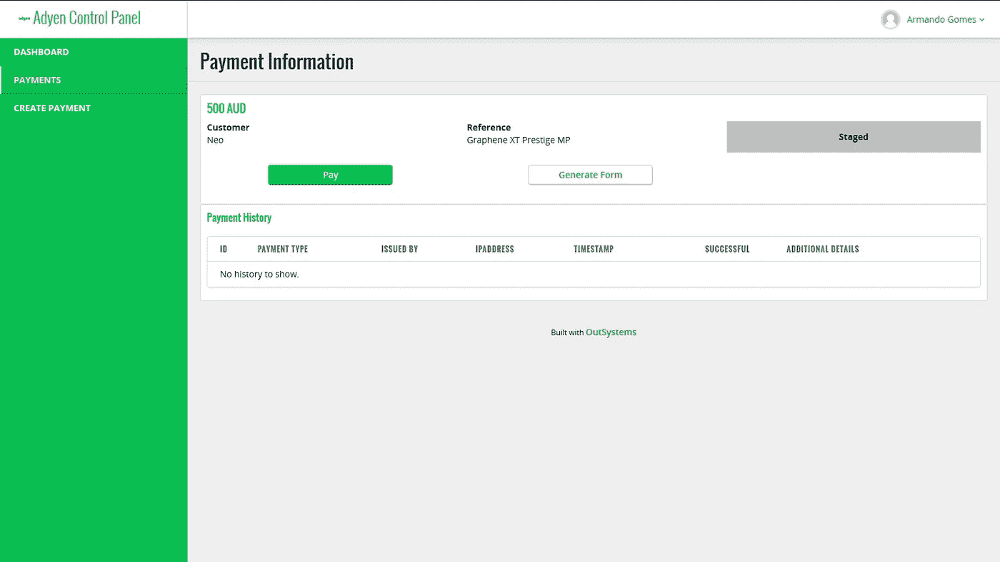

**图 21 —付款详情屏幕。**

在创建支付时，我们有一个当前状态的可视指示器——在右上角，Staged——和两个可能的操作:支付和生成表单。事实上，我们有三种行为，但是，正如你可能已经猜到的，有些行为只适用于给定的状态。

单击 Pay 按钮，我们会看到一个弹出窗口，其中有一个输入信用卡凭证的表单——如图 22 所示。

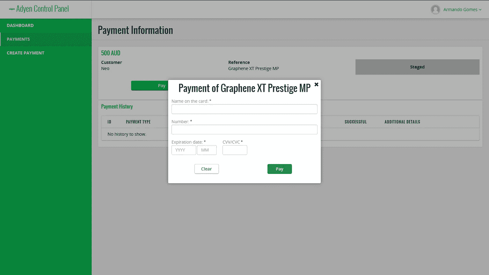

**图 22——支付选项。**

如果您不想对与客户信用卡相关的任何数据负责，您可以随时选择生成表单选项。单击“生成表格”按钮后，将会发出一份一次性表格，并通过电子邮件向您的客户发送一个链接。亲爱的读者们，这就是技术问题回来了。

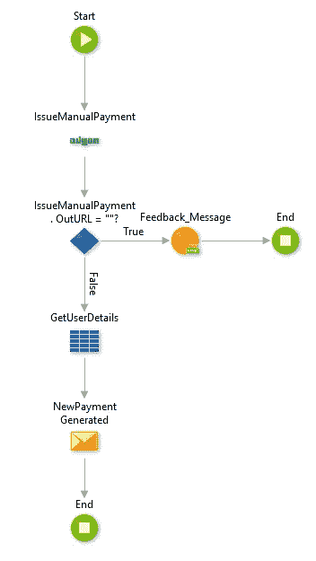

**图 23 —生成表单屏幕动作。**

当您单击“生成表单”按钮时，我们将调用图 23 所示的屏幕操作。我们调用 Issue Manual Payment 服务器操作——存在于 **Adyen 核心服务**模块中——如果一切按计划进行，我们将有一个 **Out** put **URL** ,可以在我们新创建的电子邮件模板中使用。

然后，我们检索用户详细信息——特别是用户的电子邮件地址——并使用模板调用发送电子邮件操作。这个调用的属性可以在图 24 中看到。

在图 25 中，我们可以看到我们为此使用的电子邮件模板。这是一个非常简单的电子邮件模板。

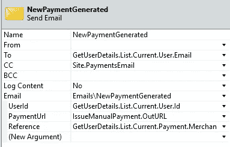

**图 24 —发送电子邮件参数。**

我只想强调一下“抄送”字段。如果仔细观察，您会发现我们正在使用一个站点属性来填充这个值。这是我们必须*确保*用户收到预期电子邮件的一种方式。退款和付款也是如此。

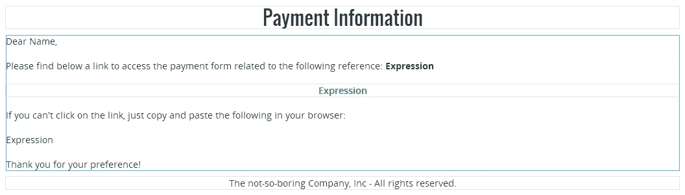

**图 25 —电子邮件模板。**

上面我们看到的是在 **IssueManualPayment** 服务器动作“外部”发生的事情——或者换句话说，在我们的控制面板中发生的事情。但是在 **IssueManualPayment** 动作里面发生了什么呢？

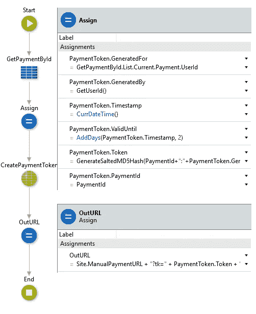

**图 26 —创建手动支付。**

在图 26 中，您可以看到我们的 **IssueManualPayment** 操作。我们创建了一个有效期为两天的支付记录，此外，我们还生成了一个令牌。我们通过使用一个名为**generatesaltedmd5 hash**(**PlatformPasswordUtils**扩展)的函数来实现这个功能，并使用一个组合字符串作为输入。 [**尽管我们知道 MD5 不再是一种安全的散列算法**](https://en.wikipedia.org/wiki/MD5#Overview_of_security_issues) ，但它适合我们正在做的事情，并且很明显，如果需要增加安全性，您可以随时改进它。

然后，在生成令牌时，我们生成带有站点属性(应该是类似 https://www.example.com/的东西)和两个输入参数的 OutURL 参数，即:

*   **tk** 用于支付令牌，以及
*   付款标识符的 **pid**

了解了这一点，我们就可以安全地重新生成令牌字符串，以确保请求的完整性。

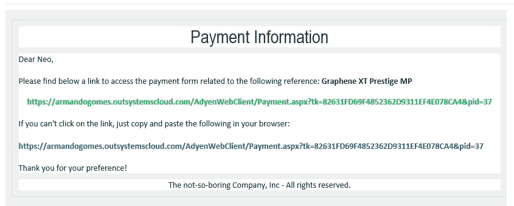

**图 27 —用于手动生成付款的示例电子邮件。**

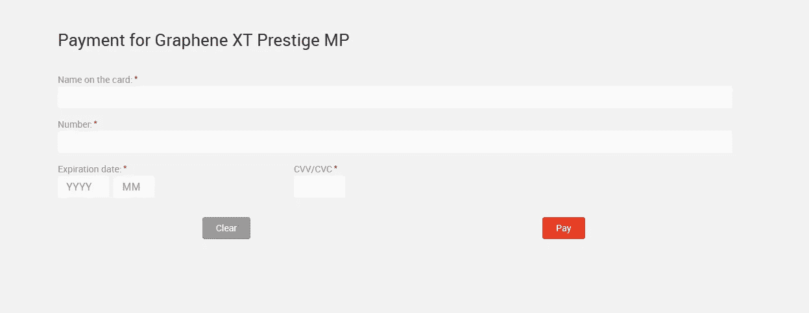

**图 28 —一次性付款表格样本。注意:这不在模块中捆绑。**

支付成功后，您将在我们的控制面板上看到以下内容:

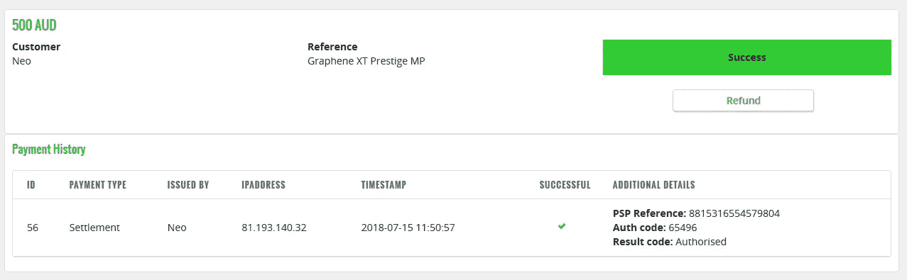

**图 29 —成功支付**

在上面的图 29 中，我们可以看到一次成功的支付。我们有历史条目，有 PSP 参考，授权码和结果码。结果代码的特殊说明:在上一篇文章中，我没有将这个值存储在我们的 **PaymentAttempt** 实体中。我现在正在存储它，如果您想使用本文中描述的模块，您必须更新您的 Adyen 核心模块。

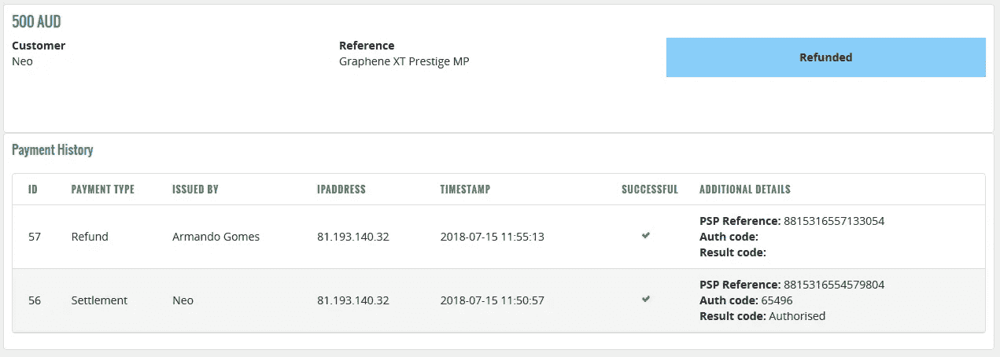

**图 30 —成功退款。**

在图 30 中，我们有同一笔付款的历史记录，但这次是退款。如你所见，退款既没有授权也没有结果代码。

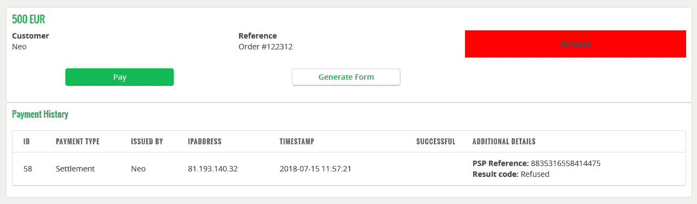

**图 31 —拒绝付款**

最后但同样重要的是，在图 31 中，我们可以看到拒绝付款的场景。如前所述，我们仍然有 PSP 参考和结果代码。

这就是本文的全部内容。亲爱的读者，我要感谢你，感谢你为此付出的努力。我还要感谢所有分享和评论这篇文章的人。接收真的很好！

在下一篇文章中，我们将讨论与 **Fixer.io** 的集成，这是一个用于当前和历史外汇(forex)汇率的简单轻量级 API。不过，这有一个警告:它只是部分“免费”。幸运的是，我们想要实现的内容包含在免费层中，所以…我们很好。

和往常一样，请在下面留言或通过 [hello@armandogom.es](mailto:hello@armandogom.es) 留言。你也可以在 [Twitter](https://www.twitter.com/portuguesecoder) 、 [LinkedIn](https://www.linkedin.com/in/armandogomes) 、 [OutSystems Community](https://www.outsystems.com/profile/56884/) 或者我的网站 [https://armandogom.es](https://armandogom.es) 上找到我，尽管在撰写本文时还没有准备好。

保重，下次见！

## 相关链接

**AdyenCore 组件(更新):**[https://www.outsystems.com/forge/Component_Overview.aspx?ProjectId=4015](https://www.outsystems.com/forge/Component_Overview.aspx?ProjectId=4015)

**Adyen 网络客户端:**[https://www.outsystems.com/forge/Component_Overview.aspx?ProjectId=4050](https://www.outsystems.com/forge/Component_Overview.aspx?ProjectId=4050)

**艾德安控制面板:【https://www.outsystems.com/forge/Component_Overview.aspx?】T22**ProjectId=4051