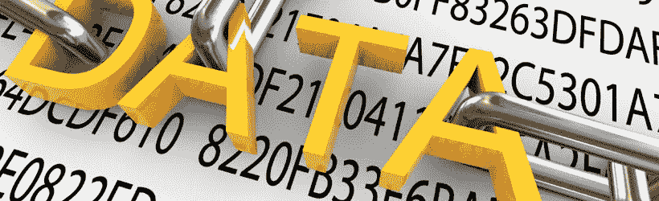

# 转换软件文件(第二部分:ins 和 outs)

> 原文：<https://itnext.io/dossier-ransomware-deel-ii-de-ins-en-outs-9ea6e5b7cf6d?source=collection_archive---------5----------------------->

转换软件是目前增长最快的网络安全威胁。在*系列中【换能器文件】我描述了所有的面，从产生到未来的发展。请参阅第一部分“T2”和“T3”。在第二部分，也是最后一部分，我将描述变形金刚的内容。谁干的？那我们该怎么办？*

## 他们用什么技术？

转发器是基于加密技术的。黑客不会自行加密算法，而是利用现有的操作系统功能(如 microsoft cryptograpic api)。通过可执行文件(. EXE 或. SCR)、Visual Basic 和 Java 脚本(. VBS 或. JS)或 MS Office 文件中的 malify 宏进行分发。

## 什么组织？

袭击主要来自乌克兰、俄罗斯、中国和伊朗。它的起源通常是由转换代码中的一个例行程序引起的。此例行程序会检查程式码是否是从其中一个国家/地区启动。如果发生这种情况，将自动卸载转换器。

网络犯罪世界是一个黑暗的世界只有少数组织知道代号和代号：

*   *第三指数集团*，一个来自俄罗斯的网络犯罪组织。
*   *编码集团*，是一个中国犯罪组织，在美国策划了大量的走私袭击。
*   *邪恶集团*，摩尔多瓦的一个反垄断组织。

## 加密:机会还是威胁？

如前所述，加密可确保转换软件的可行性。具有讽刺意味的是，同样的加密也用于确保数据的完整性和机密性。以[第一部分](https://www.linkit.nl/knowledge-base/239/Dossier_Ransomware_Deel_I_Een_introductie)中的锁为例，开发锁当然是疯狂的，因为它们也可以用来对付我们。同样，为了进一步发展加密算法，我们也有机会保持隐私。

## 付赎金还是不付？

政府和工业界都强烈建议永远不要支付赎金。但是，付款并不能保证黑客会实际发送密钥；在 80%的情况下，付款后不会发送解密密钥。此外，在付款后，还存在进一步增加赎金的风险。

## 10 防止和/或减轻影响的公司提示

企业可以采取多种措施来降低其风险和影响。以下是主要建议:

*   **使员工有意识**【通过教育使员工了解反转录病毒及其传播方式。
*   **执行(自动)备份** 重要的是执行 3-2-1 行。三个副本，在两个不同的存储介质上，其中一个副本存储在异地。请确保每天至少备份一次数据，并对其进行加密。目前的备份通常是唯一可修复变压器损坏的备份。
*   **将补丁程序带到** 安装软件供应商推荐的安全补丁程序。这些软件更新可及时解决漏洞。
*   **维护安全策略**制定一种[分层的安全方法](https://www.linkit.nl/knowledge-base/203/IT_security_volgens_de_gelaagdheid_van_een_ui)并执行这些方法来缓解攻击。
*   **帐户和权限管理** 只有在严格要求具有所有权限的帐户管理员时才使用。此外，请使用 t17 最低权限 t18 存取权限原则。
*   **配置系统**
*   默认情况下，禁用通过电子邮件发送的 MS Office 文件的宏。
*   将 Windows 设定为显示副档名。
*   在工作站和服务器上禁用“t21”【RDP】t22(如果未使用)。
*   通过邮件网关. EXE 文件过滤。
*   **分割网络** 不要将所有或重要数据放置在许多员工都可以访问的网络共享上。
*   **提供一个剧本** 设置一个剧本，其中记录了如何(谁、什么、在哪里、如何、在技术上和通信上)应对一次转发器攻击。
*   **提供最新的**[**CMDB** **确保所有 it 基础架构组件都是映像和管理的**](https://en.wikipedia.org/wiki/Configuration_management_database)
*   **使用 IT 安全软件** 特定(端点)监控软件可以识别或阻止早期攻击(请参阅前面的“行业和政府在做什么？”)。

## 万一被变压器击中怎么办？

如果僵尸来袭阻止病毒的进一步传播是非常重要的：

1.  通知用户。
2.  尽快从网络和(WIFI)互联网上断开受感染的计算机的连接。
3.  关闭共享网络驱动器。
4.  尽快查出病毒的来源。如果是特定使用者，请与他们交谈，尽可能多了解感染情况。
5.  收集尽可能多的证据。保护日志并雇用外部取证人员。
6.  向有关当局、警方及(如有需要)当局提供个人资料([举报资料外泄](https://autoriteitpersoonsgegevens.nl/nl/onderwerpen/beveiliging/meldplicht-datalekken)。
7.  尽可能通过[防恶意软件](http://www.antimalwaresoftware.nl/)清除感染。
8.  确定变压器已移除，因此请确定所有可疑电子邮件已移除或隔离。
9.  透过备份还原资料。
10.  重新启动系统。

一些资源建议将受感染服务器的 BIOS 时钟重置为正常运行时间，因为通常与赎金相关。赎金花的时间越长赎金就越高。此处的签名是调整 BIOS 时钟使[鉴证和证据负载无法使用。](https://www.linkit.nl/knowledge-base/131/De_uitdagingen_van_digitaal_forensisch_onderzoek)

## 行业和政府是做什么的？

通过证券行业和政府的积极行动来解决这个问题。这些都是商业和公私两方面的解决方案。大多数商业解决方案都是基于监控的预防性解决方案，包括:

*   [Symantec 反转印解决方案](https://support.symantec.com/en_US/article.HOWTO124710.html)
*   【T8 例反转换药】T9 例
*   [垃圾拦截 X](https://www.sophos.com/en-us/products/intercept-x.aspx)
*   [IBMq 雷达安全智能平台](http://www-03.ibm.com/software/products/nl/qradar)

最引人注目的公私合作伙伴关系之一是荷兰警方的高科技犯罪部门、欧洲网络犯罪中心、卡巴斯基实验室和英特尔安全部门。这种合作的具体结果是建立了[nomenormoransm . org](https://www.nomoreransom.org/)网站。下载一些协作工具，以恢复传输加密。

## 未来的发展是什么？

不幸的是，随着攻击公共基础设施(如[公共交通工具](http://arstechnica.com/security/2016/11/san-francisco-muni-hit-by-black-friday-ransomware-attack/)，学校和医院的趋势继续发展，转发器攻击变得更为复杂。未来的一些发展包括:

*   [密码形式](https://threatpost.com/meet-the-cryptoworm-the-future-of-ransomware/117330/)，这种变换形式在不经用户干预的情况下迅速传播。
*   [Jackware](http://www.welivesecurity.com/2016/07/20/jackware-connected-cars-meet-ransomware/) 中，黑进汽车软件要求赎金。
*   [ransac](http://www.scmagazineuk.com/new-ransomware-variant-extorts-your-reputation-rather-than-money/article/572988/)，这是一种在受害者的系统上寻找妥协材料(例如非法色情内容)的转译品。之后，我们需要勒索赎金来记录受害者的名声。这种情况很少发生。