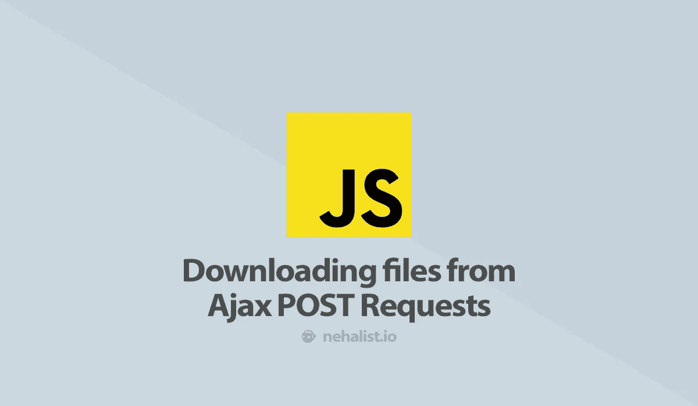

# 从 Ajax POST 请求下载文件

> 原文：<https://itnext.io/downloading-files-from-ajax-post-requests-26babc7661d4?source=collection_archive---------1----------------------->



偶尔，我偶然发现需要从 POST 请求中下载文件。一个例子是生成 PDF 文件，其中 PDF 内容依赖于请求。有趣的是，这并不像你想象的那么简单，但也并不难。

# 简单的服务器

我们将实现一个*非常简单的*服务器，它从 POST 请求生成 pdf:

```
require_once 'vendor/autoload.php';if($_SERVER['REQUEST_METHOD'] === 'POST') {
    header('Content-type: application/pdf');
    http_response_code(200);// Contents
    $pdfContent = !empty($_POST['content']) ? $_POST['content'] : 'no content specified';

    // Generate the PDOF
    $pdf = new FPDF();
    $pdf->AddPage();
    $pdf->SetFont('Arial','B',16);
    $pdf->Cell(40,10, $pdfContent);

    return $pdf->Output(null, 'foobar-' . time() . '.pdf');
}// Bad method
http_response_code(405);
exit();
```

*注意*:这段代码使用 [FPDF](https://github.com/Setasign/FPDF) 库来生成 PDF 文件。出于演示目的，pdf 中填充了来自`$_POST['content']`的内容。

FPDF 自动负责将[内容处理](https://developer.mozilla.org/en-US/docs/Web/HTTP/Headers/Content-Disposition)设置为`attachment`。如果您不使用 FPDF，需要手动设置，只需在输出前添加以下内容:

```
header('Content-Disposition: attachment; filename="filename.ext"');
```

# 下载文件

更有趣的是，在发送 HTTP 请求后，文件是如何下载的。让我们直入主题:

```
<!doctype html>
<html>
<head>
  <meta charset="utf-8">
  <title>Download POST Request</title>
</head>
<body>
Enter a text and click the button: <input type="text" id="content" value="Text for the generated pdf">
<button id="download">Send AJAX Request and download file</button><script>
  document.getElementById('download').addEventListener('click', function () {
    var content = document.getElementById('content').value;
    var request = new XMLHttpRequest();
    request.open('POST', '../server/', true);
    request.setRequestHeader('Content-Type', 'application/x-www-form-urlencoded; charset=UTF-8');
    request.responseType = 'blob';request.onload = function() {
      // Only handle status code 200
      if(request.status === 200) {
        // Try to find out the filename from the content disposition `filename` value
        var disposition = request.getResponseHeader('content-disposition');
        var matches = /"([^"]*)"/.exec(disposition);
        var filename = (matches != null && matches[1] ? matches[1] : 'file.pdf');// The actual download
        var blob = new Blob([request.response], { type: 'application/pdf' });
        var link = document.createElement('a');
        link.href = window.URL.createObjectURL(blob);
        link.download = filename;document.body.appendChild(link);link.click();document.body.removeChild(link);
      }

      // some error handling should be done here...
    };request.send('content=' + content);
  });
</script>
</body>
</html>
```

*深呼吸…*

实际的下载是通过创建一个对象来完成的，该对象用于一个新创建的`a`标签，该标签带有一个到所创建的`Blob`对象的链接，该链接被自动点击，最终打开“保存文件”对话框。此外，它被附加到`body`(这是对 Firefox 的一个修复)之后从主体中移除(我们不希望我们的主体上有大量不可见的`a`标签)。

嗯，*和 divs* 中的内容垂直居中一样简单！( *Flexbox 作弊！*)

请记住，这个实现使用普通的 JavaScript(使每个人都更容易理解这个例子)，但是实际的下载对于大多数框架(jQuery、Vue、Angular 等等)都是一样的。

当然，你可以在 GitHub 上找到完整的实现。

如果你喜欢这篇文章，请留下👏，关注我上 [*推特*](https://twitter.com/nehalist) *并订阅* [*我的快讯*](https://nehalist.io/newsletter/) *。原载于 2018 年 1 月 13 日*[*https://nehalist . io*](https://nehalist.io/downloading-files-from-post-requests/)*。*