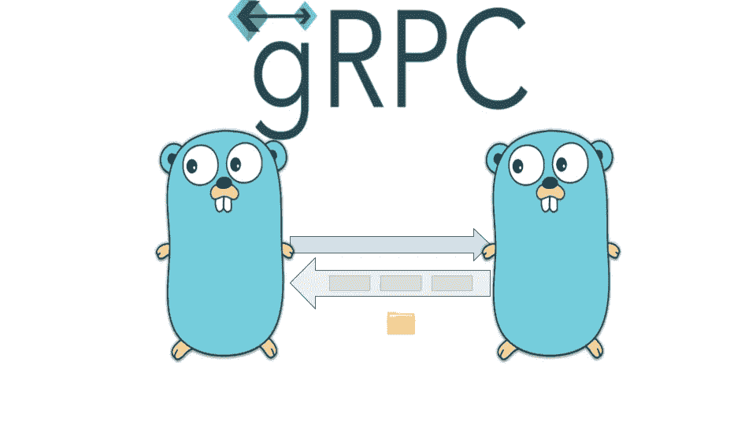

# 使用 Golang/gRPC 下载文件

> 原文：<https://itnext.io/downloading-files-using-golang-grpc-f07e4a16a536?source=collection_archive---------1----------------------->

有时我们需要从一些存储器下载文件。文件有一些元数据，如名称、大小和扩展名(可能我们需要更多的元数据，但让我们保持简单)，文件也应该实现 ***io。阅读器*的**接口用于获取该内容的字节数。



因此，文件结构可能如下所示:

```
package file

import (
   "io"
)

func NewFile(name string, extension string, size int, r io.Reader) *File {
   return &File{Name: name, Extension: extension, Size: size, r: r}
}

type File struct {
   r         io.Reader
   Name      string
   Extension string
   Size      int
}

func (f *File) Read(p []byte) (n int, err error) {
   return f.r.Read(p)
}
```

我想使用 Golang/gRPC 实现将这个结构从服务器发送到客户端。

# gRPC API

在开始实现服务器和客户端之前，我们需要有 API。我们的 API 非常简单:

```
syntax = 'proto3';

package api.v1;

option go_package = "github.com/andrey-berenda/go-filestorage/generated/v1;api";

service FileService {
  rpc Download(DownloadRequest) returns(stream DownloadResponse);
}

message DownloadRequest{
  string id = 1;
}

message DownloadResponse{
  bytes chunk = 1;
}
```

正如我们在 API 中看到的，没有文件元数据:元数据将在头中，因为我们只需要发送一次，头是实现这个目标的最佳候选。

因此，我们需要在我们的结构中有来自元数据的 ***Metadata()*** 方法和构造函数:

```
package file

import (
   "io"
   "strconv"

   "google.golang.org/grpc/metadata"
)

var fileNameHeader = "file-name"
var fileTypeHeader = "file-type"
var fileSizeHeader = "file-size"

func (f *File) Metadata() metadata.MD {
   return metadata.New(map[string]string{
      fileNameHeader: f.Name,
      fileTypeHeader: f.Extension,
      fileSizeHeader: strconv.Itoa(f.Size),
   })
}

func NewFromMetadata(md metadata.MD, r io.Reader) *File {
   var name, fileType string
   var size int

   if names := md.Get(fileNameHeader); len(names) > 0 {
      name = names[0]
   }
   if types := md.Get(fileTypeHeader); len(types) > 0 {
      fileType = types[0]
   }
   if sizes := md.Get(fileSizeHeader); len(sizes) > 0 {
      size, _ = strconv.Atoi(sizes[0])
   }

   return &File{Name: name, Extension: fileType, Size: size, r: r}
}
```

# 服务器实现

服务器的界面如下所示:

```
type FileServiceServer interface {
   Download(req *pb.DownloadRequest, server pb.FileService_DownloadServer) error
}
```

首先，我们需要检查客户端是否发送了文件 id:

```
if req.GetId() == "" {
   return status.Error(codes.*InvalidArgument*, "id is required")
}
```

然后我们从一些存储器中获取文件:

```
f, ok := getFile(req.Id)
if !ok {
   return status.Error(codes.*NotFound*, "file is not found")
}
```

在我的例子中，存储非常简单，所有内容都保存在内存中(只有一个名为“gopher”的文件):

```
//***go:embed*** static/gopher.png
var gopher []byte

func getFile(fileID string) (*file.File, bool) {
   if fileID != "gopher" {
      return nil, false
   }
   return file.NewFile("gopher", "png", len(gopher), bytes.NewReader(gopher)), true
}
```

得到文件后，我们发送文件头:

```
err := server.SendHeader(f.Metadata())
if err != nil {
   return status.Error(codes.*Internal*, "error during sending header")
}
```

并发送内容:

```
 const *chunkSize* = 1024 * 3
   chunk := &pb.DownloadResponse{Chunk: make([]byte, chunkSize)}
   var n intLoop:
   for {
      n, err = f.Read(chunk.Chunk)
      switch err {
      case nil:
      case io.EOF:
         break Loop
      default:
         return status.Errorf(codes.*Internal*, "io.ReadAll: %v", err)
      }
      chunk.Chunk = chunk.Chunk[:n]
      serverErr := server.Send(chunk)
      if serverErr != nil {
         return status.Errorf(codes.*Internal*, "server.Send: %v", serverErr)
      }
   }
   return nil
```

服务器已实现。块大小不是很大，我认为我们可以将其增加到 1MB 或类似的大小，但保持块大小是 3 的倍数(我将在后面解释为什么这很重要)。

服务器的所有代码是

# 客户端实现

我想实现客户端的方法:

```
type Client struct {
   client pb.FileServiceClient
} func (c Client) GetFile(ctx context.Context, fileID string)(*file.File, error)
```

为此，我们需要向服务器发出 gRPC 请求:

```
response, err := c.client.Download(
   ctx,
   &pb.DownloadRequest{Id: fileID},
)
if err != nil {
   return nil, fmt.Errorf("client.LoadFile: %w", err)
}
```

之后，我们需要从上下文中获取标题:

```
md, err := response.Header()
if err != nil {
   return nil, fmt.Errorf("response.Header: %w", err)
}
```

并最终创建 ***io。管道*** 并将所有内容从响应复制到 ****io。管道工* :**

```
r, w := io.Pipe()
f := file.NewFromMetadata(md, r)
go copyFromResponse(w, response)
return f, nil
```

复制的实现在这里:

```
func copyFromResponse(w *io.PipeWriter, res pb.FileService_DownloadClient) {
   message := new(pb.DownloadResponse)
   var err error
   for {
      err = res.RecvMsg(message)
      if err == io.EOF {
         _ = w.Close()
         break
      }
      if err != nil {
         _ = w.CloseWithError(err)
         break
      }
      if len(message.GetChunk()) > 0 {
         _, err = w.Write(message.Chunk)
         if err != nil {
            _ = res.CloseSend()
            break
         }
      }
      message.Chunk = message.Chunk[:0]
   }
}
```

客户端已实现。这是客户端的所有代码:

# 奖金

当您使用简单的 HTTP 发送文件时，有一个优点:您可以只使用 bash 通过 id 获取文件，而不用用 Golang 编写任何代码。当我们将 gRPC 与 streams 一起使用时，有什么方法可以做到吗？

答案是肯定的。要做到这一点，我们需要有[***grpcurl***](https://github.com/fullstorydev/grpcurl)， [***jq***](https://stedolan.github.io/jq/download/) ， [***tr***](https://linuxhint.com/bash_tr_command/) ，[***base64***](https://linuxhint.com/bash_base64_encode_decode/)。如果服务器是在***localhost:8000***上服务的，你可以使用这个命令获得你的“gopher ”:

```
grpcurl -plaintext -d '{"id":"gopher"}' localhost:8000 api.v1.FileService.Download  | jq .chunk | tr -d '"\n' | base64 -d > gopher.png
```

只有当每个块字节数是 3 的倍数时，该命令才能正确工作。如果块大小不是 3 的倍数，我们将在使用 ***base64*** 从字符串解码为字节的过程中出错。

# 最后的想法

在本文中，我介绍了如何使用 Golang/gRPC 将“文件”(参见本文开头的结构)从服务器发送到客户机。你可以在我的 [github 库](https://github.com/andrey-berenda/go-filestorage)找到所有代码。