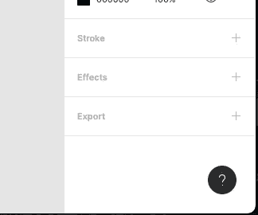
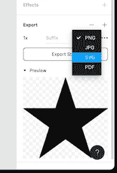
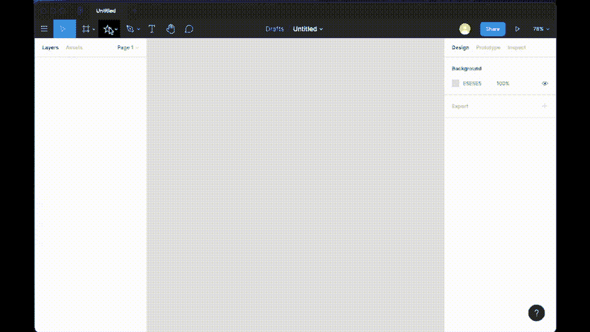
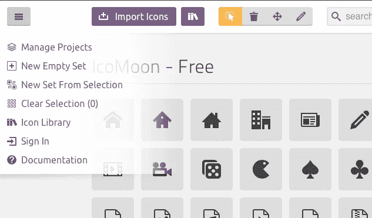
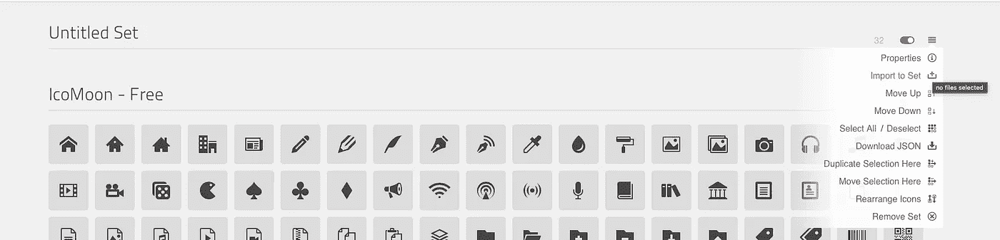
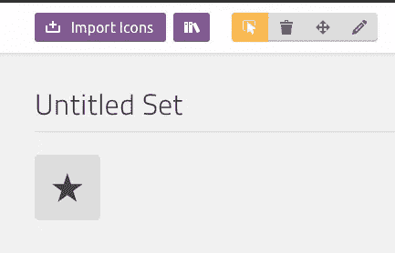
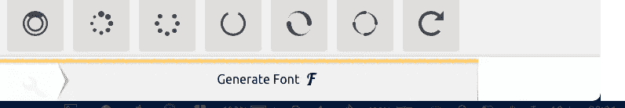
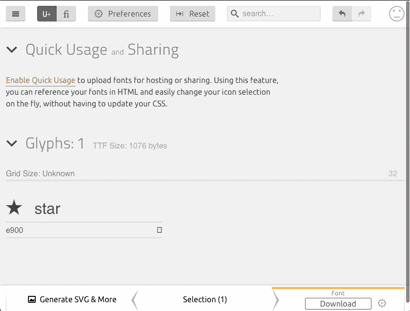
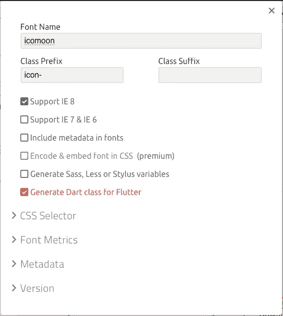
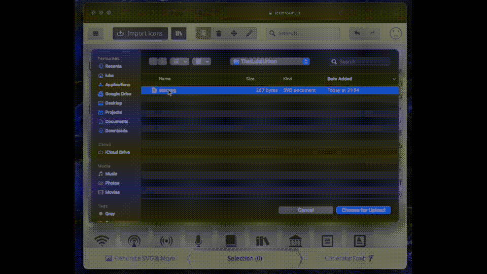

# doyouevenfutter[EP . 3]创建自定义图标字体

> 原文：<https://itnext.io/doyouevenflutter-ep-3-creating-custom-icon-font-d892c4a2f21c?source=collection_archive---------6----------------------->


现在，几乎每个应用程序都使用图标，我们基本上生活在图标的复兴时期。您的图标数量可能从几个到数百个不等，具体取决于您的应用程序规格。作为一名全职的 Flutter 开发人员，我必须与我们的 UI 设计团队密切合作，他们喜欢为我们目前正在开发的应用程序创建自定义图标。这种方法赋予我们的创作一个独特的特征，使我们的应用与众不同。不幸的是，起初，这是有代价的。图标是不可扩展的，它们让我们的应用变得越来越重。解决方案非常明显:我不得不使用自定义字体类，和 Flutter 团队使用的方法一样，但是我找不到创建一个合适的工作流程。

如果您需要:

*   使用自定义图标创建字体，
*   通过消除图像中的图标来节省空间，
*   拥有像内置图标一样的可缩放自定义图标

请继续阅读这篇文章。

# 我们用什么工具来画我们的图标？

这很简单——fig ma。自从我在大约两年前的前一份工作中发现 Figma 以来，几乎没有人知道它。在写这篇文章的时候，Figma 是**免费的**和它提供了你创建自定义图标所需的一切。

在 Figma 中绘制更高级的形状的整个过程我就不赘述了。如果你对此感兴趣，请在 [**Twitter**](https://twitter.com/thatlukeurban) 上写评论或给我发消息。



当你对 Figma 的形状满意时。在左侧面板中，在选项卡*设计*下，单击导出部分中的 *+* 。



然后选择 **SVG** 作为导出类型。

选择保存目录后，Figma 就完成了😊下面是整个过程。开始到结束:



# 如何将我的 SVG 图标变成自定义字体

为了将你的 SVG 转换成自定义字体，我使用了一个不同的网络工具——Icomoon**。这个过程很简单。**

在 [**Icomoon**](https://icomoon.io/app) app 中，左上角需要点击汉堡图标，然后*新建空集*。



一旦创建了一个**空集合**，点击与该集合相关的另一个汉堡图标，然后点击*导入以设置*。然后你需要选择所有你想要的字体图标。



使用*选择工具*(突出显示的黄色)，您需要选择想要导出的图标。



然后点击浏览器右下角的生成字体。



您将被重定向到设置预览，在这里您可以看到您的图标是否正确生成。有时，当图标有更多的细节，或者你在 Figma 中使用了曲线以外的东西，图标看起来可能与你预期的非常不同。一个快速的解决方法是确保所有的图层都被*弄皱*或者*框住*，然后*展平。*正如我提到的，如果你认为进一步的解释是必要的，请在 [**Twitter**](https://twitter.com/thatlukeurban) 上留言给我。



Icomoon 对于颤振开发的魔力在下一步大放异彩。当您单击右下角的齿轮图标时，将会出现一个模式视图提示。



在这里你可以为你的图标设置全局前缀和后缀，设置字体名称，但是最好的部分是你可以选择**为 Flutter 生成 Dart 类！**完成后，关闭模态并点击下载按钮**你已经成功地为 Flutter 创建了你自己的自定义字体！**

在这里你可以看到整个过程。



这是生成的 dart 类。如你所见，进一步的指导就在那里；)

将生成的*字体/icomoon.ttf* 添加到 *pubspec.yaml* 和 **enjoy！**现在你可以使用你的自定义图标，比如 build-it Flutter 图标。

```
Icon(Icomoon.star)
```

相比之下，420 个导出为 24x24 px 图像的图标重**1.7 MB**，图标数量与字体重量 **79 KB** 相同。

# **总结**

如果你喜欢这篇文章，请留下一些掌声(你可以不止一次鼓掌！😄)并关注我的 [**推特**](https://twitter.com/thatlukeurban) **。正如你从这篇文章中可以清楚地看到的，我个人认为学习东西应该多一点视觉化。有时候，一件被忽视的事情让我无法修复一个 bug 或完成一个特性，这很难。此外，请查看本系列的旧文章。也许你会找到你喜欢的东西:**

[***doyouevenfutter？[EP.1]滚动到列表*** *中的元素。*](https://medium.com/@luke.urban/doyouevenflutter-ep-1-b6f05c90b506)

[**doyouevenfutter？【EP . 2】API 枚举映射**](https://medium.com/@luke.urban/doyouevenflutter-ep-2-api-enum-mapping-888d2e72902c)

干杯，
卢克