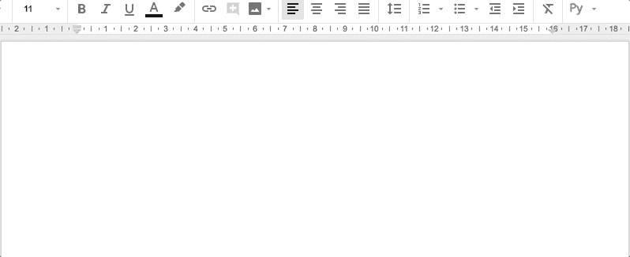
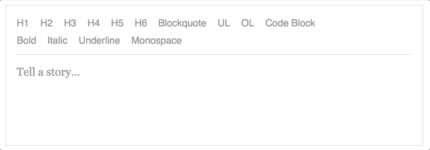

# Draft.js:列表深度控件

> 原文：<https://itnext.io/draft-js-lists-depth-control-800fb3a6714c?source=collection_archive---------6----------------------->

在 [Propeller](https://www.propellercrm.com/) 上，让用户和平台之间的交互尽可能顺畅对我们来说非常重要。这种交互的一个要点是文本编辑。我们选择 DraftJS 编辑器作为工具，为我们的用户提供 RichText 功能。为了获得最好的用户体验，我们需要遵循 RichText 编辑领域的一些常用模式，但是 DraftJS 并没有遵循这些现成的模式。相反，它为您提供了根据需要定制编辑器的广泛可能性。

# 问题是

假设您有一个嵌套列表(有序或无序)。当你完成了当前深度级别的工作后，你需要上一级。通常的做法是将该项目留空，然后点击`Return`按钮。深度水平会降低，你可以继续你的工作，甚至不用考虑按下特定的组合键。并且如果光标在第一深度级别上，则编辑器应该关闭列表。

谷歌文档

默认情况下，DraftJS 实现了不同的逻辑——当你点击空白列表项上的`Return`时，会创建一个新项。

DraftJS 默认行为

为了提高你的应用程序的 UX，你可以使用[这个插件](https://www.npmjs.com/package/draft-js-list-depth-plugin)或者按照以下步骤操作。

# 解决办法

算法非常简单:当用户按下`Return`时，我们需要检查当前列表项是否为空。如果是这样，我们需要检查深度水平。如果它大于 0，我们需要减少它。否则我们需要关闭列表。深度级别不能小于 0。和往常一样，当涉及到 DraftJS 及其文档时，事情开始变得复杂。

因为我们需要改变`Return`按键的行为，DraftJS 方法`handleReturn`将是一个很好的起点！首先，我们需要得到当前选择的块(如果有的话)来工作。为此，我们需要获得选择和内容的当前状态，并选择选择开始的块。

一旦选择了该块，我们需要检查该块是否是一个列表项，以及该项是否没有文本。让我们实现一个函数来做到这一点。

现在，当我们需要改变默认行为时，我们可以检测到确切的情况。现在让我们把目前所有的东西结合起来。

到目前为止一切顺利！现在让我们根据描述的算法实现`handleReturnForListItem`方法。

改变块的深度水平被证明是非常简单的。因为 DraftJS 在内部使用 Immutable.js，所以我们可以调用块的`set`方法来获得具有更新属性的对象的副本。然后我们需要相应地更新编辑器的状态。

注意，这里使用的是 DraftJS 中的`EditorState`——而不是本地存储的`editorState`。还要注意这里使用了`adjust-depth`改变类型。DraftJS 使用变更类型来确定当前变更是否可以被视为撤销/重做行为的边界状态。

我们差不多完成了！剩下要写的唯一部分是如果深度级别为 0 时关闭列表的逻辑。

来自`RichUtils`模块的方法`tryToRemoveBlockStyle`允许我们安全地将块类型更改为`unstyled`。这意味着我们的列表将被关闭，列表中的最后一项将是前一项。

我们将通用模式应用于 DraftJS 编辑器。干得好！

如果你到现在还在读这篇文章，你可能也想看看我的另一篇文章[和应用这个增强功能。](https://medium.com/@semin_andrey/multiline-items-in-draft-js-list-97075eaae608)