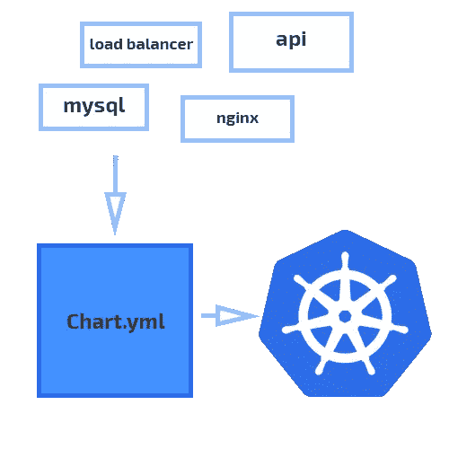
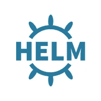

# 借助 Helm 显著改善您的 Kubernetes 部署

> 原文：<https://itnext.io/drastically-improve-your-kubernetes-deployments-with-helm-5323e7f11ef8?source=collection_archive---------0----------------------->

## 走出清单丛林，轻松部署、升级和维护最复杂的部署。


马克西米利安·魏斯贝克尔在 [Unsplash](https://unsplash.com?utm_source=medium&utm_medium=referral) 上的照片

[Kubernetes](https://kubernetes.io/) 正在迅速成为运行容器化工作负载的事实标准。虽然 Kubernetes 有很多现成的东西，但应用程序发布不一定是其中之一。

通常情况下，普通的 Kubernetes 清单用于展示应用程序及其资源。这一开始工作得很好，它允许你将[基础设施作为代码](https://docs.microsoft.com/en-us/azure/devops/learn/what-is-infrastructure-as-code)——有点像。虽然将您的 YAML 文件保存在 Git 存储库中是完全可行的，但是没有真正的方法来正确地对它们进行版本控制。当然，您可以使用 Git 修订版，但是理想情况下，您会有更合适的版本，比如[语义版本](https://semver.org/)。

这就是赫尔姆的用武之地。Helm 是 Kubernetes 的包装经理，没错。但它也是您在 Kubernetes 集群上实现更好的应用程序和发布管理的门户。Helm 允许您将应用程序定义为集群上的一组组件，并提供从头到尾管理这些组件的机制。

官网给出了非常简短的描述:

> " Helm 允许您定义、安装和升级甚至最复杂的部署."

但平心而论，我认为这不公平。除了作为一个“包管理者”之外，Helm 还是一个真正实现可靠的开发和发布工作流的基础组件。

在本文中，我们将走过一个版本的完整生命周期。我们将从 Helm 及其各种组件的介绍开始。之后，我们将从 Kubernetes 集群中部署、升级、回滚并最终删除一个应用程序。

## 是什么让 Helm 与众不同？

Helm 在所谓的[图表](https://helm.sh/docs/developing_charts/#charts)中定义了应用程序及其逻辑组件。您可以将图表视为一个或多个应用程序的集合，它们共同构成一个版本。

例如，让我们假设我们正在我们的集群上做一个 Wordpress 发布。为了让它正常运行，我们需要:

*   MySQL 实例来存储我们的数据
*   存储数据库数据的持久卷
*   WordPress 本身，不管有没有反向代理

Helm 将这些分组到一个图表中，然后您可以在一段较长的时间内部署和维护该图表。每当您将图表部署到您的集群时，Helm 的服务器端组件——名为*Tiller*——将创建一个*版本*。这个版本会随着时间的推移跟踪您的应用程序部署。我们稍后再讨论。

使用 Helm，你几乎可以部署任何东西；从简单的 Redis 缓存，到您能想象到的最复杂的 web 应用程序。部署模型大致如下:



舵部署模型

如前所述，每当 Helm 部署一个图表时，都会创建一个版本来跟踪它。这允许您随着时间的推移控制部署，并对其执行升级。

与常规的 Kubernetes 部署清单不同，Helm 图表是有版本的。Tiller 会在图表部署到集群时跟踪图表的版本，您可以随时升级或降级图表。

这种部署模型使得 Helm 变得非常强大，无论是对于发布自己软件的团队，还是希望改进集群管理的 DevOps 团队。

在本文中，我们将回顾组成 Helm 的核心概念，以及如何使用它们来更有效地部署和管理 Kubernetes 应用程序。

## 先决条件

如果您希望在自己的集群上遵循本指南中的步骤，您将需要以下内容:

*   运行 Kubernetes 集群*
*   `kubectl`已安装并配置为与您的集群交互

*如果您还没有集群，Digital Ocean 将以极具竞争力的价格为您提供。您可以使用* [*我的推荐链接获得前两个月的 100 美元信用点数*](https://m.do.co/c/e7b342e45008) *免费试用。*



# 舵柄和舵柄

舵由两部分组成:舵和舵杆。Helm 本身是您在命令行中运行的客户端组件，而 tiller 则生活在您的集群中，完成所有繁重的工作。

## 安装舵

在我们继续之前，您需要下载并安装 *Helm。*前往[官方发布页面](https://github.com/helm/helm/releases)获取针对您的特定操作系统和架构的最新 Helm 版本。出于本教程的目的，我们使用 Linux 版本。首先，打开包装:

```
$ tar -zxvf helm-v2.0.0-linux-amd64.tgz
```

之后，找到`helm`二进制文件，并将其移动到`/usr/local/bin`。要验证舵是否正确安装，运行`helm version`。输出应该大致如下:

```
> Client: &version.Version{SemVer:"v2.13.0", GitCommit:"79d07943b03aea2b76c12644b4b54733bc5958d6", GitTreeState:"clean"}
```

你也可以使用软件包管理器，比如 aptitude 或者 homebrew，但是他们可能不会总是安装最新的版本。

## 安装舵杆

现在你的机器上已经有了舵，你可以在集群上部署舵了。默认情况下，Tiller 将被安装到您的`.kubeconfig`中指定的当前上下文中。如果您想要部署到不同的集群，确保您指定了`--kube-context`标志来指定您的上下文。

Tiller 是处理集群资源的实际操作以安装和升级工作负载的组件。授予 Tiller 访问权限有多种方式——但出于本指南的目的，我们将为其分配一个`cluster-admin`角色:

通过将集群角色部署到集群来创建集群角色:

```
$ kubectl create -f tiller-sa.yaml
```

创建服务帐户后，将 Tiller 部署到您的集群，并为其分配您刚刚创建的服务帐户:

```
$ helm init --service-account tiller --history-max 200
```

`--service-account`标志指定 Tiller 应该在之前创建的`tiller`账户下运行。如果没有它，它将没有足够的权限来部署或维护图表。

`--history-max`标志指定 Helm 在其历史中保存的对象的最大数量。如果没有指定这个标志，历史对象永远不会被删除。从长远来看，这可能会在集群中构建大量的对象。

完成该步骤后，再次运行`helm version`。现在，您应该可以看到客户机和服务器的版本信息:

```
> Client: &version.Version{SemVer:"v2.13.0", GitCommit:"79d07943b03aea2b76c12644b4b54733bc5958d6", GitTreeState:"clean"}> Server: &version.Version{SemVer:"v2.13.0", GitCommit:"79d07943b03aea2b76c12644b4b54733bc5958d6", GitTreeState:"clean"}
```

# 舵图

图表是掌舵人可部署的工件。图表总是使用语义版本化进行版本化，或者打包在版本化的`.tgz`文件中，或者在平面目录结构中。

图表总是遵循特定的目录结构:

`Chart.yaml`文件包含有关图表的信息；名称、版本、描述、图标等。

`charts`文件夹包含安装图表所需的所有图表。这包括正确版本的所有依赖项。例如，如果一个 *Wordpress* 图表需要 *nginx* 和 *MySQL* 图表，这些图表也会包含在`charts`文件夹中。

如果我们看一下官方 Wordpress 图表的`Chart.yaml`文件:

您可以看到有一个`version`和一个`appVersion`字段。前者指示图表的版本，并且允许我们将版本化应用到我们的图表发布中。后者仅仅代表了图表所代表的主要应用程序的版本，在这个例子中，是 Wordpress 5.1.1。

这是舵图和普通库伯内特清单的主要区别之一。每当使用`helm package`创建图表时，图表中的版本将在安装该图表时使用。安装后，将在跟踪该实例的集群上创建一个安装，随后允许更新、回滚或删除该实例。

拥有这些机制来版本化、安装和更新可能跨越多个工作负载的应用程序是非常重要的。它允许您推出集中发布的版本，并确保您的应用程序及其依赖项始终运行正确的版本。

接下来，我们将看看部署和更新上面显示的 Wordpress 图表。

# 安装和管理图表

继续之前，请确保头盔已正确初始化。如果您遵循了本指南的安装步骤，这已经完成了。如果您还没有，您可以使用以下两个命令之一初始化 Tiller:

*   如果你的集群**已经运行舵柄**，运行`helm init --client-only`来本地初始化舵柄
*   如果您的集群没有运行 Tiller，请参考本文的**舵和舵**部分

## 仓库

Helm 使用存储库来提供图表服务。默认存储库包含各种各样的应用程序，但是您也可以添加第三方存储库，或者托管您自己的存储库。与图表版本控制相结合，托管您自己的存储库是管理您的软件版本的一种非常有效的方式。

现在我们将使用默认存储库中的 Wordpress 图表。继续运行`helm repo update`来更新存储库。输出应该大致如下:

```
> Hang tight while we grab the latest from your chart repositories...> ...Skip local chart repository> ...Successfully got an update from the "stable" chart repository> Update Complete. ⎈ Happy Helming!⎈
```

您可以通过运行以下命令来验证更新是否成功:

```
$ helm search stable/wordpress --versions
```

这会给你一个相当长的列表，显示所有的 Wordpress 图表。注意，每个图表都有一个图表版本和一个应用程序版本。这些图表不一定是绑定的——对于每个应用程序版本，可能存在多个图表。

对于稳定分支中所有可用的图表，请参见官方图表存储库:

[](https://github.com/helm/charts/tree/master/stable) [## 舵/海图

### 为 Kubernetes 策划应用。在 GitHub 上创建一个帐户，为头盔/海图开发做出贡献。

github.com](https://github.com/helm/charts/tree/master/stable) 

## 装置

在撰写本文时，Wordpress 版本`5.1.1`是稳定库中的最新版本。因为我们稍后将升级我们的安装，我们将从安装一个旧的图表开始。我们将从版本`5.0.1`开始:

```
$ helm install stable/wordpress --name my-wordpress --version 5.0.1
```

这个图表使用 MariaDB 作为数据库，运行上面的命令将自动在集群上提供所需的资源。

根据您的云提供商，输出应该大致如下:

以上是图表的*状态*。因为 Helm 跟踪已命名的发布，所以您总是可以通过运行`helm status my-wordpress`来检索这些信息。

Helm 部署和常规 Kubernetes 部署之间的一个关键区别是，使用 Helm，发布会被跟踪**，即使它们已经被删除**。在本文的后面，我们将进一步探讨发布状态。

接下来，我们将进入 Helm 提供的升级和回滚功能，将我们的 Wordpress 图表升级到最新版本。

## 升级和回滚

Helm 提供的强大机制之一是通过执行升级和回滚来控制版本的能力。在上一步中，我们已经部署了一个旧版本的 Wordpress 图表。在这一步中，我们将把它升级到最新版本。

`helm upgrade`接受两个参数:版本名和升级到的图表。如果你想升级到一个特定的图表版本，你可以像我们之前做的那样通过指定`--version`来完成。现在，我们将升级到最新版本的 Wordpress 图表。在撰写本文时，最新的版本是`5.1.1`。

要将你的 Wordpress 版本升级到最新版本，运行:

```
$ helm upgrade my-wordpress stable/wordpress
```

如果一切顺利，您的版本应该升级:

```
> Release "my-wordpress" has been upgraded. Happy Helming!> LAST DEPLOYED: Mon Mar 25 11:57:47 2019> NAMESPACE: default> STATUS: DEPLOYED
```

在那下面，你会看到你的版本的新`helm status`，反映了升级。就这些了。

如果升级导致不良副作用，您可以随时使用`[helm rollback](https://github.com/helm/helm/blob/master/docs/helm/helm_rollback.md)`执行回滚。如果您想尝试执行回滚，您可以执行一次预演，这将不会影响实际的发布。

要执行到先前版本的试运行回滚，只需运行:

```
$ helm rollback my-wordpress 0 --dry-run
```

这将模拟回滚，而不会实际改变任何集群对象。因此，如果你`helm ls`，你的 Wordpress 图表应该仍然运行在最新版本。

接下来，我们将深入探讨如何正确清理您的资源。

# 清理

当然，我们不希望这些资源停留在我们的集群上。与常规的 Kubernetes 部署不同，Helm 版本在其生命周期中包含删除状态。也就是说，当你删除一个舵图时，它会过渡到一个`deleted`状态，而不是直接消失。

我们将深入探讨图表被删除后可能存在的各种状态。首先，我们将简单地从集群中删除我们的 Wordpress 版本:

```
$ helm delete my-wordpress
```

这应该给你一个简单的:

```
> release "my-wordpress" deleted
```

很好。此操作已经清理了与发布相关的所有窗格，您可以通过运行`kubectl get pods`来验证。

尽管与该版本相关的集群资源被删除，Tiller 仍然跟踪该版本的历史。然而，你不能“复活”这个版本，或者重新使用它的名字。

## 清除释放

如果您想在将来重用某个版本的名称，或者您对跟踪某个版本的历史不感兴趣，您可以清除某个版本。

为此，只需在调用`helm delete`时传递`--purge`标志。因为我们希望将集群恢复到本文开始时的状态，所以我们将清除之前创建的 Wordpress 版本:

```
$ helm delete my-wordpress --purge
```

之后，您可以运行一个`helm ls`来验证 Tiller 不再跟踪释放。

# 结论

在本文中，您已经学习了如何使用 Helm 来安装、升级、回滚和删除应用程序版本。这些只是在一个版本的生命周期中使用 Helm 的基础，但是它们可以带你管理 Kubernetes 集群。

如果您希望继续 Helm 之旅，并使用它来发布和管理您自己的应用程序，您的下一步可能是:

*   为您的应用程序创建并发布舵图
*   深入阅读`[values.yaml](https://helm.sh/docs/chart_best_practices/#values)`上的文档，了解如何将环境变量和其他特定于环境的变量传递到您的版本中
*   将值传递到您的 Helm chart 与作为代码的[基础设施相结合，为您的应用程序自动创建、部署和更新各种环境](https://docs.microsoft.com/en-us/azure/devops/learn/what-is-infrastructure-as-code)

根据这篇文章如何被接受，我将在后续文章中进一步阐述以上观点，并将其变成一个系列。

希望这篇文章对你有用。感谢您的阅读。