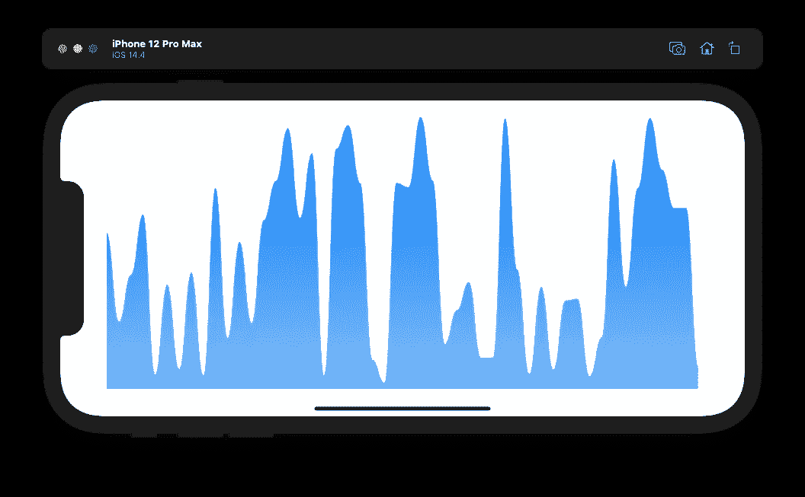
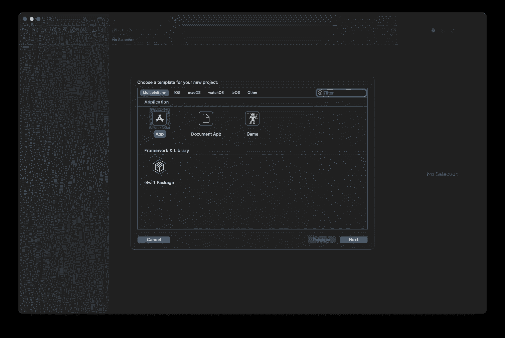
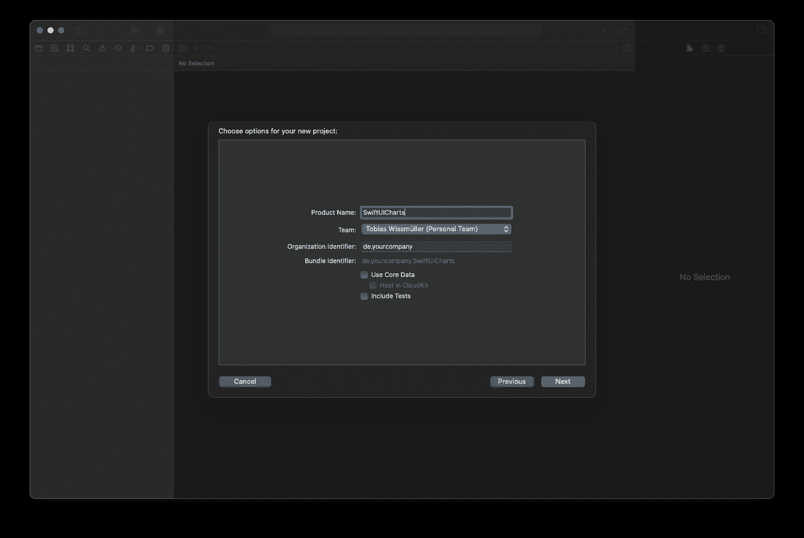
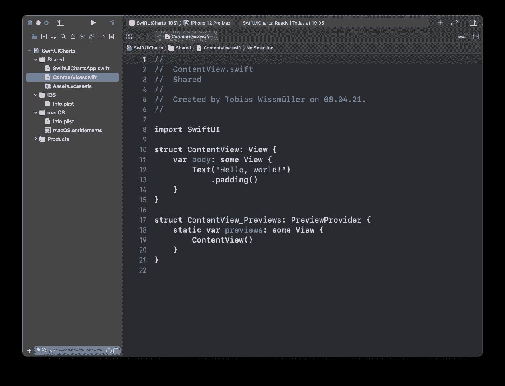
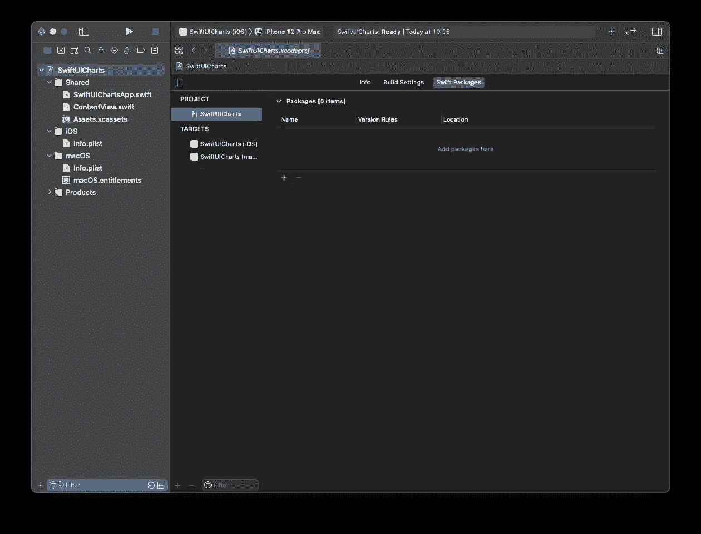
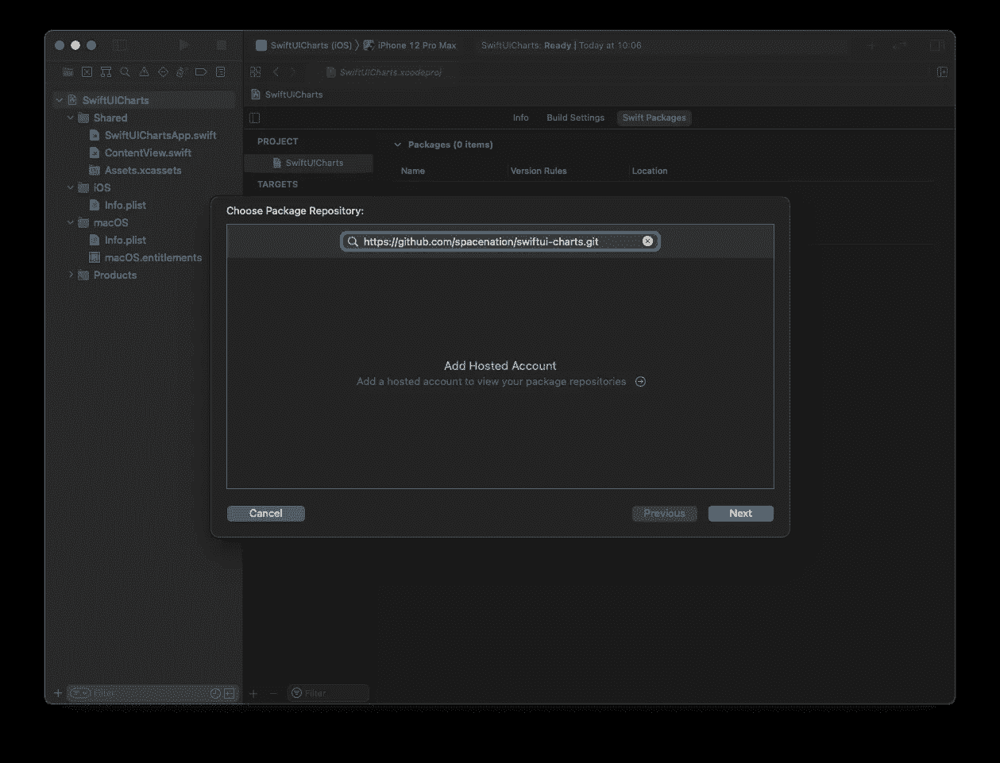
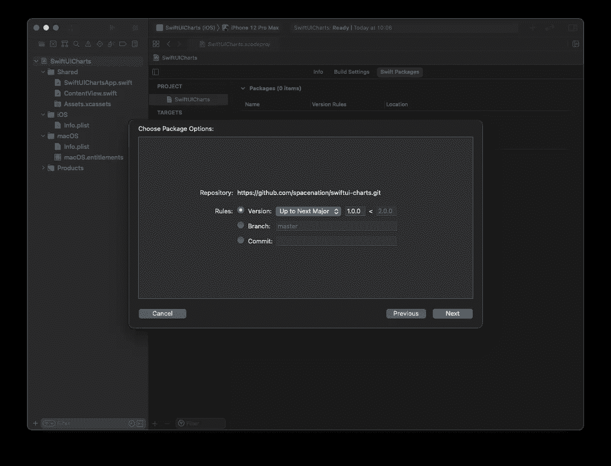
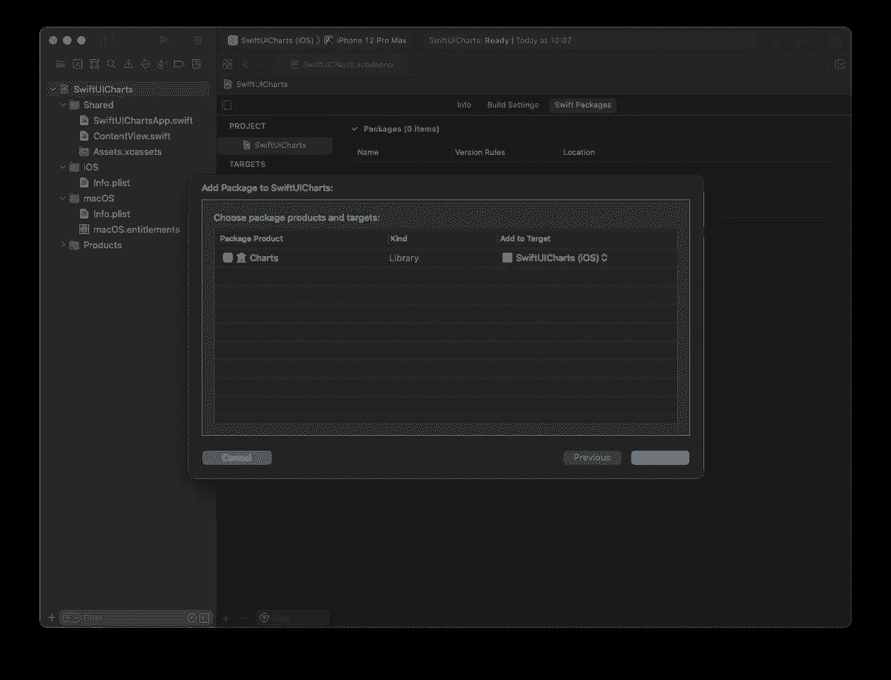
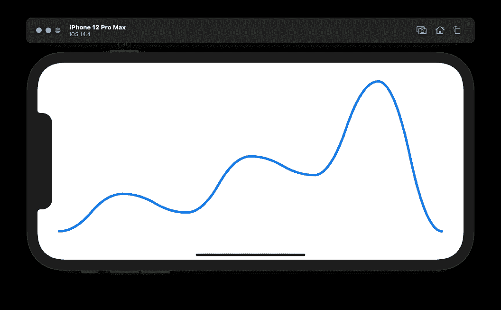

# 在 SwiftUI 中绘制图表

> 原文：<https://itnext.io/drawing-charts-in-swiftui-a5a87ac8cf9?source=collection_archive---------2----------------------->

## 关于如何在 SwiftUI 应用程序中绘制图表的教程。



我不时需要在一些好看的图表中可视化数据。这篇文章将展示如何在 SwiftUI 应用程序中绘制图表。

由于时间和预算的限制，从零开始制作图表包不是一个选择，所以我不得不寻找现有的解决方案。

我投票支持 swi ify-Charts，它提供了非常漂亮的图表和简单的集成。

## 设置和项目配置

我们首先在 XCode 中创建一个项目。



起点是标准的 SwiftUI 应用程序，它将被修改以显示图形。



在下一步中，将通过首先打开项目设置来添加包。



按下“加号”按钮，可以添加一个新的包。这里，需要提供存储库的完整路径:`[https://github.com/spacenation/swiftui-charts.git](https://github.com/spacenation/swiftui-charts.git.)` [。](https://github.com/spacenation/swiftui-charts.git.)



在下一个屏幕中，我保留了所有的默认值。



在最后一个屏幕中，我也保留了默认值。



## 显示常量数据

是时候添加代码了。对于第一个测试，我只是从 Github-Readme 中提取了一些代码片段，并将其添加到我的`ContentView`:

```
import Charts
import SwiftUI

struct ContentView: View {
    var body: some View {
        Chart(data: [0.1, 0.3, 0.2, 0.5, 0.4, 0.9, 0.1])
            .chartStyle(
                LineChartStyle(.quadCurve, lineColor: .blue, lineWidth: 5)
            )
    }
}
```

当在模拟器中运行时，将会绘制一个漂亮的图形来显示常量值。



这是第一次成功的测试。

## 显示动态数据

在我工作的领域中，我必须将数据可视化，例如来自感官输入的数据。让我们扩展这个例子，根据数据的变化动态地更新图形。

“传感器”应该是一类每 500 毫秒发布一个随机值的`ObservableObject`。

```
import Foundation

class ValuePublisher: ObservableObject {
    @Published var value: Double = 0.0

    init() {
        Timer.scheduledTimer(withTimeInterval: 0.5, repeats: true) { timer in
            self.value = Double.random(in: 0...1.0)
        }
    }
}
```

这需要在`ContentView`中被实例化为一个`@State`变量。

```
@StateObject var valuePublisher = ValuePublisher()
```

`ValuePublisher`只发出单个值，但是我们需要在一个列表中提供这些值。一个简单的队列结构就可以做到这一点。

```
struct Queue<T> {
    var list = [T]()

    mutating func enqueue(_ element: T) {
        list.append(element)
    }

    mutating func dequeue() -> T? {
        if !list.isEmpty {
            return list.removeFirst()
        } else {
            return nil
        }
    }

    func peek() -> T? {
        if !list.isEmpty {
            return list[0]
        } else {
            return nil
        }
    }
}
```

该队列将被实例化为`ContentView`中的`@State`变量

```
@State var doubleQueue = Queue<Double>()
```

当视图出现时，需要初始化底层列表。

```
.onAppear {
    doubleQueue.list = [Double](repeating: 0.0, count: 50)
}
```

图表还需要知道保存值的列表。

```
Chart(data: doubleQueue.list)
```

在最后一步中，必须将`ValuePublisher`的发布值添加到队列中，并且必须移除队列中最早的值。

```
.onChange(of: valuePublisher.value) { value in
    self.doubleQueue.enqueue(value)
    _ = self.doubleQueue.dequeue()
}
```

大概就是这样，这里是完整的`ContentView`，我也稍微改变了一下图表的外观。

```
import Charts
import SwiftUI

struct ContentView: View {

    @State var doubleQueue = Queue<Double>()

    @StateObject var valuePublisher = ValuePublisher()

    var body: some View {
        Chart(data: doubleQueue.list)
            .chartStyle(
                AreaChartStyle(.quadCurve, fill:
                    LinearGradient(gradient: .init(colors: [Color.blue.opacity(1.0), Color.blue.opacity(0.5)]), startPoint: .top, endPoint: .bottom)
                )
            )
            .onAppear {
                doubleQueue.list = [Double](repeating: 0.0, count: 50)
            }
            .onChange(of: valuePublisher.value) { value in
                self.doubleQueue.enqueue(value)
                _ = self.doubleQueue.dequeue()
            }
            .padding()
    }
}
```

下面是最终应用程序的屏幕截图


我还上传了一个视频，让你看看当值动态更新时是什么样子。

如果你喜欢这篇文章，请给我买杯咖啡。

## 资源

*   [SwiftUI-Charts](https://github.com/spacenation/swiftui-charts)
*   [Swift 中的数据结构:队列和堆栈](https://medium.com/@JoyceMatos/data-structures-in-swift-queues-and-stacks-e7d715634f07)