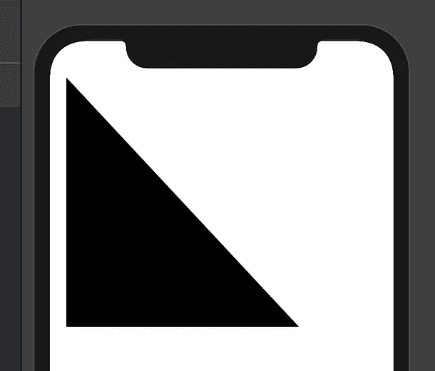
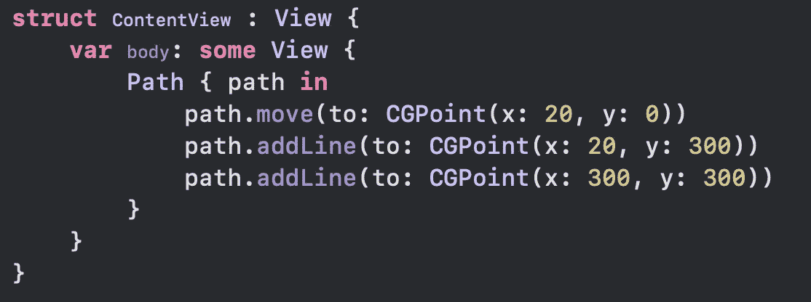
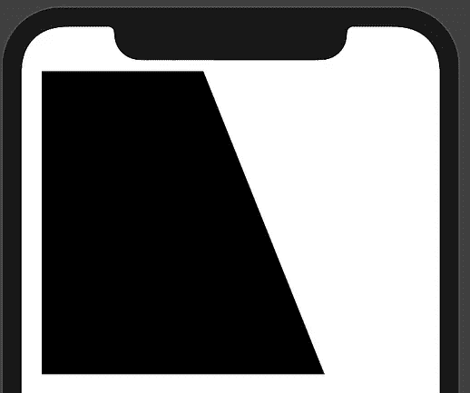
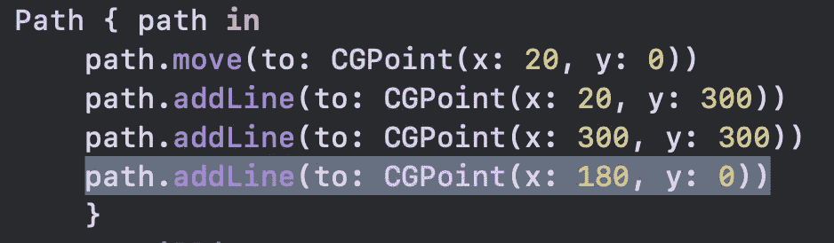
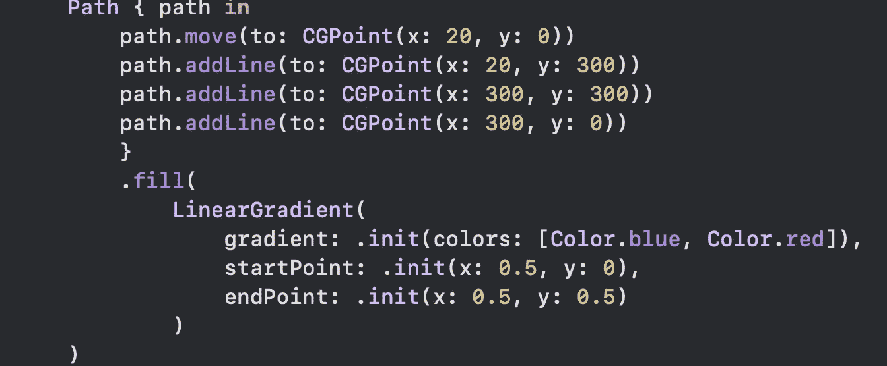
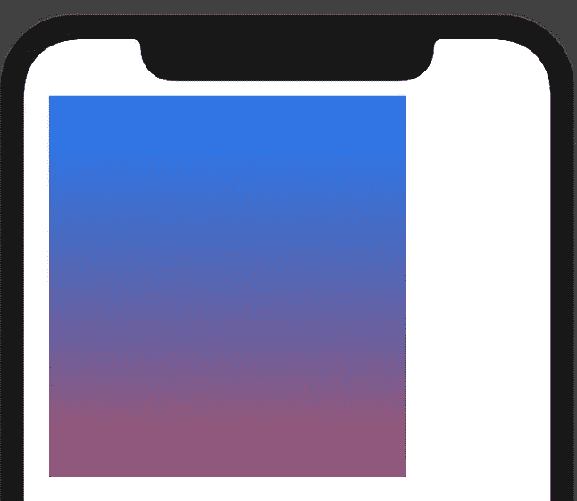

# 在 SwiftUI 中绘图—在 Swift UI 中用路径编码形状

> 原文：<https://itnext.io/drawing-in-swiftui-code-shapes-with-paths-in-swift-ui-3d6b7373f75f?source=collection_archive---------3----------------------->

在 Xcode 11 中用 SwiftUI Path 快速搭建一个基础 app，学习如何用苹果的 SwiftUI 框架绘制形状。

我叫**麦克斯韦**，我跑的是[***maxcodes . io***](https://www.maxcodes.io)*iOS 快讯**。很高兴终于见到您了。***

> *[点击 **me** 观看本指南的免费视频讲解。](http://youtube.com/maxcodes)*

# *步骤 1 —创建新的 Xcode 项目*

*   *用 *Xcode11 Beta 创建一个*单视图应用*。**
*   *确保选择了*使用 SwiftUI* 。*

# *步骤 2-用路径创建一个三角形*

*在空白应用程序中，用以下代码替换文本(“Hello World”)。你会得到一个基本的黑色三角形，如图所示。*

**注意:我用的是 Xcode 11 的实时预览版，Mac OS Catalina 上有。如果你还在运行 Mojave，但仍然下载了 Xcode 11，只需将你的应用程序编译到 iPhone 模拟器上，一切都将是 gucci。**

****

*很简单。*

## *说明*

*   ****path . move***——这使我们的形状向右移动 20 点，给我们一个漂亮的小插图。*
*   *第一个***path . addline—***这从一条 20 点的线开始，向下延伸 300 点，到达我们的图片形状的底部*
*   *第二个***path . addline—***这个开始向下 300 点，向右 300 点*

*这只需要两行，因为 Path 会自动连接它的行。这给了我们一个三角形。*

# *第三步——添加最后一行，但是有一个附加条件。*

*将下面一行添加到您的路径中。输出会出现如图，大家说说吧。*

****

*从 x 轴上的 180°开始，我们得到了一个奇怪的形状。我把这个包括进来是为了让你更好地了解这些行是如何工作的。*

**

*把 180 换成 300，实现平方。*

****我们可以简单的把这个改成 300 得到下面的输出。****

# *步骤 4-给你的路径添加一个填充。*

*修改您的 SwiftUI 代码以匹配屏幕截图。*

*   *填充采用颜色或线性渐变。尝试简单地添加(Color.red)而不是渐变，你会得到一个直的红色方块。*
*   *然而，当在 SwiftUI 路径中添加线性渐变时，我们需要提供一个渐变，它是一个颜色数组、一个起点和一个终点。*

****

# *第 5 步—这就是所有人！*

*现在，您已经对 SwiftUI Path 有了基本的了解，并且知道如何在 SwiftUI 中使用纯代码和线性渐变创建形状。*

## *SwiftUI 高级画图和动画:[此处](https://www.udemy.com/swift-ui/?couponCode=MEDIUMDEVELOPERS)。*

**

*如果您想了解更多有关 SwiftUI 的信息，并了解更多有关在 SwiftUI 中绘制路径和形状的信息， [***请使用此折扣券查看完整的 SwiftUI 开发课程。***](https://www.udemy.com/swift-ui/?couponCode=MEDIUMDEVELOPERS)*

*在本课程中，您将浏览各种 SwiftUI 教程，其中之一是使用纯代码创建徽章，特别是路径和渐变，就像我们在本指南中所做的那样！*

*[***发微博给我***](https://twitter.com/maxcodes1) 你的文章和视频请求，我都会满足！*

# *谢谢范姆！*

*我真的很感谢那些观看我的视频，阅读我的文章，参加我的课程的人。*

*谢谢，*

*一如既往，我们将在下一段视频中再见。*

****——马克斯****