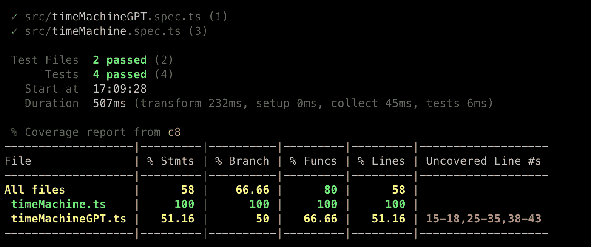
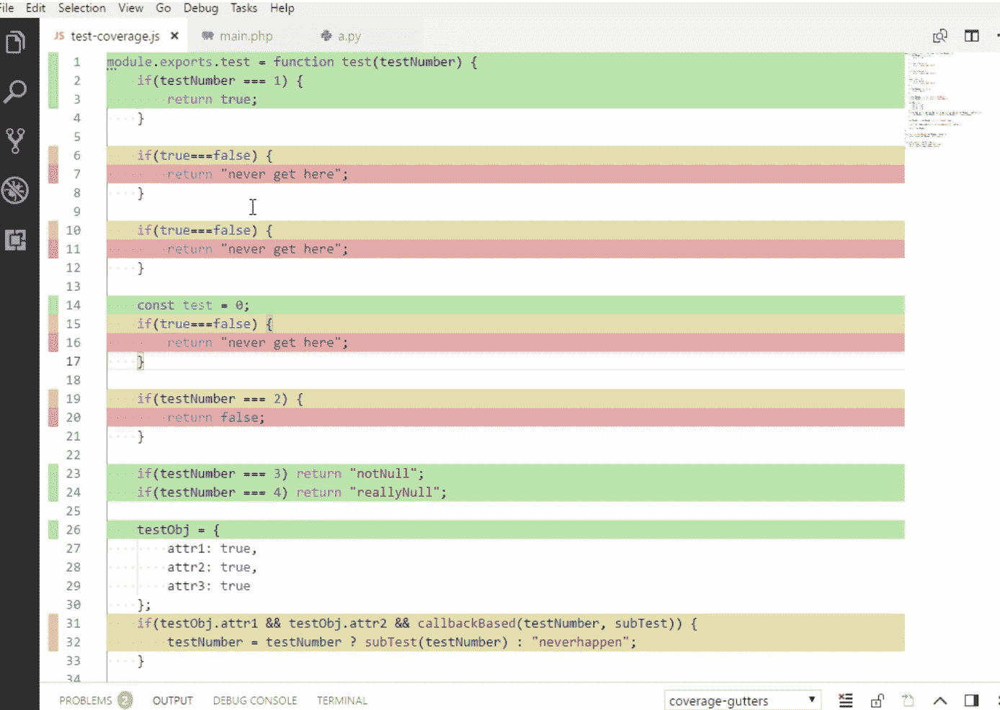
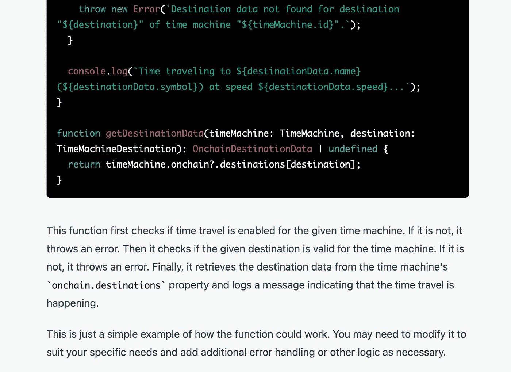
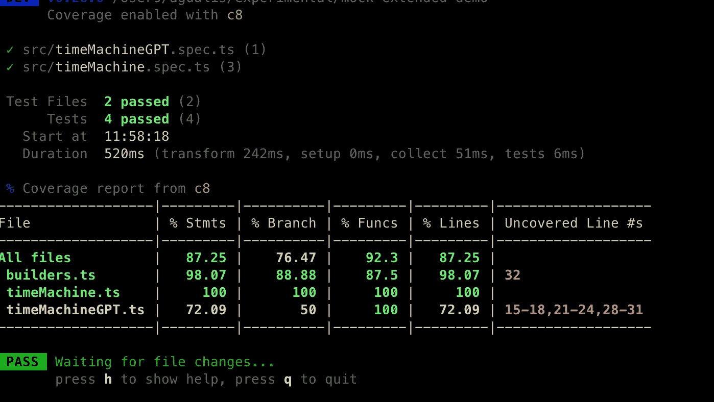
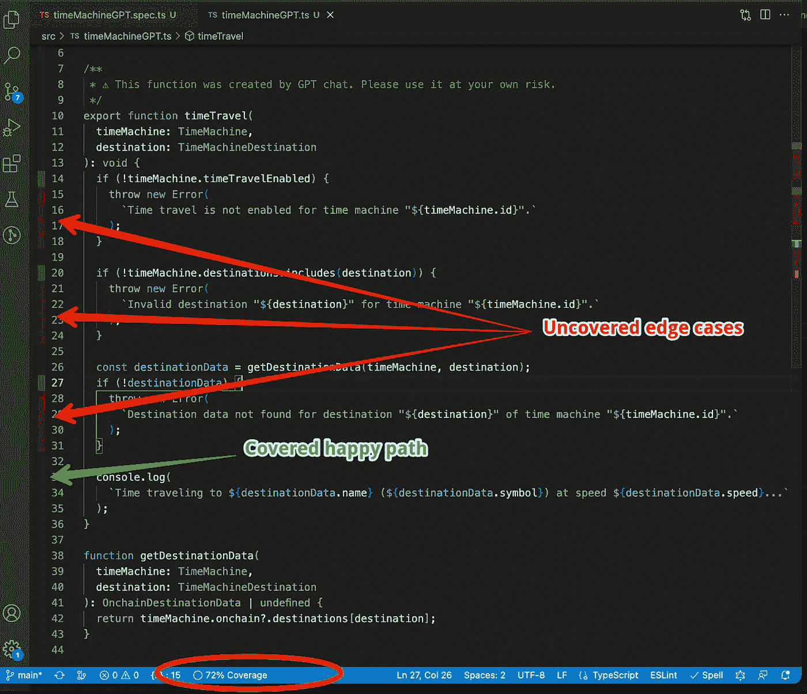

# 用代码覆盖工具推动您的测试工作

> 原文：<https://itnext.io/driving-your-testing-efforts-with-code-coverage-tools-616eadc7c2ca?source=collection_archive---------5----------------------->

使用 TypeScript 中的真实示例


由 [Unsplash](https://unsplash.com?utm_source=medium&utm_medium=referral) 上 [Raghavendra Saralaya](https://unsplash.com/@numoonchld?utm_source=medium&utm_medium=referral) 拍摄的照片

在这篇文章中，您将学习如何设置您的 IDE 来使用代码覆盖率来驱动您的测试工作。我们将在 TypeScript 中看到一个真实的例子。

> *你可以查看* [*这个回购*](https://github.com/agualis/mock-extended-demo) *或者玩* [*这个互动例子*](https://stackblitz.com/github/agualis/mock-extended-demo/tree/main?file=src%2FtimeMachineGPT.spec.ts) *来了解这个帖子的真实代码。*

# IDE 中的覆盖率

代码覆盖工具非常流行。它们允许您在运行测试时创建一个覆盖率报告。大概是这样的:



典型覆盖率输出

几乎每种语言都有自己的工具来生成不同格式的覆盖率报告: *text，json，xml，html…* 但是有一个特性我认为特别有趣:**使用你的编辑器/IDE 用覆盖率颜色高亮显示打开的文件的行(或者左边的空白)。**

下面是 *vscode* 中的一个例子:



每行上的典型颜色代码表示:

*   ***绿色(全覆盖)*** *:* 该行被最后一个测试套件执行覆盖。
*   ***红色(无覆盖)*** :该行未被最后一次测试套件执行覆盖。
*   ***黄色(部分覆盖)*** :该行被部分覆盖，表示该行没有覆盖所有可能的组合。例如，带有*布尔表达式*的行必须用*真值*和*假值*运行，以完全覆盖(*绿色*)。

我发现这个工具在有许多未测试行的遗留环境中，或者当你不熟悉被测代码时特别有用。

然而，如果您首先编写您的测试(遵循 TDD 或不遵循 TDD ),它也是有用的，因为它帮助您确认您是在正确的道路上。

# 为 TypeScript 设置代码覆盖率

你可以在大多数语言和测试框架中找到这个工具，但是我们将把它与 *Typescript* 和 *jest/vitest* 一起使用。

大多数流行的 ide 都能打开覆盖率报告，但我更熟悉 [vscode](https://code.visualstudio.com/) 和 [webstorm](https://www.jetbrains.com/es-es/webstorm/) 。两者都支持 [lcov](https://wiki.documentfoundation.org/Development/Lcov) 格式，所以**确保您设置了您的测试运行程序，以便用 *lcov 生成覆盖报告。***

## **笑话**

它有一个默认的保险设置。

Jest 默认包含 *lcov* reporter。

## **Vitest**

这是我测试 Typescript 的首选框架。

Vitest 默认使用 [c8](https://github.com/bcoe/c8) (节点本机代码覆盖率)。但是您需要安装它:

```
npm i -D c8
```

在 **vitest** 中你需要在[中明确指定记者*记者*](https://vitest.dev/guide/coverage.html) 选项。示例:

```
import { defineConfig } from 'vitest/config'
export default defineConfig({
    test: {
      globals: true,
      environment: 'node',
      coverage: { reporter: ['text', 'lcov'] }, // lcov reporter is used by IDE coverage extensions
      include: [
        'src/**/*.{test,spec}.{js,mjs,cjs,ts,mts,cts,jsx,tsx}',
      ],
    },
});
```

## 覆盖率脚本

在 *jest* 和 *vitest* 中，你只需要在 **package.json:** 中添加一个新的脚本

```
//package.json
...
"scripts": {
...
 "test:coverage": "jest --coverage",
...
}
...
```

然后用覆盖率运行您的测试:

```
npm run test:coverage
```

这将在*中生成带有默认记者的报道输出。/coverage (* 别忘了*。gitignore* 那个文件夹)。

> 检查[这个回购](https://github.com/agualis/jest-coverage-demo)看它与 **jest 的作用。**
> 
> 使用**测试**检查[这个回购](https://github.com/agualis/mock-extended-demo)以查看它的运行情况

## 设置您的 IDE

一旦您为 lcov 覆盖率设置了测试运行程序，您就可以:

✅用覆盖率来运行你的测试

👀用你最喜欢的 IDE 打开测试文件，检查被覆盖的行

[**Webstorm** 默认支持的是](https://www.jetbrains.com/help/webstorm/code-coverage.html)。

对于 **vscode** ，需要安装扩展。我最喜欢的是[覆盖水槽](https://marketplace.visualstudio.com/items?itemName=ryanluker.vscode-coverage-gutters)。

# 真实的例子

在[之前关于*嘲讽对象的*](/mocking-typescript-objects-in-legacy-projects-773b38b9b4f7)帖子中，我们看到了一个虚构的项目，其中有复杂的未经测试的逻辑。


[穆罕默德·乌萨马](https://unsplash.com/@mohamedosama?utm_source=medium&utm_medium=referral)在 [Unsplash](https://unsplash.com?utm_source=medium&utm_medium=referral) 上拍照

🤖我用[聊天 GPT](https://openai.com/blog/chatgpt/) 在打字稿中生成一个时间旅行机器，这是我得到的:



有趣的🤔但是我们想在用真人做实验之前加入自动化测试。让我们试着用我们的覆盖工具的视觉确认一步一步地覆盖它。

## 时间旅行功能

```
import {
  TimeMachine,
  TimeMachineDestination,
  OnchainDestinationData,
} from './types';

/**
 * ⚠️ This function was created by GPT chat. Please use it at your own risk.
 */
export function timeTravel(
  timeMachine: TimeMachine,
  destination: TimeMachineDestination
): void {
  if (!timeMachine.timeTravelEnabled) {
    throw new Error(
      `Time travel is not enabled for time machine "${timeMachine.id}".`
    );
  }

  if (!timeMachine.destinations.includes(destination)) {
    throw new Error(
      `Invalid destination "${destination}" for time machine "${timeMachine.id}".`
    );
  }

  const destinationData = getDestinationData(timeMachine, destination);
  if (!destinationData) {
    throw new Error(
      `Destination data not found for destination "${destination}" of time machine "${timeMachine.id}".`
    );
  }

  console.log(
    `Time traveling to ${destinationData.name} (${destinationData.symbol}) at speed ${destinationData.speed}...`
  );
}

function getDestinationData(
  timeMachine: TimeMachine,
  destination: TimeMachineDestination
): OnchainDestinationData | undefined {
  return timeMachine.onchain?.destinations[destination];
}
```

让我们开始测试快乐之路。如果我们使用有效的参数运行 *timeTravel* 函数，我们应该会看到一个 *console.log* 来确认时间旅行。我们将使用*构建器函数+模拟扩展的*(正如我们在[上一篇文章](/mocking-typescript-objects-in-legacy-projects-773b38b9b4f7)中看到的)来使测试更加清晰:

```
import { aDestination, aTimeMachine } from './builders';
import { timeTravel } from './timeMachineGPT';

it('travels in time 🚀', () => {
  const machineMock = aTimeMachine();

  const logSpy = vi.spyOn(console, 'log').mockImplementationOnce(()=> {});

  timeTravel(machineMock, aDestination('Woodstock, 1969'));

  expect(logSpy).toHaveBeenCalledWith(
    "Time traveling to Woodstock, 1969 (☮️) at speed 600000..."
  )}
);
```

所有测试绿色🎉



但是让我们用我们的 [*vscode* *扩展*](https://marketplace.visualstudio.com/items?itemName=ryanluker.vscode-coverage-gutters) 来确认一下:



我们的第一个快乐路径测试覆盖了 72%的文件。还不错。但是**覆盖工具为我们指出了一些未覆盖的边缘案例，这样我们就可以决定接下来测试什么。**

让我们来看看第一个*如果*在时间机器被禁用时抛出错误 *(timeTravelEnabled 为假):*

```
if (!timeMachine.timeTravelEnabled) {
    throw new Error(
      `Time travel is not enabled for time machine "${timeMachine.id}".`
    );
  }
```

新测试:

```
it('Throws error when machine is disabled', () => {
  const machineMock = aTimeMachine({timeTravelEnabled: false, id: 'delorean'});

  expect(() => timeTravel(machineMock, aDestination())).toThrowError(
    'Time travel is not enabled for time machine "delorean".'
  );
});
```

让我们再次检查覆盖率(如果您在观察模式下运行测试，它将会自动刷新):


很好，我们将覆盖率从 72%提高到了 81%。但是，最重要的是，我们涵盖了一个对我们很重要的边缘案例特性。我们可以重复这个过程，直到我们覆盖了最重要的路径，从而足够自信💪。

# 我如何开始测试一个遗留项目？

假设您有一个低覆盖率的遗留项目。您决定扭转局面，开始添加有价值的测试。

团队是一致的，有动力的，你将开始增加你的项目的覆盖面。从哪里开始？

**一些想法**

*   在修复 bug 之前，一定要写一个测试。
*   向所有新特性添加测试(以及向受它们影响的旧代码添加测试)。
*   创建包含最关键路径的列表。万一它们停止工作，会对你的公司产生影响(金钱、声誉或其他关键指标)。对它们进行优先排序和测试。小步前进总是更好，因为花费整个迭代/冲刺/周期而没有交付价值可能不是一个好主意，因为你只是增加了测试。
*   回顾上一点。三思而后行。这个关键但遗留的特性会受到当前代码变更的影响吗？我可以用一个简单的(虽然很慢)e2e/集成测试来测试这条完整的路径吗？

每一个环境都是不同的，所以你总是要通过投资回报率来驱动你的努力。我希望这个工具可以帮助你推动你的决定。

快乐测试✌️

记住你在[这个回购](https://github.com/agualis/mock-extended-demo)里有下面的例子，你也可以和[这个互动例子](https://stackblitz.com/github/agualis/mock-extended-demo/tree/main?file=src%2FtimeMachineGPT.spec.ts)一起玩。

出于好奇，我让聊天 GPT 在完成这篇文章后测试同样的 *timeTravel* 功能，它的回答是有效的 100%覆盖套件🤯测试不是很干净(不安全，因为我没有提供类型),但它仍然令人惊讶😬欢迎艾🤖

