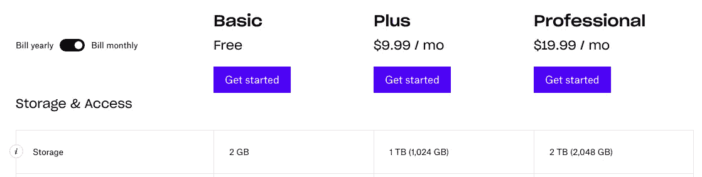
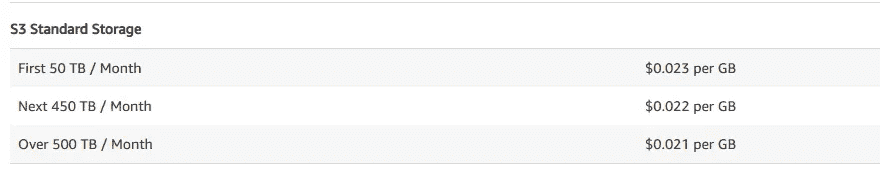
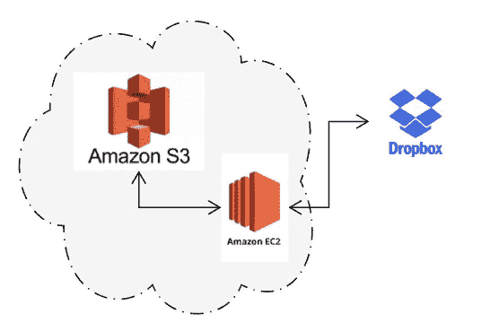
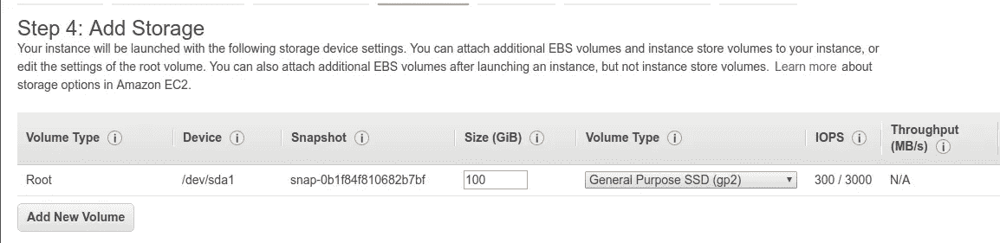
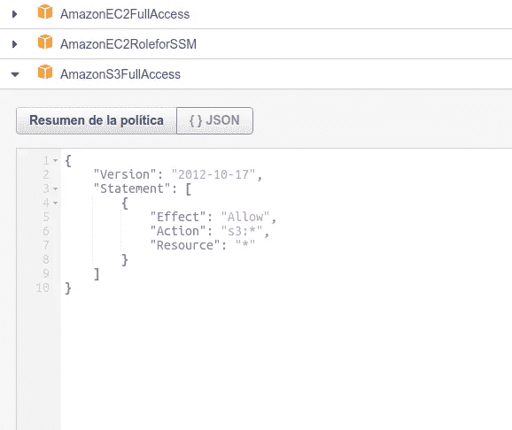

# Dropbox 到 S3:如何移植所有数据

> 原文：<https://itnext.io/dropbox-to-s3-how-to-port-all-that-data-5cebae6d6e40?source=collection_archive---------5----------------------->

因为当你看到信用卡上每月 10 美元的 dropbox 费用时，你会想“我可以做得更好”。

如果你和我一样，你已经丢失了损坏的硬盘上的数据。随着时间的推移，我们开始学习并把我们的电脑备份到云端。此外，有了像 Dropbox 和 Google Drive 这样的强大选项，这很容易，但在免费空间用完之后，我们必须满足于每月的费用吗？还是有 B 计划？

# 钱

迄今为止，Dropbox 对 1TB 的空间每月收费 10 美元。



[https://www.dropbox.com/individual/plans-comparison](https://www.dropbox.com/individual/plans-comparison)

亚马逊 S3 每月每 GB 收费 0.023 美元。



https://aws.amazon.com/s3/pricing/?nc1=h_ls

因此，如果你打算存储超过 434 GB 的数据，更经济的选择是 Dropbox，少于 434 GB 的话，你可以用 S3 来省钱。

```
434GB*0.023 = $9.98
```

# 物流

在决定移动我的数据后，下一个意识是这些年来我收集了多少数据。这与 450GB 的盈亏平衡点相去甚远，但 77GB 仍然超出了我想下载到我的本地计算机的容量，因为我不得不再次上传和删除。



答案是启动一个专用于数据传输的临时 EC2 实例。该实例将同步到我的 Dropbox，下载所有数据，然后将这些数据推送到 s3 存储桶进行长期存储。


## **DropBox 账号**

要估计您需要移动多少数据，请查看您的 DropBox 帐户页面上的用户下拉列表。

## EC2 实例

该实例是一台 **m5.large** 机器上的一个 **Ubuntu Server 18.04 LTS** 。我个人有 77GB 的数据，所以我选择添加 100 GiB 的实例存储(1GB 等于 0.931323 GiB) [*](https://docs.aws.amazon.com/emr/latest/ManagementGuide/emr-custom-ami-boot-volume-size.html) 。



为该实例分配一个对您将存储数据的 S3 存储桶具有读/写权限的角色，这一点很重要。快速而肮脏的方法是给角色 **AmazonS3FullAccess** 。然而，更安全和更可取的方法是修改 JSON 文件中的*资源*字段，使其只包含目标 bucket。



## S3 水桶

S3 铲斗可以是现有的，也可以是新的，只要最适合您的情况。也就是说，建议将其保存在与 EC2 实例相同的区域中，以减少延迟。

# 设置

启动所有资源后，我们将需要 ssh 到 EC2 实例。

```
ssh -i *YOUR-PEM-FILE-LOCATION* ubuntu@**YOUR-EC2-ADDRESS*
```

第一步是修改 *inotify.max_users。*这些实体用于监控 Linux 操作系统中的单个文件或目录。然而，在我们的例子中，我们将移动如此多的文件，以至于默认的最大用户数将导致系统错误并停止 DropBox 同步。

要避免这种情况，请将该设置至少增加到 100，000，并重新启动实例。

```
echo fs.inotify.max_user_watches=100000 | sudo tee -a /etc/sysctl.conf; sudo sy$sudo reboot
```

重新启动将终止 ssh 会话，因此您需要再次连接。

# 同步 DropBox

现在实例已经准备好了，我们可以将 Dropbox 帐户同步到它。下载/解压官方的 Linux64 tar 文件，运行预先配置好的安装脚本( *dropboxd* )。

```
cd ~ && wget -O - "[https://www.dropbox.com/download?plat=lnx.x86_64](https://www.dropbox.com/download?plat=lnx.x86_64)" | tar xzf -~/.dropbox-dist/dropboxd
```

当你运行 *dropboxd* 脚本时，它会输出一个链接到 DropBox 网页，要求你验证你是一个真实的人，你想同步帐户。将此链接复制粘贴到浏览器中并确认。

确认帐户后， *dropboxd* 脚本将需要继续运行，直到实例终止。这意味着您需要从另一个终端再次 ssh 到该实例，以完成剩余的任务。

另一种方法是将 *dropboxd* 脚本的输出写入一个文本文件。

```
~/.dropbox-dist/dropboxd >> DropBoxSync_output.txt 2>&1
```

在这种情况下，您将需要读取 tail*Dropbox sync _ output . txt*文件的结尾来获取网页链接。

```
tail ~/DropBoxSync_output.txt
```

该实例现已同步到 DropBox，并将开始自动下载您的所有文件。

# 同步到 S3

将我们的整个 DropBox 驱动器下载到实例后，最后一步是将数据从 EC2 实例传输到 S3 存储桶。

首先，我们必须安装 AWS 命令行。

```
sudo apt -y install awscli
```

最后，我们将数据推送到 S3。

```
aws s3 sync ~/Dropbox s3://**YOUR-BUCKET-LOCATION**/Dropbox
```

# 完成

就是这样。根据您要移动的数据量，该过程可能需要几分钟到几天的时间。最好监控 S3 存储桶大小(字节)指标，以了解有多少百分比的数据已经被传输。