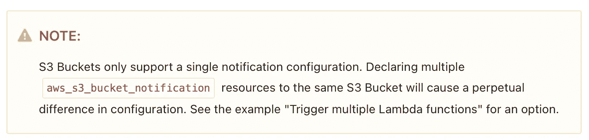

# 使用 Terraform 的动态自动气象站 S3 通知配置

> 原文：<https://itnext.io/dynamic-aws-s3-notification-configuration-using-terraform-43a74998e97a?source=collection_archive---------2----------------------->

这是你期望的简单的东西，嗯，简单。直到他们不再是。


詹姆斯·哈里逊在 [Unsplash](https://unsplash.com?utm_source=medium&utm_medium=referral) 上拍摄的照片

所以情况是这样的:

*   我有一个 aws **s3 桶**
*   我从这个桶中为 objectCreated 事件动态创建了多个**消费者**
*   **每个消费者订阅该桶上的特定前缀。也就是说，服务 1 将只监听 srv1/ path 上的新文件。service2 将仅侦听 srv2/ path 上的新文件，依此类推。**

因为一个 SNS 不能区分 s3 前缀，所以我需要多个 SNS 主题——每个服务一个

手动操作—非常简单，只需创建另一对 SNS/sq，我就可以开始了。但手动过程属于 1995 年的黑暗时代，我需要使用 IaaC 自动完成，在这种情况下使用 Terraform。

# 简单，我们开始吧！

所以我去了那里，确切地知道我需要做什么。创建一个 terraform 文件来管理 s3 存储桶、sns 主题及其策略，并使用正确的前缀(/srv1、/srv2 等)将每个 sns 主题附加到存储桶

像任何优秀的程序员一样——我想复制粘贴东西只是为了让它运行，所以我谷歌了“aws s3 sns notification terrafom”并点击了第一个链接(非常方便的是 terraform documentations)。这是链接:

> [https://registry . terra form . io/providers/hashi corp/AWS/latest/docs/resources/S3 _ bucket _ notification](https://registry.terraform.io/providers/hashicorp/aws/latest/docs/resources/s3_bucket_notification)

那一页上一句简单的话吸引了我的目光，也伤了我的心:



这一切意味着什么？？

# 没那么容易…

这意味着我可以在桶上附加一个 aws_s3_bucket_notification。这也意味着，我必须提前知道我将拥有的所有主题，因为我必须将它们作为 terraform 代码的一部分来编写。

但是我之前说了，我有一个动态的消费者名单，我不可能提前全部知道，我是不是被套牢了？

# 创意时间

所以在考虑了一会儿之后，我试着使用 aws api，获取配置并更新它。因此，如果我可以使用 API 来做这件事，并得到我想要的，我当然可以自动化它！

我花了很少的试错时间编写了一个 python 脚本，它接受很少的参数——bucket name、sns arn 和相关的前缀。脚本从 aws API 获取当前配置，检查订阅是否已经存在，如果不存在就添加它。

*如果有人需要 python 文件，我很乐意分享它*

现在我只需要运行作为 Terraform 一部分的脚本。

## 地形空资源和本地执行`provisioner`

> `null_resource`资源实现了标准的资源生命周期，但是没有采取进一步的行动。
> 
> `triggers`参数允许指定任意一组值，当这些值被更改时，将导致资源被替换。

基本上 null_resource 可以做任何事情，它在云中没有后台资源，它有一个触发器和一个 provisioner，一旦触发器改变，provisioner 就会运行。

所以我在有 SNS 主题的地方添加了一个空资源，传递 bucket 名称、sns arn 和前缀，就这样！

```
provider "null" {}resource "null_resource" "s3_object_created_subscription" { triggers = {
     prefix = var.prefix
  } provisioner "local-exec" {
     command = "python ${var.bucket_name} ${var.sns_arn} ${var.prefix}"
  }
}
```

这一小段代码可以从许多 terraform 状态文件中运行，并将一个 sns 附加到一个 bucket，可以使用我需要的任何前缀和多少前缀。像任何 terraform 资源一样，它有状态，所以它只运行一次，除非你改变前缀。

# 结论

我知道那是个骗局。它可能会中断，因为 s3 API 最终是一致的。但这并不困扰我，因为我没有大量的并行变化。

与使用多个存储桶相比，其背后的原因是我解决的存储桶限制。亚马逊目前只允许每个账户 1000 桶。那实际上是很多桶。但是一旦你有多个服务，比如说 30 个，每个服务至少需要 1 个存储桶，并且你有动态测试环境，你可以很容易地看到你是如何达到这个限制的。