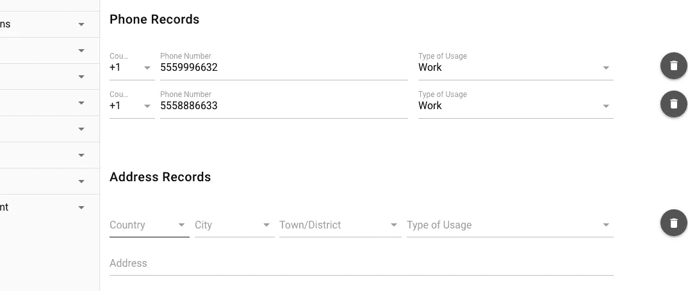
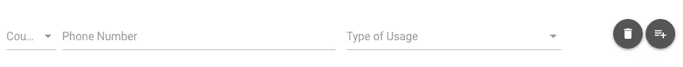
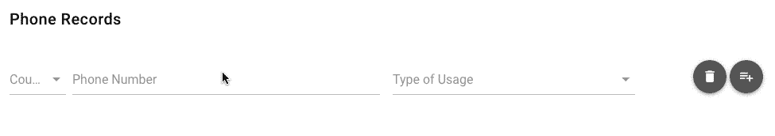

# Vue.js 中的动态组件创建

> 原文：<https://itnext.io/dynamic-component-creation-in-vue-js-b002bb41aaf4?source=collection_archive---------0----------------------->

事情是这样的:

例如，您正在创建一个包含重复字段列表的表单；

1.  电话号码、地址、标签、姓名等的列表。,
2.  愿望列表、输入具有嵌入其中的搜索功能，
3.  可能是 todo 应用？实际上还在 21 世纪？



也许是这样的？

如果你是 JavaScript 开发人员，你会这么做；

1.  创建单行表单输入的模板，
2.  在行尾放置一些“添加/删除”按钮或图标，
3.  使用 jQuery clone 命令并在行列表的末尾或开头附加/前置，
4.  重置输入内容的新行并聚焦它们，这样用户可以捕捉到刚刚发生的事情。

但是，如果你是用 Vue.js 开发的，你应该知道更多的东西。因为你现在有组件，观察器和其他一些令人兴奋的东西可以使用，一旦你做了，你可能会在其他地方再次使用。所以复制/粘贴片段，不再仅仅是复制/粘贴片段。是时候阻止你的雇主嘲笑自己是本月(或年度)复制/粘贴员工了？)

首先是创建一个可重用的组件。我将创建一个电话号码组件，稍后我将在应用程序的创建联系人页面中使用它。但重点是使用相同的电话号码组件也在编辑联系页面内，可能显示电话号码页面等。

由于我使用的是[类星体框架](https://quasar.dev/introduction-to-quasar)，*，顺便说一下*很棒，我将使用它的一些其他组件。所以不要介意标签以小写字母 Q 加破折号开始，它们会按照破折号后面的意思工作(Q-Field 是一个表单域，Q-Input 是一个表单输入等等。)它们也有类星体的一些特殊属性，但都是不言自明的。您可以在几秒钟内用原生 div/input 标记替换它们。

这是我们的伙伴 PhoneNumberLine 组件的模板；

```
<template>
  <div>
    <div **v-for="(line, index) in lines"** **:key="index"** class="row">
      <div class="col-lg-6">
        <div class="row">
          <div class="col-2">
            <q-select
              **v-model="line.countryCode"**
              label="Country Code"
              :options="countryPhoneCodes"
            />
          </div>
          <div class="col-10">
            <q-input
              **v-model="line.number"**
              label="Phone Number"
              type="tel"
              placeholder="5551234567"
              value=""
            />
          </div>
        </div>
      </div>

      <div class="col-lg-4">
        <q-select
          **v-model="line.phoneUsageType"**
          label="Type of Usage"
          :options="phoneUsageTypes"
        />
      </div>

      <div class="col-lg-2">
        <div class="block float-right">
          <q-btn round **@click="removeLine(index)"** icon="delete" />
          <q-btn round v-if="index + 1 === lines.length" **@click="addLine"** icon="playlist-plus"/>
        </div>
      </div>
    </div>
  </div>
</template>
```



组件的基本视图

我已经强调了代码的重要部分。从上到下更好的解释那些；

1.  我们在组件的数据部分有一个*数组*(名为**行**)，它在 [v-for 指令](https://vuejs.org/v2/guide/list.html#Mapping-an-Array-to-Elements-with-v-for)中使用，
2.  应该有[键绑定](https://vuejs.org/v2/guide/list.html#key)，这样 Vue.js 就可以跟踪要创建的列表的元素，这就是我们的**索引**，
3.  输入将使用 [v-model 指令](https://vuejs.org/v2/guide/forms.html)将其值绑定到**行**数组内的**行**和*对象*中。也就是说**行** *对象*本身应该包含**国家代码**，**编号**，以及 **phoneUsageType** *键*。
4.  最后是删除和添加新行的按钮。删除按钮的 **removeLine** *方法*以 **index** 为属性，另一个按钮的 **addLine** *方法*已经绑定到它们的 [**click**](https://vuejs.org/v2/guide/events.html#Listening-to-Events) *事件。*

现在我们准备创建组件的其余部分；

```
<script>
**export default** {
  name: 'PhoneNumberLine',
  data () {
    **return** {
      lines: [],
      blockRemoval: **true,**
      phoneUsageTypes: [
        {
          label: 'Home', value: 'home'
        }, {
          label: 'Work', value: 'work'
        }, {
          label: 'Mobile', value: 'mobile'
        }, {
          label: 'Fax', value: 'fax'
        }
      ],
      countryPhoneCodes: [
        {
          label: '+90',
          value: '+90'
        }, {
          label: '+1',
          value: '+1'
        }
      ]}
  },
  watch: {
    lines () {
      **this**.blockRemoval = **this**.lines.length <= 1
    }
  },
  methods: {
    addLine () {
      **let** checkEmptyLines = **this**.lines.filter(line => line.number === **null**)

      **if** (checkEmptyLines.length >= 1 && **this**.lines.length > 0) {
         **return
**      } **

      this**.lines.push({
        countryCode: **null**,
        number: **null**,
        phoneUsageType: **null** })
    },

    removeLine (lineId) {
      **if** (!**this**.blockRemoval) {
         **this**.lines.splice(lineId, 1)
      }
    }
  },
  mounted () {
    **this**.addLine()
  }
}
</script>
```

以上，**行**阵*阵*你已经了解了一点。但是另一段代码有；

1.  **blockRemoval** *数据*对象*的键*仅仅是在**行** *数组* **表** *方法*内设置为**真**时阻止我们最后一行输入的移除。
2.  **phoneUsageTypes** 和 **countryPhoneCodes** 键只是选择输入的数据提供者。
3.  在**行**行*观察器*中，Vue 跟踪**行**行*阵列*的长度并切换**块移除**。
4.  **addLine** *方法*，当被相关按钮触发时，首先检查有多少电话号码字段是空的，然后检查我们总共有多少行，如果已经有空的电话号码字段和零行以上，它会阻止新行的创建。这样做是因为当组件被渲染时， **lines** *array* 为空，在 v-for 指令中不应该有任何行被渲染。但是由于这个方法同时检查空字段和总行长度，所以它允许在安装组件时创建第一个空行。
5.  **addLine** *方法*最终将一个空对象推送到 **lines** *数组*中，由于我们的 reactive v-for 指令，应该会自动创建新的输入行。
6.  **removeLine** *方法*检查 **blockRemoval** *键*并从 **lines** *数组*中删除相关项。v-for 指令完成剩下的工作，并从表单中删除一行输入。
7.  还有我们的**挂载的** *函数*调用 **addLine** *方法*一次，创建我们的第一个空行。



添加新行

给你。最终版本有；

1.  防止最后一行被删除，
2.  如果已经有一个空行，则阻止添加新行，
3.  保持输入数据的持久记录。

这是本教程的完成代码: