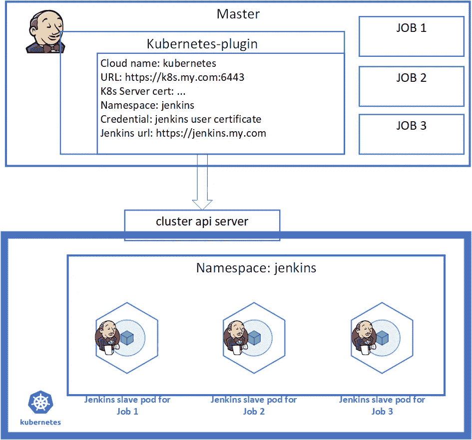
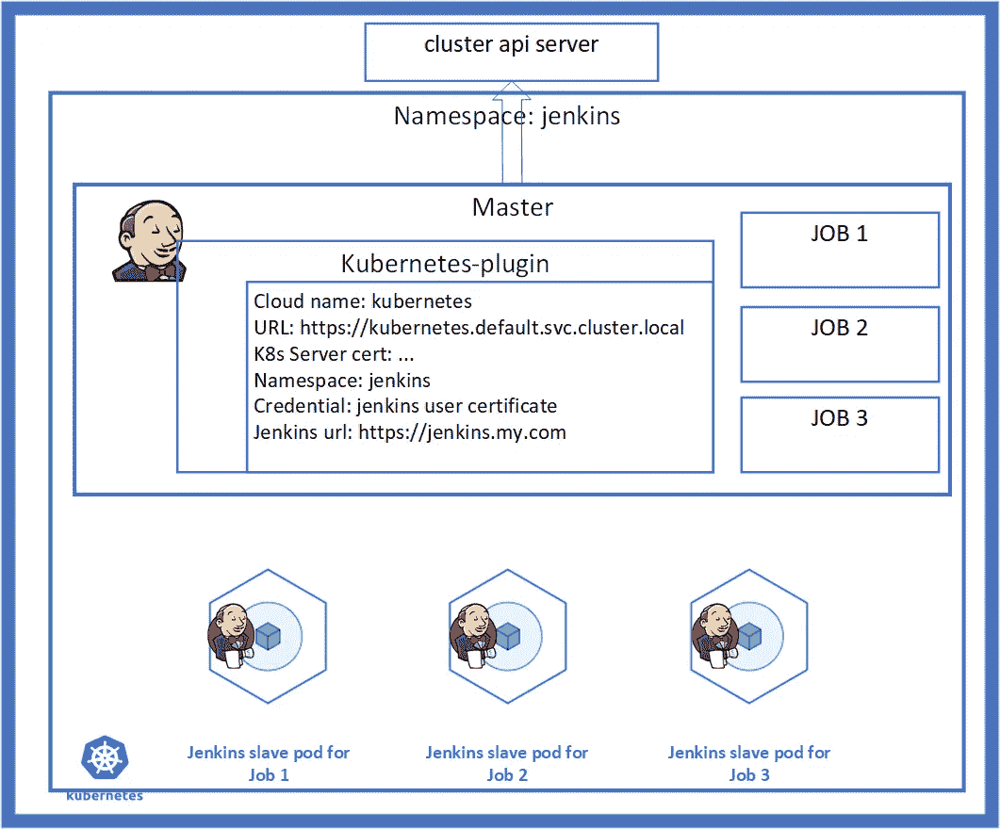
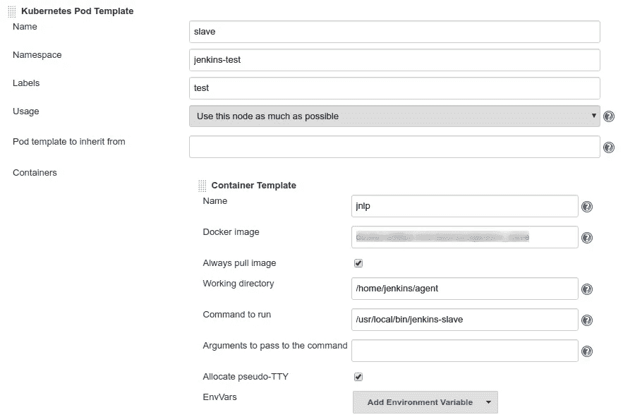

# Kubernetes 的动态詹金斯代理

> 原文：<https://itnext.io/dynamic-jenkins-agent-from-kubernetes-4adb98901906?source=collection_archive---------1----------------------->

Kubernetes 中的动态 Jenkins 代理供应

# 介绍

Jenkins 是一个历史悠久的 CI/CD 工具，并且一直在不断发展。它的[主/代理架构](https://jenkins.io/doc/book/architecting-for-scale/)对于分布式构建的可伸缩性非常好。有许多[方式](https://jenkins.io/blog/2018/09/14/kubernetes-and-secret-agents/)来供应 Jenkins 代理，从使用裸机、虚拟机、动态 EC2 实例、来自 Docker 的容器或 Kubernetes 集群。

Jenkins 和 Kubernetes 集群之间的集成非常好。凭借这些优势，我已经将 CI/CD 管道从基于主机(VM)的代理完全迁移到基于 Pod 的代理。

*   Kubernetes 的动态 Jenkins 代理，轻量级，在几秒钟内按需供应
*   为每个构建提供新鲜且可重复的 Jenkins 代理环境
*   Kubernetes 带来的资源/成本节约

在本文中，我想分享我最近的方法，使用 Jenkins 共享库的方法，在 Jenkins 管道中用简单的代码行动态地提供 Jenkins 代理。

声明管道

```
[@Library](http://twitter.com/Library)("k8sagent@v0.1.0") _  **<-- invoke library**
pipeline {
  agent {
    kubernetes(k8sagent(name: 'mini+pg')) **<- Jenkins Agent provisioned**
  }
  stages {
    stage('demo') {
      steps {
        echo "this is a demo"
        script {
          container('pg') {
            sh 'su - postgres -c \'psql --version\''
          }
        }
      }
    }
  }
}
```

脚本化管道

```
[@Library](http://twitter.com/Library)("k8sagent@v0.1.0") _  **<-- invoke library**
my_node = k8sagent(name: 'mini+pg')
podTemplate(my_node) { **<--Jenkins Agent provisioned**
  node(my_node.label) {
    sh 'echo hello world'
    container('pg') {
      sh 'su - postgres -c \'psql --version\''
    }
  }
}
```

在这个单行示例中，名称“mini+pg”是请求一个带有标准 JNLP 容器和“postgresql”容器的“mini”大小 Pod 的 Jenkins 代理。类型“mini”和“pg”是资源文件中定义的模板。库中还有其他模板，如“小”、“大”、“特权”，您可以自由混合/添加/更改。

除了动态请求/释放 Jenkins 代理来运行您的 CI/CD 管道之外，这是一种动态定义所需代理的方法。我在下面描述了如何扩展你的用法。

## 源代码

```
github [link](https://github.com/liejuntao001/jenkins-k8sagent-lib)
```

# 詹金斯如何与 Kubernetes 合作

介绍文章很多，列举几篇( [GCP](https://cloud.google.com/solutions/jenkins-on-kubernetes-engine) 、 [AWS](https://dzone.com/articles/scaling-jenkins-with-kubernetes) 、 [Azure](https://blog.jcorioland.io/archives/2017/11/21/continuous-delivery-kubernetes-azure-jenkins-helm.html) 等)。它们都是基于 Jenkins 的 Kubernetes 插件。

有两种集成模型。

1.  现有的 Jenkins 实例连接到新的 Kubernetes 集群。

当我第一次做集成时，我已经有一个生产 Jenkins 在运行，所以这绝对是一条直路。

注:一个[链接](https://kumorilabs.com/blog/k8s-6-integrating-jenkins-kubernetes/)关于如何向 K8s 认证 Jenkins。



独立的 Jenkins + K8s 集群

2.在 Kubernetes 集群中创建一个新的 Jenkins 实例。

在将第一个模型投入生产后，出于不同目的运行多个 Jenkins 实例的想法，我尝试了第二个模型，并认为它是更好的方法。



Kubernetes 星团中的 Jenkins

这两种模型都可以很好地工作，甚至可以在同一个 Kubernetes 集群中不同的名称空间中工作。

## 供应代理的官方指南

Jenkins 的 [Kubernetes 插件](https://github.com/jenkinsci/kubernetes-plugin)为定义简单/复杂代理的各种方法提供了文档和[示例](https://github.com/jenkinsci/kubernetes-plugin/tree/master/examples)。

Jenkins 代理是一个由 Kubernetes 提供的 Pod，具有多个运行指定 Docker 映像的容器。主容器必须来自 [jenkins/jnlp-slave](https://hub.docker.com/r/jenkins/jnlp-slave) 或兼容的映像。最好构建自己的映像，包括来自 [jenkins/docker-slave](https://github.com/jenkinsci/docker-slave) 的 Dockerfile 内容。

使用 Kubernetes 提供的各种机制是非常灵活的，包括 Pod 中的多个容器，在它们之间共享网络，共享工作目录、初始化容器、资源限制、环境、秘密等…

基本上，有三种方法来提供代理，

*   声明管道中的 YAML
*   脚本管道中的配置
*   Jenkins UI 中的配置

1.  声明性管道，它将为预期的 Pod 写下 yaml 文件。

```
[link](https://github.com/jenkinsci/kubernetes-plugin#declarative-pipeline)pipeline {
  agent {
    kubernetes {
      yaml """
<A long yaml file>
"""
    }
  }
...
```

2.脚本管道，用于配置所有的[参数](https://github.com/jenkinsci/kubernetes-plugin#pod-and-container-template-configuration)。

```
[link](https://github.com/jenkinsci/kubernetes-plugin#container-configuration)podTemplate(cloud: 'kubernetes', containers: [
    containerTemplate(
<All kinds of configurations>
]) {
   ...
}
```

3.Jenkins 配置，即将“Pod 模板”的所有配置填入 UI。



## Jenkins UI 中的 Pod 模板配置

方法 3 是我的起点，因为它与 Jenkins master 中定义的其他类型的代理是一样的。

我为不同的任务定义了多个“Pod 模板”。例如，具有 4 个 CPU/8GB RAM 的通用“从”适合大多数构建。一些大型项目可能需要 8 个 CPU/16GB RAM，称为“大型从属”。有些人可能需要额外的 PostgreSQL 容器进行测试，称为“slave-pg”。

有些模板是相似的，我们甚至可以使用“[模板继承](https://github.com/jenkinsci/kubernetes-plugin#pod-template-inheritance)”特性来节省一些精力，这很好。

在管道中，很容易使用 Pod 模板的标签来选择代理。

```
pipeline {
 agent {
  label "slave"
 }
...
}
```

随着时间的推移，观察到了一些问题。

*   Pod 模板太复杂，无法从 Jenkins UI 进行配置

单个 Pod 模板可以轻松拥有 30 多个配置项。这显示了 Kubernetes 的巨大灵活性，但对 UI 不利。

*   多个 Pod 模板不可管理

随着“各种任务”需求的增加，配置的模板数量也在增加。由于没有太多(少于 10 个)模板，Jenkins 配置 UI 的这个部分有 10 多页。真的很难找到合适的地方做出合适的改变。

*   跨 Jenkins 实例的 Pod 模板配置

随着我将更多的 Jenkins 实例投入生产，跨实例配置这些模板就成了一个问题。我怀疑没有人会愿意把 10 页的配置从一个 Jenkins 复制到另一个 Jenkins。

詹金斯配置作为代码( [JCasC](https://github.com/jenkinsci/configuration-as-code-plugin) )还不是拯救者，我相信。

*   缺乏决定论

项目在其管道中使用“代理标签 A”的方式创建了对 Jenkins 中定义的“代理 A”的依赖，就像一个谜。没有办法确切地知道代理 A 中有什么，A 今天是否与昨天相同，或者 A 在 Jenkins 实例中是否不同。如果代理是以可变的方式创建的，那就有问题了。

*   缺乏追踪能力

随着项目的发展，它对代理的需求也在发展。例如，project v1.0.0 可能只需要一个标准代理，而 v1.5.0 需要一个带有 PostgreSQL 容器的代理来进行测试。有时代理中使用的 docker 映像也需要升级。请求 Jenkins 管理员修改代理或创建新代理听起来很容易。但是很快就没有跟踪这种变化的能力了。

即使存在一些问题，这种方法仍然是那些必须在各种代理上运行而不是在 Kubernetes 中的 Pod 上运行的管道的必备方法。

## 管道源代码中的 Pod 模板

通过看[Kubernetes plugin for Jenkins](https://github.com/jenkinsci/kubernetes-plugin)的文档，我相信设计思路是在管道源代码中写 Pod 模板。声明式和脚本式管道都有很多[的例子](https://github.com/jenkinsci/kubernetes-plugin/tree/master/examples)。

在我的观察中，随着插件版本的升级，插件正在采取措施让 YAML 定义代理而不是配置。我欢迎这一变化，因为对 Jenkins pipeline 和其他 Kubernetes 任务使用相同的 YAML 方式非常舒服。

一个相关的主题是关于管道代码如何与项目集成，例如，它应该在同一个源代码库中还是在项目之外。判断哪个更好(或更合适)取决于很多因素。对我来说，我必须两者兼顾。

在尝试这种方法时，我遇到了两个主要问题。

*   下面是一个从插件的[示例](https://github.com/jenkinsci/kubernetes-plugin/blob/master/examples/dind.groovy)中复制的示例管道。

在这个简单的例子中，定义 Pod 模板的 YAML 是 20 行代码，而构建逻辑是 5 行。

根据我的实际经验，实际有用的 YAML 可以轻松超过 50 行。我觉得这在管道代码中太长了。而且是类似项目的重复代码。

*   如果您有 100 个项目，很难在管道代码中为 Pod 模板 YAML 修改 100 个项目。

不同的组织有不同的开发模式。没有一个答案是谁应该对项目管道负责，特别是管道代码中的 Pod 模板部分。
如果是单独的项目团队，不可能同时执行变更。例如，当需要为安全补丁升级 docker 映像时，应同时为所有项目立即采取行动。
如果是一个敬业的团队，我无法想象有效修改 100 个项目的努力。很有可能漏掉一些。

# 将 Pod 模板移动到 Jenkins 共享库

当 Jenkins 管道代码中有共同的东西时，很自然地将它们移到 [Jenkins 共享库](https://jenkins.io/doc/book/pipeline/shared-libraries/)。

当我在寻找一个使用库进行 Kubernetes 代理供应的解决方案时，我受到了这个 [salemove/pipeline-lib](https://github.com/salemove/pipeline-lib) 项目的启发。

这是一个 Jenkins 共享库，它提供了一个 [inPod](https://github.com/salemove/pipeline-lib/blob/master/vars/inPod.groovy) 方法。inPod 是 podTemplate 的一个瘦包装器，它提供了将预定义的配置与参数相结合的灵活性。以 inPod 为基础，其他一些包装器定义了各种参数，例如 [inDockerAgent](https://github.com/salemove/pipeline-lib/blob/master/vars/inDockerAgent.groovy) ， [inRubyBuildAgent](https://github.com/salemove/pipeline-lib/blob/master/vars/inRubyBuildAgent.groovy) ，以提供不同种类的代理。

例如，下面这段代码提供了一个带有“node:9-alpine”docker 图像的代理。

```
inPod(containers: [interactiveContainer(name: 'node', image: 'node:9-alpine')]) {
  checkout(scm)
  container('node') {
    sh('npm install && npm test')
  }
}
```

主要思想是从包装层收集参数，并将它们放在一起，供 Kubernetes 插件使用。

有一个关键函数 addWithoutDuplicates，在这里实现了[和](https://github.com/salemove/pipeline-lib/blob/master/src/com/salemove/Collections.groovy#L4)，它将列表合并在一起，使参数优先于默认值。

```
// For containers, add the lists together, but remove duplicates by name, giving precedence to the user specified args.
  def finalContainers = addWithoutDuplicates((args.containers ?: []), defaultArgs.containers) { it.getArguments().name }
```

通过查看该项目的介绍，这是一个已经在生产中的成功的库。这个想法很好，当我想进口供自己使用时，我发现它不适合我的情况。

*   该库依赖于方法 2，向 Pod 模板提供配置。虽然我认为新的趋势是 YAML。
*   该库仅适用于脚本化管道。在我的工作范围内，我有声明性管道和脚本化管道。我需要一个解决方案来解决这两个问题。
*   podTemplate 有许多配置，但这些并不是 Kubernetes 支持的所有东西。事实上，有一个“yaml”配置来提供原始的 yaml。原始 yaml 将与其他配置合并。
*   该库侧重于向代理提供不同的 docker 映像/卷。这很好，但我需要更多，其中许多只在'原始 yaml '支持。

## 詹金斯图书馆从 Kubernetes 获取动态代理

出于这些考虑，我想探索一种满足这些要求的新解决方案:

*   基于方法 1，全 YAML 格式
*   适用于脚本化管道和声明性管道
*   灵活调配各种代理
*   易于使用的管道代码和隐藏库中的细节
*   易于开发库以支持不断增长的代理类型需求

经过一些调查，我相信我的想法是可行的，通过查看来自 Kubernetes 插件的这两个例子: [dind.groovy](https://github.com/jenkinsci/kubernetes-plugin/blob/master/examples/dind.groovy) 和 [declarative.groovy](https://github.com/jenkinsci/kubernetes-plugin/blob/master/examples/declarative.groovy) 。

这两个例子的共同点如下

```
# scripted pipeline
podTemplate(**Map**) {
}# declarative pipeline 
 agent {
    kubernetes {
      **Map**
    }
 }
```

目标是用期望的 yaml 内容生成映射，它定义了代理的 Pod 规范。

方法是定义部分 yaml 的小部分，每个部分都针对代理的特定需求，然后将它们合并在一起，组成 Pod 的最终 yaml 格式规范。

例如，代理可能需要进行 maven 或 gradle 构建，一个名为“maven”的资源文件包含一个带有“maven”docker 映像的容器，另一个文件“gradle”包含“gradle”docker 映像。代理可能需要更少或更多的计算能力，映射到资源文件“小”/“大”/“快”以请求一些 CPU/内存资源。代理可能需要构建中的“特权”Pod、定义“安全上下文”的资源文件“特权”,在我的情况下，还需要“podAntiAffinity”来确保一台主机中只有一个特权 Pod。

把它们加在一起，用‘A+B+C’的格式定义一个代理，比如‘maven+small+privileged’，库会返回合并后的 yaml。

“small+pg”的代码示例:

```
# base
spec:
  hostAliases:
  - ip: "192.168.1.15"
    hostnames:
    - "jenkins.example.com"
  volumes:
  - hostPath:
      path: /data/jenkins/repo_mirror
      type: ""
    name: volume-0
  containers:
  - name: jnlp
    image: jenkinsci/jnlp-slave:3.29-1
    imagePullPolicy: Always
    command:
    - /usr/local/bin/jenkins-slave
    volumeMounts:
    - mountPath: /home/jenkins/repo_cache
      name: volume-0# small
spec:
  containers:
  - name: jnlp
    resources:
      limits:
        memory: 8Gi
      requests:
        memory: 4Gi
        cpu: 2# pg
spec:
  containers:
  - name: pg
    image: postgres:9.5.19
    tty: true# merged
spec:
  hostAliases:
  - ip: "192.168.1.15"
    hostnames:
    - "jenkins.example.com"
  volumes:
  - hostPath:
      path: /data/jenkins/repo_mirror
      type: ""
    name: volume-0
  containers:
  - name: jnlp
    image: jenkinsci/jnlp-slave:3.29-1
    imagePullPolicy: Always
    command:
    - /usr/local/bin/jenkins-slave
    volumeMounts:
    - mountPath: /home/jenkins/repo_cache
      name: volume-0
    resources:
      limits:
        memory: 8Gi
      requests:
        memory: 4Gi
        cpu: 2
  - name: pg
    image: postgres:9.5.19
    tty: true
```

为了便于开发，我从一个类似的 gradle 项目开始，该项目使用 TDD 方法来开发一个 Jenkins 共享库。我在这篇[文章](https://medium.com/@liejuntao001/get-a-build-number-from-service-2286d2750094)中介绍过，原始源代码是 [github link](https://github.com/liejuntao001/jenkins-buildnumber-lib) 。

gradle 项目的结构是这样的:

```
.
├── build.gradle
├── resources
│   └── podtemplates **<- many Yaml files**
├── src
│   └── com/github/liejuntao001/jenkins/MyYaml.groovy **<- merge Yaml**
├── test
│   └── groovy
│       └── K8sAgentTest.groovy **<- test**
├── testjobs
│   ├── k8sagent_Jenkinsfile.groovy
│   └── simple_Jenkinsfile.groovy **<- samples**
│   └── simple_scripted.groovy
└── vars
    └── k8sagent.groovy **<- method**
```

运行测试

```
./gradlew clean test

> Task :test
K8sAgentTest: testSdk25: SUCCESS
K8sAgentTest: testSmall: SUCCESS
K8sAgentTest: testBase: SUCCESS
K8sAgentTest: testDind: SUCCESS
K8sAgentTest: testFast: SUCCESS
K8sAgentTest: testPg: SUCCESS
K8sAgentTest: testPrivileged: SUCCESS
Tests: 7, Failures: 0, Errors: 0, Skipped: 0
```

要进一步开发这个库，只需修改 resources/podtempltes 中的资源文件来满足您的需求。

在 test/groovy/k8 sagenttest . groovy 中添加测试用例，以根据代理的预期 Yaml 内容测试合并的 Yaml。

一些注意事项:

*   建议库中使用的所有 docker 图像都是自建的私有图像，以确保内容
*   建议用版本号标记所有 docker 映像，以获得确定性代理。
*   建议整个 Jenkins 库都用版本标签发布。所有调用库的管道都要使用[@库](http://twitter.com/Library)(“k8s agent @ v 0 . 1 . 0”)_
*   源代码中有一个 base.yaml，它定义了 jnlp 容器和所有代理类型所需的通用内容。在 k8sagent.groovy 中，base.yaml 包含在所有代理中。如果有要求使一个公共库成为不可能，那么 k8sagent.groovy 需要更新。

## Yaml 合并策略

据我所知，没有一种“适合所有人”的 Yaml 合并方法。

例如，Yaml 的主要数据结构是映射和列表。在 Kubernetes 的规范中，列表有时对序列敏感，有时不敏感。

```
# sequence sensitive List
command: ["/bin/sh"]
args: ["-c", "while true; do echo hello; sleep 10;done"]# sequence insensitive List
containers:
- name: A
- name: B
```

在 Kubernetes 插件中，有一个[参数](https://github.com/jenkinsci/kubernetes-plugin#pod-and-container-template-configuration)yamlmergestrial:merge()或 override()来决定如何合并继承中的 Yaml。

在我的实现中，我重用了来自 [OndraZizka/yaml-merge](https://github.com/OndraZizka/yaml-merge/blob/master/src/main/java/org/cobbzilla/util/yml/YmlMerger.java) 的代码，并将其修改为“工作正常”的级别以适应我的场景。它解决了如下用例:

```
# a.yaml
containers:
- name: **A**
  some_config# b.yaml
containers:
- name: **A**
  some_other_config# merged yaml
containers:
- name: **A**
  some_config
  some_other_config
```

对于更复杂的场景， [MyYaml.groovy](https://github.com/liejuntao001/jenkins-k8sagent-lib/blob/master/src/com/github/liejuntao001/jenkins/MyYaml.groovy) 可能需要更新。但是我认为大多数情况可以通过定义细粒度的 Yaml 文件来解决。

> 2020 年 10 月 23 日更新

*   添加可选参数 nodeSelector

例子

```
k8sagent(name: 'base', selector: 'kubernetes.io/hostname: worker1')
```

*   添加可选参数 jnlpImage

例子

```
k8sagent(name: 'base', jnlpImage: 'jenkinsci/jnlp-slave:my_test_version')
```

## 参考

[詹金斯的 Kubernetes 插件](https://github.com/jenkinsci/kubernetes-plugin)

*感谢阅读。*