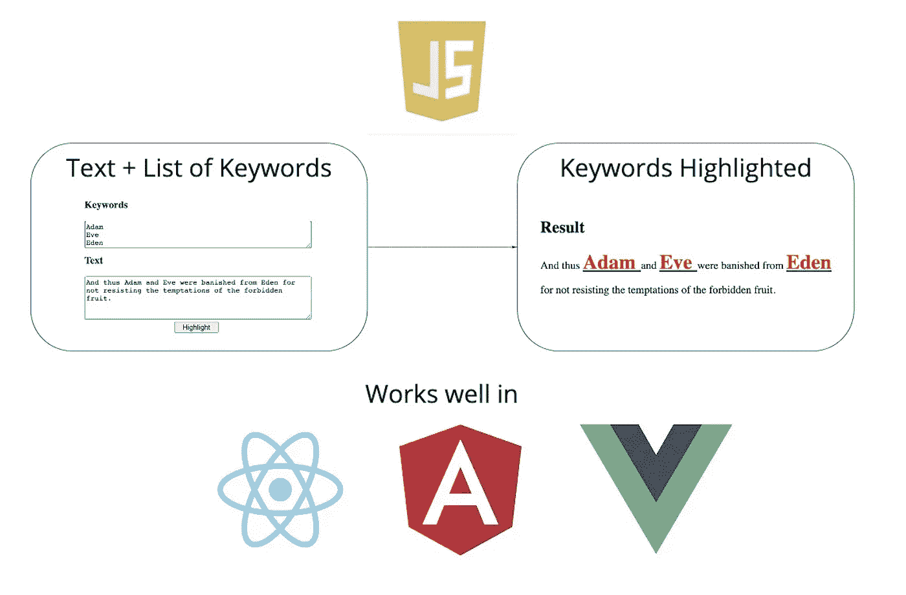
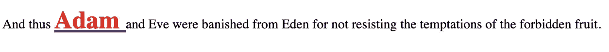
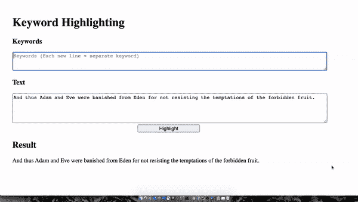

# Javascript 中的动态关键词高亮显示

> 原文：<https://itnext.io/dynamic-keyword-highlighting-in-javascript-434437f9afca?source=collection_archive---------0----------------------->

## 一种简单、普通的 JavaScript 技术，可以在任何您喜欢的 web 开发框架中使用，使文本内容更加生动

图片来源:作者

在 web 开发中，经常需要用特殊的样式配置(大字体、粗体、不同的颜色)突出显示文本块中的特定关键字，并链接到不同的页面。示例使用案例包括:

1.  链接到**维基百科**定义的特定领域术语
2.  带有社交媒体个人资料链接的人名
3.  链接到**谷歌地图**坐标的地名

当然，如果预先知道内容和想要的关键字集，可以通过直接在*中硬编码相应的样式标签，以纯 HTML 的方式完成任务。html* 文件。

硬编码示例->代码(图片来源:作者)

硬编码示例->渲染(图片来源:作者)

但是想象一下，无论是文本内容还是要突出显示的关键字列表都是事先不知道的。此外，从开发人员的角度来看，一遍又一遍地复制相同的 HTML 标签也不太好。那么问题就变成了:

> 在 JavaScript 中有没有一种简单的方法可以动态地做到这一点？

答案是明确的**是**和相应的肯定回答**如何？**”问题将在下面的段落中讨论，敬请关注！

# 你将如何从这篇文章中受益

读完本文后，您将知道何时以及如何为 web 应用程序中显示的文本块实现动态关键字高亮显示。因为它是一种纯 JavaScript 技术，你将能够在所有最先进的 web 开发框架中获益，如 **React、Angular** 或 **Vue** 。

# 示例项目

因为编程最好是通过实践来教授，所以让我们构建一个迷你项目，并在前进的过程中解释关键概念。在写作结束时，我们将构建一个简单的应用程序，如下所示:

激励的例子(图片来源:作者)

这个想法是，一旦你知道如何从一组未知的关键字和未知的内容中添加动态高亮显示到你的 web 应用程序中，你将能够在任何情况下重用这个技术。

您可以和我一起从头开始构建示例应用程序，也可以在 [**Stackblitz**](https://stackblitz.com/edit/javascript-keyword-highlighting?file=index.html) 上立即开始使用它。现在，我们已经适当地激励了自己，让我们看看如何建立这一点。

# 超文本标记语言

该项目的 HTML 源代码相当简单。抛开额外的 div 标签来实现一些像样的页面格式，您应该注意这 4 个元素:

1.  **关键字输入** (id = "keyword-input ")
2.  **文本输入** (id = "文本输入")
3.  **高亮按钮** (id = "提交-按钮")
4.  **结果分区** (id = "result ")

应用程序的 HTML 部分(图片来源:作者)

在**关键字输入**中，我们将提供一组由新行字符分层的关键字。在**文本输入**中，我们将插入一个文本块，最好包含上面的一些关键词。

一旦提供了输入，点击**高亮按钮**将呈现位于下方的**结果** div 中的文本块，所提供的关键词以红色粗体大字体高亮显示，并带有到相应 Google 搜索查询的超文本链接。

建立好 HTML 框架后，让我们实现所需的高亮显示功能，同时学习一个重要且意义深远的 JavaScript 编程概念。

# Java Script 语言

功能代码部分实际上相对较短。它由 3 种方法组成:

1.  突出显示()
2.  transformContent(内容，关键字)
3.  wrapKeywordWithHTML(关键字，url)

应用程序的 JavaScript 部分(图片来源:作者)

允许我们将想要的高亮特性放在一起的关键概念是 JavaScript 可以动态地改变 HTML。更准确地说，使用 JavaScript，可以引用一个给定的 DOM 元素，并用包含任意 HTML 的**字符串**值修改其 **innerHTML** 字段。一旦设置了该属性，浏览器将呈现新内容供用户查看，给页面一种快速响应的感觉

换句话说，您可以使用 JavaScript 基于参数(例如用户输入)动态构建 HTML 代码，然后将其传递给您希望更改的元素的 **innerHTML** 属性。

这正是 **highlight()** 函数正在做的事情。它从相应的输入字段中提取关键字和文本内容，调用神奇的 **transform(content，keywords)** 方法，最后，将这个调用的结果转储到 **result** div 的 **innerHTML** 字段中。

**transform(content，keywords)** 函数遍历关键字，并使用 **RegExp** 将内容中的每个关键字替换为用定制 HTML 包装的关键字。这个 HTML 来自于**wrapkeywordwithtml(关键字，url)** ，这里完成了繁重的工作。

给定一个单词，**wrapkeywordwithtml(keyword，url)** 函数会用 2 个 HTML 标签包装它。 ***< span >*** 标签用于改变默认样式(例如，使单词变大、加粗和红色)，而***<>***标签允许我们超链接到作为参数传递的 **URL** 。

这就是事情的全部。给定文本和关键字列表，我们遍历关键字并用自定义 HTML 包装它们。然后，我们通过设置我们希望保存新内容的 DOM 元素的 **innerHTML** 属性，将它呈现在页面上。

# 奖金(CSS 使其看起来更性感)

恭喜你！您已经编写了动态关键字突出显示的普通 JavaScript 实现。如果你和我一起创建这个页面，这里有一些 CSS 代码，可以让它看起来像文章开头的预览 GIF。

应用程序的 CSS 部分(图片来源:作者)

# 结论

所以，现在你有了一个可爱的 JavaScript 小技巧，可以让你的网页看起来更生动。然而，除了将这种技术存储在您的通用 JavaScript 工具包中之外，我希望您从本文中学到更深刻的东西。

这个教训就是 JavaScript 按需修改 HTML 代码的能力非常强大。一旦意识到这一点，你就可以创造无限的用户体验，定义无限的设计模式抽象，以重用当今 web 开发中无处不在的样板代码。

毕竟，这就是像 **Angular** 和 **React** 这样的全能前端框架的工作方式。本质上，它是利用开发人员设计的模板和用户提供的输入动态构建 DOM 元素的 Javascript。

感谢您阅读我的文章。黑客快乐！

正在寻找一位导师来帮助你在科技世界茁壮成长？
订阅我的 [**邮箱列表**](https://tomas-ye.ck.page/) ！

Tomas Ye
体操运动员、数学家、软件工程师
随时与我联系 [**LinkedIn**](https://www.linkedin.com/in/tomas-ye/) :

# 资源

[Github 上的源代码](https://medium.com/r?url=https%3A%2F%2Fgithub.com%2FTomasDavidYe%2Fkeyword-highlighting)

[在 Stackblitz 上运行代码](https://stackblitz.com/edit/javascript-keyword-highlighting?file=index.html)