# 动态保险库秘密 Kubernetes 上的代理边车

> 原文：<https://itnext.io/dynamic-vault-secrets-agent-sidecar-on-kubernetes-cc0ce3e54a94?source=collection_archive---------3----------------------->

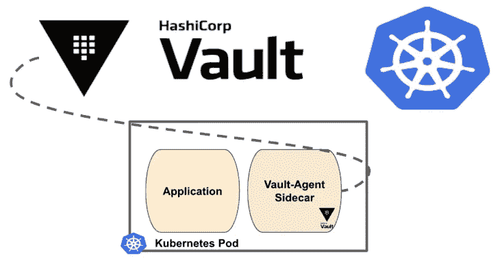

通过边车把保险库的秘密注入到库本内特的豆荚里

Kubernetes 具有内置的机密功能，使用户能够存储和管理敏感信息，这方面有一些明显的缺点，最明显的是它们在默认情况下没有加密，系统中没有内置旋转或撤销的概念，也没有跨集群存储和分发机密的概念。Vault 作为一个秘密管理工具，可以通过以各种配置直接在 Kubernetes 上运行来解决所有这些问题。对于纯 Kubernetes 工作负载，这使得 Vault 也可以完全存在于 Kubernetes 中。

Vault 已经为 Kubernetes 提供了强大的内置支持，并且可以使用 Kubernetes APIs 来验证在集群上运行的应用程序的身份，Vault 预先配置为与 Kubernetes 进行对话，使用允许其使用令牌审阅者角色的凭据，并验证由应用程序 pod 提供的 JWT (JSON Web 令牌)。Vault 使用来自服务帐户的 JWT 来验证自身并请求命名角色。

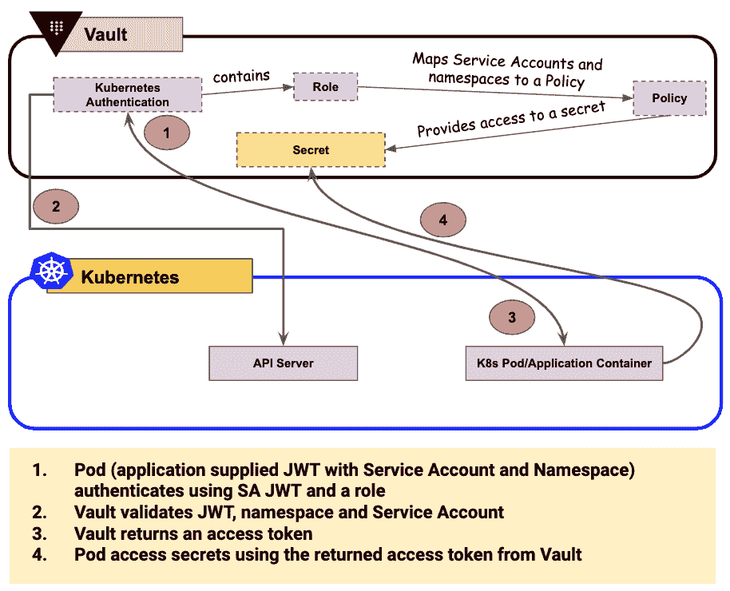

跳马-库伯内特斯

应用程序中提供的 JWT 包含信息服务帐户名称和应用程序窗格的命名空间名称。Vault 会验证 JWT 是否有效，以及请求的角色是否配置为允许访问服务帐户名和命名空间名。然后，Vault 返回一个访问令牌，应用程序可以使用该令牌通过一个或多个策略请求该角色允许的机密。

这种方法要求用户将 Vault 逻辑添加到应用程序代码中。新的 [vault-k8s](https://www.vaultproject.io/docs/platform/k8s/injector/index.html) 利用 Kubernetes [变异许可 Webhook](https://kubernetes.io/docs/reference/access-authn-authz/admission-controllers/) 来拦截和增强专门注释的 pod 配置，以便使用 Init 和 Sidecar 容器进行机密注入，这使得没有内置本机 HashiCorp vault 逻辑的应用程序能够利用来自 Vault 的静态和动态机密。

Kubernetes 提供了许多扩展其内置功能的方法。除了经常使用的扩展点:定制资源类型和定制控制器之外，准入控制器是强大的 Kubernetes-native 特性，便于用户定义和定制允许在集群上运行的内容。准入控制器在对象持久化之前，但在请求被认证和授权之后，拦截并处理对 Kubernetes API 的请求。

在创造资源之前进行技术变异。一个典型的例子是 Istio，它将一个 Envoy sidecar 容器注入到 target pods 来实现流量管理和策略执行。Vault-K8s 使用一个变异的 webhook 准入控制器来启用一种边斗方法，该方法将秘密直接注入到 Kubernetes pod 中。

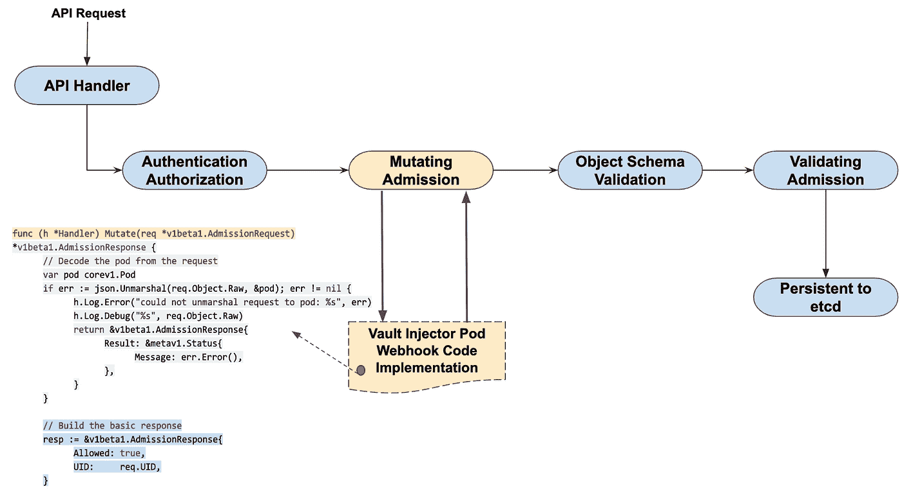

跳马-k8s-边车-变异入场网钩

使用保险库-试剂边车注射器，试剂容器被注入到由特定注释指示的 Kubernetes 容器中(vault.hashicorp.com/agent-inject:“正确”)。Vault-k8s webhook 截取带有基于 Vault 的注释的 pod，并包括一个 Init 容器来预填充机密，以及一个 Vault Agent Sidecar 来在应用程序的整个生命周期中保持机密数据同步。

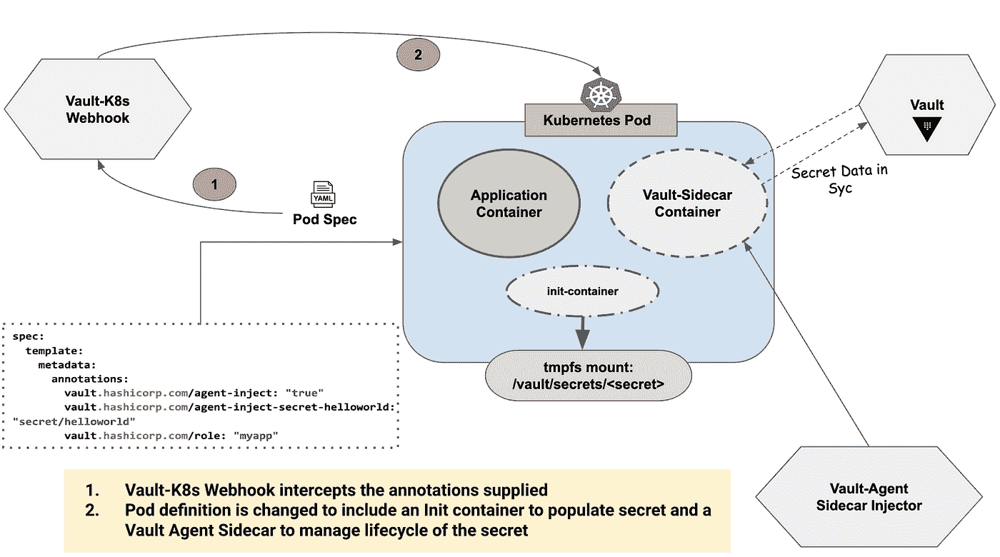

Vault-K8s —代理边车注射模型

# 机密注入工作流

除了 Vault 服务器部署之外，这种新方法还添加了一个 Vault 代理注入器。

库贝内特斯的 K8s 跳马

## Vault 服务器:

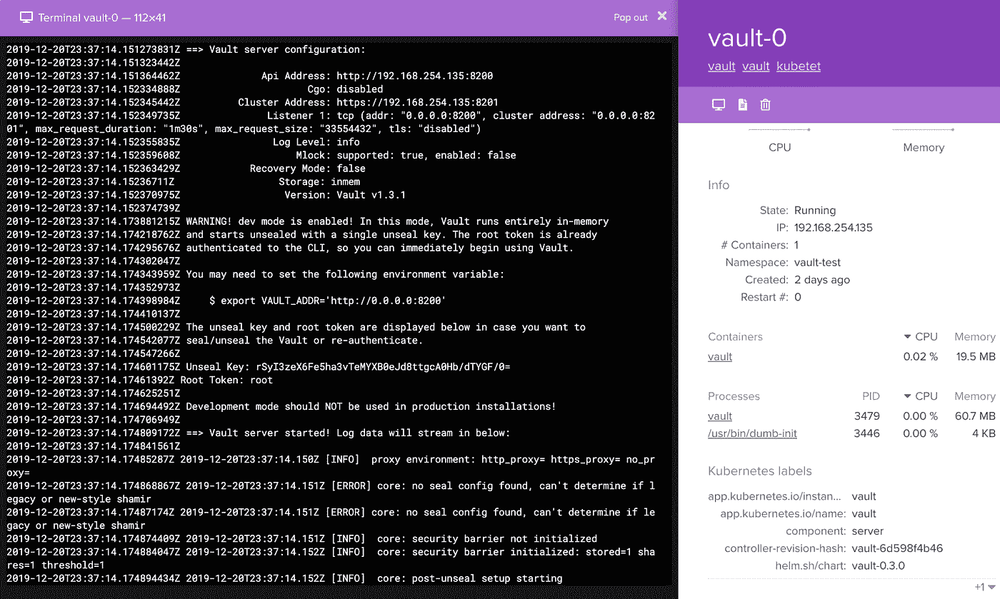

Vault 服务器

## 保险库边车药剂注射器:

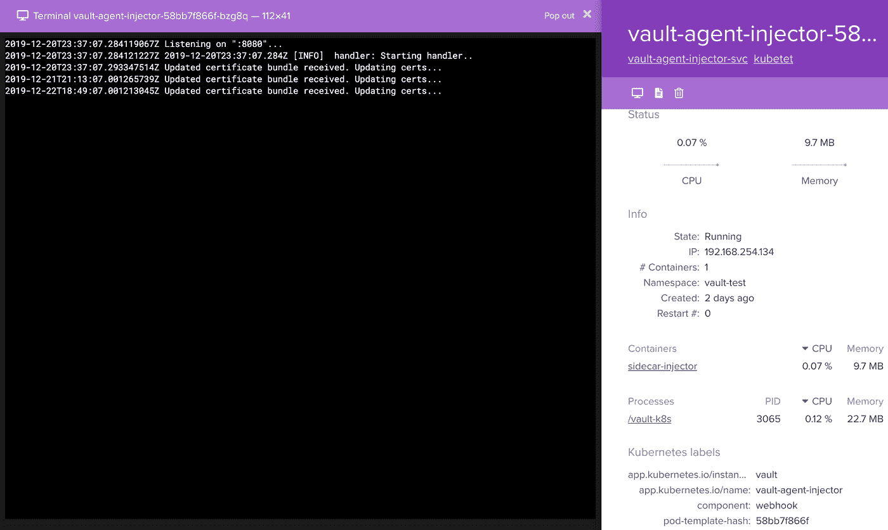

存储库代理-边车注射器

## 存储库代理注入器逻辑:

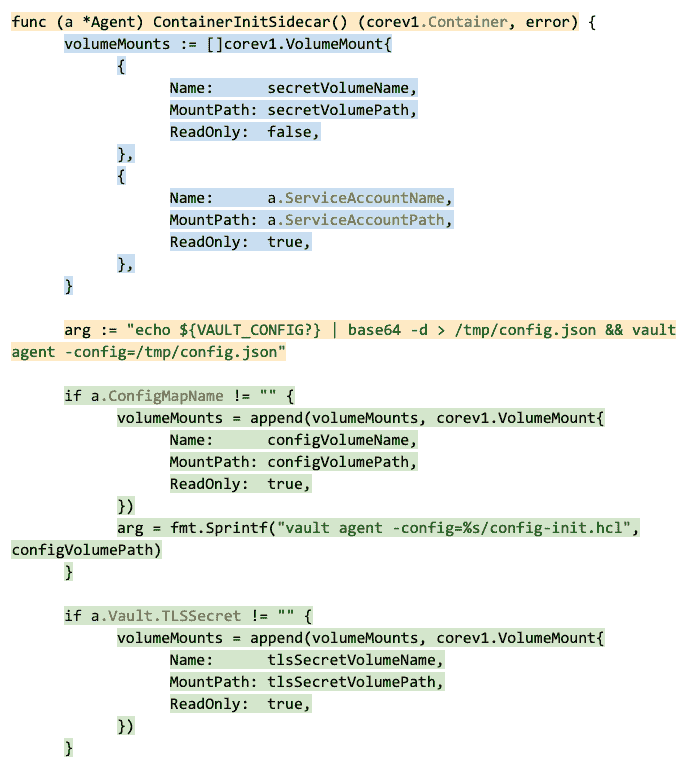

存储库代理边车-边车注入逻辑

## 在 Vault 服务器上配置策略和验证方法:

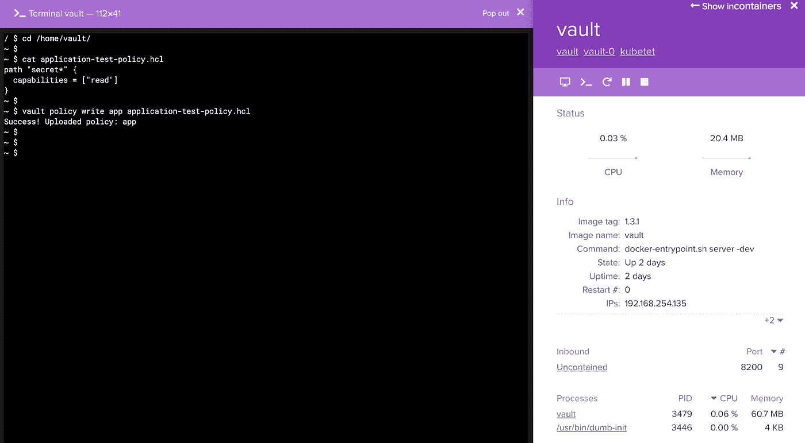

Vault 服务器-策略

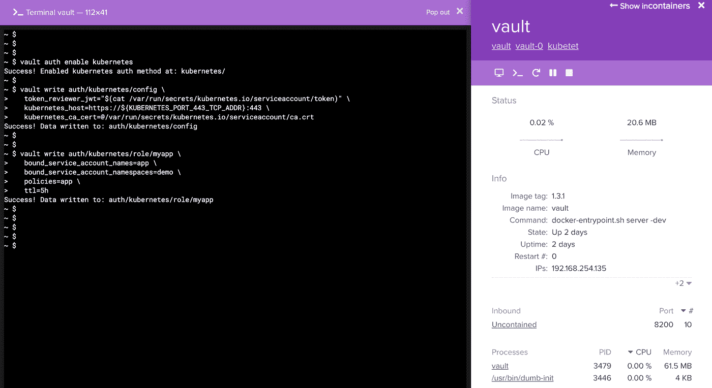

Vault 服务器-验证方法

部署了一个示例应用程序，并关联了一个服务帐户，但没有特定于 vault 的注释。此应用程序是一个简单的 web 服务器，其中没有包含机密管理/保险库信息的特定应用程序代码:

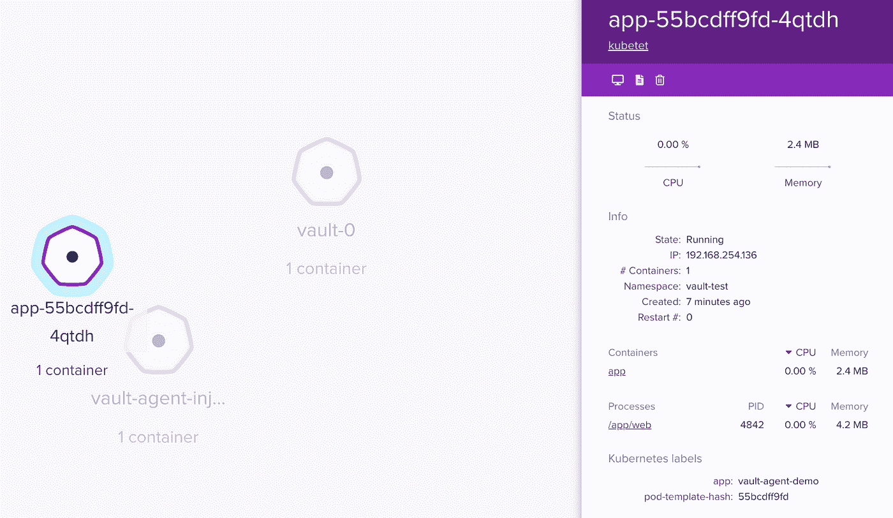

Kubernetes 部署示例

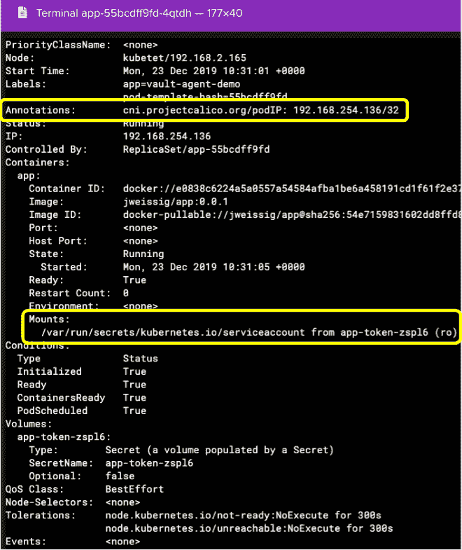

示例应用程序—不带注释

如上所述，除了服务帐户，没有额外的挂载。

通过注释 pod 规范，在部署上启用了存储库代理注入。

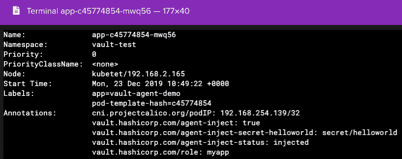

拱顶-边车注射器-注释

Vault-K8s webhook 截获 pod 规范中的更改，Vault agent injector 收到一个向 pod 添加 init 容器和 sidecar 代理容器的请求。

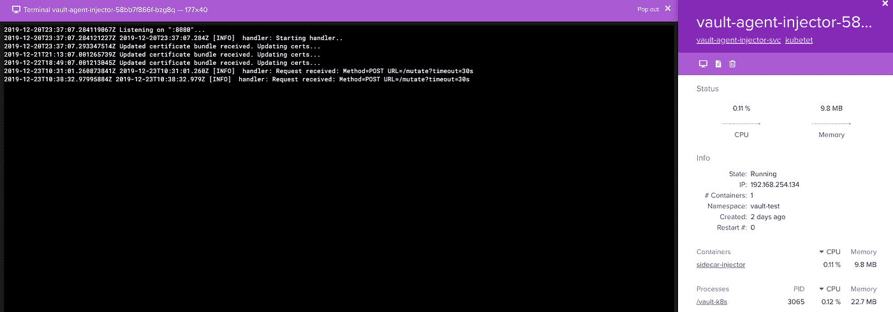

保险库代理边车注射器

init 容器通过添加包含实际秘密的额外挂载(/vault/secrets/)来填充秘密。

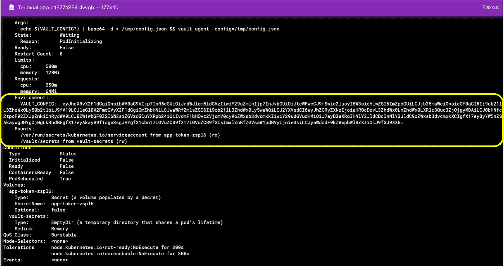

保险库机密装载

应用程序旁边的额外代理容器被添加到 pod，并且在特定间隔建立入站连接，以保持机密信息与 Vault 服务器同步。

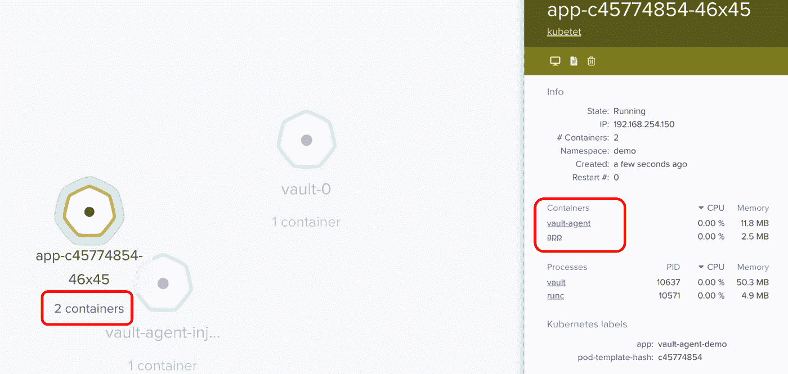

保险库代理侧柜容器

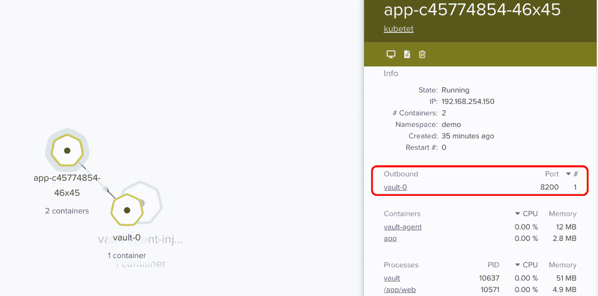

Vault 代理-Vault 服务器-机密同步

通过上述步骤，应用程序现在将挂载一个密码(tmpfs: /vault/secrets ),而无需在应用程序逻辑中进行任何特定的 vault 配置。应用程序可以从文件系统路径直接访问所需格式的秘密。

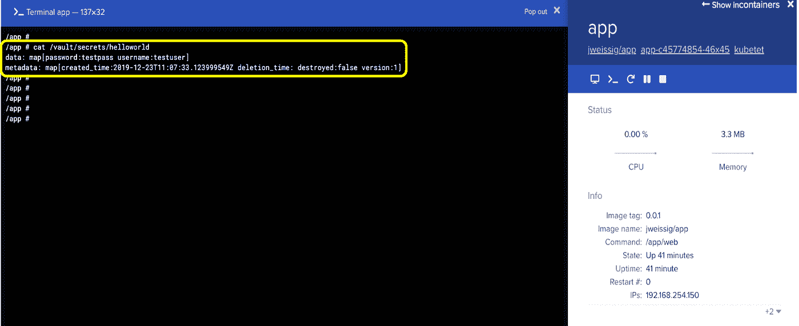

保险库秘密安装在 Kubernetes Pod 上—保险库边车—秘密安装

不同的特定于应用程序的秘密需要特定的格式。要控制格式以便应用程序可以以本机格式读取它，可以使用注释“vault . hashi corp . com/Agent-inject-Template-[filename]”来定义自定义模板，该模板使用 Vault 代理模板功能，允许使用 Consul 模板标记(Go Template)将 Vault 机密渲染到文件中。例如，Postgres 需要秘密格式:“PostgreSQL://user:pass @ Postgres:5432/wizard”，可以使用下面的批注对其进行格式化:

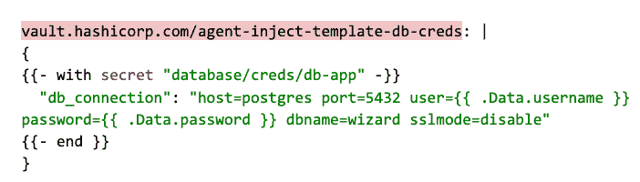

存储库代理模板

__________________________________________________________

从历史上看，秘密管理一直是一个非常复杂的过程，无意中引入安全问题太容易了。Vault 使这个过程变得更简单，而且这种集成使用户能够在 Kubernetes 上开发应用程序，而不需要任何额外的秘密管理逻辑。机密在文件系统路径下自动对应用程序可用，并且不需要内置本机 Vault 逻辑。