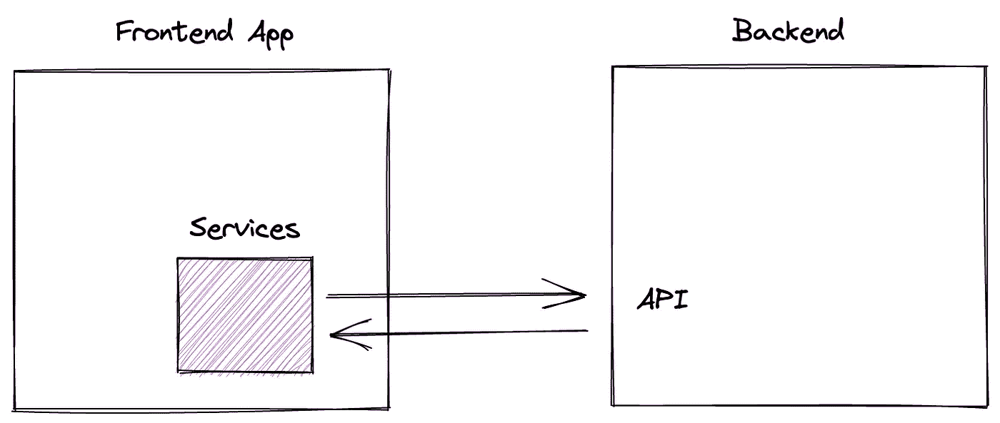
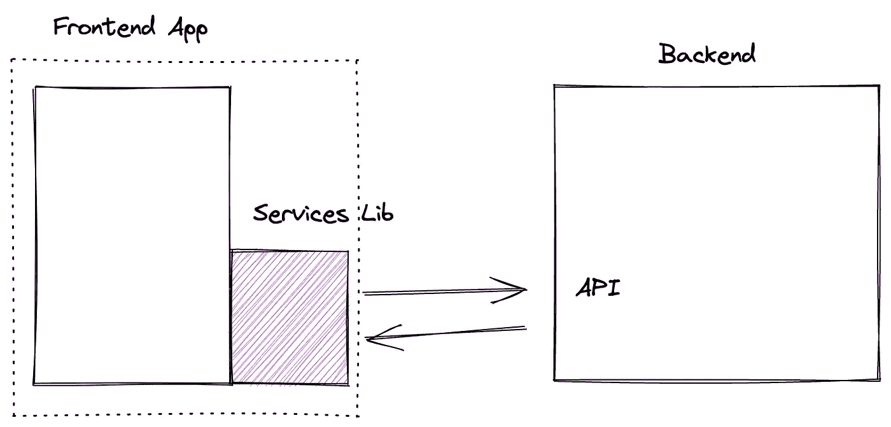
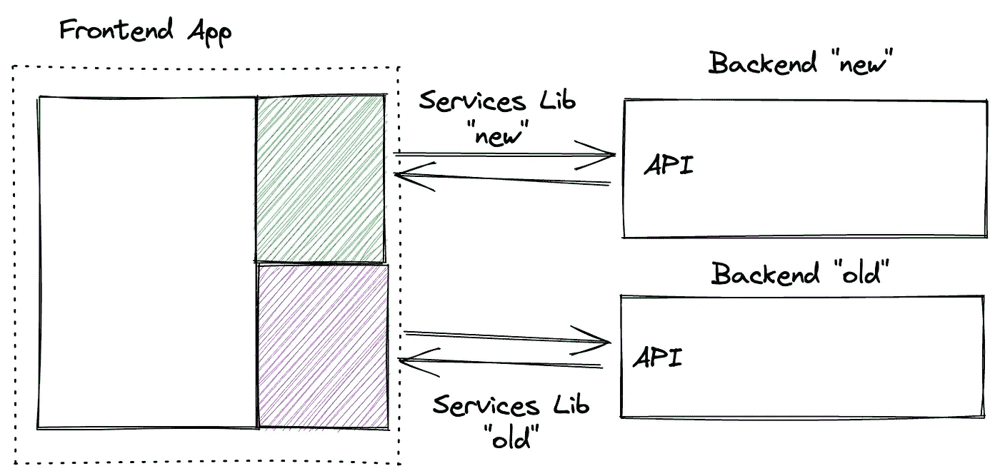
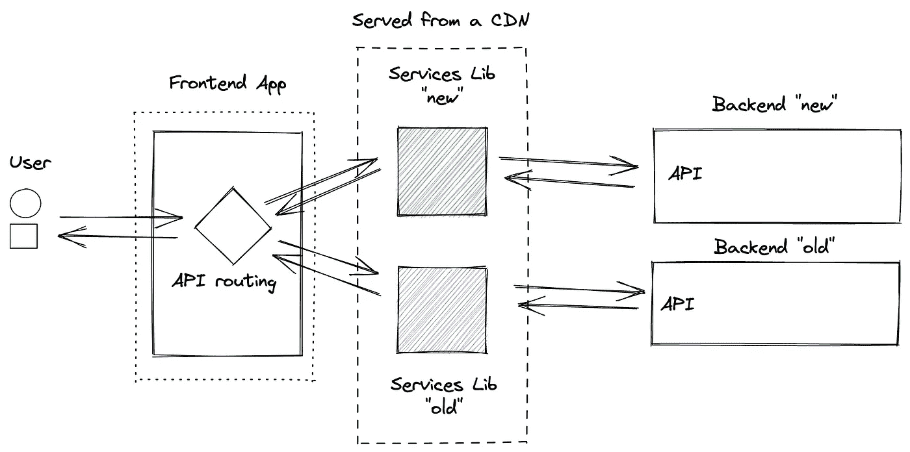
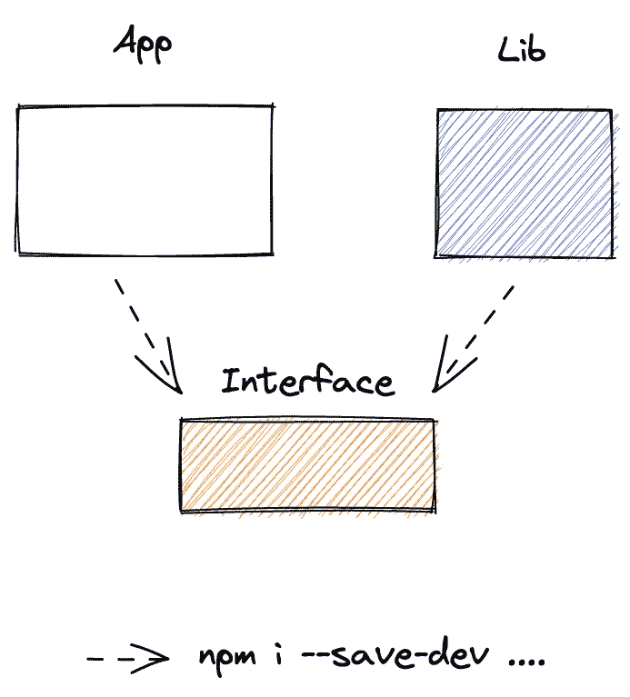

# 从 CDN 动态导入 ESM 模块

> 原文：<https://itnext.io/dynamically-import-esm-modules-from-a-cdn-5a6f741e2a1c?source=collection_archive---------1----------------------->

## Lazy 从内容交付网络加载 JavaScript 代码，只在用户需要时提供他们需要的服务。


照片由[丹尼尔·波恩](https://unsplash.com/@danborn?utm_source=unsplash&utm_medium=referral&utm_content=creditCopyText)在 [Unsplash](https://unsplash.com/?utm_source=unsplash&utm_medium=referral&utm_content=creditCopyText) 拍摄

如果我告诉你，现代浏览器可以在运行时从 CDN 本地导入一个或一组 JavaScript 库包，会怎么样？这难道不会带来新的可能性吗？

好消息。这不是假设，而是事实。如今，所有现代浏览器都可以从🥳.内容交付网络公司动态导入 JavaScript 模块

# 介绍

在开发 web 前端应用程序时，有许多支持模块使用的库和框架。大多数应用程序和库将使用像 [Webpack](https://webpack.js.org/) 、 [Rollup](https://rollupjs.org/) 这样的工具或者使用像 [esbuild](https://esbuild.github.io/) 这样更新的捆绑器来“捆绑”它们的文件。

多亏了这些工具，JavaScript 代码可以被分析、构建和分割成更小的块。

虽然这种方法非常有效，但它也有不好的一面，即无论是否执行，ES 模块都会被导入。

例如，如果您想使用一个很棒的库，比如 [idb-keyval](https://github.com/jakearchibald/idb-keyval) 来打印存储在 IndexedDB 中的值，但是 goal 只为管理员保留该功能。

```
import { get } from 'idb-keyval';

const print = async (admin) => {
  if (!admin) {
    return;
  }

  console.log(await get('hello'));
}
```

如果代码是静态构建的，那么无论如何，第三方依赖都会被添加到 ES 模块中。结果，所有用户，不管是不是管理员，都必须下载相关的代码，即使他们从来不需要它。

这就是动态导入开始发挥作用的时候，它是官方 TC39 提案的一部分，并且已经用 ECMAScript 2020 标准化。

它告诉浏览器按需加载代码，并且只在需要的时候加载。

```
const print = async (admin) => {
  if (!admin) {
    return;
  }

  const { get } = await import('idb-keyval');

  console.log(await get('hello'));
}
```

现在只有管理员需要下载第三方库的代码。

*注意:动态导入不是强制性的，你的代码都没问题。捆绑器和浏览器对你的库和应用程序的许多模块做了令人难以置信的工作。在某些情况下，这很有帮助。就像上面的例子一样，或者当大型模块需要时间来加载时。它有助于提高启动时的性能。*

# 动态导入+ CDN …但是为什么呢？

假设现在您正在开发一个与后端交互的应用程序。无论您是实现自己的 API 还是使用第三方云提供商，与您的数据交互的代码通常都可以在您的前端应用程序中找到位置。



正如我们在前一章中所看到的，如果您没有利用“动态导入”的优势，所有用户都可能因此下载代码来与后端(在模式中显示为“服务”)进行交互，不管他们是否使用它。

虽然这可能通常不是问题——毕竟，如果应用程序使用 API，所有用户都有很大机会使用它——但随着时间的推移，它可能会成为一个问题，因为这样的设计会受到供应商的限制。

有一天，你可能不得不将应用程序迁移到一个新的后端或另一个云提供商，升级的复杂性可能会成为一个问题。

为了防止这样的问题，你可以提取库的“服务”,给你更多的灵活性来预见陷阱。



然而，如果没有“动态导入”，所有用户可能仍然会下载所有代码，如果您在某个时候将应用程序与“旧”和“新”服务一起发布，这将是非常不幸的。



让我们再想象一下，一切都在现在的位置。该应用程序利用“动态导入”，将“旧”和“新”服务提取到单独的库。

尽管一切都尽善尽美，但在这一点上，前端应用程序直接依赖于这些库(想想`npm i lib --save`)。

如果您对服务进行任何更改，您必须重新构建和重新部署一切，这很快就会变得棘手。尤其是如果你得到的不仅仅是两项服务，而是很多项服务。

这就是“动态导入”和 CDN 的结合最终要大放异彩的地方。

这两种策略一起应用可以将前端应用程序从一个整体转变为一个模块化的解决方案。



对于每个用户请求，在诸如环境配置的特定条件下，前端应用程序可以在运行时仅请求执行特定查询所需的功能、代码段。

这样做，不仅用户只下载执行查询所需的内容，而且应用程序也变得几乎独立于服务。修补这些甚至添加一个新的后端现在可以开发和部署没有任何变化的应用程序！

# 给我看一些代码

这是一个很长的介绍和解释，我希望你还在这里😅。几个代码往往胜过千言万语，因此以下是如何从 CDN 动态导入功能的方法:

```
import { Component, ComponentInterface, h } from '@stencil/core';

@Component({
  tag: 'app-home',
  styleUrl: 'app-home.css',
  shadow: true,
})
export class AppHome implements ComponentInterface {

  async componentDidLoad() {
    const cdn = 'https://cdn.jsdelivr.net/npm/idb-keyval@6/+es';

    const {get, set} = await import(cdn);

    await set('hello', 'world');
    console.log(await get('hello'));
  }

  render() {
    return (
      <mark>dynamic import esm + cdn = ❤️</mark>
    );
  }
}
```

上面的代码出现在一个[模板](https://stenciljs.com/) web 组件中，以强调它可以在任何现代浏览器中工作的事实。

当组件被挂载时，它会创建一个`string`变量，指向需要加载的 es 模块。

使用这种临时的`string`值对 TypeScript 很有用。没有它，编译器会抛出一个错误`TS2307: Cannot find module 'https://...' or its corresponding type declarations.`

CDN 上库的 URL 可用于动态导入我们感兴趣的功能，`await import(cdn)`，瞧，这就是🥳.

# 类型安全

动态导入是一个本机特性，因此 JavaScript 支持开箱即用。为了改进 TypeScript 的语法，我建议使用消费者(前端应用程序)和库(“服务”)可以共享的接口。



例如，我们可以声明一个表示“hello”的函数的`interface`:

```
export interface SayHello {
  ({name}: {name: string}): Promise<string>;
}
```

`library`可以按如下方式实现:

```
export const say: SayHello = 
               async ({name}: {name: string}): Promise<string> => {
  return `Hello ${name}`;
}
```

`app`也可以使用类型来改进语法:

```
(async function() {
  const cdn = 'https://..../index.esm.js';

  const {say}: {say: SayHello} = await import(cdn);

  await say({name: 'David'});
}());
```

此外，提取接口和类型还可以简化未来的新开发。

# 结论

这种“动态导入+ CDN”的方式，对我来说不仅仅是文字。它是 [DeckDeckGo](https://deckdeckgo.com) 下一个主要版本的核心架构。

我们的主要应用程序(来源 [GitHub](https://github.com/deckgo/deckdeckgo/tree/main/studio) )核心是一个幻灯片的离线编辑器，它不依赖于任何 API。

它“只”使用一个库(source [GitHub](https://github.com/deckgo/deckdeckgo/tree/main/utils/editor) ),该库描述并公开了如果配置了后端就可以使用的端点接口。

由于我们目前在生产中同时使用 [Google Firestore](https://firebase.google.com/products/firestore) (参见 [GitHub](https://github.com/deckgo/deckdeckgo/tree/main/providers/firebase) )和 [AWS Lambda](https://aws.amazon.com/lambda/) (参见 [GitHub](https://github.com/deckgo/deckdeckgo/tree/main/providers/api) )，因此有两个服务在运行时通过 CDN 动态导入，以执行这些云提供商的操作。

与此同时，我们还开发了一个(成功的)概念验证，将我们的 web 应用程序移植到 [DFINITY](https://dfinity.org/) 的互联网计算机上，我们将继续朝着这个方向努力，因为，剧透一下，这是未来。这就是另一个服务与区块链网络交互的原因(参见 [GitHub](https://github.com/deckgo/deckdeckgo/tree/main/providers/ic) )。

最后，由于模块化架构，如果一些客户希望在内部使用我们的编辑器，我们可以快速将它集成到任何网络中。

总结:我们是面向未来的🚀。

到无限和更远的地方！

大卫

你可以通过[推特](https://twitter.com/daviddalbusco)或者我的[网站](https://daviddalbusco.com/)联系我。

在接下来的幻灯片中，请尝试使用 [DeckDeckGo](https://deckdeckgo.com/) 。

[](https://deckdeckgo.com)

# 资助计划

我们非常幸运地被 DFINITY [开发者资助计划](https://dfinity.org/grants/#utm_source=home&utm_medium=banner&utm_campaign=grants)选中，以支持开发者生态系统，奖励团队在互联网计算机上构建 dapps、工具和基础设施。

如果你有一个很棒的项目，你一定要申请，这一点我怎么强调都不为过。到目前为止，这是一次不亚于惊人的经历，只是给人一种参与超前事物的感觉。

这篇文章的所有图形都是用 [Excalidraw](https://excalidraw.com/) 开发的，多么巧妙的绘图工具。