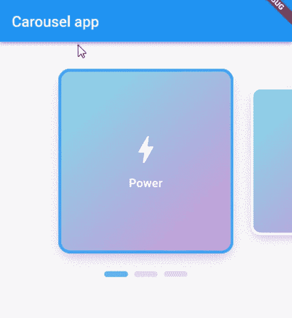
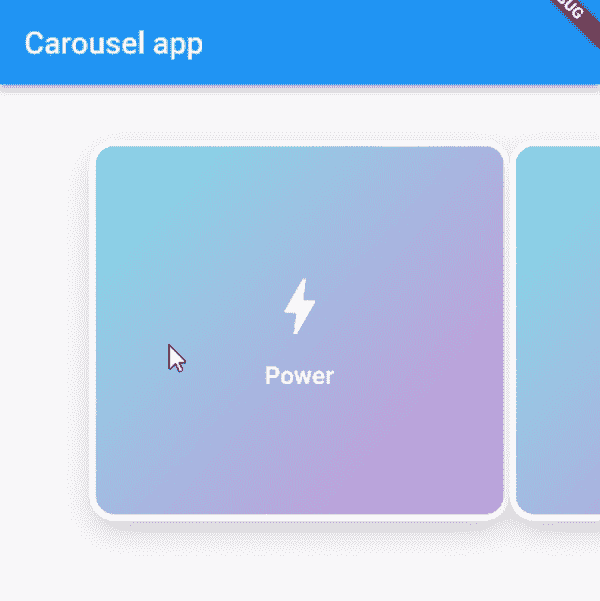
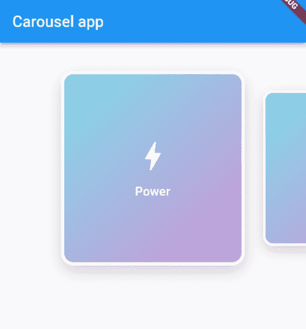

# 动态大小，动画旋转木马在颤动

> 原文：<https://itnext.io/dynamically-sized-animated-carousel-in-flutter-8a88b005be74?source=collection_archive---------0----------------------->

你喜欢时尚、灵敏的设计吗？我也是！动画旋转木马是实现这一目标的好方法，但实现起来可能有些棘手。在本文中，我将向您展示如何毫不费力地做到这一点。

虽然 [**carousel_slider**](https://pub.dev/packages/carousel_slider) 库看起来很诱人，但它在响应迅速的动态应用程序中并不太好。因为要定义内容高度，所以用图片比用 widgets 更合适。

这就是为什么我们必须使用[**expandable _ page _ view**](https://pub.dev/packages/expandable_page_view)来显示我们的卡片，并将它们恰当地放在其他 UI 组件旁边。在后面的指南中，我还将实现 [**flutter_bloc**](https://pub.dev/packages/flutter_bloc) 来管理状态并保存我们当前挑选的卡片，以及**[**smooth _ page _ indicator**](https://pub.dev/packages/smooth_page_indicator)**来指示当前页面，但这是可选的。****

## ****目录****

> ******1。底座零件
> 2。动画
> 3。状态管理&页面指示器
> 4。最终想法&完成项目******

# ****1.基础零件****

****首先，让我们将我们的**页面**小部件包装在一个**sliverfillreming**中。这确保了如果页面内容溢出，我们将获得一个漂亮的可滚动视图(记住将 **hasScrollBody** 设置为 false 以获得我们想要的行为):****

****现在我们创建一个简单的**卡片模板**放到我们的转盘中。它本质上可以是任何小部件，因此我将选择一些简单的东西来展示:****

****现在剩下唯一要做的就是创建一个 page controller**(viewportFraction 定义了我们的一张卡片占多大的屏幕宽度%)** 和一堆卡片。我现在打算静态地做这件事:****

****并将它们放入我们的**可扩展页面视图中。**我在一个**构建器**工厂中使用过它，因为以后实现动画和动态缩放更方便:****

****它应该会产生类似如下的结果:****

********

****很整洁，不是吗？但是我们可以做得更好！****

# ****2.动画片****

****为了给我们的小部件添加一些比例动画， **AnimatedBuilder** 将会派上用场。它可以把我们的 PageController 当做一个双动画。PageController 有一个 page 字段，它以双倍的速度传输当前页面索引切换进度(当您在第一个小部件上时，它发出 0，当您进行到一半时，它发出 0.5，以此类推)。****

****由于 PageController 的工作方式，在调用`.page` getter 之前，我们必须**检查它是否有维度**，否则，它将打印出一个错误并溢出一瞬间。****

****为了缩放内容，我使用了一个`**Transform.scale**`小部件，并将缩放比例设置为`max(0.8, (1 — (carouselController.page! — index).abs() / 2))`。这非常简单——当当前页面与卡片的索引匹配时，最大值为 1——否则它将自己固定在 0.8(或者我们希望的任何值)。我们也可以增加除数来制作更平滑的动画。这就是它现在的样子:****

********

# ****3.状态管理和页面指示器****

****我会让文章的这一部分相对简短，你应该对 **BLoC** 的工作原理有所了解。让我们创建我们的 Cubit 和 State 类:****

****我还希望我的 CarouselCard 类将它的**索引**作为参数。现在我们可以检查卡片当前是否被**选中**，并相应地更改其边框的颜色:****

****现在我们必须**用 BlocProvider** 包装页面，并将当前页面**索引**传递给 CarouselCubit。后者可以通过监听器实现:****

****我们正在确保页面不为空，如果存储在 cubit 状态中的当前卡片索引与四舍五入的页面值不匹配，它将被更新。现在我们可以创建一个 **SmoothPageIndicator** :****

****我们得到了这个结果:****

********

# ****4.最终想法和完成项目****

****我希望你会发现这是一篇有用的文章。如果有任何不清楚的地方，请随时在我的社交网站上给我发消息或留下评论。这是一份完整的回购协议:
[https://github.com/RedC4ke/carousel_app](https://github.com/RedC4ke/carousel_app)****

## ****跟随我:****

****[https://www.linkedin.com/in/redc4ke/](https://www.linkedin.com/in/redc4ke/)
https://github.com/RedC4ke****