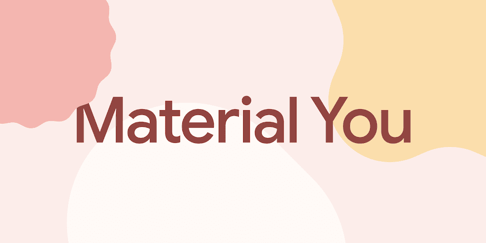
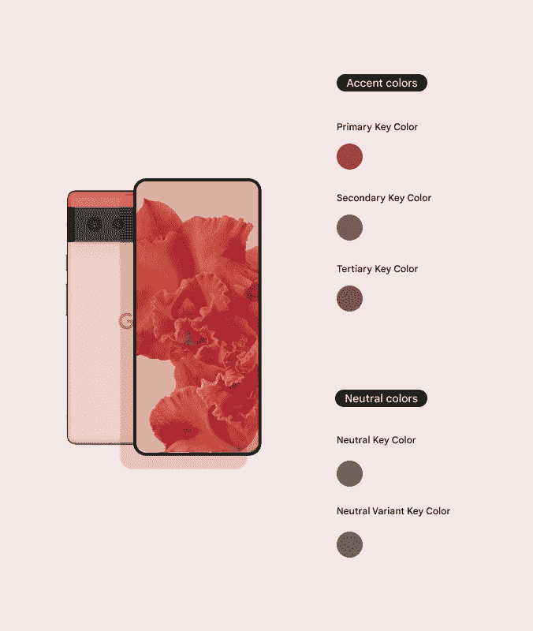
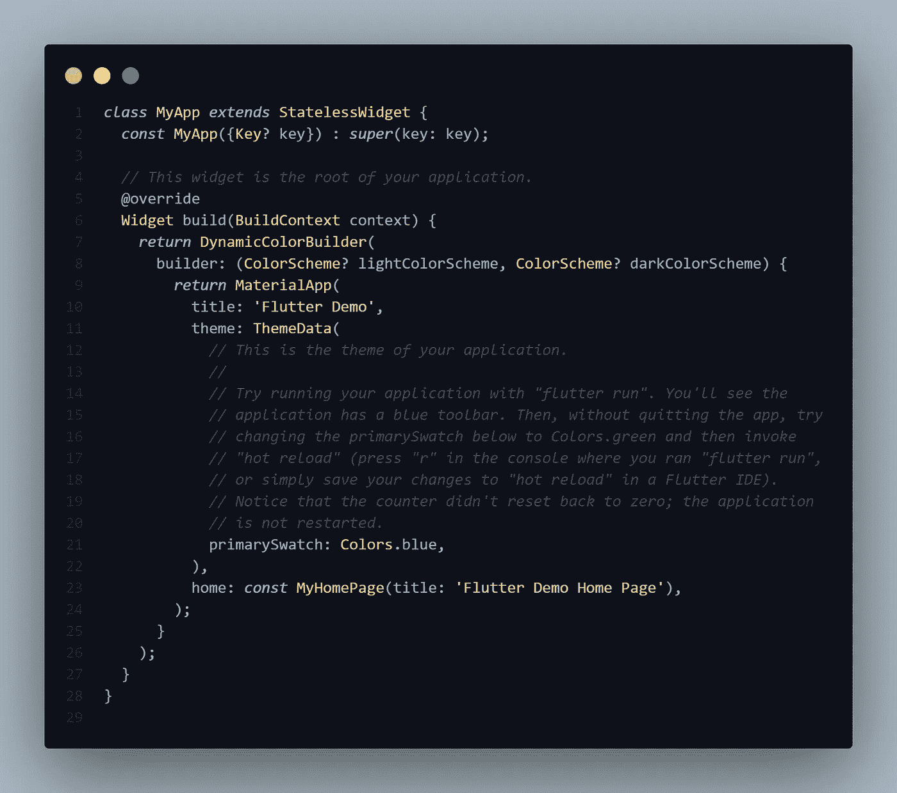
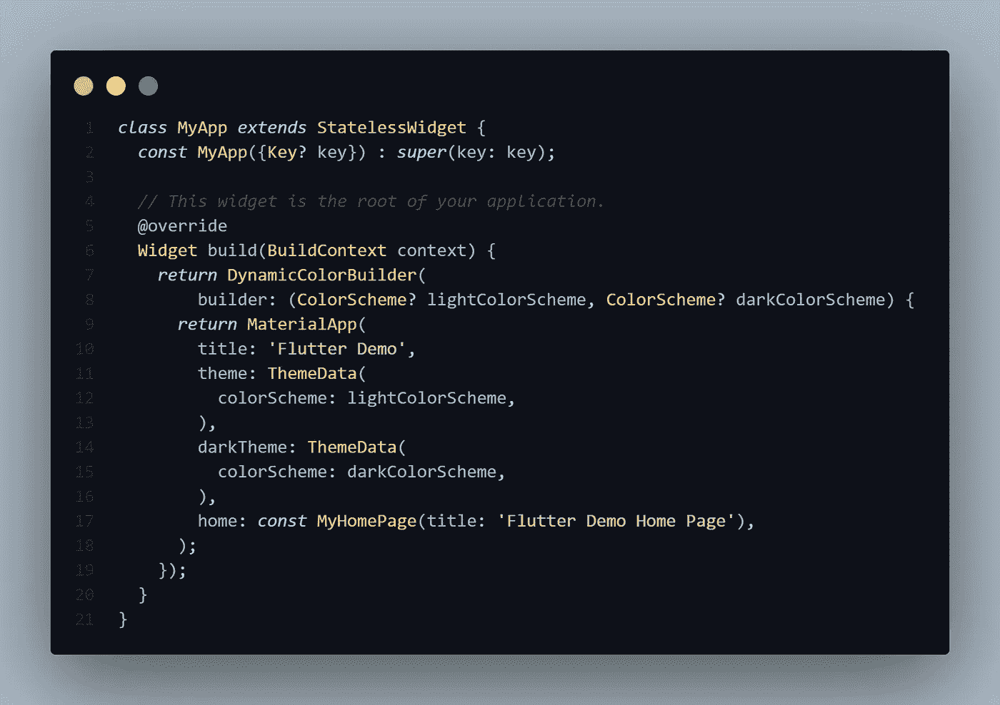
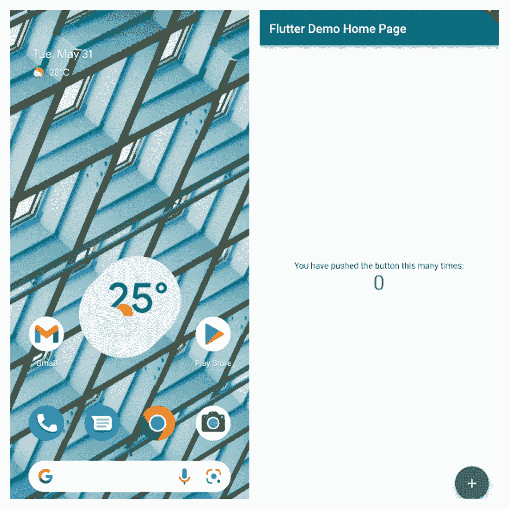
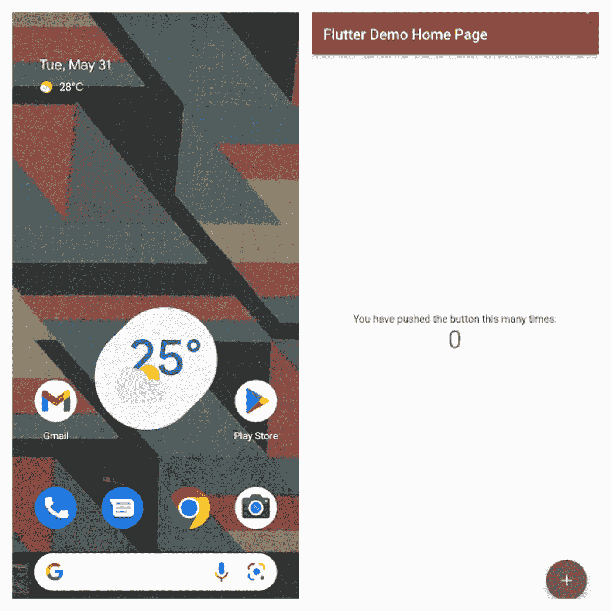
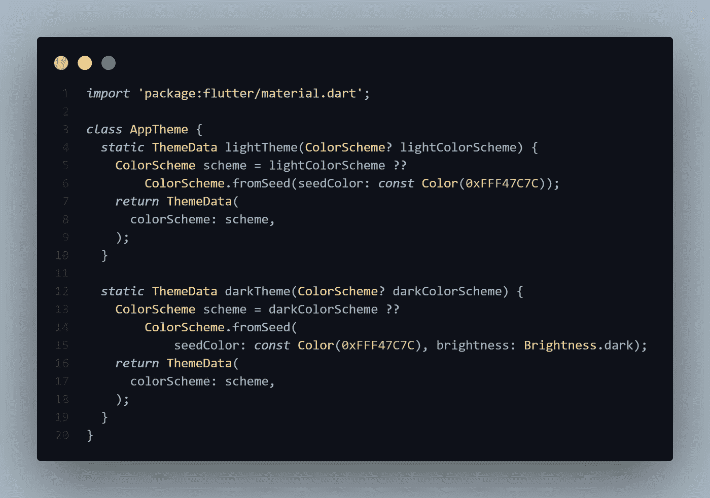
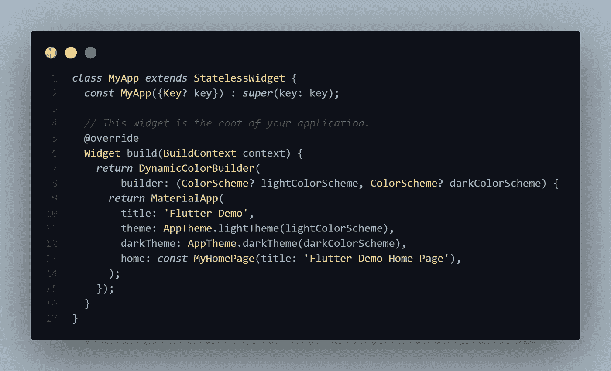

# 动态主题你的颤振应用

> 原文：<https://itnext.io/dynamically-theme-your-flutter-app-59da5037f5df?source=collection_archive---------0----------------------->

如你所知，Flutter 最近放弃了它的主要版本更新，即 Flutter 3.0。它带来了很多变化，其中之一是我等待了很久的 Material You，它在 Google IO 2021 上正式亮相。不知道你是什么料的，看看这个[链接](https://material.io/blog/announcing-material-you)。

自从推出以来，Material You 吸引我的一个特点是[用户生成方案(UGS)](https://m3.material.io/m3/pages/dynamic-color/user-generated-color) 。简单来说，UGS 是一种从用户的壁纸中生成由谷歌设计和定义的配色方案的机制。

来源:材料设计 3

因此，每次用户更改壁纸时，都会从中提取一种颜色来生成一个配色方案，用于为我们的应用程序着色。所以每换一个新壁纸，我们 app 的主题都会变，是不是很神奇？

是的，但唯一需要注意的是，这项功能只能在运行 Android S 或更高版本的设备上使用。

所以让我们在我们的 Flutter 应用程序中实现这个功能。

## 颤振中动态颜色的实现

所以我们先导入 [dynamic_color](https://pub.dev/packages/dynamic_color) ，material.io 的官方包

这个包有一些算法，与操作系统交谈，以产生一个配色方案。

它有一个返回明暗配色方案的生成器方法。

因此，在我们来自 flutter 的样板代码中，让我们用***dynamic color builder***包装 MaterialApp 小部件

注意 ColorScheme 可以是 null，这是因为这个功能只针对 Android S+，所以如果任何设备没有它，它就会有一个 null 值。

现在让我们使用这些方案来应用到我们的应用程序的主题。

tada，你已经成功地实现了动态颜色，想看看它看起来怎么样吗？

我非常喜欢这个功能

## 奖金

这只是一个演示，这不是我定义主题的方式。我没有在 main.dart 文件本身定义主题。此外，UGS 不能在低于 Android S 的设备上运行，因此，它会在这样的设备上抛出一个空错误，破坏我们的应用程序，所以我们需要修复它。

让我们创建一个名为 AppTheme 的自定义类，它有两个静态方法，分别叫做 *lightTheme* 和 *darkTheme，*，并且都返回 *ThemeData，*此外，这两个方法都需要 c *olorScheme 参数。*

在给你做材料之前，我们习惯于定义自己的配色方案，对吗？我们在这里也会这样做。再做一些修改，这是我们最终代码的样子。

app _ 主题. dart

主.镖

所以基本上我做的是*app theme . light theme(color scheme？lightColorScheme)* 从 DynamicColorBuilder 请求配色方案，如果配色方案为空，我将返回自己的自定义配色方案。

这里我使用了 *ColorScheme.fromSeed()* 的方法。这是 Flutter 3.0 中推出的一种新方法，它采用单一颜色并从中生成配色方案。向制作这个的人致敬🍻

这就是我如何为我的 Flutter 应用程序构建主题。我很想得到这方面的反馈！

就这样，我们成功地实现了动态配色方案，然后我们处理了可能导致应用程序崩溃的错误。

感谢您阅读这篇文章！😍

哦，是的，如果你已经通读了所有这些，这是给你的一份礼物😁：

## 重要链接:

1.  **GitHub 资源库**—
    [https://GitHub . com/raghavthegreat 1/dynamic-color-flutter . git](https://github.com/RaghavTheGreat1/material_you.git)
2.  **材料三**——[https://m3.material.io/](https://m3.material.io/)