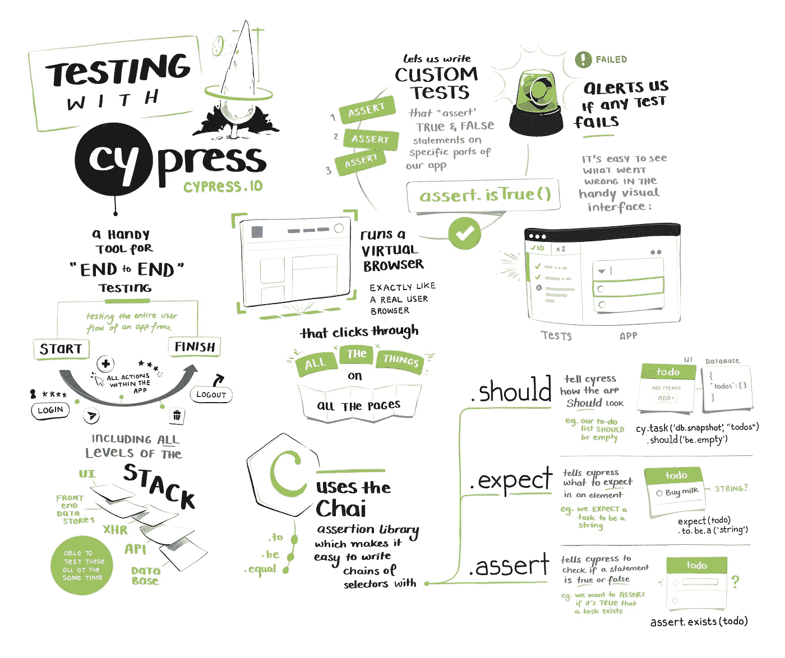
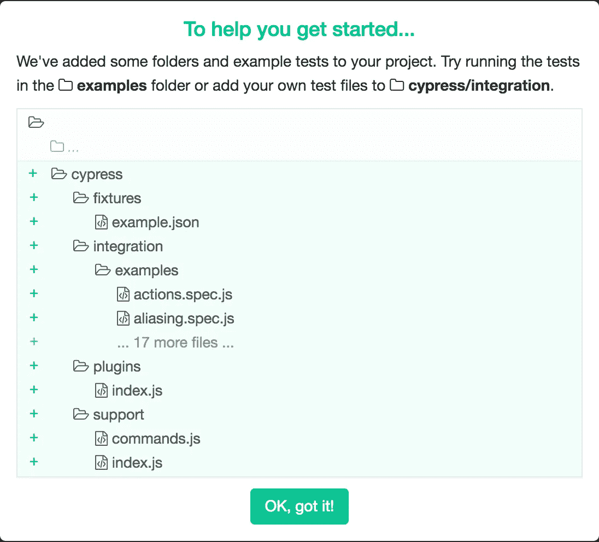
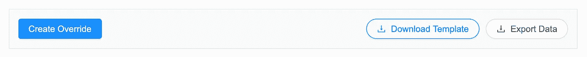
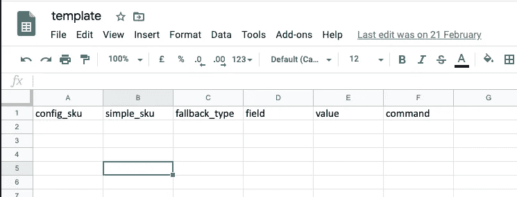
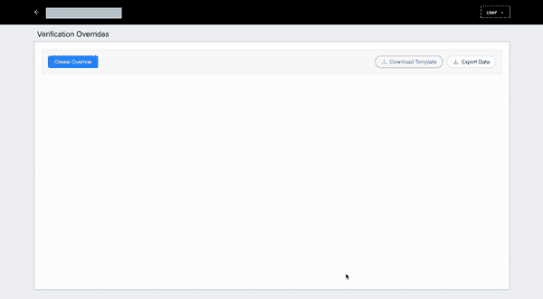
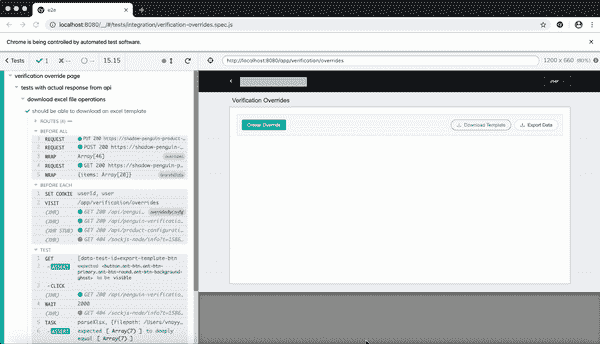

# 用 cypress 进行 excel 文件下载的 E2E 测试

> 原文：<https://itnext.io/e2e-testing-of-excel-downloads-with-cypress-d6e46ccdc232?source=collection_archive---------1----------------------->

Maggie Appleton 为 egghead.io 所作的插图

最近在做一个项目时，我不得不创建一个功能，让用户可以下载包含一些数据的 excel 文件。

在这个过程中，由于我非常喜欢用 [Cypress.io](https://medium.com/u/47c842e55929?source=post_page-----d6e46ccdc232--------------------------------) 进行 E2E 测试，所以我决定编写一个测试套件，确保 excel 被正确下载，并且包含用户期望的正确数据。

本文假设对 cypress 有一个基本的了解。

**免责声明**

如果你以前没有尝试过用 cypress 进行 e2e 测试，我强烈推荐你跳到“参考”部分，按照一些入门指南去做。

# 📦装置

1.  假设您有一个名为`dashboard-ui`的 repo，在其中创建一个名为`e2e`的新文件夹。
2.  `cd`到那个文件夹，在里面执行下面的命令。

3)通过打开`package.json`更新项目脚本，并将您的脚本更新为:

4)安装 cypress 后，您还应该会看到 cypress 为您创建的一些默认文件夹和文件。

5)我们将要编写的测试将放在`integration`文件夹中。

# ⚙️功能

为了简单起见，假设我们的应用程序只有一个特性，用户可以点击一个`download template`按钮，它可以下载一个包含一些数据的 excel 文件。

单击下载模板按钮，下载一个文件，如下所示:

## 演示

gif 到演示 excel 文件下载

# 🧪 E2E 测试

1.  在`integration`文件夹中创建一个名为`ExcelDownload.spec.js`的新文件。
2.  在这个文件中，我们的测试将首先检查按钮是否存在，然后我们将单击它。

3)点击文件后，理想情况下文件应该已经下载，现在我们需要以某种方式读取该文件，检查它是否存在，并检查它是否包含正确的数据。

4)为此，我们首先需要安装另一个 npm 包，它可以解析 excel 并将其转换为 json。

5)之后，在您的`plugins/index.js`文件中，我们将创建一个新任务来解析 excel。

这个函数将解析我们的 excel 文件，并将其转换为 json。

6)最后，让我们完成 excel 文件下载的测试

7)这样，我们就可以确保我们的 excel 下载功能正常工作。

## 测试执行

在 cypress 中运行 e2e 测试的演示

8)这里唯一需要注意的是，如何知道 CI/CD 管道的下载路径，或者如何将该路径更改为其他路径。

解决办法是在柏树上建造。在`plugins/index.js`文件中，我们将再次创建另一个任务。

在这里，我们将下载的默认目录更改为 cypress 文件夹中的一个名为`excelDownloads`的目录。

[https://docs . cypress . io/API/plugins/browser-launch-API . html # Change-download-directory](https://docs.cypress.io/api/plugins/browser-launch-api.html#Change-download-directory)

# 💡结论

总之，E2E 测试对每个应用程序都非常重要，你也应该写一个，因为这是你能得到的最接近测试实际用户如何使用你的应用程序的方法。

正如托马斯·拉科米所说:

> 有了 e2e 测试和 cypress.io，晚上睡得更香

👯如果你觉得这篇文章有帮助，请分享！

更多更新可以在 twitter [@VivekNayyar09](https://twitter.com/VivekNayyar09) 关注我。

另外，请不要忘记保持社交距离，以防止病毒传播，并定期洗手。注意安全，呆在家里。

# 🚀**参考文献**

*   [https://softchris.github.io/pages/cypress.html](https://softchris.github.io/pages/cypress.html)
*   [https://docs . cypress . io/guides/getting-started/installing-cypress . html #系统要求](https://docs.cypress.io/guides/getting-started/installing-cypress.html#System-requirements)
*   [https://dev . to/tlakomy/sleeping-better-night-with-cypress-io-59 m2](https://dev.to/tlakomy/sleeping-better-at-night-with-cypress-io-59m2)
*   [https://blog . log rocket . com/how-to-write-useful-end-to-end-tests-with-cypress/](https://blog.logrocket.com/how-to-write-useful-end-to-end-tests-with-cypress/)