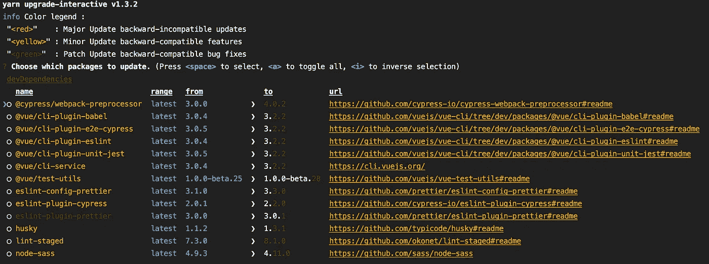
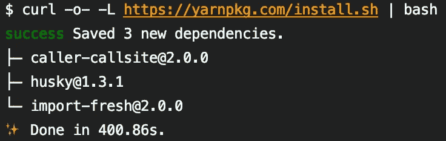
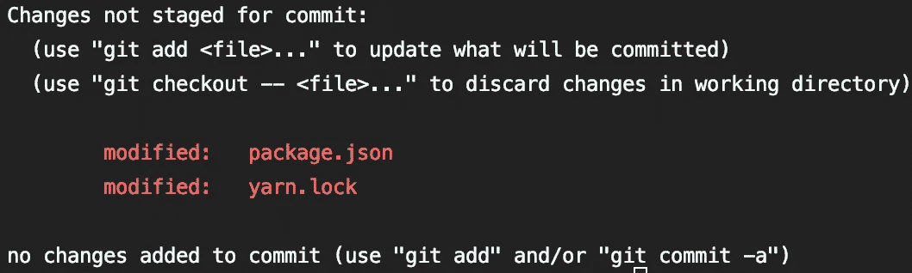

# 升级 npm 软件包的最简单、最快速和最安全的方式

> 原文：<https://itnext.io/easiest-fastest-safest-way-to-upgrade-your-npm-packages-963feb705ca1?source=collection_archive---------2----------------------->


伊恩·杜利在 [Unsplash](https://unsplash.com/search/photos/launch?utm_source=unsplash&utm_medium=referral&utm_content=creditCopyText) 上的照片

有很多方法可以升级我们的项目 npm 包，甚至可以检查哪些是最新版本，但是我们如何在不离开命令行的情况下做到这一点呢？在这里，前往浏览器并来回移动是不可能的。我们需要快速处理这类任务，而且不要让人头疼，对吗？

最有效的方法是通过`[yarn](https://yarnpkg.com/en/)`和以下命令:

```
yarn upgrade-interactive --latest
```

输入后，我们会看到一个漂亮的交互式菜单，它提供了一个很好的洞察力，并帮助我们通过点击来完成它:



这份报告为要求更高的开发者提供了很多细节，甚至还提供了回购包的 URL。此外，使用不同的颜色是为了防止我们不必要的升级到主要版本，这将破坏我们的构建。

我们可以用我们的键上下移动，用退格键选择升级，然后按回车键完成整个过程。



当然，这一更改也会保存在`package.json`和`yarn.lock`中:



原来如此。据我所知 [npm](https://docs.npmjs.com/cli/update.html) 默认不提供这个伟大的工具，但是如果你不是`yarn`的朋友，有一些 [3d 派对包](https://www.npmjs.com/search?q=npm%20upgrade)可以提供帮助(真的吗？反正……)。

如果你想了解更多关于`yarn upgrade-interactive`的信息，你可以在这里查看文档。编码快乐！！