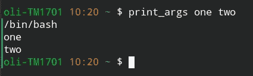
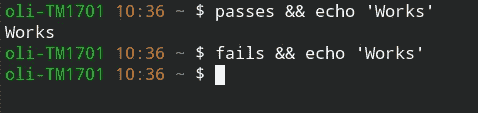
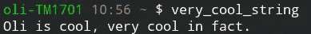
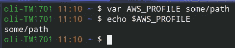
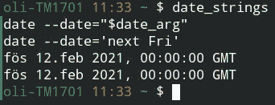
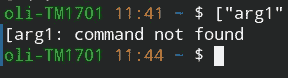
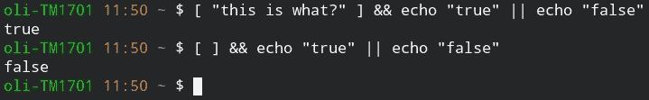
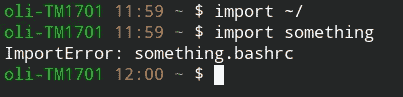

# 最简单的指南。bashrc

> 原文：<https://itnext.io/easiest-guide-to-bashrc-7ad0063d37eb?source=collection_archive---------0----------------------->

我带着`.bashrc`文件的旅程充其量只能算是忙乱。消化如何构造一个`bash`程序的语法和逻辑一直是一个问题。我希望这能让人们的生活变得更轻松，让 bash 变得更简单。也就是说，我喜欢巴什。无数次，我有一长串终端命令需要得到*正确的*。人们说 bash 像一把锤子，所有东西看起来都像钉子。在这种情况下，它*是*一个钉子。

向宗教人士讲述`bash`大会。是的，我打破它们，这是我个人的惯例。我认为`bash`是一次个人旅程，你可以用一种对你自己而不是别人来说最简单的方式来表达你想让你的电脑做什么。

# 内容

在本指南中，我们将探索几个概念。我们不会讨论提示本身，因为这可能是我所知道的最糟糕的语法之一。我很乐意把这些留给一些在线模板，那里有很多。

我们将涵盖的内容:

*   基本 bash 语法
*   表达式(和环境变量)
*   用线串
*   多档`.bashrc`
*   自动化

我们将**不**涵盖的内容:

*   外壳工具如`du`、`sed`、`awk`等。这些超出了本文的范围
*   提示符(在我的例子中为`oli-TM1701 10:36 ~ $`)

# 句法

Bash 有一种特殊的语法，这在大多数现代编程语言中并不常见。但是不要误解它，如果用一种干净的方式写，它的奇怪之处在于它的力量和简洁。

## 功能

我想从一个基本的函数开始，因为它们是每个程序的构造块，而且令人惊讶的是，在我看到的大多数 shell 脚本中最缺少的。我们只是打印函数的参数。

```
print_args() {
  echo $0
  echo $1
  echo $2
}
```



输出

注意`$0`是执行命令的程序，那么参数被列为`$1`、`$2`等等。然后我们可以像这样创建一些基本的局部变量。

```
print_args() {
  local first=$1
  echo $first
}
```

注意:如果在`first`、`=`和`$1` **之间有空格，则该赋值无效。现在是下一个令人困惑的部分…**

## 从函数返回值

如果你认为可以像在大多数语言中一样，通过使用`return`语句从函数中获得一个`return`值，我不会责怪你。只是`bash`做事情有点不同。**`return`**语句仅用于返回代码**。对于那些记得`C`或相关语言的人来说，这是一个`integer`。但这并不意味着它没有用。这里有一个使用非常常见的`&&`操作符连接 bash 操作的例子。**

```
passes() {
  return 0
}fails () {
  return 1
}
```

****

**输出**

**到现在为止，你应该在想“那么我们如何获得返回值呢？”。答案是`stdout`，我们将在下一节看到。**

## **评估表达式**

**表达式对于任何干净的脚本来说都是至关重要的，但是，就像 T9 中的其他东西一样，语法并不是最好的。这将我们带到 bash 的核心原则之一。如果你能在控制台中看到它，你可以把它放在一个变量中。实质上是用`echo`变量的基本打印相当于一个*表达式*而不是一个*过程*。当我学习`bash`的时候，这是一个小小的大脑弯曲，但是唉，事情就是这样做的。这里有几个例子:**

**使用`$(expression)`操作器。**

```
cool_string() {
  echo "$1 is cool"
}very_cool_string() {
  echo "$(cool_string Oli), very cool in fact."
}
```

****

**输出**

**现在我们有了一些工具来做一些更奇特的事情。让我们来看看`eval`命令。`eval`简单地运行传递给它的任何内容，就像您将它直接键入终端一样。这里有一个有趣的例子，我们创建了一个函数，这个函数会无缘无故地创建环境变量:**

```
var() {
  eval "export $1=\"$2\""
}
```

**如果您不知道`export`命令，那么这是一种为您的 shell 会话分配环境变量的方法。**

****

**输出**

## **用线串**

**所以现在我们到了这一点，细心的读者意识到 bash 的一切都归结于拥有字符串、执行它们和/或将它们转换成不同的字符串。现在应该开始明白为什么 Linux 上有这么多工具来操作字符串了，比如`sed`、`awk`、`grep`等等。我们可以直接获取字符串，将它们处理成一个`bash`命令并执行它们，这就是**闪电般的速度**！**

**让我们像上面一样做一些字符串模板。**

```
date_strings() {
  local date_arg="next Fri"
  echo 'date --date="$date_arg"'
  echo "date --date='$date_arg'"
  echo `date --date="$date_arg"`
  echo $(date --date="$date_arg")
}
```

****

**输出**

**`'`:就是你所见即所得(WYSIWYG)的方式做字符串。**

**`"`:是字符串模板。就像 python 中的`f'template {variable}'`或者 javascript 中的``template ${variable}``。在这种情况下，曲线`{}`只是普通变量。**

```:同`$(expression)`。这可能看起来很混乱，因为它不是真正的字符串或字符串模板，而是函数调用/表达式求值。**

## **条件式**

**如果你希望这是直觉，那么我再次抱歉。条件句有点古怪，尤其是在引擎盖下。先来解释一个叫`[`的程序(对，一个程序)。**

**它接受像`[ arg1 -flag arg2 ]`这样的参数和标志，它们之间留有空格。这就是为什么当我们在终端中输入`["arg1"`时会出现这个可笑的错误，因为它不是语法错误。**

****

**现在让我们用我们的先验知识来看看条件句。因为我们知道`[`是一个程序，并且程序有一个返回值(如果一切正常，则为 0，否则为错误代码，如 1)。让我们用几个参数运行`[`程序。**

****

**是时候看看`bash`中的`if`语句了。我们将使用`-f`标志，表示“这个文件存在吗？”然后用它平白无故写一个`import`函数。我们还将使用`.`来加载我们的文件。要查看您可以使用哪些标志，请查看此页面，其中的`-z`尤其有用。:)**

```
import() {
  local suffix='.bashrc'
  local file_name="$1$suffix"
  if [ -f $file_name ]
  then
    . $file_name
  else
    echo "ImportError: $file_name"
  fi
}
```

**现在我们将尝试加载我们的`~/.bashrc`和一个不存在的名为`something.bashrc`的文件。**

****

**输出**

**还有另一个创造性的用于条件句的程序叫做`[[`，它有非常相似的语法，但是有不同的效果。在某些情况下，这是一个简单的比较。**

## **多文件。bashrc**

**好了，有了上面的工具和指定一个文件作为另一个`.bashrc`加载的`.`，你已经可以自己做了。:)**

## **将它备份到。饭桶**

**只要记得这么做，这很重要。**

*   **让你的`~/.bashrc`尽可能的空。**
*   **为您的`.bashrc`文件文件夹指定一个环境变量。**
*   **加载一个`index.bashrc`或者`__init__.bashrc`，如果你愿意的话，加载其余的。**
*   **???**
*   **利润。**

# **自动化**

**现在你已经有了为你的`bashrc`创建小功能所需的大部分工具，试一试，创建一些非常基本的功能。使用上面的语法，你可以自动搜索你的`bash`历史记录…**

```
search_history() {
  history | grep $1
}
```

**建立和签署一个`android` apk。记住，就像其他事情一样:没有什么比练习更好的了。**

**感谢阅读。**

## **进一步阅读**

**5 个小时的反复试验可以节省整整几分钟阅读文档的时间。
* [Bash docs(也可以通过](https://linux.die.net/man/1/bash) `man bash` [)在终端中访问](https://linux.die.net/man/1/bash)**

**这些书让我跨越了几年的经验。罗伯特·马丁的
* [干净的代码](https://amzn.to/3z083SU)
* [干净的架构](https://amzn.to/2UyrEdS)**

**———本文编辑— —
1。通过互联网的力量，我的文章中的错误暴露出来，我用更准确的信息更新了文章，比如使用局部变量。**

**2.在文章中添加了我最喜欢的编程书籍。**