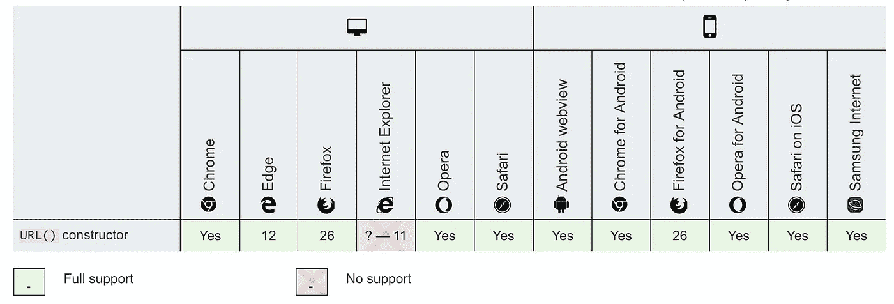
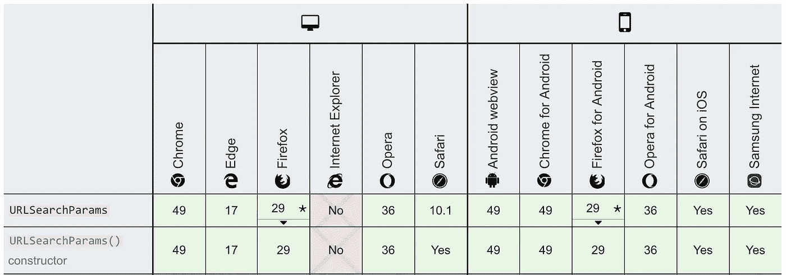

# 获取和创建 url 搜索参数的最简单方法:Javascript

> 原文：<https://itnext.io/easiest-way-to-get-and-create-url-params-javascript-9d24eae65720?source=collection_archive---------3----------------------->


照片由[émile Perron](https://unsplash.com/@emilep?utm_source=medium&utm_medium=referral)在 [Unsplash](https://unsplash.com?utm_source=medium&utm_medium=referral) 上拍摄

可能有很多方法可以获得 url 参数。也许你的程序在反应和使用一些库。我发现现代浏览器的 api 让它变得非常简单。

我将向您展示一些工具，您可以使用这些工具来获取这些 URL 参数。

# 获取 URL

我们要做的第一件事是获取网址。非常简单。所有浏览器都支持带`window.location`的窗口上的 url。

```
const url = window.location
```

那很容易。

# 获取 URL 参数

现在，为了获得 URL 参数，我们将使用一个为现代浏览器设计的 api，名为`URL`。如果你想在使用之前确认一下，这里有一个支持浏览器的列表。



[https://developer.mozilla.org/en-US/docs/Web/API/URL/URL](https://developer.mozilla.org/en-US/docs/Web/API/URL/URL)

我们要做的第一件事是创建一个新的 URL 对象。然后我们可以在 URL 对象上使用一个函数来获得我们想要的参数。

代码如下:

```
const url = window.location; // [http://google.com](http://google.com/)?id=test
const urlObject = new URL(url);
const id = urlObject.searchParams.get('id')
console.log(id) 
// prints 
// test
```

如果`id`不存在，那么 id 将为空。

# 创建带参数的 URL

创建带参数的 url 也很简单。我们再次使用浏览器 api 工具`URLSearchParams()`。

下面是这个函数的兼容性。



[https://developer . Mozilla . org/en-US/docs/Web/API/URLSearchParams](https://developer.mozilla.org/en-US/docs/Web/API/URLSearchParams)

`URLSearchParams()`是一个真正伟大的功能，可以采取多种选择。

以下是构造函数可以采用的示例选项列表。

```
const url = new URL('https://example.com?foo=1&bar=2');

// Retrieve params via url.search
// url.search ?foo=1&bar=2
const params = new URLSearchParams(url.search); 

// Pass in a sequence
const params3 = new URLSearchParams([["foo", 1],["bar", 2]]);

// Pass in a record
const params4 = new URLSearchParams({"foo" : 1 , "bar" : 2});
```

所以你可以决定如何传递这些搜索参数，但我是这样做的。

```
const params = { id: 'blahdy' }
const paramString = new URLSearchParams(params)
console.log(`http://google.com?${paramString.toString()}`)
```

# 结论

您只需几行代码就可以构建参数搜索字符串。这是获取和构造这些字符串最简单的方法。如果你有任何更好的方法来做同样的事情，发表评论，让我知道。

此外，如果你想看看另一种使用 URLSearchParams 的酷方法，请查看我关于今年【ES2019 酷功能的帖子！。在这里，我解释了一个新的很酷的特性，您可以使用 URLSearchParams。

编码快乐！

在 twitter 上关注我！