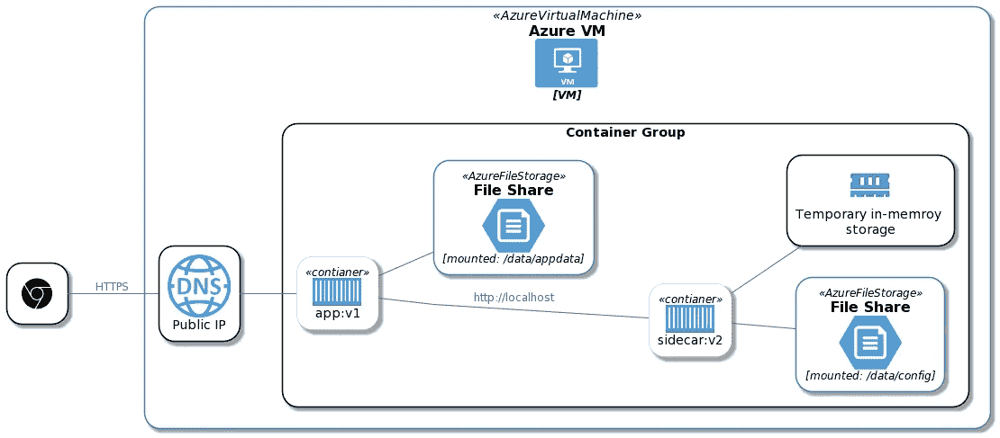

# 直接从桌面轻松地将容器部署到 Azure

> 原文：<https://itnext.io/easily-deploy-containers-to-azure-directly-from-your-desktop-16efebc87b21?source=collection_archive---------3----------------------->

克里斯托夫·高尔在 [Unsplash](https://unsplash.com/s/photos/desktop?utm_source=unsplash&utm_medium=referral&utm_content=creditCopyText) 上拍摄的照片

# 介绍

容器现在是一个成熟的解决方案，提供了额外的基础设施抽象级别。在许多情况下，容器可以取代传统上由虚拟机驱动的工作负载。

在这篇博客中，我们将看看 [Azure 容器实例](https://azure.microsoft.com/en-us/services/container-instances/)，展示直接从 docker CLI 向 Azure 部署容器有多快多容易。

# 先决条件

如果你想跟进，你需要有 Azure 订阅，Azure CLI 和 Docker 桌面实例。

*   [获得免费 Azure 订阅](https://azure.microsoft.com/en-us/free/)
*   [安装 Azure CLI](https://docs.microsoft.com/en-us/cli/azure/install-azure-cli)
*   [安装 Docker 桌面](https://www.docker.com/products/docker-desktop)

# 什么是 Azure 容器实例

Azure Container Instances 是一个计算产品，它在轻量级 Azure 功能和更复杂但成熟的 Azure Kubernetes 服务之间架起了一座桥梁。

[https://docs . Microsoft . com/en-us/azure/container-instances/container-instances-container-groups](https://docs.microsoft.com/en-us/azure/container-instances/container-instances-container-groups)

# 使用案例和特征

ACI 最适合可以独立运行的容器化工作负载、简单的应用程序、包括数据科学模型在内的批处理作业、各种任务自动化和集成场景。

*   **快速启动:**几秒钟启动容器。
*   **每秒计费:**仅在容器运行时产生费用。
*   **虚拟机管理程序级安全性:**完全隔离您的应用程序，就像它在虚拟机中一样。
*   **自定义大小:**指定 CPU 内核和内存的精确值。
*   **持久化存储:**将 Azure 文件共享直接挂载到一个容器中，以检索和持久化状态。
*   **Linux 和 Windows:** 使用相同的 API 调度 Windows 和 Linux 容器。

# 工作流程

我们将部署一个示例网页。这个想法是，通过 docker CLI 和 ACI，我们可以直接从 docker 命令行快速原型化、测试和部署！

> *重要节点:此流程仅用于测试目的，在真实代码场景中，您将让 CI/CD 管道为您部署应用。*

我们将使用 bash，但是同样的情况当然也可以使用`powershell`。

> *Docker CLI 现在包含通过* ***上下文*** *命令与 Azure 容器实例的内置集成。使用 Azure CLI 时，您可以通过键入* `*az interactive*` *来激活****Azure Interactive****。这是 Azure CLI 的一个实验性特性，它给你参数完成和更多！*

首先，让我们使用 docker CLI 设置变量并通过 Azure 进行身份验证

*   *租户*启用登录的设置变量:`TENANT=$(az account show --query tenantId -o tsv)`
*   最后让我们登录 Azure `docker login azure --tenant-id $TENANT`。系统将提示您通过 AD 或粘贴身份验证代码登录。
*   创造环境`docker context create aci azure-context`

> *该命令是交互式的，将提示您选择* ***订阅、资源组(创建或选择现有资源组)和位置*** *。如果您创建了一个新的资源组，请务必记下它的名称，以便以后清理资源。*

现在让我们部署一个测试容器！

1.  切换到新的上下文`docker context use azure-context`
2.  运行[ACI hello world image](https://hub.docker.com/r/microsoft/aci-helloworld)
3.  太好了！现在 grep 主机 IP 并在浏览器中导航到它:`docker inspect helloworld | grep HostIP`你应该看到“欢迎使用 Azure 容器实例！”如下图。
4.  清理资源

*   运行`docker stop helloworld`停止容器
*   运行`docker rm helloworld`移除容器组。运行此命令会完全删除容器组，因此不会产生费用。
*   如果您仅出于本演示的目的创建了资源组，则可以选择删除该资源组

成功！

*   切换回 docker 桌面上下文:`docker context use default`

# 摘要

我们已经看到将容器组直接部署到 Azure 容器实例是多么容易。这对于测试目的和快速内部开发循环非常有用。

这篇博客仅仅触及了 Azure 容器实例能做什么以及如何集成开发人员工作流的皮毛。在我看来，Azure 容器实例是 Azure 中最灵活、最强大的无服务器产品之一。

# 链接和资源

如果你有兴趣了解更多，可以看看很多很棒的博客和教程。

*   [撰写现已推出的客户端集成](https://www.docker.com/blog/compose-cli-aci-integration-now-available/)
*   [ACI 定价](https://azure.microsoft.com/en-gb/pricing/details/container-instances/)
*   [Docker 文档](https://docs.docker.com/engine/context/aci-integration/)
*   [部署 minecraft](https://www.docker.com/blog/deploying-a-minecraft-docker-server-to-the-cloud/)
*   [撰写规范](https://www.compose-spec.io/)
*   [VS 代码集成](https://cloudblogs.microsoft.com/opensource/2020/07/22/vs-code-docker-extension-azure-containers-instances/)
*   [Azure ACI 快速入门](https://docs.microsoft.com/en-us/azure/container-instances/quickstart-docker-cli)
*   [微软学习](https://docs.microsoft.com/en-us/learn/modules/run-docker-with-azure-container-instances/)
*   [Git 回购为卷](https://docs.microsoft.com/en-gb/azure/container-instances/container-instances-volume-gitrepo)
*   [Mark Russinovich 和 Scott Hanselman 在 Azure Friday 进行了非常酷的演示](https://www.youtube.com/watch?v=7G_oDLON7Us&ab_channel=MicrosoftAzure)