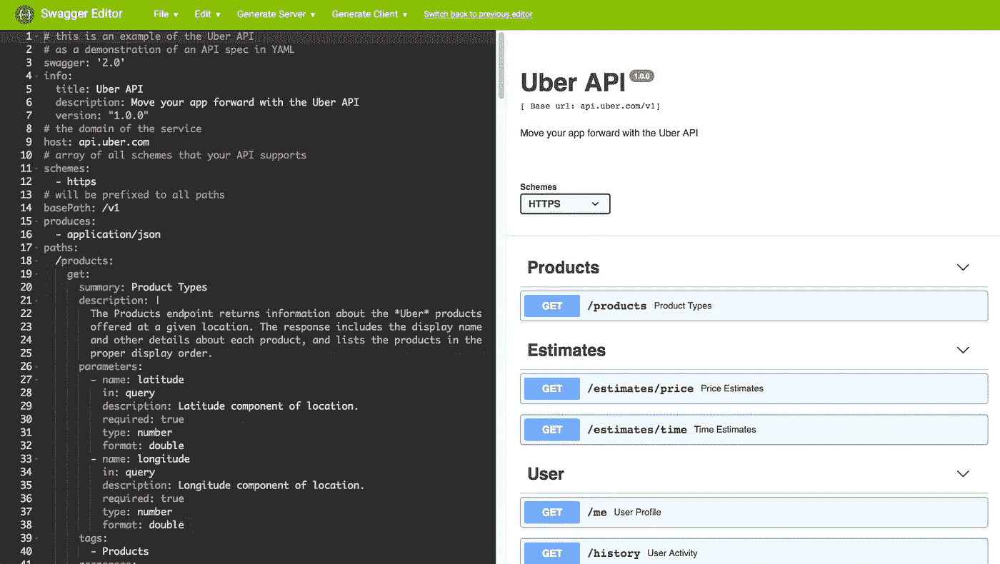
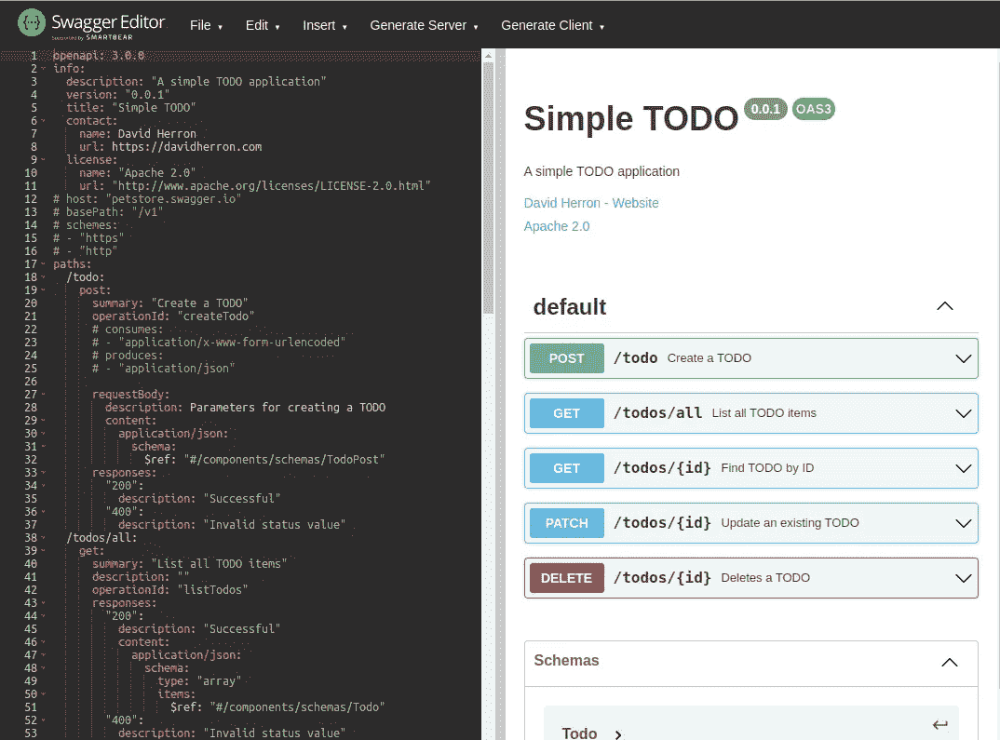
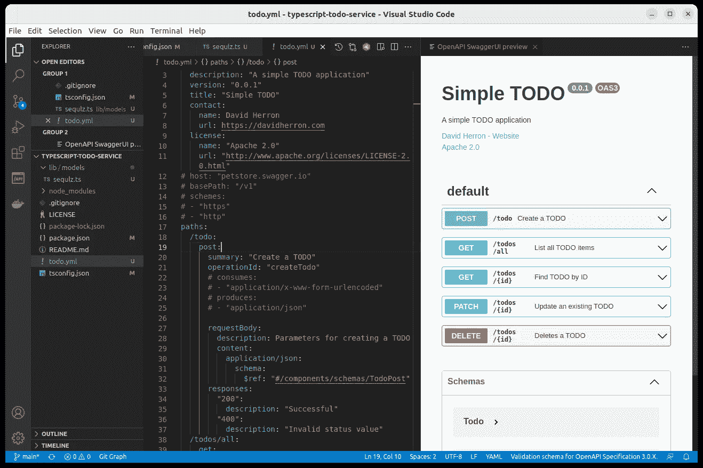

# 使用免费工具轻松编辑或查看 OpenAPI API 规范

> 原文：<https://itnext.io/easily-edit-or-view-openapi-api-specifications-using-free-tools-33d738630d6a?source=collection_archive---------5----------------------->

## 编辑 OpenAPI 规范或者在你的网站上显示它们的聪明方法



大摇大摆的编辑在行动，作者的形象

**OpenAPI 文档用 YAML 或 JSON 编写，可以用任何程序员编辑器编辑。Swagger 编辑器等工具通过立即显示错误和交互式 API 文档，以交互方式帮助编写 OpenAPI 规范。由于 OpenAPI 是一个开放的规范，所以任何公司开发 OpenAPI 工具的大门都是敞开的。在这篇文章中，我们将使用 swagger.io 网站上的 Swagger 编辑器，并尝试一些可以在您的笔记本电脑上运行的替代方法。**

回想一下，OpenAPI 是一种记录应用程序编程接口(API)的方法。它最初是作为 Swagger 规范而存在的，但是当 Smart Bear 将其贡献给 OpenAPI 计划时，它的名字就变成了 OpenAPI。OpenAPI 规范文档以 YAML 或 JSON 格式编写。它们描述了对象模式、API 方法等等。OpenAPI 工具可以生成交互式文档，确定 AWS API 网关等平台的配置，或者生成客户端或服务器源代码。

在整个教程中，我们指的是`todo.yml`。您可以使用任何您喜欢的 OpenAPI 规范。但是，如果您想查看编写本教程时使用的规范，GitHub 资源库位于:[https://github.com/robogeek/typescript-todo-service](https://github.com/robogeek/typescript-todo-service)

# 在线大摇大摆的编辑器

在线 Swagger 编辑器是最简单的 OpenAPI 编辑器。一个导航到网站([https://swagger.io/tools/swagger-editor/](https://swagger.io/tools/swagger-editor/))并点击现场演示按钮，这将带你到[http://editor.swagger.io/](http://editor.swagger.io/)。在这个站点上，您可以开始编辑 JSON 格式或 YAML 格式的 OpenAPI 文档。您最初将编辑 Pet Store 演示 API，但是清除编辑器缓冲区并编辑您的 API 是很容易的。



编辑面板是一个常规的程序员编辑器，用于编辑 JSON 或 YAML 形式的 OpenAPI 规范。当您编辑 OpenAPI 规范时，它会交互式地验证代码，并给出错误和警告，帮助完成代码。编辑时，预览窗格会以交互方式显示您正在创建的 API 的不断更新的交互式摘要。这意味着您可以轻松地探索您的 API，并直接确定代码是否符合您的意图。编辑器依靠后端服务来完成检测错误和生成交互式文档的繁重工作。

虽然编辑体验非常好，但它没有与您的本地文件系统集成。这意味着打开一个文件进行编辑，或者将编辑内容保存回你打开的文件，这是很笨拙的，我们将在后面讨论。使用在线编辑器让你受到 Smart Bear 的支配，依赖于他们继续免费托管这个编辑器的意愿。

Smart Bear 确实提供付费在线服务 Swagger Hub。换句话说，在线编辑器是付费服务的免费演示。

# 在本地安装 Swagger 编辑器

在您的机器上运行编辑器可能是一个最佳实践，这样您就可以控制自己的命运。Smart Bear 使编辑器可以作为 Docker 容器或使用 npm 安装的 Node.js 包使用。这是安装在他们网站上的同一个编辑器，但是你可以在你的电脑上运行它。

不幸的是，Node.js 包`swagger-editor`没有提供一个清晰描述的运行编辑器的方法。这个包的自述文件是这样写的，就好像你正在使用 GitHub([https://github.com/swagger-api/swagger-editor](https://github.com/swagger-api/swagger-editor))的 Git 库一样。如果您对源代码感兴趣，这是一个好去处，但是它似乎不适合日常使用。

相反，让我们集中使用 Docker 来运行 Swagger 编辑器。

如果你还没有在你的笔记本上安装 Docker，请点击[开始使用 Docker:安装，第一步](https://techsparx.com/software-development/docker/damp/getting-started.html)获取教程。

在 GitHub 库的自述文件中，您可以找到关于使用以下命令运行 Docker 容器的文档:

```
$ docker run -d -p 80:8080 swaggerapi/swagger-editor
```

运行这个命令后，您可以在浏览器中进入`http://localhost`,在 Swagger 网站上找到确切的 Swagger 编辑器。不同之处在于编辑器是在你的电脑上运行的，你有额外的控制余地。

命令行的替代方法是创建一个名为`docker-compose.yml`的文件，其中包含:

```
version: '3' services:
   editor:
     image: swaggerapi/swagger-editor
     ports:
       - 80:8080
```

然后，使用以下命令运行它:

```
$ docker compose up
```

注意，这是“T3”，而不是“T4”。Docker tools 的最新版本包含一个“`docker compose`”命令，看起来具有古老的“`docker-compose`”命令的功能。建议切换到新命令，忘掉旧命令。Docker-compose 已死，Docker Compose 万岁？

编辑器运行后，用户体验与 Swagger 网站相同。不同的是你有更多的控制权，因为编辑器是在你的电脑上执行的。

# 使用 Swagger 编辑器编辑本地 OpenAPI 规范文件

无论你是在网站上使用 Swagger 编辑器，还是在电脑上的 Docker 下使用，都是同一个 Swagger 编辑器。让我们讨论一下用它来编辑一个本地文件。我们之前说过编辑本地文件很笨拙。因为是 web 应用，所以不能直接打开你电脑上的文件，导致笨拙。

要编辑 OpenAPI 规范，点击*文件*菜单并选择*导入文件*。这将打开一个文件选择器，您可以在其中选择一个本地文件。注意短语“*导入文件*”而不是本机应用中使用的“*打开文件*”。这个短语提醒您，作为一个 web 应用程序，它并不直接在文件系统中打开文件。导入后，编辑器包含您选择的规范。

编辑完规范之后，您将得出一个结论，您希望将文件保存回磁盘。为此，返回*文件*菜单，选择*另存为 YAML* 。它不是让您选择文件名，而是将规范保存为下载文件夹中的“`openapi.yaml`”。要将此文件保存回您的工作区，您必须从下载中手动复制该文件。

这个过程有些笨拙。一方面，保存文件需要两个步骤，保存到`openapi.yaml`，然后将该文件移动到原始文件。另一方面，我认为所有 IDE 用户都应该养成一个习惯，那就是定期键入 CTRL-S 或 COMMAND-S 来定期保存您正在编辑的文件。这样做可以将文件保存到磁盘，如果编辑器崩溃，这一点很重要。因为 Swagger 编辑器在浏览器窗格中，所以不能使用这个习惯。

# 使用 Swagger 编辑器自动编辑本地文件

Docker 命令可以很容易地列出要编辑的文件。这将省去使用*导入文件*编辑文件的步骤。

```
$ docker run -p 80:8080 -v $(pwd):/tmp \
    -e SWAGGER_FILE=/tmp/todo.yml swaggerapi/swagger-editor
```

这将当前目录作为`/tmp`挂载到容器中，然后告诉 Swagger Editor 编辑`/tmp/todo.yml`。当你在`http://localhsot`上打开浏览器窗口时，你会看到文件已经在那里了。

将它用作合成文件相当简单。创建一个名为`docker-compose-edit-spec.yml`的文件，其中包含:

```
version: '3' services:
   editor:
     image: swaggerapi/swagger-editor
     ports:
       - 80:8080
     volumes:
       - ./todo.yml:/tmp/todo.yml
     environment:
       - SWAGGER_FILE=/tmp/todo.yml
```

这与命令行工具的设置相同，但是所有内容都整齐地记录在一个配置文件中。

要运行此合成文件:

```
$ docker compose --file docker-compose-edit-spec.yml up
```

通过给合成文件起这么长的名字，我们能够将多个合成文件用于多种目的。

# 安装 Visual Studio 代码的 OpenAPI 扩展

42Crunch 的这个扩展本质上是集成到 Visual Studio 代码中的 Swagger 编辑器。在 VSC，打开扩展面板，搜索“OpenAPI”。在撰写本文时，这个扩展是最好的结果，也是目前为止 VSC 安装最广泛的 OpenAPI 工具。

安装后，打开 JSON 或 YAML 文件时，该扩展会自动检测它是否是 OpenAPI 规范。如果是这样，它添加了对 OpenAPI 有用的行为。这包括编辑器窗格中的代码完成和代码提示，以及预览窗格。单击 VSC 工具栏中的预览按钮可触发预览窗格。交互式 API 视图与 Swagger 编辑器提供的相同。



因为您正在 VSC 编辑器中编辑规范，所以您可以直接访问文件系统。例如，您可以随心所欲地键入 CTRL-S 或 COMMAND-S。更重要的是，您不需要手动重命名保存的文件，因为 VSC 直接保存到打开的文件。

这解决了前面描述的笨拙。您正在直接编辑本地文件，并直接保存到本地文件。缺点是增加了一些 Visual Studio 代码的臃肿。

# 使用 Swagger UI 发布 API 文档

模型是 OpenAPI 规范的文档是交互式的。Swagger UI 项目(【https://github.com/swagger-api/swagger-ui】T2)是 OpenAPI 规范的浏览器端查看器。它实际上是 Swagger 编辑器的预览面板。目的是在公共网站上部署，这样公众就可以查看交互式 API 文档。

Swagger UI 自述文件讨论了两种安装方法:

1.  在 HTML 页面中嵌入一些代码，Swagger UI 完全在浏览器中运行。
2.  部署 Docker 容器。

对于 HTML 部署，请参考 Swagger UI 团队展示的模板。更多信息请参见:[在一个 HTML 页面中显示 Swagger UI，而不使用服务器端服务](https://techsparx.com/software-development/openapi/swagger-ui-viewer.html)

相反，让我们探索使用 Docker 容器。

```
$ docker run -p 80:8080 \
   -e BASE_URL=/swagger \
   -e SWAGGER_JSON=/foo/swagger.json \
   -v /bar:/foo \
   swaggerapi/swagger-ui
```

这使用了一个本地文件，它将是在容器中显示为`/foo/swagger.json`的`/bar/swagger.json`。虽然这个环境变量是`SWAGGER_JSON`，我们也可以提供一个 YAML 文件。`BASE_URL`变量使 API 查看器出现在不同的 URL 上，这意味着您不是查看 API 的`http://localhost/`，而是查看`[http://localhost/swagger](http://localhost/swagger.)` [。](http://localhost/swagger.)

这对于在您的笔记本电脑上显示 API 很有用，但是对于生产部署就不那么有用了。

这里有一个 Docker Compose 部署，它试图显示一个 HTTP URL 上可用的 API 规范。

```
version: '3' services: nginx:
     image: nginx
     networks:
       - openapi
     volumes:
       - .:/usr/share/nginx/html:ro editor:
     image: swaggerapi/swagger-ui
     networks:
       - openapi
     ports:
       - 80:8080
     # volumes:
     #   - ./todo.yml:/tmp/todo.yml
     environment:
       - SWAGGER_JSON_URL=http://nginx/todo.yml
       # - SWAGGER_JSON=/tmp/todo.yml networks:
   openapi:
```

这部署了两个容器，一个是 NGINX，专门用于服务 OpenAPI 规范，另一个是 Swagger UI。如果我们使用`SWAGGER_JSON_URL`和注释掉`SWAGGER_JSON`，这将尝试从 NGINX 服务器中检索`todo.yml`。或者，我们可以使用`SWAGGER_JSON`而不是`SWAGGER_JSON_URL`从本地文件中检索它。

使用 NGINX 服务器时，弹出一个错误:

```
Failed to load API definition. Fetch error Failed to fetch http://nginx/todo.yml Fetch error Possible cross-origin (CORS) issue? The URL origin (http://nginx) does not match the page (http://localhost). Check the server returns the correct 'Access-Control-Allow-*' headers.
```

有了这个合成文件，Swagger UI 容器就可以到达位于`http://nginx` URL 的 NGINX 容器。然后，它从`http://nginx/todo.yml`中检索规格。这意味着由 Swagger UI 加载的 JavaScript 从不同的 URL 加载，而不是 OpenAPI 规范的源代码，这看起来像一个 CORS 错误。有一个建议是添加访问控制头，这是值得研究的。

使用带有 Docker 合成文件的 Swagger UI 的最简单的例子是:

```
version: '3' services:
    editor:
     image: swaggerapi/swagger-ui
     ports:
       - 80:8080
     volumes:
       - ./todo.yml:/tmp/todo.yml
     environment:
       - BASE_URL=/todoapi
       - SWAGGER_JSON=/tmp/todo.yml
```

这将本地 OpenAPI 规范挂载到容器中，告诉 Swagger UI 使用它，并将其放在`/todoapi` URL。

关于在网页上部署 Swagger UI 的工作示例，请参见:[在不使用服务器端服务的情况下在 HTML 页面中显示 Swagger UI](https://techsparx.com/software-development/openapi/swagger-ui-viewer.html)

# 摘要

Swagger 编辑器和 Swagger UI 是编辑和查看 OpenAPI 规范的有用工具。它们可以很容易地在你的笔记本电脑上使用，或者作为网站上的托管服务。

对于编辑 OpenAPI 文件，建议使用 Visual Studio 代码的 OpenAPI 扩展。

OpenAPI 是一个开放的规范，使得任何组织都可以使用它，任何公司都可以开发和提供 OpenAPI 工具。OpenAPI 工具的清单很长，而且还在不断增加，位于:[https://openapi.tools/](https://openapi.tools/)

# 关于作者


[**大卫·赫伦**](https://davidherron.com/) :大卫·赫伦是一名作家和软件工程师，专注于技术的明智使用。他对太阳能、风能和电动汽车等清洁能源技术特别感兴趣。David 在硅谷从事了近 30 年的软件工作，从电子邮件系统到视频流，再到 Java 编程语言，他已经出版了几本关于 Node.js 编程和电动汽车的书籍。

*最初发表于*[*https://techsparx.com*](https://techsparx.com/software-development/openapi/edit-openapi-documents.html)*。*