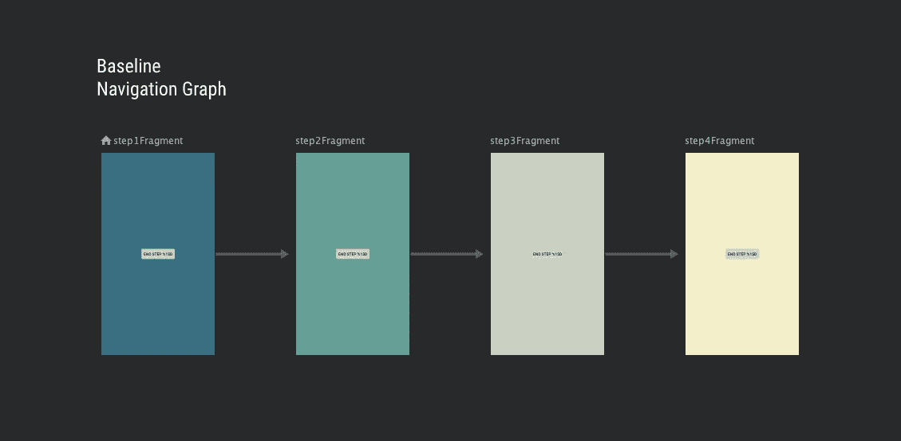
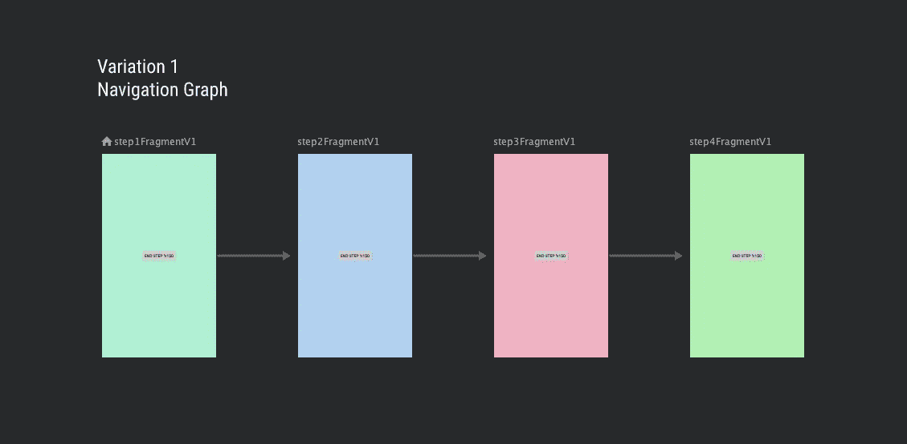
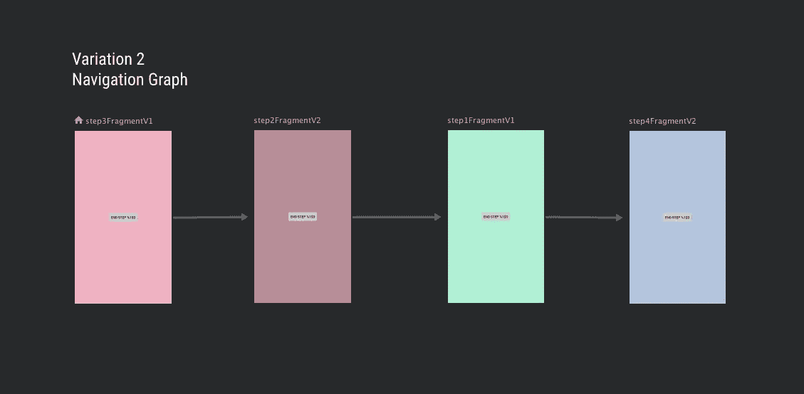

# 使用 Android 导航组件在 Android 上进行简单的 A/B 测试

> 原文：<https://itnext.io/easy-a-b-testing-on-android-with-androidx-navigation-component-64d057e5bdce?source=collection_archive---------3----------------------->


由 [Unsplash](https://unsplash.com/s/photos/compass?utm_source=unsplash&utm_medium=referral&utm_content=creditCopyText) 上的[absolute vision](https://unsplash.com/@freegraphictoday?utm_source=unsplash&utm_medium=referral&utm_content=creditCopyText)拍摄

创建一个成功的应用程序需要采取数据驱动的决策。从用户那里收集有价值的见解的一个很好的工具是 A/B 测试。网上有很多资源解释其背后的理论(比如这里的)，但本质上是将一个功能的两个或更多不同的变体部署到不同的用户群，并将这些变体的表现与预定义的目标(比如增加第一天的保留率、转换率等)进行比较。结果，你将(希望)有一个获胜的变体，它将胜过其他的，并将成为所有用户的新标准(当然其他变体将永远消失……)

在技术方面，当 A/B 测试时，主要的挑战是不要用特定于测试的代码污染您的业务逻辑和/或主要代码库，并设计一个解决方案，使必要的测试后清理变得容易，使结果代码保持良好的状态，就像那里从未发生过测试一样。

# 导航挑战

谷歌在 2018 年发布了 AndroidX 导航组件库，作为 Jetpack 的一部分。它偏爱一个活动——多片段应用程序架构，隐藏了大多数怪异/糟糕的生命周期相关问题。它很强大，同时也很容易使用，提供了一个很好的图形导航编辑器，并使令人害怕的开发者在使用它们时感觉更舒服。如果你还没有尝试过，你可以在这里阅读更多关于它的内容，在这里看看 codelab [。](https://codelabs.developers.google.com/codelabs/android-navigation/#0)


我们为导航组件找到的另一个很好的用例是(你猜对了)A/B 测试，并且已经被证明非常成功地帮助解决了所描述的技术挑战。

考虑这样一个场景，您想要测试一个特性(例如用户入职)，您有 3 个不同的版本，每个版本有 4 个屏幕。基线，变体 1 具有完全不同的屏幕，变体 2 以不同的顺序混合了新屏幕和变体 1 屏幕。

设计导航逻辑看起来就像一场噩梦，到处都是 if 和 whens，使用一个 ViewPager 或只是片段管理器，手动处理所有的片段事务。但是有了导航组件，所有这些问题都不存在了！

为了演示使用导航组件的新方法，我创建了一个新的玩具项目，完整的源代码在这里:

[](https://github.com/tpakis/ABNavigationExample) [## tpakis/异常示例

### 此时您不能执行该操作。您已使用另一个标签页或窗口登录。您已在另一个选项卡中注销，或者…

github.com](https://github.com/tpakis/ABNavigationExample) 

# 救援导航组件

主要思想是应该有 3 个不同的导航图，AB 测试的每个变化(基线，变化 1，变化 2)一个。每个导航图将包含 4 个目的地(根据我们之前描述的测试场景，但是它可以是任何数量，甚至在变化之间也不相同)，它们是片段，以及连接目的地的 3 个动作。为了帮助可视化，我从 android studio 导航编辑器中截取了一些截图。目的片段是彩色方框，动作是箭头。



AB 测试基线导航图



第一个变体的导航图



AB 测试第二种变化的导航图。请注意，第一步和第三步与第一步相同，但顺序不同(第三步现在是第一步，反之亦然)

每个**不同的(有些是变体之间共享的)**片段都有不同的类和 XML 布局文件。在实际场景中，这对于清理目的来说非常有效，因为这是一个 A/B 测试，在测试结束时，我们将删除所有没有通过的片段类和布局文件，而不用担心对获胜者变体的重构。

A/B 测试特性的托管活动*(项目中的 ABTestActivity)*需要知道要膨胀哪个导航图。在一个大项目中，我们希望注入这些信息，但是为了简单起见，现在有一个枚举类 ABTestVariation，并且适当的变化与活动的启动意图一起传递:

这种方法非常简单，看起来也很干净，但是有一个很大的挑战。为了在片段之间导航，您必须指定您想要导航到的目的地或者您应该采取的动作，这两者都需要一个 id:

```
findNavController().navigate(R.id.action_b_to_a)
```

由于我们在 3 个不同的 XML 导航图中有 4 个不同的目的地和 3 个不同的动作，我们如何知道在处理它们的活动中使用哪个 id 呢？看起来我们又陷入了 whens 和 if 的陷阱，或者片段应该以某种方式获取这些信息并将其传递回父活动，这也不是很好。

最后，经过大量的试验和错误，尝试多种方法，终于有了**发现**的时刻！不同图中的目的地 id 不必不同，甚至在同一导航图中的动作 id 也不必不同！这意味着我们可以用 **id 将每个动作命名为 next** ，然后活动将尝试导航到… next！！如果这个动作不存在，那就意味着我们到达了图的末端！那太容易了！

测试后的清理也非常简单，只需删除片段、它们的布局和导航图(如果你愿意，让活动膨胀相同的图，而不传递这个信息)。

A/B 测试快乐！