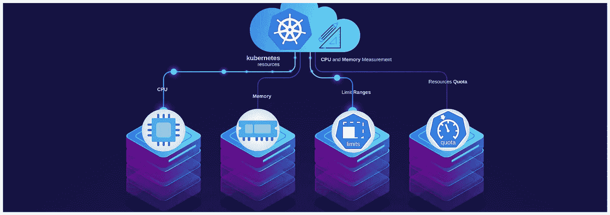
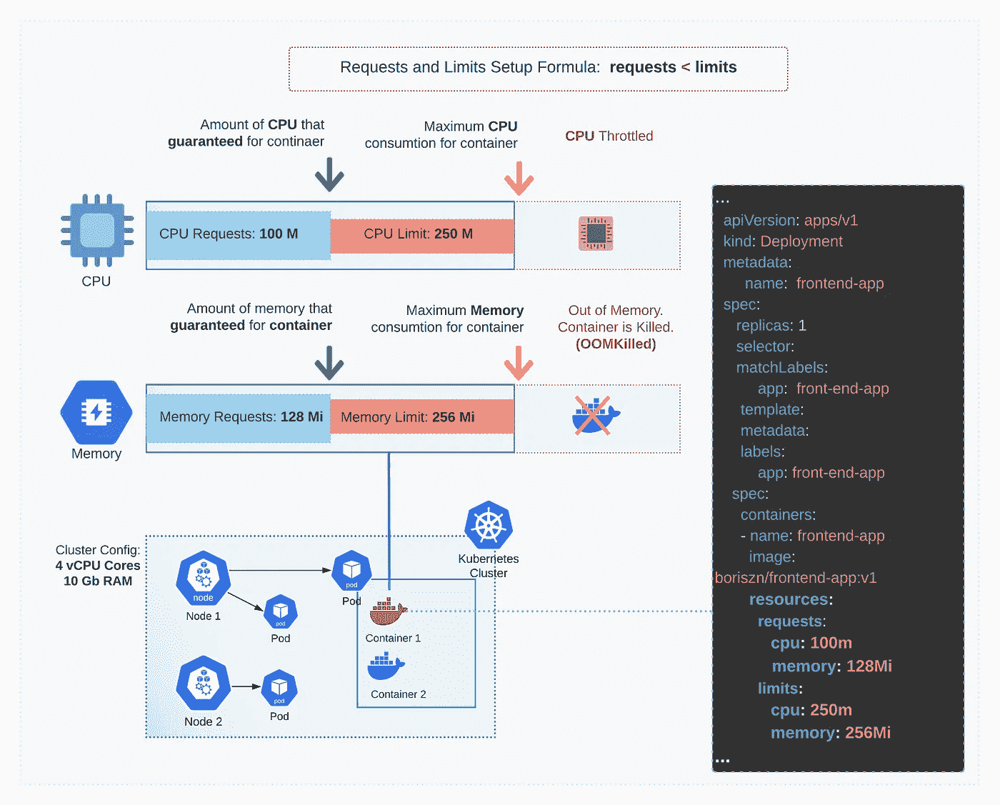
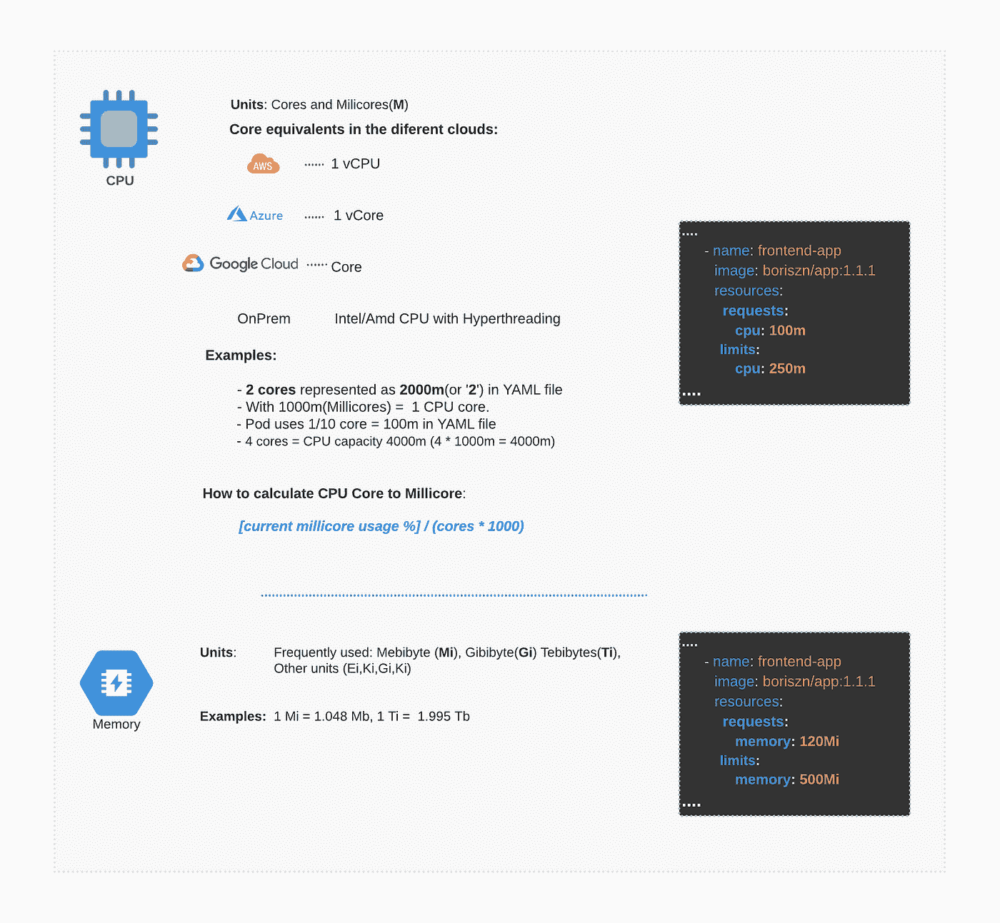
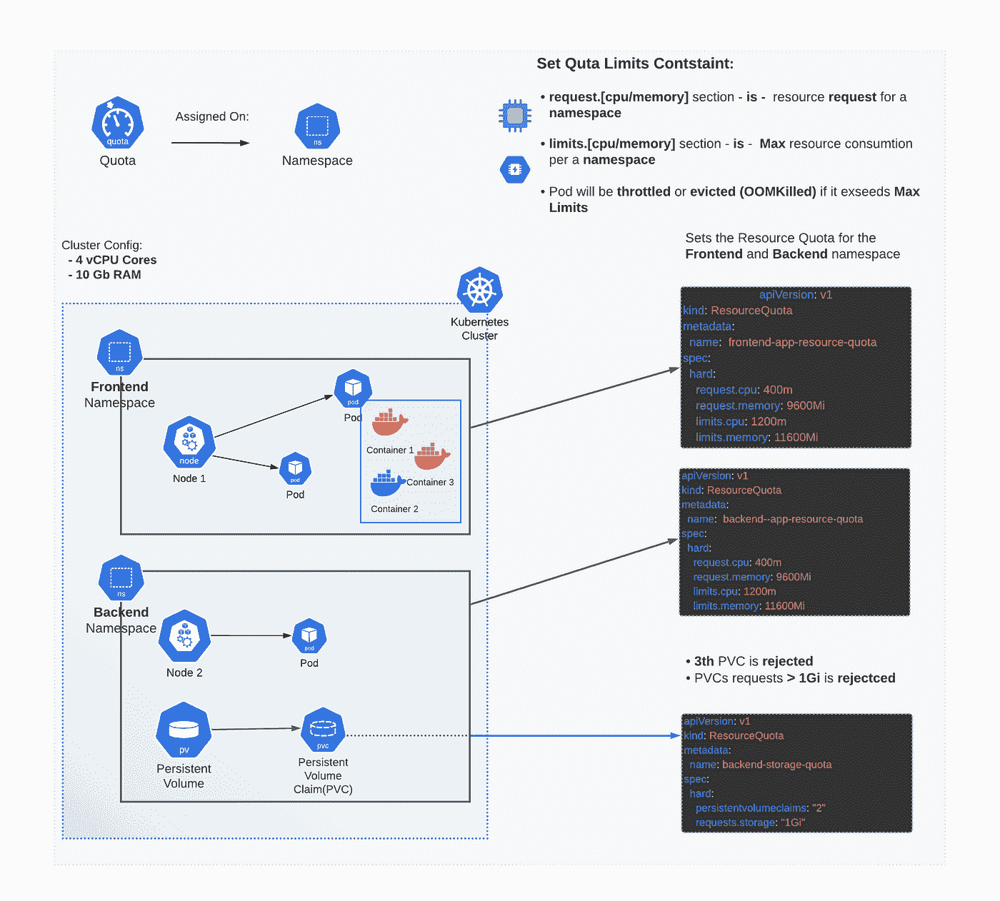
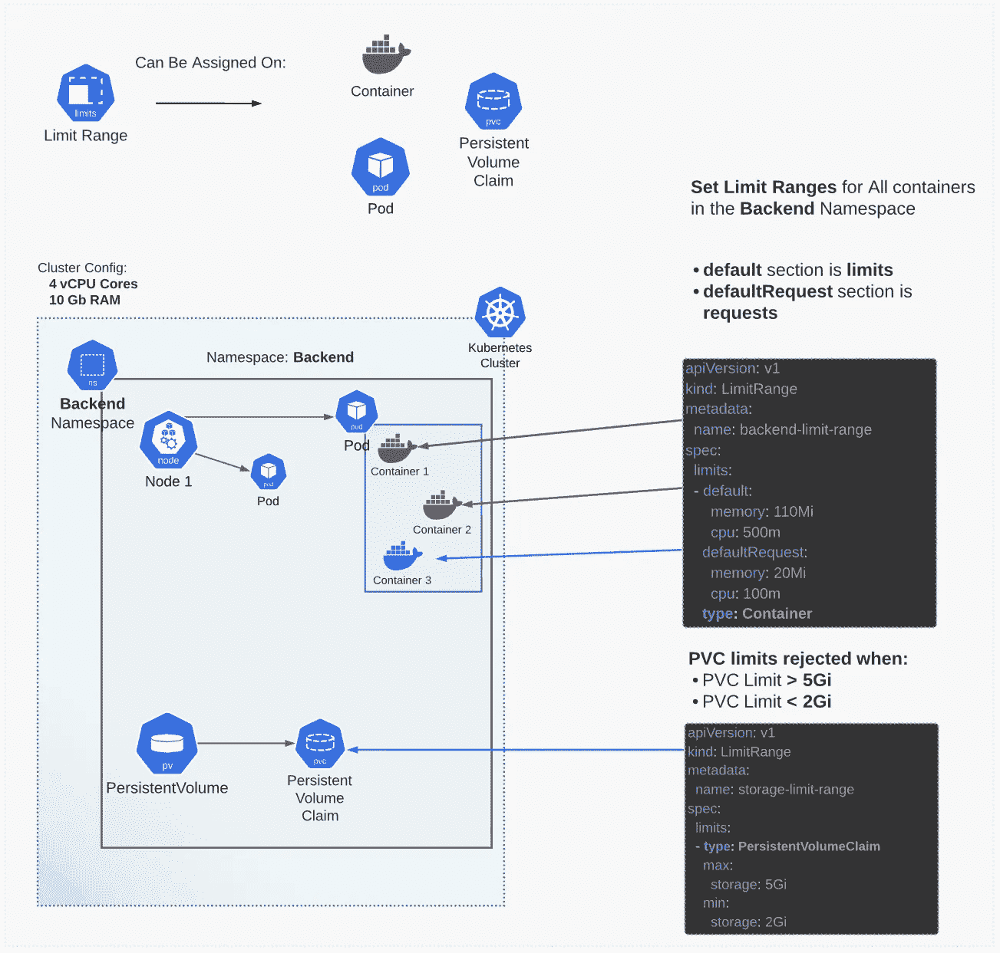

# 轻松快速地调整 Kubernetes CPU 和内存

> 原文：<https://itnext.io/easy-and-fast-adjustment-of-kubernetes-cpu-and-memory-709394cc2cb1?source=collection_archive---------0----------------------->

在 Kubernetes 中分配和管理 CPU 和内存资源既复杂又容易。在为众多客户完成这项任务后，我决定创建一个框架区域。我将向您展示 Kubernetes 的资源和限制是什么，以及如何管理它们。



## 该框架包含以下步骤。

*   **信息图表指南**显示了确定和分配资源和限制时应遵循的算法。
*   **代码模板**允许以最小的适应性应用那些算法。
*   **算法和工具**收集有关资源消耗的指标并设置限制。
*   **链接**到官方文档，您可以快速获取一些示例并阅读更多详细信息。

## 这篇文章没有包含的内容。

我的目标是简单。所以你不会找到关于资源、限制范围和配额如何工作的详细描述。有大量关于它的文章，以及 Kubernetes 的完整文档。相反，你可以在这里找到关于如何快速调整项目中 Kubernetes 资源的信息***。***

# *关于 CPU 和内存资源的基础指南*

*两个备忘单从 Kubernetes、度量单位、资源状态工作流以及如何应用它的一些规则方面解释了什么是资源。*

**

## *CPU 和内存**测量单位***

**

****请注意*******CPU 计算公式并不适用于每个设置或项目*** *。它被用作检测和分配资源和限制的过程的起点。***

**Kubernetes 部署 YAML 模板包括容器、资源和限制定义。**

**更详细的信息和代码片段:**

*   **[Kubernetes.io .分配内存资源指南](https://kubernetes.io/docs/tasks/configure-pod-container/assign-memory-resource/)。**
*   **[Kubernetes.io .分配 CPU 资源指南](https://kubernetes.io/docs/tasks/configure-pod-container/assign-cpu-resource/)。**
*   **[Kubernetes 最佳实践资源请求和限制](https://cloud.google.com/blog/products/gcp/kubernetes-best-practices-resource-requests-and-limits)**
*   **Azure Kubernetes 服务。开发人员最佳实践资源管理**

# **资源**配额指南****

****

**两个配额**模板，包含支持的命名空间中持久卷声明和资源的配额定义**。**

**您可以使用 ku bectl“apply”命令来设置名称空间的配额约束。**

```
**kubectl apply -f resource-quota.yaml — namespace backend**
```

**配额、指标以及如何使用配额表达式和代码示例的详细说明。**

*   **[https://kubernetes.io/docs/concepts/policy/resource-quotas/](https://kubernetes.io/docs/concepts/policy/resource-quotas/)**

# **极限**范围指南****

****

**两个限制范围代码模板，用于限制容器的 CPU 和内存资源，以及限制存储(持久卷声明)。要设置该约束，您也可以使用`kubectl apply -f path/to/file.yaml -n namespace`**

**更详细的信息和代码片段。**

*   **[管理资源。Cpu 默认命名空间](https://kubernetes.io/docs/tasks/administer-cluster/manage-resources/cpu-default-namespace/)**
*   **[Kubernetes 木卫一。限制存储消耗](https://kubernetes.io/docs/tasks/administer-cluster/limit-storage-consumption/)**
*   **[Kubernetes 木卫一。极限范围](https://www.howtoforge.com/limit-ranges-in-kubernetes/)**

# **有助于资源和限制例程的工具和框架**

*   **[**Popeye**](https://github.com/derailed/popeye)**扫描集群的潜在配置、资源和网络漏洞问题，并生成所有问题的详细报告。****
*   ****[**金凤花**](https://github.com/FairwindsOps/goldilocks/) 扫描 pod 的资源限制，并使用推荐的资源创建报告。****
*   ****一个简单的工具，来自 Azure 团队，可以扫描 pods 来寻找丢失的资源并限制请求。****
*   ****[**K9s+基准测试**](https://github.com/derailed/k9s#benchmark-your-applications) —提供命令行界面(CLI ),允许您在您喜爱的终端软件
    中轻松管理、监控甚至基准测试您的集群****

****一些有用的免费开源工具，很容易安装。您还可以将这些工具与 [Datadog](https://www.datadoghq.com/blog/announcing-aks/) 、 [Grafana+Prometeus](https://ifi.tech/2020/10/28/how-to-configure-prometheus-and-grafana-in-azure-kubernetes-aks/) 、Azure Monitor 结合使用，以改进资源和限制监控。****

# ****算法****

1.  ****设置资源请求。获取特定应用程序/容器的 CPU 和内存使用信息。****
2.  ****设置资源限制。设置资源请求。运行负载测试以检测高负载下容器的 CPU 和内存..****
3.  ****监控容器的 CPU 和内存使用情况。****
4.  ****监控持久存储的使用情况。****
5.  ****检查是否可以使用限制范围应用资源限制(如果您有类似的容器、存储设置)****
6.  ****如果需要，应用存储限制范围。或者使用配额(不建议对生产环境应用配额)****

# ****结论****

****我已经和你分享了我每天创建和使用的框架，同时处理 Kubernetes 的请求和限制。希望你会觉得有用。有什么好主意吗？****

****请在评论中分享你的反馈和建议。****