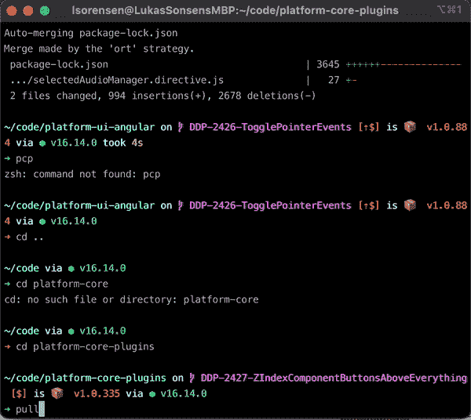

# 使用 Bash 提高生产力

> 原文：<https://itnext.io/easy-bash-scripting-tips-to-increase-productivity-7227f6d12756?source=collection_archive---------4----------------------->


命令行

你有没有发现自己一遍又一遍地在终端上输入同样的命令？如果你像我一样，你可能厌倦了这一点，并希望它自动化。这里有一些关于如何使用 bash 加速工作流的技巧。

# 什么是 Bash？

Bash 是一种为 Unix shells 编写的脚本语言。你的 Mac 终端是一个 Unix Shell 和 Linux 终端。如果你使用的是 windows，你需要下载类似于运行在 Unix 上的 [Git Bash](https://gitforwindows.org/) 的东西。

# Bash vs Zsh

Z Shell，简称 Zsh，是 Bash 的一个扩展，它附带了大量有用的插件，如自动 cd(只需键入路线)、拼写检查、更强大的制表符补全、插件支持、主题化和令人敬畏的框架。有很多关于如何在 Medium 上设置 Zsh 和 Oh-My-Zsh 的教程，我强烈推荐你去看看。

[](https://medium.com/@caulfieldOwen/youre-missing-out-on-a-better-mac-terminal-experience-d73647abf6d7) [## 你错过了更好的 Mac 终端体验

### Mac 命令行应用程序，插件，调整和提示，使您的终端完全符合您的要求:功能…

medium.com](https://medium.com/@caulfieldOwen/youre-missing-out-on-a-better-mac-terminal-experience-d73647abf6d7) 

# 。bashrc/。zshrc

要开始编写一些简单的脚本，您需要根据使用 bash 或 zsh 来找到您的`.bashrc`或`.zshrc`文件。从现在起，我将只参考`.zshrc`文件，但是我知道你可以在你的`.bashrc`中做大多数相同的事情。

要打开您的`.zshrc`文件，只需在您的终端中运行以下命令:

```
$ open ~/.zshrc
```

您应该已经在文本编辑器中打开了您的`.zshrc`文件，并且可以开始编辑了。如果你安装了 Oh-my-zsh，你会发现里面已经有很多东西了。大部分都会用#符号注释掉。现在忽略它，滚动到文件的底部，我们将在那里添加代码。

# 别名

我们能做的提高生产力的最简单的事情就是开始写一些别名。别名只是更长命令的快捷方式。

```
alias gp="git push"
```

将别名`gp`添加到`git push`命令中。所以无论何时你想运行“git push ”,你只需要在命令行中输入`gp`。一开始并不能节省很多时间，但是在你推了几千次之后，它就累积起来了。

这里还有一些别名的例子

```
alias ui="cd path/to/ui/repository"
```

一个频繁使用的回购协议的别名。

```
alias gcd="git checkout develop"
```

变更开发分支机构的别名。

要保存这些别名，只需将它们添加到您。zshrc 文件并保存它，但是一定要重新加载您的终端，通过运行以下命令来查看它们的应用:

```
$ source ~/.zshrc
```

也可以把它变成一个别名。)

```
alias reload="source ~/.zshrc"
```

# 功能

现在让我们假设您想要做一些比别名更复杂的事情，并且您想要将几个步骤自动化到一个命令中。这就是函数派上用场的地方。这里有一个我日常使用的函数的例子。

```
pullindev() {
 git checkout develop
 git fetch
 git pull
 git checkout -
 git merge develop
}
```

该函数名为`pullindev` ，它切换到开发分支，提取和提取，然后切换回您之前所在的分支，并在开发中合并。我用它来使我的特性分支与 develop 保持同步，而不必分别输入每个命令。我只需输入`pullindev` 并等待我的分支更新。



运行中的 pullindev 示例

函数很容易编写，因为我们大多数人都熟悉语法。简单地定义一个函数并在里面写一些 bash。最容易编写的函数是当你只需要连续运行一堆命令时，但有时你可能想做一些更复杂的逻辑。

幸运的是，Bash 是一种完整的语言，能够为循环定义变量、if 语句。编写复杂逻辑和自动化困难任务所需的一切。

在编写复杂的 Bash 脚本时，可以参考这个 [Bash 备忘单](https://devhints.io/bash)。

## 更复杂的例子

在我的工作中，我们使用 JIRA 来跟踪新功能。我们使用 JIRA 卡 id 作为分支的前缀，并以卡 id 开始每次 git 提交，以跟踪每次提交的目的。

示例:

```
$ git commit -m "DDP-1209: fixed typo"
```

我想实现自动化，所以我创建了一个 bash 脚本，它可以从我的分支名称中读取 JIRA 卡 id，然后将其添加到我的提交消息中。下面是代码:

```
commit () {
 branch="$(git branch | grep \* | cut -d ' ' -f2)"
 IFS='-' read -rA arrBranch <<< "$branch"
 story="$arrBranch[1]-$arrBranch[2]"
 branchPrefix=${arrBranch[1]}
 commitMessage="$story: $1" if [ "$branchPrefix" != "DDP" ]; then
   commitMessage="$1"
   read -q "REPLY?Branch name does not start with 'DDP'. would you      like still include prefix in commit? [y/n] "
   echo
 if [[ $REPLY =~ ^[Yy]$ ]]; then
    echo "Enter in a prefix:"
    read ANSWER
    commitMessage="$ANSWER: $1"
   fi
 fi

 git add .
 git commit -m "$commitMessage"
}
```

我们来分解一下。

```
branch="$(git branch | grep \* | cut -d ' ' -f2)"
```

这通过将 **git branch** 结果通过管道传输到 grep 中来获取当前分支名称，并搜索以*开头的行，然后从分支名称中删除星号和空格。

```
IFS='-' read -rA arrBranch <<< "$branch"
```

在每个`‘-’`处拆分分支机构名称。类似于跑`branch.split(‘-’)`。一个特征分支应该是这样的:`DDP-1209-my-new-feature`

```
story="$arrBranch[1]-$arrBranch[2]"
```

创建变量`story`，它是拆分中的前两个项目，因此对于我们的示例，分支故事将等于`DDP-1209`

```
branchPrefix=${arrBranch[1]}
```

将 branchPrefix 变量设置为第一个 split，`DDP`以便稍后检查前缀是否正确。

```
commitMessage="$story: $1"
```

创建变量`commitMessage`，它是你的 JIRA 故事(卡片)id 加上你输入的任何信息。即`commit “my commit message”`在这里`$1`等于“我的提交消息”

```
if [ "$branchPrefix" != "DDP" ]; then
   commitMessage="$1"
   read -q "REPLY?Branch name does not start with 'DDP'. would you      like still include prefix in commit? [y/n] "
   echo
 if [[ $REPLY =~ ^[Yy]$ ]]; then
    echo "Enter in a prefix:"
    read ANSWER
    commitMessage="$ANSWER: $1"
   fi
 fi
```

如果 branchPrefix 不是`DDP`,通知客户分支不是以 DDP 开始，并询问他们是否仍然希望包括分支前缀。如果他们键入`y`，然后询问客户他们想添加什么作为前缀，并将他们的答案附加到`commitMessage`。

```
git add .
git commit -m "$commitMessage"
```

存放所有用于提交的更改，并使用带前缀的提交消息提交。现在，当我想要提交我的更改时，我所要做的就是键入:

```
$ commit "my commit message"
```

它会自动将我的 JIRA 卡 id 添加到我的提交中，并自动保存我所有的更改，为我每天的提交节省了大量时间。

# 结论

Bash 脚本是一种简单的方法，通过自动化您每天在终端中输入的简单命令来提高您的生产率。您可以使用别名来创建易于使用的更长命令的快捷方式、自动化一系列简单命令的函数，并且可以编写更长更复杂的 bash 脚本来自动化需要更复杂逻辑的复杂任务。坐下来，放松，让自动化来完成工作。