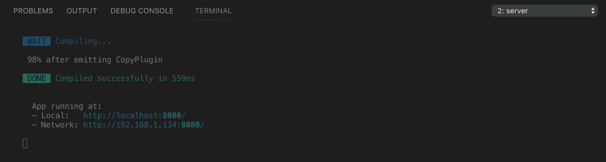

# VS 代码终端的简单增强

> 原文：<https://itnext.io/easy-enhancements-for-vs-codes-terminal-6dda2c22ee5c?source=collection_archive---------0----------------------->

几个月前我从 Sublime Text(没有阴影——❤sublime)转到了 VS 代码。我一直将终端(在 Mac 上)与 Sublime 结合使用，但是在使用 VS 代码时，我决定利用集成的终端。看到命令输出与您正在处理的文件在同一个窗口中当然很好(特别是在使用保存时运行的命令时)，但缺点是很容易看不到哪个窗格是活动的，光标在哪里。我不断地在随机文件中输入`git status`之类的东西。

在研究如何解决这个问题时，我发现了一些其他的 VS 代码终端增强，我将与大家分享。


粉红玫瑰。版权所有诺拉布朗。

# 解决焦点问题

这个[堆栈溢出问答](https://stackoverflow.com/questions/46124139/how-to-change-the-color-of-the-terminal-when-is-focused)给我指出了正确的方向。

## 使终端光标突出

你可以做一件很小但很有帮助的事情来使你要输入的文本更明显，那就是当光标在终端中时，通过改变颜色并使其闪烁来使光标更突出。添加:

```
"workbench.colorCustomizations": {
   "terminalCursor.foreground": "#00ffaa
},
"terminal.integrated.cursorBlinking": true,
```

到您的 **settings.json** 文件(使用您最喜欢的#hexcode)。要跳过 GUI 设置编辑器并直接进入 JSON 文件，请打开命令调板(`shift+cmd+p`)，键入“设置”，然后选择“首选项:打开设置(JSON)”。

**注意:**这个文件必须包含一个 Javascript 对象，所以设置列表应该用花括号括起来。

## 给终端添加一些风格

我想让它更加明显，终端窗格是活跃的。对我有效的解决方案是创建一个简单的样式表，并使用这个扩展将它加载到 VS 代码中。例如:

```
.terminal {
    border-left: 1px solid #00ffaa;
    padding-left: 1em;
    opacity: 1;
}
.terminal:not(.focus) {
    border-color: transparent;
    opacity: 0.5;
}
```

将它保存在某个中心位置，然后告诉扩展加载它，方法是在 **settings.json** 中添加几行代码:

```
"vscode_custom_css.imports": ["file:///Users/youruser/Documents/vs-code-custom.css"],
"vscode_custom_css.policy": true,
```

这是样式表就位后终端的样子，无焦点和有焦点:



应用于终端的自定义 CSS 在聚焦时高亮显示

# 使终端更容易导航

## 用于更改窗格焦点的键绑定

现在，我们可以更容易地看到我们在航站楼里，但是我们如何到达那里呢？

默认情况下`ctrl+``切换终端打开和关闭。但是通常情况下，您希望终端保持打开状态，只需在它和编辑器窗口之间切换焦点。为此，可以将以下内容添加到 keybindings.json 文件中:

```
{
  "key": "ctrl+`",
  "command": "workbench.action.terminal.focus",
  "when": "!terminalFocus"
},
{ 
  "key": "ctrl+`",
  "command": "workbench.action.focusActiveEditorGroup",
  "when": "terminalFocus"
}
```

有许多方法可以访问键绑定文件，但最简单的可能是打开命令菜单(`shift+cmd+p`)，键入“keyboard”，然后选择“Preferences:Open Keyboard shortcut s(JSON)”。

如果您的键盘快捷键文件中还没有任何自定义绑定，它需要是一个数组，所以一定要将绑定列表放在方括号中。

## 命名您的终端窗口

有一天，当我想出如何更改终端标签上的名字时，我觉得自己非常聪明。您可以在 VS 代码中做同样的事情，所以当您有多个终端运行时，您不必猜测您需要哪一个。

激活您想要命名的终端，使用命令菜单(再次使用`command+shift+p`)并开始键入“终端:重命名”，然后选择该选项。输入您想要的名称，然后按`return/enter`就可以了。

(您也可以为这个命令添加一个键盘快捷键:`workbench.action.terminal.rename`，但是默认情况下 VS 代码没有这个快捷键。)

## 下一个和上一个终端

我认为最方便的是不使用小的下拉菜单来浏览终端窗口。您可以添加更多的键盘快捷键来实现这一点:

```
{ 
  "key": "ctrl+shift+right",
  "command": "workbench.action.terminal.focusNext"
},
{ 
  "key": "ctrl+shift+left",
  "command": "workbench.action.terminal.focusPrevious"
},
```

对了，创建一个新的终端，快捷键是`ctrl+shift+``。

## 几个可能有用的额外功能

如果您试图在有活跃的终端窗口时关闭窗口，有一个设置会打开警告:

```
"terminal.integrated.confirmOnExit": true
```

不幸的是，它警告您终端中是否有正在运行的进程，所以有点突兀。

对于你*提前知道*你想继续运行的进程，即使你退出 VS 代码或者关闭一个工作区，你也可以用`shift+cmd+c`启动一个外部终端程序。而且，您可以使用以下设置更改它打开的编辑器:

```
"terminal.external.osxExec": "YourFaveTerminal.app"
```

# 更多东西

如果您对命令行了如指掌，那么定制终端的方法还有很多:

*   [掌握 VS 代码的终端](https://www.growingwiththeweb.com/2017/03/mastering-vscodes-terminal.html)
*   [集成终端文档](https://code.visualstudio.com/docs/editor/integrated-terminal)
*   [自定义 CSS 和 JS 加载器扩展](https://marketplace.visualstudio.com/items?itemName=be5invis.vscode-custom-css)