# 使用 Mockoon 轻松进行前端开发

> 原文：<https://itnext.io/easy-front-end-development-with-mockoon-1ff656a7dba6?source=collection_archive---------2----------------------->

作为一个移动开发者(或者前端),我们的主要工作之一就是集成 API。与后端团队合作并不容易，有时 API 没有准备好，有时没有文档。

我在开发过程中的一个痛点是测试服务器响应。这里有一个场景，我刚刚开发了一个错误屏幕，但我如何测试它。我们可以在代码中编写一些模拟 API 来返回一些虚拟响应。尽管已经做到了这一点，但是这种方法是不可伸缩的，并且增加了开发周期。例如，如果我需要更改响应中的某些内容，我必须更改代码并重新编译它，这可能需要很长时间，具体取决于项目的复杂性。当然，我可以告诉我的后端团队暂时改变响应，但我们都知道它是怎么回事。

## 模仿软件

在搜索了一些嘲讽的解决方案后，发现 [**邮差**](https://www.postman.com/) 和 [**查尔斯**](https://www.charlesproxy.com/) **代理**但都是付费解决方案。谢天谢地我的一个学长找到了名为[**mocoon**](https://github.com/mockoon/mockoon)的 FOSS 软件。它的灵活性、免费性和与构建变体的结合(我将在后面解释)将极大地提高你的开发效率。

**模拟卡通设置**

首先，让我们设置 mockoon。从[这里](https://mockoon.com/)为您的操作系统下载并安装 mockoon。让我们来了解一下 mockoon 的一些基础知识。有关更深入的信息，您可以参考文档本身。

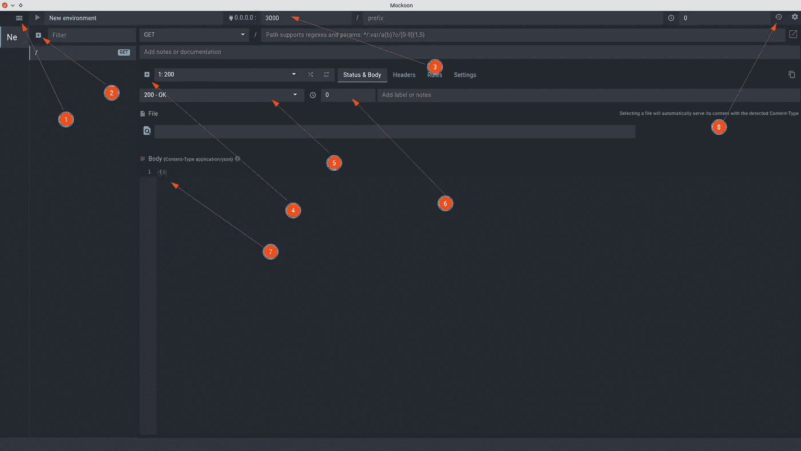

1.  环境:把它想象成你的 API，它运行在特定的端口上，包含所有的端点。您可以创建多个环境(稍后我将分享我如何使用它来更改端点而无需重新编译应用程序)。
2.  路线:您可以在这里创建新路线。指定端点的路径(服务器地址后面的部分)和请求类型(GET、POST)。
3.  端口:运行服务器的端口。尝试给出一些独特的端口。
4.  响应:您可以创建许多响应类型，并手动或通过创建一些规则来返回它们。
5.  回应代码:您可以为创建的每个回应指定回应代码。
6.  延迟:如果你想模拟一些加载，这是非常方便的。这些值以毫秒为单位(1 秒= 1000 毫秒)。
7.  响应主体:响应主体。您也可以将文件作为响应正文返回。
8.  历史:您可以在此处查看该环境的历史。这在开发过程中非常有用，因为您可以看到整个请求和响应，而不必在应用程序中实现或使用一些日志库来打印网络请求/响应。

我对这些类型的模仿软件的一个担心是需要模仿所有的请求，但是 mockoon 不是这样。它支持部分模仿。

## 什么是部分模拟？

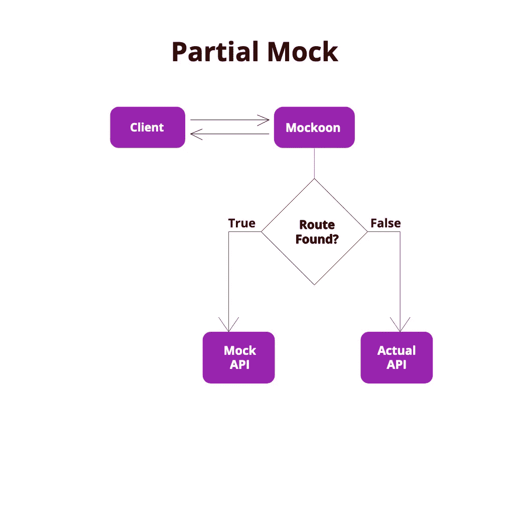

顾名思义，部分模拟允许我们只指定我们想要模拟的路由，并通过所有其他路由传递给实际的 API。

有了这个强大的特性，我们可以设置我们的环境来简化开发。

## 我的模拟卡通设置

对于一个特定的项目，我通常创建如下所示的三个环境。

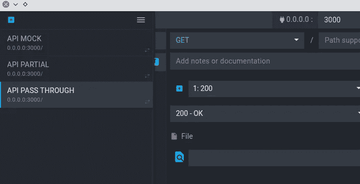

## API 模拟

这是完全脱机的，包含所有端点的响应(或者只包含您关心的端点)。您可以请求您的后端团队以 swagger 或 postman 格式导出端点，然后您可以在这里导入它。如果你的后端团队不够友好，我会告诉你一个方法，在我们设置代理后添加路线。有了它，你可以在没有互联网的情况下工作(但像所有伟大的程序员一样，你可能不会，因为我们最好的朋友**斯塔克伟福**不会在你身边)。我大多是用这种模式做开发。

## API 部分

在这个环境中，您设置代理并提供一些您当前正在处理的端点。这种情况的用例是，如果您只想模拟您正在处理的特定功能的某个端点集，并让一切保持原样，这将是保留它的地方。这里没有定义的所有其他端点都将被转发到您实际的 API。

下面是如何设置代理。

1.  单击设置图标

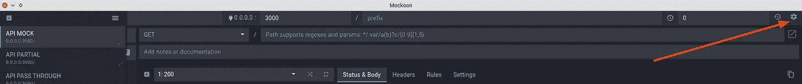

2.启用代理并输入您的 API 地址。

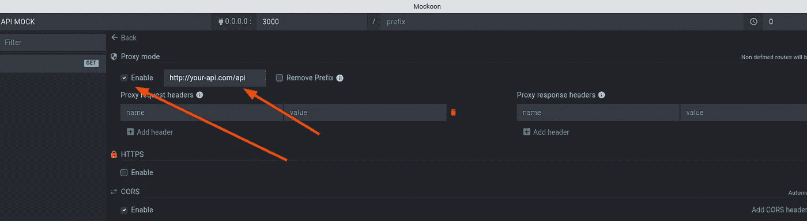

你完了。现在，您在这个环境中定义的任何路由都将被嘲笑，所有其他请求都将被转发到指定的地址。

## API 传递

这是空的(不包含端点),我用它将所有请求传递给服务器。你可以通过移除 **API 部分**环境中的所有端点来达到同样的效果，但是我发现这种方式很简单。

以下是如何直接从 mockoon 向您的环境添加路线。通过环境启动 **API(或者在空环境中配置),然后从你的应用发出请求。您可以通过点击历史图标在 mockoon 中查看日志。**

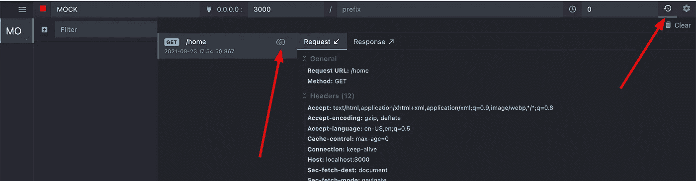

然后点击路线中的添加按钮。这应该会将路由添加到您当前的环境中，并带有响应。然后你可以通过右击路线并选择`Duplicate to environment`将路线移动到其他环境。

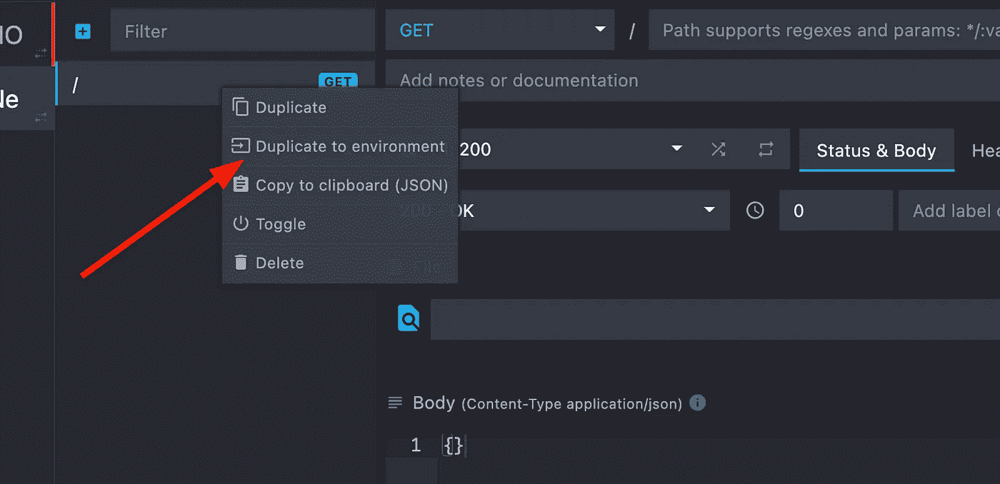

## 为什么有这么多环境？

这种方法的主要好处是，您不必更改应用程序代码中的任何内容来更改端点。只要你的应用指向 mockoon，你就可以通过使用代理功能来控制你想把它转发到哪里。如果您有用于开发、试运行和生产的 API，并且希望在特定的 API 上测试您的应用程序，这将非常有用。只需创建一个新环境(使用相同的端口)，然后指定代理地址。

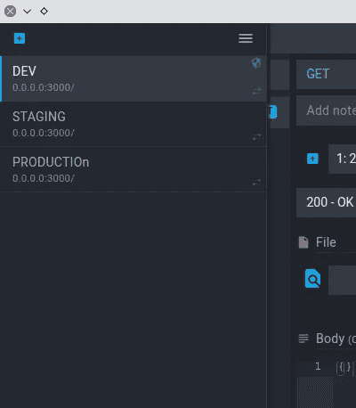

需要注意的一点是，所有这些环境共享同一个端口，一次只能使用一个环境。

## 反应

让我们添加一些端点，并了解如何根据不同的条件返回不同的响应。您可以使用规则根据查询或正文返回不同的响应。我相信你可以创建一个成熟的服务器，但我不推荐这样做。

您还可以创建一组固定的响应，并在它们之间进行切换(您可以通过替换或编辑路由主体来达到相同的效果，但这容易出错且不可维护)。

## 添加响应变量

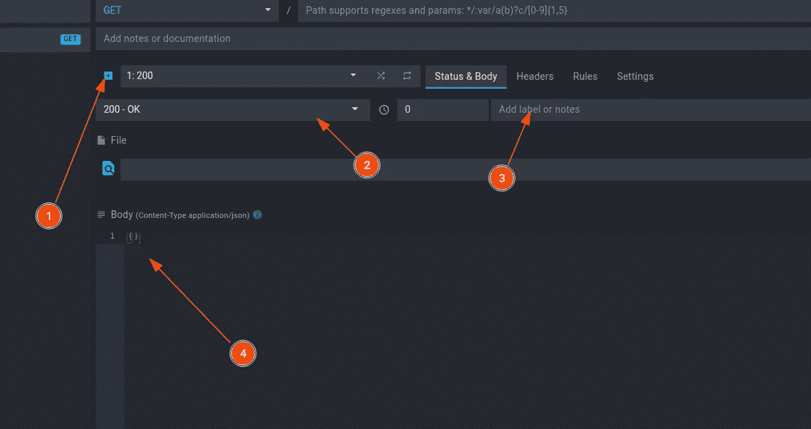

您可以通过点击添加按钮( **1** )然后选择响应代码( **2** )来添加新的响应变量。您可以提供一些名称以便于识别( **3** )并最终提供响应体( **4** )。

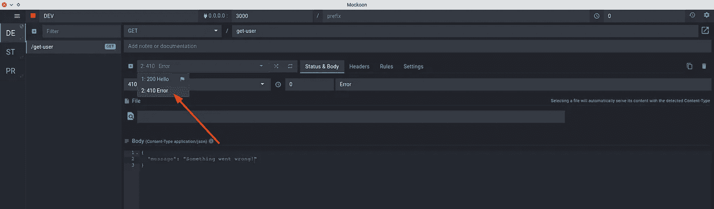

您可以通过将其拖到顶部来切换到新的响应变体(注意，仅单击它不会发送请求，您必须将其拖到顶部，[他们正在努力使其更容易](https://github.com/mockoon/mockoon/issues/252))。

如果您希望基于请求参数返回不同的响应，那么您可以使用规则。以下是如何做到这一点。假设您希望在用户 id 有效时返回 success，当它为-1 时返回 error。

我们将像这样向服务器发送一个包含 id 的用户 json。

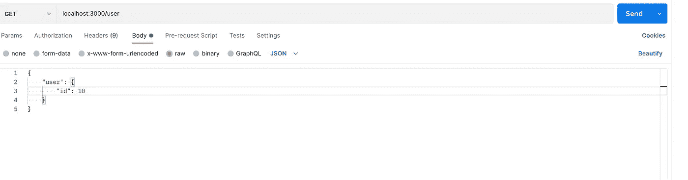

然后创建两个响应。一个代表成功，另一个代表失败。

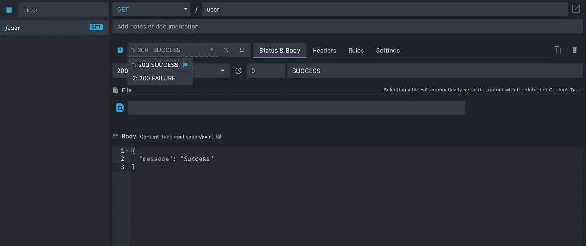

若要成功，请转到 rules 选项卡并添加以下规则。

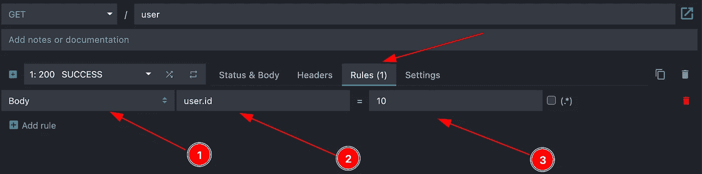

1.  选择查找数据的位置。您可以从`body`、`query`、`header`、`router params`或`request number`中选择。请求编号是一项功能，允许您针对特定数量的请求发送特定的响应。如果您想发送特定的响应，比如说第三个请求，这很有用。

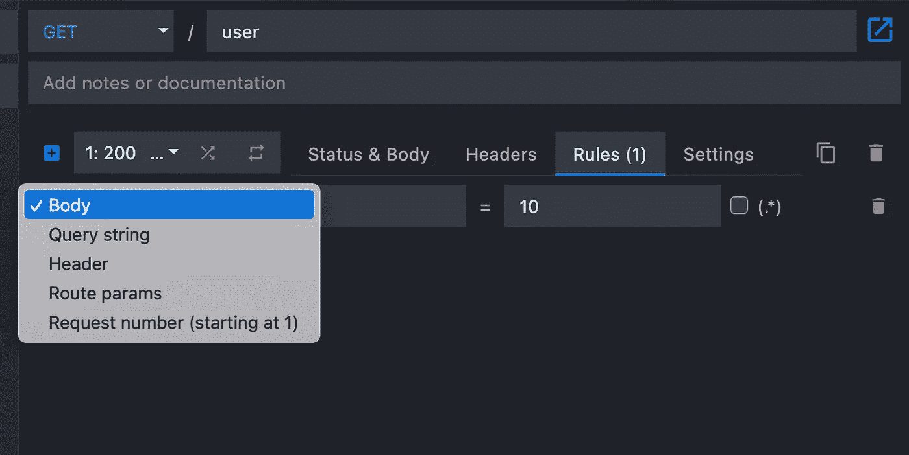

2.要检查的值，在我们的例子中是`user.id`。

3.指定参数的值。

对于失败，我们也可以这样做。

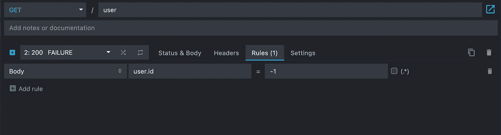

最后，不要忘记将环境头设置为`Content-Type`到`application/json`，因为在 android 中使用改进可能会导致一些问题，所以为了安全起见，请像这样使用环境头。

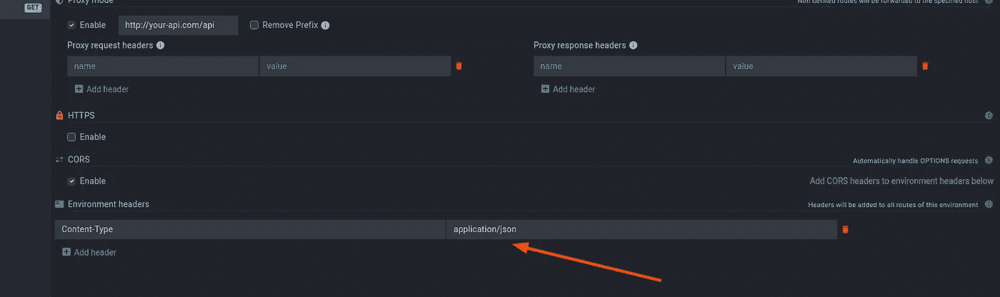

可能还有其他我不知道的伟大特性。您可以参考所有特性的文档。

## 项目设置

## Android 设置

为了使开发变得容易，我创建了一个名为`mock`的新变体，并且只将其用于开发。下面是模拟变体。

这个想法非常简单，使用 BuildConfig 导出 BASE_URL，并在代码中使用它。无论何时你改变变量，端点都会改变。

你们可能想知道为什么我用`localhost`而不是`10.0.2.2`。`10.0.2.2`指向你的开发机器的本地主机，但是只在模拟器上工作。如果你试图在真实设备上运行这个版本，它不会工作。所以我们正在使用`localhost`，并将使用端口转发来连接开发机的端口和你的测试设备(仿真器或真实设备)。

```
adb reverse tcp:3000 tcp:3000
```

如果您连接了多个设备，那么使用`-s`标志来指定设备。

```
adb -s device_id reverse tcp:3000 tcp:3000
```

## IOS

对于 IOS，您可以创建一个名为`mock`的新目标，并在那里设置端点变量。你可以参考这篇关于使用配置生成器创建新目标的文章。

需要记住的一点是，IOS 模拟器没有自己的网络堆栈。所以你必须指定`localhost`作为你的 mockoon 的地址。我发现使用 mockoon 进行开发的一个主要好处是日志记录。您可以很容易地看到日志及其请求和响应正文。

我还没有在真实设备上测试过。我相信这种方法是行不通的，我也不知道我们是否可以在 ios 设备上使用端口转发。

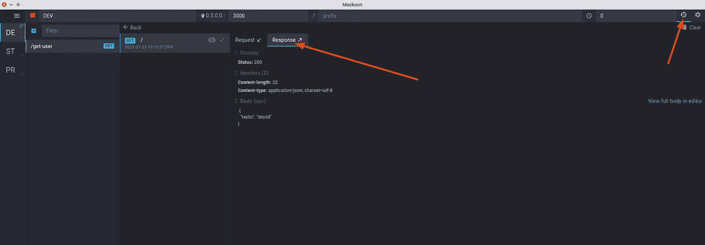

本文到此为止。希望这篇文章对你有帮助。Moockoon 是一个很棒的软件，去 github 上支持它吧。